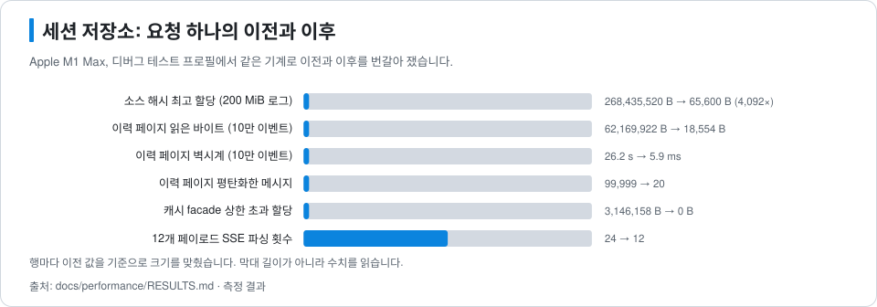
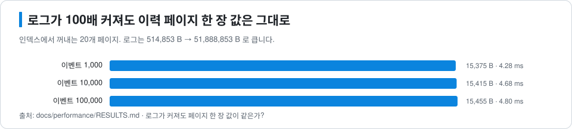
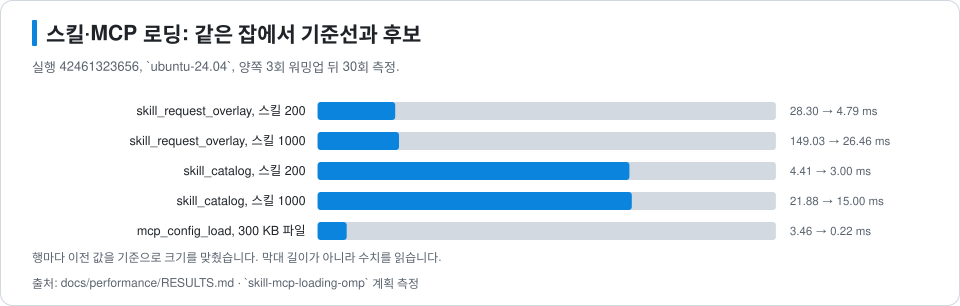
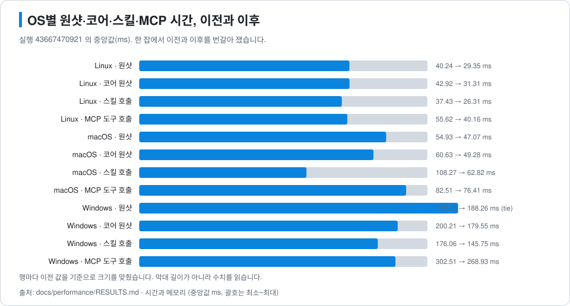

# 성능: 측정 결과와 그 한계

언어: [English](RESULTS.md) | **한국어**

이 페이지는 두 부분으로 구성된다. 위쪽은 최신 `origin/main` 커밋과 경쟁 코딩 에이전트 7종의 최신 안정 릴리스를 Linux·macOS·Windows에서 자동 비교한 결과이고, 아래쪽은 앞서 수행한 동일 기계 A/B 최적화 계획의 과거 기록이다. 서로 다른 계획이나 다른 OS 러너에서 잰 수치는 한 표에서 섞지 않는다.

- **최신 자동 측정(위쪽 절):** [`.github/workflows/benchmark-docs.yml`](../../.github/workflows/benchmark-docs.yml)이 `origin/main` 기준으로 [`benchmark.yml`](BENCHMARK.ko.md)을 Linux(`ubuntu-24.04`), macOS(`macos-latest`), Windows(`windows-latest`)에서 각각 실행하고, 경쟁 도구의 최신 안정 버전(`jcode`는 OS별 최신 릴리스, `Claude Code`·`Codex CLI`·`OpenCode`·`pi`·`omp`·`omo`는 `npm dist-tag latest`)을 매 회차 동적으로 해석한 뒤 `README.md`, `README.ko.md`, [`RESULTS.md`](RESULTS.md), 이 문서, 차트, 문서 사이트 미러를 갱신한다. 현재 기록은 이전 `dev` 브랜치 `v0.1.0-dev` 및 고정 버전 스냅샷을 `origin/main` 커밋 `882db5d7`(`horon-agent v0.1.23-dev (882db5d)`) 기준으로 바꾼 것이다.
- **과거 계획 기록(아래쪽 절):** 기준점 B0 위에서 수행한 `agent-runtime-performance-2` 등 동일 기계 전후 비교 기록을 원본 `record-*.svg` 추세 차트 및 증거 출처와 함께 그대로 보존해, 각 과거 표가 어떤 커밋과 빌드 프로필에서 나왔는지 계속 추적할 수 있게 했다.

## 차트: 최신 자동 측정

<!-- bench-charts:start -->

이 구간은 `.github/workflows/benchmark-docs.yml` 이 아래 자동 측정의 경쟁 도구 비교로 다시 그립니다. 손으로 고치지 않습니다. 모든 차트는 낮을수록 좋고 파란 막대가 horon 입니다.


| 항목 | 차트 |
| --- | --- |
| `--version` 시간 | [01-version.ko.svg](charts/01-version.ko.svg) |
| 설치 크기 | [02-install-size.ko.svg](charts/02-install-size.ko.svg) |
| 원샷 프롬프트 시간 | [03-oneshot-time.ko.svg](charts/03-oneshot-time.ko.svg) |
| 원샷 프롬프트 메모리 | [04-oneshot-memory.ko.svg](charts/04-oneshot-memory.ko.svg) |
| 스킬 호출 시간 | [05-skill-time.ko.svg](charts/05-skill-time.ko.svg) |
| MCP 도구 호출 시간 | [06-mcp-time.ko.svg](charts/06-mcp-time.ko.svg) |
| 최대 세션 수에서의 메모리 | [07-sessions-memory.ko.svg](charts/07-sessions-memory.ko.svg) |
| 세션 하나당 늘어나는 메모리 | [08-per-session-memory.ko.svg](charts/08-per-session-memory.ko.svg) |
| 원샷 프롬프트당 fsync 호출 수 | [09-fsync-calls.ko.svg](charts/09-fsync-calls.ko.svg) |
| 첫 세션 메모리 | [10-first-session-memory.ko.svg](charts/10-first-session-memory.ko.svg) |

대화형 클라이언트는 별도 바이너리입니다. 이 차트는 `tui` 묶음만으로 그리며 위의 헤드리스 차트와 섞지 않습니다.

| TUI 항목 | 차트 |
| --- | --- |
| TUI 지연 | [tui-01-latency.ko.svg](charts/tui-01-latency.ko.svg) |
| TUI 메모리와 크기 | [tui-02-memory.ko.svg](charts/tui-02-memory.ko.svg) |

<!-- bench-charts:end -->

## 최근 자동 측정의 버전

<!-- bench-versions:start -->

`10f56ae46cb197cd596cecbd95c876957e52b4fd`의 비교 측정을 2026-11-25 14:53 UTC에 실행해 기록한 버전입니다. 여러 러너에서 같은 버전을 기록했으면 한 번만 표시합니다.

| 도구 | 버전 |
| --- | --- |
| horon | `horon-agent v0.1.23-dev (10f56ae)` |
| jcode | `jcode v1.1.2 (4f874c9ea)` (Linux), `jcode v1.0.3 (a0ae514c4)` (macOS, Windows) |
| Claude Code | `2.1.332 (Claude Code)` |
| Codex CLI | `codex-cli 0.172.0` |
| OpenCode | `1.19.6` |
| pi | `1.6.1` |
| oh-my-pi (omp) | `omp/19.2.0` |
| oh-my-openagent (omo) | `omo 5.1.83 (engine: senpi 2026.11.23)` |

설치 시점의 npm 레지스트리 메타데이터와 `package.json`에서 검증한 경쟁 도구 출처입니다.

| 도구 | 패키지 | 버전 | 해석 경로 | Git SHA | 무결성 / SHA |
| --- | --- | --- | --- | --- | --- |
| Claude Code | `@anthropic-ai/claude-code` | `2.1.332` | npm dist-tag latest | — | `sha512-tvSh6bLvEbd97APD31AnojOrRC3AmcRj5R8sF8QIQitu3x2ucOb1kKmTkGDw41kjva+CGJfpkt+wYouk6yv56Q==` |
| Codex CLI | `@openai/codex` | `0.172.0` | npm dist-tag latest | — | `sha512-yHf/6wbw4Zvha2M2ylDhDrU9FgfKLYgV6xSzSjlz3gxQNsiVLkXo+fPGwBqvP0A5geLtZs9wAbq+1v7+ZVWJ0g==` |
| OpenCode | `opencode-ai` | `1.19.6` | npm dist-tag latest | — | `sha512-x0yTvlq3Cyhp3z1IhsNlktLa9M/FSbpMWiDlcGljKMTlBKdHM/um/03JedJa71N2yNlHkOvOPI0H4tbyXuuGwA==` |
| pi | `@earendil-works/pi-coding-agent` | `1.6.1` | npm dist-tag latest | — | `sha512-+VSb95N4PB+G7TLceg7wkbJT31BEeIBnUT9500g9a1rOsCx78CUw1YFGtLcRhS6jj8pdfm0fFwrakrMLu6lVAQ==` |
| oh-my-pi (omp) | `@oh-my-pi/pi-coding-agent` | `19.2.0` | npm dist-tag latest | — | `sha512-E4eMyBMYG6KZkq6pTCRPEC2PyzCx/lpbV2rJpXqS3/WJ63BMySvwKnQlGi1qNeECB+Oszs8/fZSg2V5xReBpqA==` |
| oh-my-openagent (omo) | `omo-ai` | `5.1.83` | npm dist-tag latest | `69a1863a457da06fb64ae788e335bf272f1df406` | `sha512-88Q4DT98wRgS1p23alCS96+EFSsWNRyQnYMVga/4Pk9p44mq6JhwDXfDBM5YhFNZ//wnh9rmXRJ0WzEmx689dQ==` |

러너별 jcode 릴리스 신원입니다. 각 작업이 내려받아 검증한 `jcode-release.json`에서 읽습니다.

| OS | 태그 | 커밋 | 자산 | SHA-256 | 제공 경로 |
| --- | --- | --- | --- | --- | --- |
| Linux | `v1.1.2` | `4f874c9ea6b7c3e228045fa8269e4d84bec66a6b` | `jcode-linux-x86_64.tar.gz` | `74ae84a18bb959c7f360ec0a1fecf3eae089ff3f2d92d400062eab4ec32efc56` | release-download |
| macOS | `v1.0.3` | `a0ae514c45451f12d5633ed4fa7c71614a9f4a42` | `jcode-macos-aarch64.tar.gz` | `274396799d2c60600ce3e4890abe78439c1882017eedfc272ce30b1730c5b74b` | release-download |
| Windows | `v1.0.3` | `a0ae514c45451f12d5633ed4fa7c71614a9f4a42` | `jcode-windows-x86_64.exe` | `3c929e46b2facc14a21032f845d26c0e2a80a7a9d008cb64c4845fa4434d30dd` | release-download |

[실행](https://github.com/horon-ai/agent/actions/runs/45634992098)

<!-- bench-versions:end -->

## 여덟 도구 비교 해석

최신 자동 비교([실행 45506107561](https://github.com/horon-ai/agent/actions/runs/45506107561), `origin/main` 커밋 `882db5d7`, 빌드 `horon-agent v0.1.23-dev (882db5d)`, 2026-11-24 23:12 UTC 측정)는 Linux·macOS·Windows 세 OS 모두에서 건너뛴 도구 없이 여덟 에이전트(`horon`과 `jcode`, `Claude Code`, `Codex CLI`, `OpenCode`, `pi`, `omp`, `omo`)를 전부 쟀다.

- **horon이 앞서는 지점:** `--version` 시간은 Linux(`2.9 ms` 대 `jcode` `7.6 ms`)와 Windows(`14.7 ms` 대 `jcode` `16.7 ms`)에서 1위이고 macOS에서는 `jcode v1.0.3`과 사실상 동률이다(`16.0 ms` 대 `15.0 ms`). 원샷 프롬프트 시간은 Linux(`119.1 ms` 대 `jcode` `139.5 ms`)와 macOS(`159.3 ms` 대 `jcode` `436.9 ms`, 최대 RSS `33.3 MB` 대 `36.1 MB`)에서 앞서고, 스킬 호출(`40.6 ms` Linux, `137.5 ms` macOS, `219.5 ms` Windows)과 MCP 도구 호출(`60.4 ms` Linux / 준비 `49.5 ms`, `141.9 ms` macOS / 준비 `107.5 ms`, `253.8 ms` Windows / 준비 `162.7 ms`)은 세 OS 모두에서 7개 경쟁 도구보다 빠르다. 동시 세션에서는 `horon`·`jcode`·`OpenCode`만 데몬 하나에서 세션을 처리해 세션당 추가 프로세스가 `0.00`이고(`horon` 10세션 턴 후 RSS: Linux `54.2 MB`, macOS `41.8 MB`, Windows `36.0 MB`), 세션마다 프로세스를 띄우는 도구(`Claude Code`·`Codex CLI`·`pi`·`omp`·`omo`)는 10세션 기준 Linux `1.3 GB`–`5.3 GB`, macOS `1.1 GB`–`4.1 GB`, Windows `1.0 GB`–`4.1 GB`까지 늘어난다(Windows 10세션에서 `omo`는 연결·steer 오류 2건을 기록했다). 기본 `core` 도구 표면(`oneshot_core`)에서도 첫 모델 요청이 Linux `11,080 B`(`43.9 ms`, RSS `43.6 MB`), macOS `10,921 B`(`139.1 ms`), Windows `10,988 B`(`207.5 ms`)에 머무르며(즉시 도구 8종 + `toolbox` `9,033 B`), 초기 도구 목록이 `18,198 B`–`35,357 B`에 달하는 도구들보다 작다.
- **horon이 뒤지거나 비기는 지점과 구조적 이유:** Linux 원샷 `fsync` 횟수는 정전 내구성을 지키는 `[storage] sync = "full"` 기본값 때문에 `10`회인 반면, 일회성 실행에서 세션 원장을 커밋하지 않는 `Claude Code`(`-p`)와 `pi`(`--no-session`)는 `0`회이고 `Codex CLI` `3`회, `OpenCode` `4`회, `jcode` `5`회, `omp` `25`회, `omo` `38`회다(`AGENTS.md` 규칙상 원본 내구성 플러시는 속도와 맞바꾸지 않는다). Windows 원샷에서는 `jcode v1.0.3`이 시간(`167.6 ms` 대 `204.2 ms`, min–max 범위 `160.1–292.5 ms` 대 `197.7–271.1 ms`로 범위 겹침)과 최대 RSS(`31.6 MB` 대 `36.5 MB`)에서 앞서며, Linux 원샷 최대 RSS는 `horon`(`52.0 MB`)과 `jcode v1.1.2`(`51.7 MB`)가 `same` 수준이다. 세션당 추가 RSS 기울기는 Linux(`63.8 KB` 유휴 / `187.9 KB` 턴 후 대 `109.8 KB` / `528.7 KB`)와 Windows(`97.5 KB` / `272.6 KB` 대 `126.1 KB` / `540.7 KB`)에서 `jcode`가 더 낮고, macOS에서는 유휴 기울기를 `horon`(`141.1 KB` 대 `171.9 KB`)이, 턴 후 기울기를 `jcode`(`310.6 KB` 대 `467.7 KB`)가 앞선다. 한편 업스트림 `jcode v1.1.2`가 macOS·Windows 바이너리를 제공하지 않아 Linux는 `v1.1.2`, macOS·Windows는 `v1.0.3`으로 측정됐다. 설치 크기는 macOS(`105.0 MB`)와 Windows(`107.1 MB`)에서 `horon`이 전체 1위이며, Linux(`124.9 MB`)는 러너에 미리 깔린 Node.js 런타임(`>=22.19`)을 제외한 디렉터리 크기만 재는 `pi`(`117.0 MB`) 다음이다.
- **측정의 한계:** 모든 실행은 실제 API 대신 로컬 모의 모델 서버(`scripts/perf/mock_llm_server.py`)에 붙으므로 기동·IPC·저장·샌드박스·MCP 초기화 비용만 분리해 재며 실제 모델 토큰 지연과 과금은 포함하지 않는다. MCP 연결도 도구별 기본 방식(`horon` `mcp-call`, `jcode` `mcp-action`, `Claude Code` `ToolSearch`, `Codex CLI` 네임스페이스 Responses, `OpenCode`·`pi`·`omo` `mcp-tool` 및 `omo` 콜드 시 백그라운드 `tool_search`, `omp 19.x` `## MCP Tool Commands` 기반 `mcp-command`)을 따르며, OS마다 메모리 단위(`PSS`/`RSS`와 `Working Set`)와 러너 사양이 다르므로 같은 OS 행 안에서만 상대 비교를 읽어야 한다.

## 과거 기준선 기록: `agent-runtime-performance-2` (한눈에 보기)

이 아래 절들은 크로스 OS 자동 비교 전에 수행한 동일 기계 A/B 최적화 계획의 과거 기록을 보존한다. 먼저 `agent-runtime-performance-2` 계획은 기준점 B0(계획 시작 직전 커밋) 위에서 `dev`에 성능 커밋 19개를 올렸고(무관한 `fix(cli)` 커밋 1개는 아래 수치와 무관), 세션 저장소의 해시와 이력 페이지, SSE 파서, 복제 내보내기, 결과 캐시 임계값, attach/detach 소크를 Apple M1 Max(디버그 테스트 프로필)에서 같은 기계 앞뒤 번갈아 재기 방식으로 쟀다. 원본 산출물은 `.omo/evidence/agent-runtime-performance-2/`(`.gitignore:19`)에 있고, 아래 모든 수치는 당시 증거 파일에서 그대로 옮긴 기록이다.

아래 차트가 그 과거 체크포인트의 요약이며, 정확한 수치는 해당 절 표 안에 접힌 채로 있다. 표가 차트 앞을 막지 않게 하려는 것이다.




- 이벤트 10만 개 세션에서 이력 페이지 한 장은 62,169,922 B 대신 18,554 B를 읽고, 26.2 s 대신 5.9 ms가 걸린다. 200 MiB 소스 해시의 최고 할당은 268,435,520 B에서 65,600 B로 내려갔다. 시간과 읽은 바이트는 이전과 같다.
- GitHub Linux 러너의 원샷 프롬프트당 fsync 호출은 콜드 40회·웜 35회에서 아래 계획들을 거치며 15회·14회로 줄었다. jcode는 5회에 머무는데, 대화 기록을 커밋하지 않기 때문이다. 이 차이는 조정 대상이 아니라 구조 차이다.
- macOS 원샷은 872.4 ms에서 290.4 ms로, 시작→첫 요청은 236.4 ms에서 78.7 ms로 줄었다. 두 빌드를 같은 기계에서 번갈아 쟀고, 같은 실행에서 jcode 원샷은 294.8 ms였다.
- Linux 원샷은 207.9 ms에서 168.0 ms로 줄었지만 jcode의 146.3 ms보다 여전히 느리다. Windows 격차는 더 크고, 닫혔다고 주장하지 않는다.
- `jcode-parity-optimization` 계획 뒤 세션 하나당 메모리는 Linux에서 149.6 KB로, jcode의 57.4 KB보다 크다. 이전 값은 254.7 KB였다.
- 로딩 계획에서는 벽시계 개선이 확인되지 않았고, A/A 대조가 그 이유를 보여 준다. 같은 바이너리의 두 실행 차이가 그 계획이 주장할 수 있는 어떤 효과보다 크다.

## 측정 결과

차원 표기는 다음 규칙을 따른다. `MEMORY` 는 할당과 메모리, `TIME` 은 벽시계 시간, `WORK` 는 반복 횟수와 바이트량, `RESOURCES` 는 파일 서술자·스레드·태스크 수다. 한 차원의 개선을 다른 차원의 개선으로 읽지 않기 위해 차원을 따로 적는다.

<details>
<summary>정확한 수치</summary>

| 변경 | 차원 | 이전 | 이후 |
| --- | --- | --- | --- |
| 스트리밍 소스 해시, 최고 할당 (200 MiB 로그) | `MEMORY` | 268,435,520 B | 65,600 B (4,092배) |
| 스트리밍 소스 해시, 읽은 바이트 | 변화 없음 | 209,715,200 B | 209,715,200 B |
| 스트리밍 소스 해시, 벽시계 | `TIME` (개선 없음) | 6,434 ms | 6,404 ms |
| 이력 페이지, 평탄화한 메시지 (10만 이벤트, 20개 페이지) | `WORK` | 99,999개 | 20개 |
| 이력 페이지, 읽은 바이트 | `WORK` | 62,169,922 B | 18,554 B |
| 이력 페이지, 벽시계 | `TIME` | 26.2 s | 5.9 ms |
| SSE, 페이로드 12개를 파싱한 횟수 | `WORK` | 24회 | 12회 |
| 복제 내보내기, 직렬화 횟수 (페이지 64 → 256 이벤트) | `WORK` | 129회 | 513회 (이벤트 4배에 직렬화 4.0배) |
| 복제 내보내기, 참조 구현 대비 바이트 (같은 64 → 256) | `WORK` | 8,445,218 → 138,506,722 B (16.4배) | 102,903 → 411,795 B (4.0배) |
| 캐시 facade, 상한 초과 경로 (일시 할당 · 정규 직렬화) | `MEMORY` | 3,146,158 B, 1회 | 0 B, 0회 |
| 캐시 facade, 벽시계 | `TIME` (개선 없음) | MiB당 약 19 ms | MiB당 약 19 ms |
| attach/detach 소크, 200 사이클 뒤 자원 | `RESOURCES` | fd 14, 스레드 25, 태스크 2,141 | fd 14, 스레드 22, 태스크 2,141 |

</details>

몇 가지는 표만으로는 오해하기 쉬워서 따로 적는다.

- 소스 해시의 다이제스트는 다섯 픽스처(61 KB, 618 KB, 6.2 MB, 62 MB, 200 MiB)에서 모두 이전과 같다. 바뀐 것은 최고 할당 하나이고, 읽는 바이트와 걸리는 시간은 그대로다.
- 이력 페이지의 `WORK` 와 `TIME` 은 같은 요청의 두 얼굴이다. 10만 이벤트 세션에서 20개짜리 페이지 하나를 받을 때, 이전에는 세션 전체를 재생해 99,999개 메시지를 평탄화하고 62 MB 를 읽었고, 이후에는 색인이 가리키는 20개 레코드만 읽는다.
- 복제 내보내기는 페이지 크기가 4배가 될 때 이전 참조 구현이 바이트를 16.4배로 늘렸고, 지금 구현은 4.0배로 늘린다. 즉 로그 길이가 아니라 페이지 길이에 비례한다. 페이지 바이트는 B0 과 바이트 단위로 같고, 고정 다이제스트 `135cf07d...`(길이 240,882)와 `4a4855d4...`(길이 26,979)가 그대로 재현된다.
- 캐시 facade 는 상한을 넘는지 판단하려고 정규 JSON 을 한 번 직렬화하던 것을 없앴다. 1 MiB 경계는 바이트 단위로 정확하다(1,048,575 B 는 캐시, 1,048,577 B 는 건너뜀). 실제로 캐시하는 경로는 여전히 한 번 직렬화한다.
- 소크는 200 사이클, 10개 창, 588.99초다. 창마다 증가분을 재고, 실패 라운드와 정지 실패(`quiescence_misses`), 반납 실패(`non_returning`)가 모두 비어 있다.

### 같은 페이지를 로그가 커져도 같은 비용으로 받는가

색인이 있는 상태에서 20개짜리 페이지를 받을 때, 로그가 100배 커져도 읽는 바이트는 0.5%만 늘었다. 재생한 메시지는 세 크기 모두 0이다.



<details>
<summary>정확한 수치</summary>

| 이벤트 수 | 로그 크기 | 페이지가 읽은 바이트 | 벽시계 |
| --- | --- | --- | --- |
| 1,000 | 514,853 B | 15,375 B | 4.28 ms |
| 10,000 | 5,168,853 B | 15,415 B | 4.68 ms |
| 100,000 | 51,888,853 B | 15,455 B | 4.80 ms |

</details>

이 표의 로그 크기는 성장 테스트가 직접 만든 세션이라 앞 표의 10만 이벤트 픽스처(62,155,848 B)와 크기가 다르다. 같은 측정이 아니다.

### 표에 담지 않은 커밋

나머지 커밋은 앞뒤 쌍보다 상한, 측정 표면, 결정을 바꾼 것이다. NDJSON 프레이밍을 UTF-8 경계에서 안전하게 하고 프레임 상한을 넣은 커밋, 훅의 stdin 쓰기를 데드라인 안으로 옮긴 커밋, 도구 지연을 execute 가 아니라 dispatch 전체로 넓힌 커밋이 있다. 이벤트 스트림에 개수·바이트 상한과 보이는 overflow 를 넣은 커밋, 압축 결정 전의 컨텍스트 복제를 없앤 커밋, 브리지 쓰기를 select 루프 밖 유계 큐로 옮긴 커밋도 있다. 문법 오류로 실행되지 않던 벤치마크 스크립트를 고치고 고정 픽스처 생성기를 넣은 커밋, 단계 카운터·할당 프로브·같은 기계 A/B 실행기를 넣은 커밋, p99 키를 항상 남기는 규칙을 넣은 커밋이 측정 표면을 바꿨다. 네 가지 구조 항목을 측정으로 기각한 결정 기록, 구조 게이트·리포트 템플릿·A/B 안내를 넣은 커밋 둘, 색인 헤더 검사의 중복 클로저를 정리한 후속 수정이 나머지다.

## 측정했지만 채택하지 않은 것

여섯 항목은 측정한 뒤 채택하지 않기로 결정했다. 각 항목에는 그 결정을 뒤집으려면 넘어야 할 숫자가 함께 있다.

| 항목 | 결정 | 결정한 숫자 |
| --- | --- | --- |
| 비활성 세션 축출 정책 | 채택 안 함 | 세션당 fd 0.999개, 스레드 0.998개, RSS 0.41 MB. 1개에서 1,000개까지 이 기울기가 꺾이지 않는다. debug job 수(`server:memory`가 내보내는 `job_count`)는 다섯 인구 수 모두에서 0이고, 소크에서 세션 수는 0으로 돌아온다 |
| `globalEvents` 다중화 | 채택 안 함 (프로토콜 변경) | 감시 세션당 소비자 쪽 fd 7.4개와 스레드 3.0개. 데몬 자신의 몫은 세션당 연결 1.0개이고, 브리지는 연결 하나에 세션 하나를 붙인다 |
| 세션 맵 잠금 범위 축소 | 채택 안 함 | 무관한 세션 제거가 import 전체를 기다린다. 1 / 20 / 60 / 150 이벤트에서 861 / 5,561 / 11,255 / 24,499 ms, 비율 1.00 |
| 인터럽트 폴 25 ms 타이머를 통지로 교체 | 채택 안 함 | 최악 29.7 ms(평균 27.6 ms)를 아끼려고, 감시 그룹 라운드당 wakeup 1회라는 비용 구조를 바꾸는 것이다 |
| `run.stopped` 저널 쓰기와 닫기 저장 겹치기 (#144, #129) | 채택 안 함 (더 느림) | 같은 잡에서 `dev`와 비교한 Windows 마지막 요청→종료 중앙값: 5회 39.8 → 56.4 ms(run 42759006826), 20회 35.2 → 42.8 ms(run 42764256757, IQR 33.0–40.9 대 40.7–45.5). Linux와 macOS는 동률이었다. 이후 #146이 닫기 저장의 flush 자체를 없애 같은 구간이 32.5 ms가 됐다 |
| Windows 고정 셸 환경을 프로세스당 한 번만 계산 (#124, #122) | 채택 안 함 (동률) | Windows 도구 왕복 구간, 20회: 74.3 → 73.5 ms(run 42735692366), min–max 범위 안이다. 왕복의 대부분은 호출마다 만드는 env 표나 PATH 탐색이 아니라 `cmd.exe` 기동 비용이다 |

숫자로 기각한 것은 실패가 아니다. 이 계획은 "개선이 안 나오면 그 항목은 '채택 안 함'으로 근거와 함께 끝냅니다. 그것도 성공입니다"를 성공의 정의로 삼았다. 위 표의 마지막 열이 그 근거다.

## 이 숫자들이 말하지 않는 것

이 절이 이 페이지의 목적이다. 아래 문장 중 하나라도 빠지면 이 페이지는 읽는 사람을 잘못된 결론으로 데려간다.

- **소스 해시의 개선은 해시 단계에만 해당하며, 저장 경로는 검증도 흘려서 한다.** `crates/base/src/session/event_commit.rs:120-133` 는 잡아 둔 접두부를 64 KiB 버퍼 하나로 해시하고, `:148-166` 은 예약된 꼬리를 같은 크기 버퍼로 비교한다. 그래서 큰 로그를 저장해도 로그 사본을 통째로 할당하지 않는다. 계획 당시 기록한 7 KB 로그에서 156,518 B, 553 KB 로그에서 8,293,580 B는 최고 할당이 로그 크기를 따르던 저장에서 나온 값이며 지금 이 경로를 설명하지 않는다.
- **이력 페이지의 개선은 머리가 바뀌지 않은 동안의 반복 페이징에만 해당한다.** 색인은 로그의 신원 스탬프(장치, inode, 길이, mtime, ctime)에 묶여 있어 append 한 번, import 한 번, reset 한 번으로 무효가 된다. 그래서 계속 자라는 세션은 예전 비용을 한 번 더 치르고 색인을 다시 만든다. 그 재구축 비용은 측정되지 않았다. 새 머리에서 페이지를 한 번만 받는 경우는 빨라지지 않는다.
- **캐시의 개선은 할당이지 처리량이 아니다.** 벽시계는 MiB당 약 19 ms 로 양쪽이 같다. 이스케이프 비용이 어느 쪽이든 지배한다.
- **소크는 fd, 스레드, 큐, 대기 요청, 태스크를 단언한다. RSS 는 아니다.** RSS 는 68.4 MB 에서 79.5 MB 로 오른 뒤 평평하게 머물렀고(최고 83.7 MB), 관찰값으로만 남았다.
- **200 사이클 소크는 20 사이클당 자원 1개의 누수를 판별한다.** 계획이 요구한 1,000 사이클은 이제 예약 워크플로 `Attach/Detach Soak`(`.github/workflows/soak.yml`)가 매주 실행하고 첫 실행이 깨끗했으며, 풀 리퀘스트용 형식은 같은 테스트를 구조 게이트에서 20 사이클로 돌리는 것이다(`scripts/perf/check_structural.py:136-146`).
- **이 계획이 끝났을 때 구조 게이트는 프레임 상한을 단언하지 않았다.** 그때 게이트가 읽던 카운터에 프레임 계수가 없었고, 프레임 상한은 `crates/harness-api-server/src/framing_tests.rs` 만 지켰다. 이제 게이트에 `frame` 구획이 있다(`scripts/perf/check_structural.py`). 브리지 리더와 SDK 리더가 각각 `max_frame_bytes`, `accepted_frame_bytes`, `rejected_frame_bytes` 를 보고하고, 게이트는 상한이 `frame_max_bytes`(64 MiB)와 같고 거부된 가장 작은 프레임이 수락된 가장 큰 프레임보다 정확히 1바이트 큰지 확인한다. 프레임 개수는 여전히 세지 않는다.
- **이 숫자들이 덮던 `shared_context` 맵은 이제 트리에 없다.** 토픽 채널 저장소와 함께 제거됐으므로(#299) 소크도 이 맵을 더 이상 표집하지 않고, 위 표에도 이 항목의 값이 없다. 과거 측정값은 기록대로 남긴다. 모든 인구 수에서 0이었고, 그 0은 "누수가 없다"가 아니라 "아무도 쓰지 않았다"는 뜻이었다. `server:memory` 페이로드에 남은 것은 그 옆의 swarm 블록이다. `member_count`, `status_counts`, `swarm_count`, `swarm_membership_count`, `plan_count`, `plan_item_count` 와 각 바이트 추정치이고(`crates/app-core/src/server/debug_server_state.rs`), 앞으로 소크가 표집할 대상은 이 블록이다.
- **복제 내보내기의 직렬화 계수는 페이지 단위로 고정된다.** 256개 상한에서 513회지만, 로그가 커지면 내보내기 시간은 여전히 커진다(1,000 이벤트 278.2 ms, 10,000 이벤트 2,657.2 ms). 바이트가 평평한 것은 페이지 안에서지 전체 내보내기에서가 아니다.
- **캐시 facade 의 워밍 복원 시간은 단발 측정이다.** 페이지 캐시 분산을 포함하고, 같은 케이스에서 레인의 108.6 / 901.8 ms 와 리드의 재실행 108.9 / 499.7 ms 가 그 폭이다. 바이트 단위 경계 판정만 재현 가능한 수치다.
- **네 가지 채택 안 함 결정의 절대 밀리초는 릴리스 수치가 아니다.** 디버그 테스트 프로필과 임시 홈에서 잰 값이고, 전이되는 것은 비율(대기 시간이 import 시간과 같다, 세션 생성 약 1.2 s)이다.
- **`globalEvents` 의 fd 7.4개와 스레드 3.0개는 소비자 쪽 비용이다.** SDK 와 데몬이 같은 프로세스에서 돌아 양 끝이 함께 세어졌다. 100 세션과 1,000 세션 수치는 이 세션당 값에 대한 산술이지 두 번째 측정이 아니다.

## 재현 방법

측정마다 `CARGO_TARGET_DIR` 을 자기 전용 디렉터리로 두고, 한 번에 하나씩만 돌린다. 하나의 타깃 디렉터리에 테스트 바이너리 둘이 동시에 붙으면 매번 다른 실패가 나고, 그 실패는 코드에 대한 정보가 아니다.

```bash
export CARGO_TARGET_DIR="$PWD/.target-measure"
```

측정용 로그는 저장소의 생성기로 만든다. 아래는 200 MiB 로그와 10만 이벤트 로그다.

```bash
python3 scripts/perf/fixtures/gen_event_log.py --bytes 209715200 --seed 20261021 --out /tmp/event-log-200mib/
python3 scripts/perf/fixtures/gen_event_log.py --events 100000 --seed 20261021 --out /tmp/event-log-100000/
```

소스 해시는 프로브 예제가 전체 읽기와 스트리밍 다이제스트를 나란히 인쇄한다.

```bash
cargo build --locked -p horon-agent-base --example source_hash_probe
"$CARGO_TARGET_DIR/debug/examples/source_hash_probe" hash /tmp/event-log-200mib/events.jsonl
```

이력 페이지는 10만 이벤트 픽스처를 환경 변수로 넘겨 재고, 커밋된 500레코드 기준선과의 동일성은 별도 테스트가 본다.

```bash
HISTORY_PAGE_PERF_FIXTURE=/tmp/event-log-100000/events.jsonl \
  cargo test --locked -p horon-agent-harness-api-server --lib history_page_perf -- --nocapture --test-threads=1
cargo test --locked -p horon-agent-harness-api-server --lib pages_match_the_committed_pre_change_baseline -- --nocapture
```

SSE 파서는 청크 크기 네 가지에서 같은 이벤트 열과 파싱 횟수를 인쇄한다.

```bash
cargo test --locked -p horon-agent-provider-openai --lib stream::stream_tool_tests::chunked_replay_yields_the_same_events_at_every_chunk_size -- --nocapture
```

복제 내보내기는 페이지 바이트 동일성과 상한을 저장소 안 테스트가 검증한다. 표에 적은 직렬화 계수(129 / 513)를 인쇄한 QA 하네스는 `.omo/evidence/agent-runtime-performance-2/qa_task14.py` 에 있고 추적되지 않으므로, 클론한 사람은 그 계수를 직접 재현할 수 없다. 다이제스트와 길이는 재현된다.

```bash
cargo test --locked -p horon-agent-session-store replication -- --nocapture
```

캐시 facade 는 테스트가 경계 양쪽의 직렬화 횟수를 인쇄하고, 예제가 할당 최고점을 인쇄한다.

```bash
cargo test --locked -p horon-agent-base --lib event_cache -- --nocapture
cargo build --locked -p horon-agent-base --example facade_cache_probe
```

소크는 200 사이클 기본형과 `#[ignore]` 된 1,000 사이클 변형이 있다. 1,000 사이클형은 예약 워크플로 `Attach/Detach Soak`(`.github/workflows/soak.yml`)가 매주 실행한다. 이 워크플로는 `CI Required` 에 들어가지 않으므로 자원 잔류 실패가 풀 리퀘스트를 막지 않고, 추적 이슈 하나를 만들거나 갱신한다.

```bash
HORON_AGENT_WORKSPACE_TRUST=trust \
  cargo test --locked -p horon-agent --test e2e soak_attach_detach::soak_attach_detach_returns_every_counter_to_baseline -- --exact --nocapture
HORON_AGENT_WORKSPACE_TRUST=trust \
  cargo test -p horon-agent --test e2e soak_attach_detach_1000_cycles -- --ignored --exact --nocapture
```

예약 실행은 직접 재현할 수 있다: `gh workflow run soak.yml --ref dev -f cycles=1000`. 리포트는 `soak-attach-detach-report` 아티팩트이고, `python3 scripts/perf/check_soak.py <캡처한 로그>` 가 로컬 실행에서 같은 마크다운을 만든다.

### 호스트 러너에서 잰 1,000 사이클 기준선

첫 실행은 워크플로가 병합된 뒤 `dev` 푸시가 띄운 것이다([실행 43600180217](https://github.com/horon-ai/agent/actions/runs/43600180217), 커밋 `af41e0b7`). `ubuntu-24.04`, `HORON_AGENT_PERF_COUNTERS=1` 환경이다.

| 측정 | 값 |
| --- | --- |
| 사이클 | 1,000, 100개씩 10개 창 |
| 사이클 소요 | 7분 38초(13:34:30Z → 13:42:08Z), 사이클당 약 0.46초 |
| 잡 전체 | 콜드 빌드를 포함해 10분 56초 |
| 판정 | `STRUCTURAL_PERF section=soak cycles=1000 fd_retention=0 thread_retention=0 non_returning=0` |
| 리포트 | **Clean.** 모든 카운터가 기준선으로 돌아왔다 |

| 카운터 | 기준선 → 최종 | 100 사이클당 기울기 |
| --- | --- | --- |
| `fd_count` | 16 → 16 | +0.000 |
| `thread_count` | 16 → 16 | +0.000 |
| `queue_depth_high_water` | 0 → 1 | +0.100 |
| `pending_requests`, `interrupt_poll_wakeups`, `background_tasks`, `live_sessions`, `connected_clients` | 0 → 0 | +0.000 |

`queue_depth_high_water` 는 최종값이 아니라 최고 수위다. 어느 시점에든 관측된 가장 깊은 큐를 기록하므로 순간적인 1은 잔류가 아니다. 잡 타임아웃 180분은 측정된 실행보다 한 자릿수 이상 여유가 있다.

구조 게이트와 A/B 실행기의 사용법, 리포트 템플릿의 필수 키, 경계를 올리는 절차는 [`docs/performance/BENCHMARK.ko.md`](BENCHMARK.ko.md) 에 있다. 게이트 명령은 `python3 scripts/perf/check_structural.py` 이고, A/B 는 `scripts/perf/ab_perf.py` 다.

## 상태

계획의 항목은 17개이고, 14개가 완료, 3개가 부분 완료(`[~]`)다. 부분 완료의 뜻은 다음과 같다.

| 항목 | 상태 | 뜻 |
| --- | --- | --- |
| 7. 두 SDK 의 NDJSON 프레이밍 상한 | `[~]` | 코드와 테스트는 `dev` 에 있고 검증됐다. 이 항목이 지목한 증거 파일이 워크트리와 함께 사라졌고 재구성하지 않았다. 동작은 증명됐고 증거 궤적은 아니다 |
| 12. 보조·결과 캐시 바이트 회계 | `[~]` | 코드는 `dev` 에 있고, 결정적인 줄은 리드가 직접 재실행해 재현했다. 레인의 원본 증거 파일은 사라졌고, 지금 그 자리에 있는 파일은 스스로 `recovered` 라고 밝힌 재구성본이다 |
| 15. attach/detach 소크 | `[x]` | 계획 항목인 1,000 사이클이 이제 돈다. `.github/workflows/soak.yml` 이 매주·수동으로 실행하고, 첫 실행이 1,000 사이클을 7분 38초에 깨끗하게 마쳤다(`fd_retention=0`, `thread_retention=0`, `non_returning=0`, 실행 43600180217). 200 사이클 형은 풀 리퀘스트 게이트로 남되, 구조 게이트가 20 사이클로 돌린다(`scripts/perf/check_structural.py:136-146`) |
| 17. CI 구조 게이트와 리포트 템플릿 | `[~]` | 게이트는 실제로 돈다(경계 42개 `scripts/perf/structural_budget.json`, `EXIT=0`, 위반 시 `EXIT=1`, 측정 누락 시 `EXIT=2`, 계약 테스트 84개 `scripts/perf/test_check_structural.py`). 계획의 두 조건이 남았다. 프레임 계수 카운터가 없고, "B0 에서 통과"는 구조적으로 불가능하다(`STRUCTURAL_PERF` 줄을 인쇄하는 코드가 B0 뒤에 들어왔다). 이제 게이트는 `frame` 구획에서 두 리더의 프레임 상한 자체를 단언하고, 프레임 개수는 여전히 읽지 않는다 |

나머지 13개 항목은 완료다.

## `agent-rust-loading-durable-runtime` 계획의 측정 (별도 계획, 별도 기준)

위 표는 `agent-runtime-performance-2` 계획의 기록이다. 아래는 뒤에 실행된
`agent-rust-loading-durable-runtime` 계획이 남긴 것이며, 기준 커밋도 측정 도구도 다르다.
두 계획의 수치를 한 표에서 비교하지 않는다.

이 계획의 원본 산출물은 `.omo/evidence/agent-rust-loading-durable-runtime/` 아래에 있다.

### 시간 개선: 확인되지 않음

측정 도구(`scripts/perf/bench_loading.py` 와 `crates/base/examples/loading_probe.rs`)가 이 계획의
산출물이라, 계획 시작 직전의 기준 커밋에는 같은 도구가 없다. 그래서 서로 다른 두 측정
프로그램을 비교하는 대신, 같은 바이너리의 두 설정을 30회씩 교대 측정하는 대조(A/A)를
썼다(`aa_control: true`). 결과는 `improvement_claim: false`다.

| 구간 | A p50 / p95 (ms) | B p50 / p95 (ms) |
| --- | --- | --- |
| attach_history | 671.2 / 1579.2 | 691.7 / 2047.0 |
| provider_dispatch | 12.0 / 26.5 | 13.3 / 66.2 |
| resume_ready | 309.9 / 733.9 | 299.2 / 675.1 |
| session_save | 906.8 / 1271.5 | 993.2 / 1412.7 |
| skill_catalog | 0.2 / 0.2 | 0.2 / 1.4 |

같은 바이너리의 두 실행 사이 편차가 이 계획이 주장할 수 있는 효과보다 크고, 방향도 한쪽으로
치우치지 않는다. 따라서 **벽시계 시간 개선은 주장하지 않는다.**

### 구조 계수: 측정되고, 상한이 지켜짐

시간 대신 계수로 판정하는 항목이다. 두 종류의 증거가 있고, 서로 다른 것을 잰다.

- `python3 scripts/perf/check_structural.py` 가 exit 0 으로 **상한 45개 전부 통과**(실패 0, 누락 0)했다. 이 게이트가 실제로 읽는 계수는 큐 깊이·대기 요청 수·이력 페이지 비용·해시 버퍼·
  프레임 상한·attach/detach 소크 여섯 묶음이다.
- 아래 표의 항목은 그 게이트가 읽지 **않는다**. 각 항목의 이름 붙은 테스트가 직접 단정한다.

| 항목 | 차원 | 무엇이 바뀌었나 | 고정하는 테스트 |
| --- | --- | --- | --- |
| 저장 검증 | `MEMORY` | 커밋 검증이 파일 전체를 할당하지 않고 고정 64 KiB 버퍼로 스트리밍. 소스 길이는 패스 수만 늘림 | `hash_stream` |
| 요청 스냅샷 | `WORK` | 같은 요청에서 메시지 깊은 복사가 이력 길이를 따라 늘지 않음 | `request_snapshot_reuse` |
| 스킬 목록 | `WORK` | 요청당 overlay 스캔 1회 이하, 섹션 상한 49,152 B(UTF-8) | `skill_snapshot_budget` |
| 연결 준비 | `WORK` | core 밖 내장 도구 생성자 호출 0회, 시작 경로가 prewarm 네트워크를 기다리지 않음 | `loading_deferred_setup` |
| 세션 재개 | `WORK` | 살아 있는 세션 재로드와 재개 중복 저장 제거 | `loading_live_resume` |

`MEMORY` 와 `TIME` 을 섞지 않는다. 위 표의 어느 항목도 벽시계 개선을 주장하지 않는다.

### 이 계획이 측정하지 않은 것

- 릴리스 프로필 수치. 모든 측정은 디버그 프로필이다.
- 다중 기기·운영 규모의 처리량.
- provider 호출의 속도. provider 네트워크 시간은 이 계획의 범위가 아니다.

## `agent-irc-bus` 계획의 측정

위 두 기록과 별개로 실행한 `agent-irc-bus` 계획의 측정이다. 이 계획은 에이전트 사이의 메일박스 버스와 `irc` 도구를 넣었고, 기준 커밋 B0는 `50eed12`(`dev`의 계획 시작 직전 커밋), 후보는 `c9d9d8c`(웨이브 3 병합)이다. 앞의 두 기록과 이 기록의 수치를 서로 비교하지 않는다.

원본 산출물은 `.hyper/qa/agent-irc-bus/11-happy.txt`(A/B 보고서 JSON, 처리량 3회, 구조 게이트 `irc` 구역)와 `.hyper/qa/agent-irc-bus/11-failure.txt`(A/A 대조)에 있고, `.hyper/`는 저장소에서 무시되므로 이 절이 추적되는 기록이다.

### 측정 조건

| 항목 | 값 |
| --- | --- |
| 기계 | Apple M1 Max, 10 코어, 메모리 64 GiB |
| 커널 | `Darwin Alpoxs-MacBook.local 25.4.0 ... RELEASE_ARM64_T6000 arm64` |
| 툴체인 | `rustc 1.99.1`, `cargo 1.99.1` |
| 빌드 프로필 | release, 기능 집합 없음(양쪽 모두 `cargo build --locked --release -p horon-agent-base --example perf_counters_surface`) |
| 워크로드 | `perf_counters_surface` 한 번 실행(실행마다 프로세스를 새로 띄움) |
| 측정 중 부하 | 부하 평균 50.10 / 44.73 / 44.59(1분 / 5분 / 15분), `rustc`·`cargo` 프로세스 4개 |
| 반복 수 | 워밍업 3회, 각 쪽 10회, 두 쪽을 번갈아 실행 |
| B0 바이너리 | `48c69b5c...`, 커밋 `50eed12` |
| 후보 바이너리 | `a82fb191...`, 커밋 `c9d9d8c` |

측정 중 이 계획과 무관한 컴파일이 여러 저장소에서 돌고 있었다. 그동안 관측한 부하 평균은 36에서 64 사이였고 `rustc`와 `cargo` 프로세스 수가 4에서 17 사이로 관측됐다. 그래서 이 절의 절대 시간은 조용한 기계의 값이 아니다.

### A/B: 회귀 없음

`scripts/perf/ab_perf.py`가 exit 0으로 끝났고 채택 판정은 `not-adopted-no-measurable-change`다. 회귀를 뜻하는 `reject-regression`이 아니며, 중앙값 차이가 잡음 대역 안이라 개선도 회귀도 주장하지 않는 값이다.

| 항목 | B0 | 후보 | 차이 |
| --- | --- | --- | --- |
| 중앙값 | 5.23 ms | 5.39 ms | +0.16 ms (+3.09%) |
| p95 | 7.06 ms | 7.10 ms | +0.05 ms |
| 잡음 대역(`max(3*1.4826*MAD, 중앙값의 1%)`) | | | ±1.35 ms, 대역 안 |
| `cpu_user_ms` 중앙값 | 2.22 ms | 2.18 ms | -0.04 ms |
| `cpu_system_ms` 중앙값 | 1.55 ms | 1.60 ms | +0.05 ms |
| `peak_rss_bytes` 중앙값 | 6,045,696 B | 6,029,312 B | -16,384 B |
| `fd_count` / `thread_count` 중앙값 | 3 / 1 | 3 / 1 | 같음 |
| 실패 / 시간 초과 | 0 / 0 | 0 / 0 | |
| `read_bytes` 중앙값 | 0 B | 0 B | 같음 |

실행기는 워크로드가 보고하지 않은 `allocated_bytes`, `pss_bytes`, `retained_bytes`를 0이 아니라 `null`로 두고 `counts.missing`에 세 이름을 올렸다. p99는 표본 10개라 20개 미만이라는 이유와 함께 거절됐다.

### A/A 대조: 거짓 회귀 없음

같은 후보 바이너리를 양쪽에 넣은 대조 실행은 `control-no-change`로 끝났다. 중앙값은 6.48 ms와 6.70 ms로 0.22 ms(3.43%) 차이가 났지만 잡음 대역 ±1.58 ms 안이다. 즉 위 A/B의 0.16 ms 차이는 이 측정기가 구분할 수 있는 크기가 아니며, 실행기가 회귀를 지어내지 않는다는 증거다.

### IRC 처리량

`cargo run --locked --release -p horon-agent-irc-core --example irc_throughput`을 3회 실행했다. 메시지 수는 기본값 100,000이고 `broadcast64`는 64의 배수로 내림해 99,968건이다.


<details>
<summary>정확한 수치</summary>

| 시나리오 | 1회차 | 2회차 | 3회차 | 중앙값 | 범위 |
| --- | --- | --- | --- | --- | --- |
| `direct_waiter` (msg/s) | 105,291 | 107,434 | 111,523 | 107,434 | 105,291 ∼ 111,523 |
| `direct_deliver` (msg/s) | 2,410,858 | 2,229,008 | 2,392,230 | 2,392,230 | 2,229,008 ∼ 2,410,858 |
| `broadcast64` (msg/s) | 3,237,934 | 3,141,178 | 3,141,375 | 3,141,375 | 3,141,178 ∼ 3,237,934 |

</details>

`direct_waiter`는 수신 작업 64쌍(`WAITER_PAIRS = 64`)이 동시에 `wait`로 기다리는 구조다. 각 수신 작업은 첫 라운드 뒤부터 상대에게 답장 의무를 만드는 메시지를 한 번 보내고 나서 `wait`에 들어가고, 드라이버는 64개 대기자가 모두 등록된 것을 확인한 뒤 살아 있는 쌍마다 메시지 하나를 보낸다. 쌍 안의 왕복은 순서대로지만 64쌍은 동시에 진행한다. `direct_deliver`는 즉시 주입을 돌려주는 가짜 전달 경로, `broadcast64`는 64개 대상에게 한 본문을 보내는 경로다.

todo 6이 처음 잰 `direct_waiter`는 39,128 msg/s(`6-happy.txt`, 2,555,678 us에 100,000건)였고, todo 12가 `wait` 호출마다 붙던 타이머 왕복을 없앤 뒤 이번 측정에서 107,434 msg/s이다. 약 2.75배다. todo 12가 남긴 측정은 124,071 msg/s(`12-happy.txt`)이고, 이번 값은 그보다 낮다. 측정 시점의 부하 차이로 보이며 코드 경로는 같다.

### 구조 게이트 `irc`

`python3 scripts/perf/check_structural.py --only irc`가 exit 0으로 다섯 경계를 모두 통과했다.

| 카운터 | 관측값 | 경계 |
| --- | --- | --- |
| `mailbox_high_water` | 100 | 100 이하 |
| `mailbox_dropped` | 900 | 900과 같음 |
| `broadcast_body_allocations` | 1 | 1과 같음 |
| `waiters_live_after_churn` | 0 | 0과 같음 |
| `broadcast_inflight_high_water` | 16 | 16 이하 |

### 이 숫자들이 말하지 않는 것

- **A/B 워크로드는 버스가 아니라 프로세스 시작과 카운터 인쇄를 잰다.** `perf_counters_surface`는 데몬을 띄우지 않고 카운터 스냅샷을 한 번 인쇄한다. IRC 버스는 기본 설정에서 꺼져 있고 이 경로에 들어오지 않으므로, 이 A/B가 말하는 것은 "공용 코드에 회귀가 없다"까지다. 버스 자체의 비용은 처리량 표가 답한다.
- **처리량은 같은 프로세스 내부 측정이다.** 예제는 `IrcBus`와 가짜 디렉터리·가짜 전달자를 한 프로세스에 두고 잰다. 데몬 전송, 직렬화, 세션 상태 전이, 모델 호출은 포함하지 않는다. 실제 에이전트 대화의 응답 시간은 이 수치로 예측할 수 없다.
- **`direct_waiter` 수치는 기계 부하에 민감하다.** 이번 측정의 3회는 105,291에서 111,523 사이이고, todo 6의 39,128(`6-happy.txt`)과 견주면 약 2.75배다. todo 12가 남긴 124,071(`12-happy.txt`)과 이번 값의 차이는 측정 시점의 부하 차이로 보이므로, 옮겨 읽을 값은 절대 처리량보다 비율이다.
- **A/B의 절대 시간은 조용한 기계의 값이 아니다.** 측정 중 관측한 부하 평균이 36에서 64 사이였고, 무관한 저장소의 `cargo test`, `cargo clippy`, `cargo build`가 함께 돌았다. A/B가 두 쪽을 번갈아 실행하고 A/A가 잡음 대역을 확인했으므로 비교의 방향은 유효하지만, 5 ms대 절대값은 다른 조건에서 재현되지 않는다.
- **p99는 없다.** 표본이 10개라 실행기가 20개 미만을 이유로 거절했다.
- **세 지표는 측정되지 않았다.** `allocated_bytes`, `pss_bytes`, `retained_bytes`는 워크로드가 보고하지 않아 `null`이고 `counts.missing`에 있다. 0으로 읽지 않는다.
- **구조 게이트는 시간을 재지 않는다.** 위 다섯 값은 모양이 상한 안에 있는지만 말하고, 빠른지는 말하지 않는다.

## `platform-adapter-perf` 계획의 측정

위 세 기록과 별개로 실행한 `platform-adapter-perf` 계획의 측정이다. 이 계획은 OS별 코드를 `crates/platform-*` 다섯 크레이트로 모으고, 세션 저장에서 다시 만들 수 있는 파생 캐시의 fsync를 없애고, HTTPS 클라이언트의 TLS 설정을 프로세스당 한 번만 만들고, 가격표 새로고침을 기본으로 끈다. 기준 커밋 B0는 `738712a`(`dev`의 계획 시작 직전 커밋), 후보는 `215bfdb`(작업 브랜치)이다. 앞 세 기록과 이 기록의 수치를 서로 비교하지 않는다.

원본 산출물은 `.hyper/qa/platform-adapter-perf/after/` 아래에 있다. `.hyper/`는 저장소에서 무시되므로 이 절이 추적되는 기록이다.

| 파일 | 내용 |
| --- | --- |
| `compare-macos.json`, `compare-linux.json`, `compare-linux-times.json` | 세 줄(horon B0, horon 후보, jcode) 비교. Linux `compare-linux.json`은 `--syscalls`, 시간 수치는 `compare-linux-times.json`에서 |
| `fsync-linux.txt` | one-shot 한 건의 fsync·fdatasync 호출 수, cold와 warm |
| `ab-*.json` | 같은 기계 A/B 보고서(실행기 출력 JSON 그대로) |
| `github-baseline/`, `github-candidate/` | GitHub `benchmark.yml` 실행 42294971747(`--ref dev`)과 42294976581(브랜치)의 아티팩트 |
| `structural.log` | `check_structural.py` 전체 출력 |

### 측정 조건

| 항목 | macOS | Linux | GitHub 러너 |
| --- | --- | --- | --- |
| 기계 | Apple M1 Max, 10 코어 | Docker `rust:1-trixie`, linux/aarch64, 10 코어 | `ubuntu-latest`, linux/x86_64, 4 코어 |
| 툴체인 | `rustc 1.99.1` | 컨테이너 배포판 rustc | `stable` (실행 시점) |
| 프로필 | release | release | release |
| 한 측정 안의 두 바이너리 | 같은 기계, 번갈아 실행 | 같음 | 다른 실행, 다른 러너 인스턴스 |
| 경쟁 도구 | jcode v0.99.1 (`7206efd0c`) | 같음 | 같음 |

한 측정 안의 모든 줄이 같은 모의 모델 서버에 붙으므로 API 요금과 시크릿은 쓰지 않는다. macOS와 Linux는 B0 바이너리와 후보 바이너리를 같은 실행 안에서 쟀고, GitHub은 `dev` 실행과 브랜치 실행을 따로 띄웠다. 그래서 아래 표에서 GitHub 열만 "전후"가 아니라 "두 실행"이다.

### 세 환경 전후

one-shot은 `run` 질문 한 건(기동, `ls` 도구 왕복 1회, 최종 응답)의 중앙값이다. start→first request는 api-bridge 소켓 연결부터 첫 `list_sessions` 응답까지다. fsync는 one-shot 한 건이 부른 fsync·fdatasync 호출 수다. 메모리는 데몬 프로세스 트리의 idle RSS이다.


<details>
<summary>정확한 수치</summary>

| 지표 | 환경 | B0 `738712a` | 후보 `215bfdb` | 변화 | jcode | 후보 / jcode |
| --- | --- | --- | --- | --- | --- | --- |
| one-shot 중앙값 | macOS | 872.4 ms | 290.4 ms | -66.7% | 294.8 ms | 0.99× |
| one-shot 중앙값 | Linux (Docker) | 207.9 ms | 168.0 ms | -19.2% | 146.3 ms | 1.15× |
| one-shot 중앙값 | GitHub 러너 | 185.3 ms | 499.8 ms | 별도 실행, 비교 불가 | 145.5 ms / 357.8 ms | 비교 불가 |
| start→first request | macOS | 236.4 ms | 78.7 ms | -66.7% | 해당 없음 | 해당 없음 |
| start→first request | Linux (Docker) | 57.0 ms | 57.0 ms | -0.03% | 해당 없음 | 해당 없음 |
| start→first request | GitHub 러너 | 23.7 ms | 25.3 ms | 별도 실행 | 해당 없음 | 해당 없음 |
| fsync·fdatasync 호출 | Linux (Docker) | 175 cold / 170 warm | 40 cold / 35 warm | -77% | 19 cold / 5 warm | 7.0× |
| fsync·fdatasync 호출 | GitHub 러너 | 잴 수 없음 | 40 cold / 35 warm | 잴 수 없음 | 19 / 10 / 5 회 | 3.5× |
| 첫 세션 idle RSS | macOS | 32.73 MiB | 29.52 MiB | -9.8% | 37.34 MiB | 0.79× |
| 첫 세션 idle RSS | Linux (Docker) | 32.05 MiB | 33.37 MiB | +4.1% | 40.29 MiB | 0.83× |
| 세션당 증가분 | macOS | 592 KiB | 320 KiB | -46% | 544 KiB | 0.59× |
| 세션당 증가분 | Linux (Docker) | 1396 KiB | 944 KiB | -32% | 144 KiB | 6.6× |
| 첫 세션 idle RSS | GitHub 러너 | 잴 수 없음 | 39.9 MiB | 잴 수 없음 | 43.0 MiB | 0.93× |
| 세션당 증가분 | GitHub 러너 | 잴 수 없음 | 319 KiB | 잴 수 없음 | 38 KiB | 8.3× |

</details>

이 표의 후보 열은 `215bfdb` 바이너리로 잰 값이다. 그 뒤 브랜치에 쌓인 변경 가운데 시작 경로를 건드린 것은 지연 HTTP 클라이언트(`b6dcfc0`) 하나이고, 시간·메모리 재측정은 아래 "메모리" 절에 있다. F2 품질 검토가 찾은 11건의 수정도 이 수치를 바꾸지 않았고, 같은 실행기로 다시 재면 Linux fsync가 cold 40 · warm 35로 값이 같다(`F2-review.md`의 "fsync" 절).

fsync의 40 상한 판정은 `bench_compare.py --syscalls` 실행기가 잰 값(cold 40 · warm 35)이다. todo 6의 자체 드라이버는 HOME과 프롬프트 모양이 달라 같은 후보 바이너리에서 cold 45 · warm 40을 쟀고, 그 실행에서는 40 상한을 warm만 만족한다(`6-linux-fsync.txt`의 "result against the plan").

호스트 러너의 절대값은 기계마다 달라 뜻이 없으므로 GitHub 열은 "워크플로가 브랜치에서 그대로 돌고 fsync 수도 기록된다"까지만 읽는다. GitHub B0 실행의 세션 측정은 세 지점 모두 `daemon socket not ready`로 실패했다. 그 실행은 `dev`의 `bench_compare.py`를 쓰는데, `serve --debug-socket` 제거에 맞춘 수정(todo 13)이 아직 브랜치에만 있어서다. 그래서 GitHub B0의 세션 값은 0으로 읽지 않는다.

### 같은 기계 A/B: 시간 경로에 회귀 없음

`scripts/perf/ab_perf.py`는 두 바이너리를 블록 단위로 번갈아 실행하고 잡음 대역 `max(3*1.4826*MAD, 중앙값의 1%)`을 함께 낸다. 대역을 넘는 차이만 개선이나 회귀로 부른다.

한 줄이 한 경로다. one-shot과 start→first request, 세션 경로는 준비(임시 HOME, 모의 모델 주소, 데몬 기동)를 대신 해 주는 작은 프로브를 거치므로 이 표의 절대값은 앞 환경 표보다 프로브 기동분만큼 크다. 두 쪽이 같은 프로브를 쓰므로 비교 방향은 그대로다.

<details>
<summary>정확한 수치</summary>

| 경로 | 환경 | B0 | 후보 | 차이 | 잡음 대역 | 판정 |
| --- | --- | --- | --- | --- | --- | --- |
| one-shot | macOS | 1121.85 ms | 435.79 ms | -61.2% | ±93.95 ms | 개선 |
| start→first request | macOS | 236.36 ms | 78.72 ms | -66.7% | ±10.36 ms | 개선 |
| 세션 경로 2개 | macOS | 3295.26 ms | 2259.88 ms | -31.4% | ±131.13 ms | 개선 |
| `--version` 로드 | macOS | 7.76 ms | 7.52 ms | -3.0% | ±1.36 ms | 대역 안 |
| `perf_counters_surface` | macOS | 4.74 ms | 4.80 ms | +1.3% | ±1.41 ms | 대역 안 |
| one-shot | Linux | 265.02 ms | 217.62 ms | -17.9% | ±14.61 ms | 개선 |
| `--version` 로드 | Linux | 2.60 ms | 2.63 ms | +1.2% | ±0.39 ms | 대역 안 |
| `perf_counters_surface` | Linux | 0.46 ms | 0.47 ms | +1.6% | ±0.08 ms | 대역 안 |
| start→first request | Linux | 57.03 ms | 57.02 ms | -0.03% | ±2.93 ms | 대역 안 |
| 세션 경로 1개 | Linux | 14882 ms | 14836 ms | -0.3% | ±148.82 ms | 대역 안 |
| 세션 경로 2개 | Linux | 14936 ms | 14858 ms | -0.5% | ±149.36 ms | 대역 안 |

</details>

도구 지연과 기동 단계는 같은 기계에서 따로 확인했다. `bench_tools.py`의 14개 케이스를 3회씩 번갈아 돌린 결과 중앙값 차이는 -15.7%에서 +5.4% 사이이고, 커진 케이스는 `ls`(+5.4%), `agentgrep`(+1.1%), `read (repo Cargo.toml)`(+0.9%)이다. `ls`는 B0의 세 회차가 2.21 / 2.46 / 3.57 ms이고 후보가 2.58 / 2.59 / 2.64 ms라 B0 자신의 회차 폭 안에 들어간다. `bench_startup.py`의 서버 준비 중앙값은 10.8∼10.9 ms(B0)와 11.0 ms(후보), 브리지 총 시간은 18.1∼18.6 ms와 17.9∼18.6 ms로 양쪽이 겹친다. GitHub 후보 실행에서 변경과 무관한 도구 케이스까지 20∼40% 높았던 것은 러너 인스턴스 차이이고, 같은 기계에서는 재현되지 않는다.

macOS가 크게 줄어든 것은 이 계획이 노린 두 비용이 macOS에만 있었기 때문이다. 파생 캐시를 포함한 저장마다 `F_FULLFSYNC`를 걸던 경로가 원본으로 줄었고, reqwest 클라이언트마다 키체인 인증서를 읽던 경로가 프로세스당 한 번 생성으로 바뀌었다. 대조로 `--version` 로드와 `perf_counters_surface`는 두 환경 모두 대역 안이다. 이 두 경로는 저장도 TLS도 지나지 않으므로, 공용 코드에 회귀가 생겼다면 여기서 먼저 보였을 자리다.

### 메모리: Linux 데몬 상주량의 처음 수치와, 다시 잰 뒤의 결론

시간 경로는 어디서도 느려지지 않았다. 메모리는 Linux 데몬 상주량(`rss`)이 늘어난 것으로 처음 기록했는데, 그 측정 방법 자체가 두 빌드를 비교할 수 없다는 것을 뒤에 확인했다. 처음 수치를 먼저 남기고, 재측정과 원인 수정을 그 아래 적는다.

<details>
<summary>정확한 수치</summary>

| 측정 | 환경 | B0 | 후보 | 차이 |
| --- | --- | --- | --- | --- |
| 데몬 idle, 세션 0개 | macOS | 27.82 MiB | 24.09 MiB | -3.73 MiB (-13.4%) |
| 데몬 idle, 세션 1개 | macOS | 32.34 MiB | 28.95 MiB | -3.39 MiB (-10.5%) |
| 데몬 idle, 세션 0개 | Linux | 27.88 MiB | 29.01 MiB | +1.13 MiB (+4.1%) |
| 데몬 idle, 세션 1개 | Linux | 31.74 MiB | 32.75 MiB | +1.01 MiB (+3.2%) |
| one-shot 최고 RSS (8회) | Linux | 32.46 MiB | 32.87 MiB | +0.41 MiB (+1.3%, 범위 겹침) |
| 같은 바이너리 대조 (A/A) | Linux | 27.83 MiB | 27.87 MiB | +0.03 MiB (+0.1%) |

</details>

Linux의 차이는 힙이 아니라 실행 파일 상주 페이지다. 세션 1개 상태의 `/proc/<pid>/smaps`를 매핑 종류별로 더하면 다음과 같다.

| 매핑 | B0 | 후보 | 차이 |
| --- | --- | --- | --- |
| 실행 파일 `r-xp` | 26176 KiB | 27136 KiB | +960 KiB |
| 실행 파일 `r--p` | 1508 KiB | 1508 KiB | 0 |
| 익명 `rw-p` | 1796 KiB | 1730 KiB | -66 KiB |
| 그 밖 | 1784 KiB | 1784 KiB | 0 |

같은 측정을 한 번 더 돌리면 `r-xp` 차이는 +960에서 +1472 KiB, 익명 차이는 -66에서 +156 KiB 사이에서 나온다. 두 번 모두 방향은 같고 크기는 실행 파일 쪽이 압도적이다. 세션이 없을 때도 같은 방향으로 `r-xp` +1152 KiB, 익명 +10 KiB이다. 보조 페이지 폴트 중앙값은 1574와 1584로 사실상 같고 주 페이지 폴트는 양쪽 0이다. 바이너리는 276,928 B 커졌고 `.text`는 100,576 B 커졌으므로, 늘어난 상주량은 파일 크기보다 크게 나온다. 즉 더 많은 코드 페이지가 실제로 닿는다. 세션당 증가분은 반대로 B0 1396 KiB에서 944 KiB로 줄었다.

#### 다시 잰 결과: 이 차이는 코드가 아니라 페이지 캐시였다

처음 수치는 같은 파일을 양쪽에 쓰는 A/A 대조만 했기 때문에 "이 바이너리 하나에서는 측정이 반복된다"만 보증한다. 같은 소스를 독립적으로 두 번 빌드해 같은 방법으로 재면 그 차이보다 큰 폭으로 흔들린다.

| 대조 | rss 중앙값 | `r-xp` 중앙값 |
| --- | --- | --- |
| 같은 커밋, 빌드 1 vs 빌드 2 | 22.22 vs 21.63 MiB | 22068 vs 22028 KiB |
| 같은 커밋, 빌드 1 vs 빌드 3 | 22.22 vs 26.33 MiB | 22068 vs 21948 KiB |
| 후보 커밋, 빌드 1 vs 빌드 2 | 27.00 vs 23.17 MiB | 22576 vs 22716 KiB |
| 같은 바이트, 경로만 다름 | 14.39 vs 26.85 MiB | 11276 vs 24076 KiB |

원인은 `r-xp` 상주 페이지가 실행한 코드가 아니라 커널이 폴트마다 함께 매핑한 페이지 캐시 폴리오라는 점이다. 상주 구간의 중앙 길이는 32∼48페이지(64 KiB 폴리오)이고, 실제 실행 구간은 1∼2페이지다. 그래서 같은 소스의 두 빌드도 상주량이 8 MiB까지 갈린다.

측정을 캐시에 흔들리지 않는 값으로 바꿨다. callgrind 명령어 덤프(`--dump-instr=yes`)에서 실행한 4 KiB 코드 페이지 수를 세고, `rss`는 시작 전마다 `posix_fadvise(DONTNEED)`로 페이지 캐시를 비우고 `fault_around_bytes`를 4096으로 고정해 쟀다.

| 빌드 | 실행 코드 페이지 | `rss` 중앙값(통제 측정) |
| --- | --- | --- |
| 기준선 738712a #1 | 1765 | 26.42 MiB |
| 기준선 #2 | 1765 | 26.37 MiB |
| 후보 f5f5868 #1 | 1771 | 26.92 MiB |
| 후보 #2 | 1778 | - |
| 후보 #3 | 1771 | - |

한쪽 안의 빌드 간 폭(기준선 1759∼1765)이 양쪽 차이(1765 vs 1771)와 같거나 크다. 즉 처음 기록한 "+1.0∼1.3 MiB 실행 코드 상주"는 이 변경에 귀속되는 회귀가 아니다.

#### 실제로 고친 것: 시작할 때 TLS 신뢰 저장소를 만들던 경로

`serve`는 시작할 때 도구 레지스트리를 만든다. 그때 `WebFetchTool::new`, `WebSearchTool::new`, `DiscoverToolsTool::new`, `NotificationDispatcher::new`가 각각 `shared_http_client()`를 들고 있었고, 그 클라이언트를 만드는 일은 신뢰 저장소 449개 앵커를 전부 파싱하는 일이다.

    shared_http_client -> ClientBuilder::build -> openssl_probe::probe
      -> rustls_native_certs::load_pem_certs
      = 시작 instructions의 83%, 실행 코드 페이지 878개 중 194개

네 생성자가 클라이언트를 들지 않게 바꿨다. `shared_http_client()`는 이미 프로세스 전역 `OnceLock`이므로, 요청을 보내는 지점에서 그대로 부르면 된다.

| 쪽 | 실행 코드 페이지 | `rss` 중앙값 | `r-xp` 중앙값 |
| --- | --- | --- | --- |
| 기준선 | 1765 | 26.42 MiB | 22068 KiB |
| 수정 전 후보 | 1771 | 26.92 MiB | 22576 KiB |
| 수정 후 후보 | 1755 | 26.59 MiB | 22208 KiB |

수정 후 실행 코드 페이지는 기준선보다 적는다(1755 vs 1765). 남은 `rss` 차이 +0.17 MiB는 위에서 본 같은 소스 빌드 간 폭(통제 측정에서 최대 8 MiB, 같은 쌍에서 0.6 MiB) 안이며, 실행 코드 차이로는 나타나지 않는다.

시작 경로의 나머지는 양쪽이 같다. idle까지의 시스템 호출은 5416 vs 5428(53종 중 46종 동일), 연 파일은 364 vs 365이다.

### 구조 게이트

`python3 scripts/perf/check_structural.py`가 exit 0으로 55개 경계를 모두 통과했다(실패 0, 누락 0). 이 게이트는 벽시계 시간을 읽지 않으므로 위 시간 수치와는 다른 축을 지킨다.

### 이 숫자들이 말하지 않는 것

- **GitHub 러너의 두 실행은 전후 비교가 아니다.** 서로 다른 호스티드 러너 인스턴스이고, 브랜치의 워크플로만 `--syscalls`를 켜므로 후보 실행에만 strace가 붙는다. 후보 실행에서 이 변경과 무관한 바이너리까지 일제히 느려졌다: jcode 145.5 → 357.8 ms, Claude Code 452.1 → 913.9 ms, Codex CLI 369.4 → 2273.1 ms, OpenCode 2.98 → 5.81 s, pi 928.4 → 2109.5 ms. 바뀌지 않은 실행 파일이 두 배 넘게 느려졌으므로 두 실행의 차이는 이 계획이 아니라 러너와 계측에서 온다. 같은 Docker 기계에서 잰 strace 비용은 one-shot당 +255에서 +259 ms였고, 후보 실행의 변경 없는 도구 지연도 일률적으로 높다(`bash (true)` 2.2 → 3.1 ms, `read (tiny file)` 0.5 → 0.6 ms). 이 계획의 회귀 판정은 같은 기계에서 잰 macOS와 Docker Linux 두 환경으로 한다.
- **macOS의 -66.7%는 이 계획의 두 비용에만 해당한다.** 저장 경로와 클라이언트 생성 경로를 지나지 않는 `--version` 로드와 `perf_counters_surface`는 대역 안이다. 모델 지연, 도구 실행 시간, 프롬프트 조립 시간은 이 수치에 들어 있지 않는다.
- **fsync 호출 수는 Linux 컨테이너에서만 센다.** macOS에는 `strace`가 없고, 이 계획은 macOS의 기본 동기화를 바꾸지 않았다(설정 `[storage] sync = "fast"`로만 일반 fsync).
- **처음 잰 Linux 데몬 RSS +1.0∼1.3 MiB는 회귀가 아니었다.** 그 값은 실행한 코드가 아니라 커널이 폴트마다 함께 매핑한 페이지 캐시 폴리오를 재고 있었다. 같은 소스의 두 빌드도 더 크게 흔들리므로 그 수치로 이 변경을 판정할 수 없다. 캐시에 흔들리지 않는 실행 코드 페이지로 다시 재면 후보가 기준선보다 적고(수정 후 1755 vs 1765), 통제한 `rss` 차이는 같은 소스 빌드 폭 안이다. 대신 시작할 때 TLS 신뢰 저장소를 만들던 경로를 찾아 없앴다(위 "실제로 고친 것").
- **첫 세션 RSS와 세션당 증가분은 다른 축이다.** Linux 후보는 첫 세션 값이 +1.3 MiB 높고 세션당 증가분은 -452 KiB이다. 두 값을 하나의 "메모리"로 합치지 않는다.
- **`perf_counters_surface`는 데몬을 띄우지 않는다.** 이 워크로드가 말하는 것은 "공용 코드에 회귀가 없다"까지이고, 저장 경로나 TLS 경로의 비용은 one-shot 표가 답한다.
- **p99는 없다.** 표본이 12개 이하라 실행기가 20개 미만을 이유로 거절했다.

## `cache-context-session-opt` 계획의 측정

이 계획은 OpenAI 호환 요청에 `prompt_cache_key`와 보존 기간을 싣고(`ee9f46bc`), 같은 입력이면 그 키를 다시 계산하지 않으며(`263ab39e`), 압축 꼬리를 회복 대역(기준의 0.8)에 맞추고(`6e7f5052`), 묶음 저장의 로그 동기화를 묶음 끝 한 번으로 합칩니다(`626eebb3`). 성능은 GitHub Actions에서만 잰다. 후보는 `dev`의 `e95b8773`이고, 측정은 2026-11-07의 `benchmark.yml` 실행 42371020359(`--ref dev`, linux·macos·windows 모두 성공)와 `structural-perf.yml` 실행 42371014382(성공)이다. 비교 기준은 위 `platform-adapter-perf` 절에 기록된 같은 러너 값이다.

| 지표 | 환경 | 이전 기록 | 후보 `e95b8773` | 변화 |
| --- | --- | --- | --- | --- |
| one-shot fsync·fdatasync 호출 (표본 3) | GitHub Linux 러너 | 40 cold / 35 warm | 32 cold / 27 warm | -20% cold, -23% warm |
| 그중 fsync / fdatasync (cold) | GitHub Linux 러너 | 해당 없음 | 16 / 16 | 해당 없음 |
| jcode 대비 배수 (warm) | GitHub Linux 러너 | 7.0× (35 / 5) | 5.4× (27 / 5) | 차이 축소 |
| one-shot 시간 중앙값 | GitHub macOS 러너 | 해당 없음 | 175.52 ms (jcode 341.8 ms) | 해당 없음 |
| one-shot 시간 중앙값 | GitHub Windows 러너 | 해당 없음 | 269.02 ms (jcode 175.37 ms) | 해당 없음 |
| 구조 성능 게이트 | GitHub Linux 러너 | 통과 | 통과 | 회귀 없음 |

줄어든 호출은 로그 줄의 fdatasync이다. 3건 묶음 저장의 `LogFileSync`가 3에서 1로 줄어든 것은 `crates/session-store/tests/batch_sync.rs`가 고정한다.

### 이 숫자들이 말하지 않는 것

- **one-shot 시간은 표본이 3개다.** 이 절은 OS별 현재 값을 적을 뿐이고, 같은 러너의 이전 시간 값과 A/B로 비교한 것이 아니다. 아래 자동 측정 절이 `main`에서 같은 묶음을 계속 다시 잰다.
- **캐시 키의 효과는 여기 없다.** 벤치마크는 가짜 모델 서버를 쓰므로 캐시 적중이 생기지 않는다. 적중은 실제 모델 회사의 `cached_tokens`로만 보다. 키 계산 비용은 세션 안에서 입력이 바뀌지 않으면 비교 한 번으로 끝나도록 메모했다(`crates/provider-openai/src/chat/prompt_cache_memo.rs`).
- **압축 회복 대역은 시간 지표가 아니다.** 24k 창의 남기는 꼬리가 10,800에서 3,625 토큰으로 줄고 200k 창은 140,000 / 20,000 그대로라는 것은 단위 테스트가 확인한다.

## `jcode-parity-optimization` 계획의 측정

이 계획은 기본 실행에서 가격표 읽기와 두 번째 설정 파싱을 건너뛰고(`76a510fd`), 세션마다 저장 스레드를 두던 것을 최대 4개짜리 공용 writer 풀로 바꾸고(`c75dd149`), 더티 표식을 디렉터리 fsync 하나로 확정하고(`af13232d`), 30분 넘게 쉰 세션의 파생 캐시를 놓는다(`1266059d`). 성능은 GitHub Actions에서만 잰다. `benchmark.yml`의 `baseline_ref` 입력으로 기준 `main`(`b62a79c9`)과 후보를 **한 잡 안에서 같은 러너, 같은 가짜 모델 서버로 번갈아** 쟀으므로 아래 이전/이후는 같은 기계의 A/B이다. 실행은 2026-11-08의 42388003895(linux·macos, 세션 1·10·100, 턴 3, one-shot 표본 3)와 42389421614(macos, one-shot 표본 20)이다.


<details>
<summary>정확한 수치</summary>

| 지표 | 환경 | 이전 `b62a79c9` | 이후 | jcode v0.99.1 |
| --- | --- | --- | --- | --- |
| 세션 하나가 늘 때 메모리 (기울기) | GitHub Linux 러너 | 254.7 KB | 149.6 KB | 57.4 KB |
| 세션 하나가 늘 때 메모리 (기울기) | GitHub macOS 러너 | 249.6 KB | 185.1 KB | 153.4 KB |
| 세션당 스레드 | GitHub Linux 러너 | 1.14 | 0.16 | 0.07 |
| 세션당 스레드 | GitHub macOS 러너 | 1.34 | 0.26 | 측정 불가 |
| 100세션 턴 뒤 트리 RSS | GitHub Linux 러너 | 96.2 MB | 79.2 MB | 65.5 MB |
| 100세션 턴 뒤 트리 RSS | GitHub macOS 러너 | 84.5 MB | 75.4 MB | 70.1 MB |
| one-shot fsync·fdatasync 호출 (cold, 첫 표본) | GitHub Linux 러너 | 32 | 27 | 19 |
| one-shot fsync·fdatasync 호출 (warm, 마지막 표본) | GitHub Linux 러너 | 27 | 22 | 5 |
| one-shot 시간 중앙값 (표본 3) | GitHub Linux 러너 | 367.0 ms | 363.9 ms | 288.7 ms |
| one-shot 시간 중앙값 (표본 20) | GitHub macOS 러너 | 219.3 ms | 215.8 ms | 312.9 ms |

</details>

세션당 fd는 두 환경 모두 이전과 이후가 1.00으로 같다.

### 이 숫자들이 말하지 않는 것

- **표본 3개의 macOS 중앙값은 회귀처럼 보였다.** 42388003895에서 이후 384.3 ms, 이전 254.4 ms였지만 표본이 이후 616·384·245 ms, 이전 594·254·235 ms로 흩어져 있었다. 같은 비교를 표본 20개로 다시 잰 42389421614에서 중앙값 215.8 대 219.3 ms, 최솟값 174.7 대 173.5 ms로 차이가 없었다. 그래서 `benchmark.yml`에 `oneshot_runs` 입력을 두었다.
- **jcode와의 차이는 아직 남아 있다.** Linux에서 세션 하나가 늘 때 메모리는 jcode의 약 2.6배이고 one-shot은 1.26배 느리다. 이 계획은 그 차이를 줄였을 뿐 없애지 않았다.
- **세션당 스레드 기준(기울기 0.1 미만)은 Linux에서만 맞았다.** 세션 1·10·100 세 점의 기울기는 Linux 0.16, macOS 0.26이었다. 세션 500을 더한 42397804493(같은 러너 A/B, one-shot 표본 20)에서는 Linux 0.05(이전 1.04, jcode 0.02), macOS 0.40(이전 1.45)이다. Linux의 세 점 값은 적은 세션 수에서 런타임 스레드가 섞인 잡음이었지만, macOS는 500세션에서도 0.1을 넘는다. writer 풀은 최대 4개이므로 macOS에서 남은 기울기는 다른 곳(데몬의 블로킹 작업 스레드로 보임)에서 오며, 원인은 확인하지 않았다. 500세션 턴 뒤 트리 RSS는 Linux 289.2 → 189.9 MB(jcode 159.9 MB), macOS 226.8 → 161.7 MB(jcode 156.8 MB)이다.
- **macOS one-shot 중앙값은 두 번 잰 결과의 방향이 엇갈린다.** 표본 20개로 42389421614에서는 이후 215.8 대 이전 219.3 ms, 42397804493에서는 199.4 대 188.7 ms(+5.7%)였고 최솟값은 두 번 모두 같았다(174.7 대 173.5, 168.7 대 168.6 ms). 같은 실행의 Linux는 410.6 대 407.6 ms이다. 회귀로 판정하지 않았지만 호스티드 러너의 잡음 대역이 약 ±6%라는 뜻이기도 한다.
- **`ab_perf.py` 경로별 A/B는 돌리지 않았다.** 이 계획의 시간 비회귀 판정은 위 one-shot 표(같은 러너 번갈아 측정)와 구조 성능 게이트로 했고, `perf_counters_surface`·start→first request 같은 경로별 A/B는 기록에 없다.
- **hibernation의 효과는 위 표에 없다.** 벤치마크는 턴 직후 잠깐 쉬고 재므로 30분 창이 지나지 않는다. 해제가 실제로 일어나는지는 `crates/app-core/src/server/idle_hibernation_tests.rs`가 확인한다.

## `skill-mcp-loading-omp` 계획의 측정

스킬 목록, 작업 폴더 스킬, MCP 사용자 설정 로딩을 바꾼 계획이다. 판정은 `.github/workflows/loading-ab.yml` 한 번의 실행으로 했다. 개발 기기에서 잰 수치는 판정에 쓰지 않았다.

### 측정 조건

- 실행: [run 42461323656](https://github.com/horon-ai/agent/actions/runs/42461323656), 2026-11-08, `ubuntu-24.04` 잡 하나에서 두 쪽을 릴리스로 빌드하고 번갈아 잼.
- 기준선 `23007c9b`(로딩 카운터가 처음 들어간 커밋), 후보 `83f2b6c7`. 툴체인 `rustc 1.99.1`.
- `bench_loading.py --mode warm --events 0 --skills 0,200,1000`, 예열 3회, 측정 30회씩. 두 조건: 본문 8 KiB와 `~/.claude.json` 300 KB, 그리고 둘 다 0. 픽스처가 `[mcp] claude_user = true`를 켜서 두 쪽이 같은 파일을 읽는다.
- 측정 단계 하나는 요청 9회분이다(`REPEAT_REQUESTS`).

### 카운터: 세 조건 모두 참

| 픽스처 (본문 8 KiB, MCP 300 KB) | 카운터 | 기준선 | 후보 |
| --- | --- | --- | --- |
| 스킬 200개 | `skill_catalog` `skill_bytes_read` | 1,656,290 | 819,200 |
| 스킬 1000개 | `skill_catalog` `skill_bytes_read` | 8,281,890 | 4,096,000 |
| 스킬 0·200·1000개 | `mcp_config_load` `mcp_config_reads` | 9 | 0 |
| 스킬 0·200·1000개 | `skill_request_overlay` `skill_file_reads` | 0 | 0 |

본문이 0인 조건의 `skill_bytes_read`(23,490 / 117,890)는 두 쪽이 같다. 앞머리만 있는 파일이라 줄일 본문이 없다. `skill_request_overlay`의 파일 읽기는 기준선도 0이다. 기준선은 요청 범위 안에서 같은 목록을 다시 쓰고, 대신 요청마다 폴더를 다시 훑는다. 그 비용은 아래 시간에 나온다.

### 시간 (p50, 괄호는 p95, ms)



<details>
<summary>정확한 수치</summary>

| 단계 | 조건 | 기준선 | 후보 |
| --- | --- | --- | --- |
| `skill_request_overlay` | 스킬 200, 본문 8 KiB | 28.30 (29.09) | 4.79 (4.96) |
| `skill_request_overlay` | 스킬 1000, 본문 8 KiB | 149.03 (153.92) | 26.46 (27.83) |
| `skill_catalog` | 스킬 200, 본문 8 KiB | 4.41 (4.53) | 3.00 (3.11) |
| `skill_catalog` | 스킬 1000, 본문 8 KiB | 21.88 (22.64) | 15.00 (15.32) |
| `skill_catalog` | 스킬 1000, 본문 0 | 15.71 (15.98) | 14.82 (15.28) |
| `mcp_config_load` | MCP 300 KB | 3.46 (3.71) | 0.22 (0.26) |

</details>

`bench_tools.py`의 14개 사례는 모두 후보 중앙값이 기준선과 같거나 작다(표본 5개씩, 같은 잡).

### 측정 중에 고친 것

- 첫 실행([run 42458666340](https://github.com/horon-ai/agent/actions/runs/42458666340))에서 본문 0 조건의 `skill_catalog`가 기준선 p95를 넘었다(스킬 1000개 9.65 → 13.52 ms). 원인은 이름 충돌 처리가 스킬마다 앞서 받은 목록을 처음부터 훑던 것과, 충돌이 없어도 스킬마다 namespace 문자열과 비교 키를 만들던 것이다. `abd7618e`, `83f2b6c7`에서 이름 색인, 충돌 때만 namespace 계산, 스레드 하나 줄이기, 첫 4 KiB 안의 앞머리는 힙 버퍼 없이 파싱하기로 고쳤고, 위 표가 고친 뒤의 결과다.
- 벤치 스크립트의 MCP 픽스처 확인이 "측정 단계에서 파일을 다시 읽었는가"를 보던 것을 "그 파일의 서버가 로드됐는가"로 바꿨다(`b3a053b3`). 파싱 캐시가 바뀌지 않은 파일을 다시 읽지 않는 것이 이번 변경의 목적이기 때문이다.

### 이 숫자들이 말하지 않는 것

- 실행마다 러너가 달라 같은 기준선도 실행 사이에 수 ms씩 움직였다(본문 0, 스킬 1000개 `skill_catalog` 기준선 9.65 / 15.62 / 15.71 ms). 비교는 같은 실행 안의 두 쪽끼리만 했다.
- 콜드 시작(파일 캐시가 빈 상태)은 재지 않았다.
- Windows는 ctime이 없어, 같은 크기로 고치고 수정 시각을 되돌린 스킬 파일은 다음 요청에 보이지 않을 수 있다(`docs/runtime/PROMPT.ko.md`).

## fsync 감축과 jcode와의 구조적 차이 (#47)

세 변경을 넣었다. 명시 선택을 한 번도 하지 않은 세션은 `local-head-explicit.json`에 `false`를 쓰지 않고(A), 세션 writer는 이미 있는 `sessions/` 루트의 부모를 열 때마다 다시 flush하지 않는다(B). 반대로 영속 런타임 저널은 새로 만든 폴더의 항목을 부모에 확정하도록 고쳤다(C). C 전에는 정전 뒤 이미 `Ok`를 돌려준 `runtime.jsonl`이 폴더째 사라질 수 있었다. 계약은 [`../protocol/SESSION_STORE.ko.md`](../protocol/SESSION_STORE.ko.md)에 있다. 측정은 2026-11-09 `benchmark.yml` 실행 42531992327이고, 기준 `dev`(`c3e3ceeb`)와 후보(`d9d2c836`)를 한 잡 안에서 같은 러너로 번갈아 쟀다. one-shot 표본은 5개다.

<details>
<summary>정확한 수치</summary>

| 지표 | 환경 | 이전 `c3e3ceeb` | 이후 `d9d2c836` | jcode v0.99.1 |
| --- | --- | --- | --- | --- |
| one-shot fsync·fdatasync 호출 (warm) | GitHub Linux 러너 | 16 | 15 | 5 |
| one-shot 시간 중앙값 (최소–최대) | GitHub Linux 러너 | 60.5 ms (54.2–133.1) | 57.7 ms (54.3–111.4) | 146.9 ms |
| one-shot 시간 중앙값 (최소–최대) | GitHub macOS 러너 | 98.3 ms (90.3–389.4) | 115.1 ms (96.1–393.0) | 362.4 ms |
| one-shot 시간 중앙값 (최소–최대) | GitHub Windows 러너 | 257.5 ms (235.0–562.6) | 284.8 ms (225.8–468.6) | 146.9 ms |
| 스킬 호출 시간 중앙값 (최소–최대) | GitHub Windows 러너 | 243.3 ms (220.2–260.9) | 264.6 ms (235.0–366.3) | 205.9 ms |
| MCP 호출 시간 중앙값 (최소–최대) | GitHub Linux 러너 | 72.3 ms (70.2–144.0) | 101.8 ms (72.3–288.0) | 169.0 ms |
| MCP 호출 시간 중앙값 (최소–최대) | GitHub Windows 러너 | 287.5 ms (276.9–302.2) | 299.3 ms (277.5–350.7) | 317.8 ms |
| 세션 하나가 늘 때 메모리, 턴 뒤 | GitHub Linux 러너 | 516.7 KB | 404.2 KB | 218.0 KB |
| 세션 하나가 늘 때 메모리, 턴 뒤 | GitHub Windows 러너 | 378.5 KB | 353.8 KB | 324.9 KB |

</details>

시간 칸의 이전·이후 차이는 모두 최소–최대 범위 안에 있으므로 동률로 읽는다. 이 변경은 시간 경로에 flush를 더하지 않고 줄이기만 한다(C의 flush는 저널 폴더를 처음 만들 때 한 번뿐이고 append마다 들지 않는다).

Windows one-shot과 스킬 호출은 이 변경과 관계없이 jcode보다 느리다(#44, #45). 이 표는 그 차이를 줄였다고 말하지 않는다.

### 남는 10회 차이는 구조적 차이다

- jcode의 one-shot fsync는 전부 사용량 통계 SQLite(`model-usage-v1.sqlite3`, WAL)에서 나온다. 대화 기록(세션 저널과 스냅샷)은 `append_json_line_fast`와 `write_json_fast`로 쓰며 flush하지 않는다. 그래서 jcode는 프로세스 충돌에는 안전하지만 전원 차단 시 커널이 아직 내려쓰지 않은 대화를 잃는다.
- horon의 15회는 모두 원본의 확정이다. 이벤트 로그 커밋마다 1회, 세션 생성 때 폴더 항목, 로컬 상태 파일(`local-runtime.json`)과 그 폴더, 영속 런타임 저널과 그 폴더다.
- AGENTS.md 방침에 따라 다음은 넣지 않았다. 턴 끝에 한 번만 flush하는 그룹 커밋(도구 결과 기록이 확정 전 상태로 남음), 비동기 flush 스레드(`Ok` 뒤에 확정되므로 계약 약화), `sync_file_range`와 `O_DSYNC`(내구성이 아니거나 횟수가 늘어남).
- 더 줄이려면 로컬 상태 파일과 이벤트 로그를 한 기록으로 합치는 저장 형식 변경이 필요하다. 별도 설계 과제다.

### 이 숫자들이 말하지 않는 것

- **fsync 호출 수는 Linux에서만 센다.** macOS에는 `strace`가 없다. 세 변경은 macOS `F_FULLFSYNC`와 Windows `FlushFileBuffers`에도 같은 비율로 적용되지만 그 횟수는 재지 않았다.
- **첫 실행(cold)은 1회 늘 수 있다.** C는 `durable-runtime/`을 처음 만들 때 홈 폴더 항목도 확정하므로, 홈마다 한 번 더 든다.

## 닫기 저장과 세션당 메모리: 원인 진단과 구조적 차이 (#44, #45, #47, #48)

Windows 단발 실행·스킬 호출의 열세와 세션당 메모리 증가를 진단 기록으로 나눈 뒤, 데이터 안전을 깎지 않는 수정 하나만 넣었다. 실행 끝의 닫기는 상태만 바꾸는데도, 보조 기록(`AuxiliaryRecorded`)에 상태·pid·마지막 활동 시각(`runtime_history`)이 함께 들어 있어서 매번 이벤트 로그 커밋, 바인딩 확정, 파생 캐시 재작성을 모두 했다. 이 값은 읽는 곳이 없고 원본은 `local-runtime.json`이므로 보조 기록에서 뺐다([`../protocol/SESSION_STORE.ko.md`](../protocol/SESSION_STORE.ko.md)). 측정은 2026-11-09 `benchmark.yml` 실행 42572765871이고, 기준 `dev`(`fca59cd6`)와 후보(`1dd5cd2d`)를 한 잡 안에서 같은 러너로 번갈아 쟀다. 표본은 5개다.

| 지표 | 환경 | 이전 | 이후 | jcode v0.99.1 |
| --- | --- | --- | --- | --- |
| one-shot fsync·fdatasync 호출 (warm) | GitHub Linux 러너 | 15 | 14 | 5 |
| one-shot 마지막 요청 → 종료 (중앙값) | GitHub Linux 러너 | 11.5 ms | 8.2 ms | 4.4 ms |
| one-shot 마지막 요청 → 종료 (중앙값) | GitHub Windows 러너 | 61.8 ms | 46.5 ms | 11.9 ms |
| one-shot 시간 중앙값 (최소–최대) | GitHub Linux 러너 | 61.5 ms (60–63) | 58.7 ms (57–100) | 144.9 ms |
| one-shot 시간 중앙값 (최소–최대) | GitHub Windows 러너 | 255.8 ms (224–303) | 224.3 ms (220–305) | 151.7 ms |
| 스킬 호출 시간 중앙값 (최소–최대) | GitHub Linux 러너 | 57.0 ms (55–60) | 53.4 ms (52–54) | 56.3 ms (55–58) |
| 스킬 호출 시간 중앙값 (최소–최대) | GitHub Windows 러너 | 260.5 ms (256–306) | 250.6 ms (233–263) | 232.7 ms (211–256) |
| MCP 호출 시간 중앙값 (최소–최대) | GitHub Windows 러너 | 301.6 ms (281–363) | 269.8 ms (255–279) | 337.2 ms |

Linux 스킬 호출은 범위가 겹치지 않아 jcode보다 빠르게 되었다. Windows 시간 칸은 이전·이후 범위가 겹치므로 개선 방향으로만 읽는다.

### Windows 종료 구간의 남은 몫

진단 빌드(실행 42568847961, 구간별 시간 로그)로 나눈 Windows one-shot 종료 구간은 최종 응답 저장 15 ms(이벤트 로그 확정 약 8 ms, 파생 캐시 재작성 약 4.5 ms), `run.stopped` 저널 기록 10 ms, 닫기 저장 18 ms, 프로세스 정리 약 4 ms였다. 이번 수정은 닫기 저장만 바인딩 확정 하나로 줄였다. 남은 몫은 아래 이유로 줄이지 않았다.

- 이벤트 로그와 `run.stopped` 저널은 원본이다. Windows `FlushFileBuffers`는 호출마다 수 ms가 들지만 확정을 빼면 정전 시 대화와 실행 상태를 잃는다. jcode는 대화 기록을 확정하지 않으므로 이 차이는 구조적 차이다.
- 커밋마다 다시 쓰는 파생 캐시(약 4.3 ms, flush 없음)는 턴 중간에 붙는 다른 클라이언트가 읽으므로 쓰는 주기를 바꾸지 않았다.
- 도구 왕복의 bash 실행(Windows 약 23 ms)은 벤치마크의 `ls`를 `cmd.exe /D /S /C`로 실행하는 비용이다. 셸을 바꾸지 않고는 줄일 수 없다.
- 시작 구간의 첫 HTTP 클라이언트 생성은 5 ms로, 인증서 저장소 읽기가 원인이라는 추정은 측정으로 기각했다.

### 세션당 메모리 (#48)

실행 42568289247(Linux, 턴 직후, 세션 1·5·10의 기울기)에서 세션 하나가 늘 때 RSS 477 KB 가운데 익명 메모리가 440 KB, 할당자가 살아 있다고 보고한 데이터가 234 KB, `allocator:purge` 뒤 RSS가 417 KB였다. heaptrack(진단 실행 42571121373)으로 세션 1개와 10개를 비교하면 살아 있는 힙이 세션당 약 247 KB 늘고, 가장 큰 증가 지점도 세션 생성 29 KB, 잠근 도구 목록 10 KB, 이벤트 위치 색인 8 KB 정도로 모두 세션이 실제로 쓰는 데이터다. 누수는 없다.

- 반환해도 60 KB만 줄었으므로, 나머지 약 200 KB는 할당자 영역 안의 단편화다. 반환을 더 자주 해도 효과가 작다.
- macOS에서는 살아 있는 데이터 증가가 horon 140 KB로 jcode 191 KB보다 작고, 이번 실행의 Windows 턴 뒤 증가도 horon 310 KB로 jcode 396 KB보다 작다. Linux 차이는 할당자(glibc)의 단편화에서 오며, 할당자를 바꾸는 것은 다른 경로의 회귀 위험이 커서 이번에 하지 않았다.

## `perf-bench-harness-prompt` 계획의 측정

이 계획은 한 턴이 치르는 요청 바이트와 프롬프트 표면을 재고, 줄이고, 구조 게이트로 묶었다(#324). 동작도 하나 바뀐다. 세션 도중 `.horon/prompt-overlay.md`, `preferred-tools.md`, `system-prompt.md`를 고치면 이제 다음 세션 경계(새 세션, `/clear`, 작업 폴더 변경, 복원)에서 반영된다. AGENTS.md가 이미 따르던 규칙과 같다.

### 측정 조건

- 3개 OS A/B: [run 43667470921](https://github.com/horon-ai/agent/actions/runs/43667470921), 후보 `f5993e9d`, 같은 잡에서 `dev` `5285d2a4`로 만든 기준선 `horon-base`. `suites=compare`, `oneshot_runs=5`, 중앙값과 min–max이다. min–max가 겹치는 차이는 동률이다.
- `compare,startup,tools`를 묶은 Linux A/B: [run 43670649131](https://github.com/horon-ai/agent/actions/runs/43670649131).
- macOS `compare` 재측정: [run 43672354272](https://github.com/horon-ai/agent/actions/runs/43672354272). 첫 macOS `--version` 표본이 겹치지 않아 다시 쟀다.
- 바이트와 카운터 값: 구조 게이트 [run 43666931419](https://github.com/horon-ai/agent/actions/runs/43666931419)와 ci.yml [run 43662099986](https://github.com/horon-ai/agent/actions/runs/43662099986)이며 ubuntu와 macOS가 같다. 전 값은 같은 브랜치 Wave 1(`308f6c5e`, 이 표면들에서 `dev`와 같음)에서 쟀다.

### 프롬프트 표면과 세션 컨텍스트


<details>
<summary>정확한 수치</summary>

| 표면 | 전 | 후 |
| --- | --- | --- |
| 즉시 보내는 core 도구 카탈로그(스키마 8개) | 9,714 B | 9,151 B |
| core one-shot 첫 요청의 `tools`(모의 서버) | 9,818 B | 9,255 B |
| 정적 프롬프트(core, 프롬프트 파일 없음) | 1,367 B, 319 토큰 | 1,322 B, 305 토큰 |
| `# Additional tools` 색인 | 629 B, 문장 중간에서 잘린 행 5개 | 585 B, 1개(`todo`) |
| 바뀌지 않은 요청 9번의 프롬프트 원천 읽기 시도 | 54 | 0 |
| 세션 컨텍스트 `git` 프로세스, 저장소 밖 / 작업 트리 | 1 / 3 | 0 / 1 |
| PCI 표시 장치가 없을 때 GPU 탐지 프로세스 | 1 | 0 |

</details>

PR #332에서 도구 목록 상한을 9,151 B로 낮췄다. `1dfdd06a`에서 도구 8개에 공통으로 들어가는 `intent` 설명을 줄인 뒤 실측값인 8,975 B를 새 상한으로 정했다. 정적 프롬프트는 1,322 B였고 내용이 같은 요청 9회에서 프롬프트 원본을 읽은 횟수는 0회였다. 같은 Linux 러너에서 첫 요청의 `tools` 필드는 `83da1c39`의 9,255 B에서 9,079 B로 줄었다. 도구 목록은 목표인 9,000 B보다 25 B 작고 첫 요청은 최초 기준인 9,818 B보다 739 B 작다. [구조 측정 결과](https://github.com/horon-ai/agent/actions/runs/44190404248/job/134418534689) · [모의 서버가 받은 첫 요청](https://github.com/horon-ai/agent/actions/runs/44190400494/artifacts/14378517143)

### 시간과 메모리 (중앙값 ms, 괄호는 min–max)



<details>
<summary>정확한 수치</summary>

| OS | 시나리오 | `horon-base` (dev) | 후보 |
| --- | --- | --- | --- |
| Linux | one-shot | 40.24 (39.92–179.35) | 29.35 (28.39–44.31) |
| Linux | core one-shot | 42.92 (41.29–49.03) | 31.31 (30.72–45.41) |
| Linux | skill 호출 | 37.43 (36.77–38.08) | 26.31 (25.22–26.45) |
| Linux | MCP 도구 호출 | 55.62 (50.58–57.65) | 40.16 (39.54–44.96) |
| macOS | one-shot | 54.93 (53.10–495.17) | 47.07 (44.89–265.97) |
| macOS | core one-shot | 60.63 (55.86–88.40) | 49.28 (48.89–127.21) |
| macOS | skill 호출 | 108.27 (85.84–128.53) | 62.82 (51.71–87.13) |
| macOS | MCP 도구 호출 | 82.51 (80.09–191.23) | 76.41 (73.10–206.67) |
| Windows | one-shot | 170.15 (158.82–229.05) | 188.26 (142.17–370.69) |
| Windows | core one-shot | 200.21 (171.71–436.16) | 179.55 (149.18–427.49) |
| Windows | skill 호출 | 176.06 (158.48–180.42) | 145.75 (139.41–231.53) |
| Windows | MCP 도구 호출 | 302.51 (201.68–494.52) | 268.93 (172.28–412.46) |

</details>

- one-shot 최대 RSS는 Linux 46.6 → 39.4 MB, macOS 31.6 → 24.0 MB, Windows 33.9 → 33.6 MB이다. Linux one-shot fsync는 양쪽 모두 10회 그대로다.
- Linux run 43670649131도 같은 방향이다. one-shot 48.69 → 34.59 ms, skill 호출 43.12 → 30.72 ms, MCP 도구 호출 78.07 → 49.12 ms, 최대 RSS 40.0 → 38.3 MB, fsync 10과 10이다.
- min–max가 겹치지 않게 느려진 시나리오는 없다. Windows one-shot(170.15 → 188.26)과 run 43672354272의 macOS MCP 도구 호출(101.94 → 107.63)은 중앙값이 나빠졌지만 범위가 겹치므로 동률이다.
- `--version`: 첫 macOS 표본은 7.36 (6.99–7.50) → 7.89 (7.79–8.18) ms로 겹치지 않았다. 재측정은 9.27 (8.96–10.48) → 8.29 (7.99–8.43) ms로 반대 방향으로 겹치지 않았고, Linux와 Windows는 두 실행 모두 겹친다. 이 브랜치는 `--version` 경로의 코드를 바꾸지 않았으므로 첫 표본은 러너 잡음이다.
- startup·tools 묶음은 같은 잡 기준선이 없어 보고만 한다. `serve` 소켓 준비 20.39 ms(dev 기준 run 43612646876에서 20.57 ms), 브리지 no-op 응답 21.59 ms(21.89 ms)이다.

### 이 숫자가 말하지 않는 것

- 시간 단축의 원인은 나누지 않았다. 세션 컨텍스트의 `git` 프로세스 감소와 요청당 프롬프트 작업 감소가 모두 측정 경로에 있지만, 그 차이를 둘로 나눈 실행은 없다.
- `[features] foreign_rules`(기본값 꺼짐)는 여전히 요청마다 규칙 파일을 읽고, 프롬프트 원천 읽기 수에 잡히지 않는다.
- Windows 벤치 빌드는 기준선과 후보 모두에서 같은 `linker stdout` 줄 두 개를 출력한다. 이 변경이 아니라 벤치의 Windows release 링크에서 나오며, 이 브랜치의 ci.yml 실행에는 경고가 없다.

## 자동 측정: `main` 최신 측정 커밋

`main` 에 올라간 커밋이 CI 와 구조 성능 게이트를 모두 통과하고 직전 측정 이후 에이전트 코드(`src`, `crates`, `Cargo.toml`, `Cargo.lock`, `.cargo`, `rust-toolchain.toml`, `scripts/perf`)가 바뀌었으면, `.github/workflows/benchmark-docs.yml` 이 Linux·macOS·Windows에서 전체 벤치마크 묶음을 OS마다 따로 돌리고 아래 구간을 `main` 과 `dev` 에서 함께 다시 쓴다. OS마다 절이 하나씩 있고, 한 번의 실행이 이 파일과 `RESULTS.ko.md`를 함께 쓰므로 영어와 한국어 구간은 늘 같은 커밋을 가리킨다. `suites=all`은 모든 정규 묶음을 뜻하고 `install`은 넣지 않으므로 아래 어느 줄도 설치 시간이 아니다. 설치 시간은 설치 묶음을 이름으로 지정한 실행에서 나오고, 그 묶음은 측정 중인 커밋이 아니라 고정한 배포 릴리스를 잰다. 측정 방법과 묶음별 뜻은 [`BENCHMARK.ko.md`](BENCHMARK.ko.md) 의 "자동 측정"에 있다.

<!-- bench-auto:start commit=10f56ae46cb197cd596cecbd95c876957e52b4fd -->

## 헤드리스 (`horon-agent`)

이 구간은 `.github/workflows/benchmark-docs.yml` 이 자동으로 다시 씁니다. 손으로 고치지 않습니다.

- 커밋: `10f56ae46cb197cd596cecbd95c876957e52b4fd`
- 측정 시각: 2026-11-25 23:50 UTC
- 실행: <https://github.com/horon-ai/agent/actions/runs/45634992098> (원본 JSON 은 OS별 `benchmark-<os>-<run_id>` 아티팩트)

OS마다 다른 GitHub 호스티드 러너에서 따로 잽니다. 기계가 다르므로 OS끼리 절대값을 비교하지 않고, 같은 OS 안의 상대 비교(horon 대비 배수)와 커밋 사이의 추세만 읽습니다.

| OS | 러너 | 바이너리 | 상태 |
| --- | --- | --- | --- |
| Linux | `ubuntu-24.04` | `horon-agent v0.1.23-dev (10f56ae)` | 성공 |
| macOS | `macos-latest` | `horon-agent v0.1.23-dev (10f56ae)` | 성공 |
| Windows | `windows-latest` | `horon-agent v0.1.23-dev (10f56ae)` | 성공 |

### Linux

#### Coding agent comparison (headless, mock model)

Host: linux/x86_64, 4 CPUs, Python 3.12.16. Baseline: **horon**. Samples per one-shot, skill and MCP cell: 5.

| Tool | Version | `--version` (median) | Install size |
|---|---|---|---|
| horon | horon-agent v0.1.23-dev (10f56ae) | 2.6 ms | 125.9 MB |
| jcode | jcode v1.1.2 (4f874c9ea) | 7.1 ms | 147.2 MB |
| Claude Code | 2.1.332 (Claude Code) | 7.5 ms | 767.6 MB |
| Codex CLI | codex-cli 0.172.0 | 30.3 ms | 428.5 MB |
| OpenCode | 1.19.6 | 350.1 ms | 617.5 MB |
| pi | 1.6.1 | 170.4 ms | 118.2 MB |
| oh-my-pi (omp) | omp/19.2.0 | 557.3 ms | 447.8 MB |
| oh-my-openagent (omo) | omo 5.1.83 (engine: senpi 2026.11.23) | 102.0 ms | 579.8 MB |

**One-shot headless prompt** (includes startup, one `ls` tool call, final answer)

| Tool | Time (median) | Min–max | vs horon | Peak tree RSS | vs horon | Tool round-trip | fsync calls | request bytes | Note |
|---|---|---|---|---|---|---|---|---|---|
| horon | 40.2 ms | 39.5 ms–191.4 ms | baseline | 51.8 MB | baseline | yes | 10 | 3,747 / 2,358 (1 tools) | — |
| jcode | 136.4 ms | 135.2 ms–138.5 ms | 3.40× more | 51.3 MB | same | yes | 5 | 2,935 / 1,100 (1 tools) | — |
| Claude Code | 321.8 ms | 315.8 ms–336.1 ms | 8.01× more | 213.7 MB | 4.13× more | yes | 0 | 48,905 / 31,201 (12 tools) | — |
| Codex CLI | 276.1 ms | 267.8 ms–323.0 ms | 6.88× more | 186.2 MB | 3.60× more | yes | 3 | 40,520 / 18,198 (9 tools) | — |
| OpenCode | 2.10 s | 2.01 s–2.24 s | 52.18× more | 615.0 MB | 11.87× more | yes | 4 | 2,659 / 0 (0 tools) | — |
| pi | 291.6 ms | 285.5 ms–306.6 ms | 7.26× more | 120.3 MB | 2.32× more | yes | 0 | 5,502 / 2,841 (4 tools) | — |
| oh-my-pi (omp) | 1.16 s | 1.14 s–1.20 s | 29.00× more | 350.2 MB | 6.76× more | yes | 25 | 31,275 / 18,206 (11 tools) | — |
| oh-my-openagent (omo) | 4.51 s | 4.45 s–5.10 s | 112.33× more | 719.6 MB | 13.89× more | yes | 38 | 28,299 / 2,946 (2 tools) | — |

`request bytes` is the first model request of the first run as the mock server received it: JSON body bytes / tool catalog bytes (tools offered).

**Core-profile one-shot** (the one-shot turn without `--tools`, so the request carries the default core surface: the eager tools, `toolbox` and the listed-tool index)

| Tool | Time (median) | Min–max | vs horon | Peak tree RSS | vs horon | Via | Tool round-trip | Note | request bytes |
|---|---|---|---|---|---|---|---|---|---|
| horon | 42.6 ms | 41.8 ms–43.0 ms | baseline | 44.4 MB | baseline | — | yes | — | 11,080 / 9,033 (8 tools) |
| jcode | — | — | — | — | — | — | — | skipped: jcode has no core tool profile | — |
| Claude Code | — | — | — | — | — | — | — | skipped: Claude Code has no core tool profile | — |
| Codex CLI | — | — | — | — | — | — | — | skipped: Codex CLI has no core tool profile | — |
| OpenCode | — | — | — | — | — | — | — | skipped: OpenCode has no core tool profile | — |
| pi | — | — | — | — | — | — | — | skipped: pi has no core tool profile | — |
| oh-my-pi (omp) | — | — | — | — | — | — | — | skipped: oh-my-pi (omp) has no core tool profile | — |
| oh-my-openagent (omo) | — | — | — | — | — | — | — | skipped: oh-my-openagent (omo) has no core tool profile | — |

**Skill invocation** (process start to final answer, including skill discovery and one load of the fixture skill)

| Tool | Time (median) | Min–max | vs horon | Peak tree RSS | vs horon | Via | Tool round-trip | Note |
|---|---|---|---|---|---|---|---|---|
| horon | 37.6 ms | 37.4 ms–40.0 ms | baseline | 42.3 MB | baseline | skill-uri | yes | — |
| jcode | 39.9 ms | 38.5 ms–42.2 ms | 1.06× more | 50.2 MB | 1.19× more | skill-tool | yes | — |
| Claude Code | 333.3 ms | 326.8 ms–335.8 ms | 8.86× more | 212.7 MB | 5.03× more | skill-tool | yes | — |
| Codex CLI | 320.8 ms | 305.3 ms–331.5 ms | 8.53× more | 186.3 MB | 4.41× more | file-read | yes | — |
| OpenCode | 2.43 s | 2.36 s–2.45 s | 64.67× more | 658.5 MB | 15.57× more | skill-tool | yes | — |
| pi | 376.0 ms | 373.4 ms–379.5 ms | 10.00× more | 130.3 MB | 3.08× more | file-read | yes | — |
| oh-my-pi (omp) | 1.18 s | 1.12 s–1.21 s | 31.25× more | 331.2 MB | 7.83× more | file-read | yes | — |
| oh-my-openagent (omo) | 5.24 s | 5.12 s–5.33 s | 139.16× more | 738.6 MB | 17.46× more | file-read | yes | — |

**MCP tool call** (process start to final answer, including starting the fixture stdio MCP server and one `bench_echo` call)

| Tool | Time (median) | Min–max | vs horon | Peak tree RSS | vs horon | Via | Tool round-trip | MCP ready | Note |
|---|---|---|---|---|---|---|---|---|---|
| horon | 57.0 ms | 56.5 ms–57.2 ms | baseline | 45.9 MB | baseline | mcp-call | yes | 47.5 ms | — |
| jcode | 146.4 ms | 146.2 ms–147.3 ms | 2.57× more | 60.1 MB | 1.31× more | mcp-action | yes | 136.0 ms | — |
| Claude Code | 420.8 ms | 418.7 ms–439.5 ms | 7.38× more | 237.5 MB | 5.17× more | mcp-tool | yes | 297.9 ms | — |
| Codex CLI | 292.4 ms | 289.3 ms–1.39 s | 5.13× more | 196.7 MB | 4.28× more | mcp-tool | yes | 173.0 ms | — |
| OpenCode | 2.20 s | 2.19 s–2.25 s | 38.65× more | 605.1 MB | 13.18× more | mcp-tool | yes | 2.02 s | — |
| pi | 407.0 ms | 397.5 ms–413.8 ms | 7.14× more | 143.8 MB | 3.13× more | mcp-tool | yes | 362.4 ms | — |
| oh-my-pi (omp) | 1.78 s | 1.77 s–1.82 s | 31.27× more | 541.6 MB | 11.79× more | mcp-command | yes | 1.67 s | — |
| oh-my-openagent (omo) | 5.30 s | 5.23 s–5.41 s | 92.99× more | 734.3 MB | 15.99× more | mcp-tool | yes | 2.68 s | — |

**Session memory** (idle after 3 turn(s) per session; sizes are process-tree sums, RSS; PSS also recorded on Linux). "Each additional" is the least-squares slope across the measured session counts; 0 B means growth stayed below RSS sampling noise. Threads and descriptors come from the daemon's own `server:memory` after the turns. Processes are counted in the same tree walk as the RSS sample (PSS shares it on Linux), so the count and the bytes describe one observation; a PID shared by two session roots counts once, a root that already exited is counted as neither bytes nor process, and a cell that could not be read is —, never 0.

| Tool | First session | Each additional | vs horon (additional) | Threads/session | FDs/session | Processes (idle) | Processes/session | First (post-turn) | Each additional (post-turn) |
|---|---|---|---|---|---|---|---|---|---|
| horon | 41.0 MB | 129.9 KB | baseline | 1.24 | 1.00 | 1 | 0.00 | 49.4 MB | 534.8 KB |
| jcode | 52.0 MB | 32.1 KB | 4.04× less | 0.34 | — | 1 | 0.00 | 55.2 MB | 151.8 KB |
| Claude Code | 164.9 MB | 165.2 MB | 1,302× more | — | — | 1 | 1.00 | 203.5 MB | 197.7 MB |
| Codex CLI | 149.8 MB | 121.4 MB | 957.26× more | — | — | 5 | 0.89 | 158.4 MB | 162.0 MB |
| OpenCode | 238.0 MB | 580.3 KB | 4.47× more | — | — | 1 | 0.00 | 464.3 MB | 6.6 MB |
| pi | 112.4 MB | 113.7 MB | 896.36× more | — | — | 1 | 1.00 | 128.1 MB | 131.2 MB |
| oh-my-pi (omp) | 277.7 MB | 122.2 MB | 963.63× more | — | — | 1 | 1.00 | 323.6 MB | 320.7 MB |
| oh-my-openagent (omo) | 423.6 MB | 37.1 MB | 292.51× more | — | — | 2 | 0.89 | 649.1 MB | 630.7 MB |

Threads/descriptors unavailable: jcode (server:memory did not report fd_count)

**Post-turn tree RSS per session count**

| Tool | 1 session(s) | 5 session(s) | 10 session(s) |
|---|---|---|---|
| horon | 49.4 MB | 52.6 MB | 54.1 MB |
| jcode | 55.2 MB | 56.4 MB | 56.6 MB |
| Claude Code | 203.5 MB | 1007.8 MB | 1.9 GB |
| Codex CLI | 158.4 MB | 818.4 MB | 1.6 GB |
| OpenCode | 464.3 MB | 538.5 MB | 527.1 MB |
| pi | 128.1 MB | 657.7 MB | 1.3 GB |
| oh-my-pi (omp) | 323.6 MB | 1.6 GB | 3.1 GB |
| oh-my-openagent (omo) | 649.1 MB | 3.2 GB | 6.2 GB |

**Live processes per session count** (idle / post-turn)

| Tool | 1 session(s) | 5 session(s) | 10 session(s) |
|---|---|---|---|
| horon | 1 / 1 | 1 / 1 | 1 / 1 |
| jcode | 1 / 1 | 1 / 1 | 1 / 1 |
| Claude Code | 1 / 1 | 5 / 5 | 10 / 10 |
| Codex CLI | 5 / 1 | 8 / 8 | 13 / 13 |
| OpenCode | 1 / 1 | 1 / 1 | 1 / 1 |
| pi | 1 / 1 | 5 / 5 | 10 / 10 |
| oh-my-pi (omp) | 1 / 1 | 5 / 5 | 10 / 10 |
| oh-my-openagent (omo) | 2 / 4 | 5 / 20 | 10 / 40 |

#### User-installed package cost (headless, mock model)

Host: linux/x86_64, 4 CPUs, Python 3.12.16. One turn per sample; samples per scenario: 5. Cells are measured per OS; never compare absolute values across OSes.

| Build | Scenario | Turn (median) | Min–max | First request | Peak tree RSS | Tool round trip | Tools called | vs baseline | Status |
|---|---|---|---|---|---|---|---|---|---|
| candidate | empty | 31.4 ms | 31.1 ms–97.4 ms | 27.5 ms | 31.5 MB | no | – | – | ok |
| candidate | installed | 39.0 ms | 33.6 ms–39.6 ms | 34.7 ms | 39.0 MB | no | – | – | ok |
| candidate | called | 70.3 ms | 65.0 ms–71.4 ms | 34.7 ms | 47.0 MB | yes | ext__hello__greet | – | ok |

**Installed size** (absolute: a size does not need a median)

| Build | Scenario | Package area | Files | Package binary | Agent binary |
|---|---|---|---|---|---|
| candidate | empty | 0.0 B | 0 | 1.6 MB | 125.9 MB |
| candidate | installed | 1.6 MB | 4 | 1.6 MB | 125.9 MB |
| candidate | called | 1.6 MB | 4 | 1.6 MB | 125.9 MB |

#### 기동

```text
Benchmarking: /home/runner/work/agent/agent/bench-bin/horon-agent
============================================================

--help (binary load):
  Min:    2.57 ms
  Max:    3.28 ms
  Mean:   2.69 ms
  Median: 2.61 ms
  Stdev:  0.22 ms

--version:
  Min:    2.39 ms
  Max:    2.48 ms
  Mean:   2.43 ms
  Median: 2.42 ms
  Stdev:  0.03 ms

Measuring isolated server startup (10 runs)...

Server ready (isolated socket connectable):
  Min:    20.40 ms
  Max:    20.47 ms
  Mean:   20.42 ms
  Median: 20.41 ms
  Stdev:  0.02 ms

Server startup stages (one extra run with HORON_AGENT_STARTUP_PROFILE=1, not timed):
  stage             at ms  delta ms   share
  panic_hook          0.0       0.0    0.3%
  logging_init        0.1       0.1   19.1%
  nofile_limit        0.3       0.2   29.6%
  perm_harden         0.3       0.0    1.2%
  args_parse          0.3       0.0    0.1%
  config_loaded       0.4       0.1   17.6%
  server_new          0.6       0.1   22.9%
  socket_bound        0.6       0.1    9.0%

Measuring harness bridge readiness (10 runs)...

Bridge stage: api socket connectable:
  Min:    20.54 ms
  Max:    21.05 ms
  Mean:   20.74 ms
  Median: 20.75 ms
  Stdev:  0.15 ms

Bridge stage: hello_ok:
  Min:    21.04 ms
  Max:    21.52 ms
  Mean:   21.23 ms
  Median: 21.22 ms
  Stdev:  0.14 ms

Bridge stage: no-op reply:
  Min:    21.33 ms
  Max:    21.80 ms
  Mean:   21.54 ms
  Median: 21.56 ms
  Stdev:  0.13 ms

Bridge total (socket -> no-op):
  Min:    21.33 ms
  Max:    21.80 ms
  Mean:   21.54 ms
  Median: 21.56 ms
  Stdev:  0.13 ms

============================================================
Summary:
  Binary load median:      ~2.6 ms
  Server ready median:     ~20.4 ms
  Bridge total median:     ~21.6 ms
```

#### 세션 로딩 (COLD)

```text
binary   /home/runner/work/agent/agent/bench-bin/examples/loading_probe (5ff4694da2c8)
stages   /home/runner/work/agent/agent/bench-bin/examples/resume_stage_probe (c9857906b310, 3 cold pass(es) per session fixture)
mode     cold
protocol COLD: every measured run gets its own freshly copied HOME; no derived cache from an earlier run exists, so each sample is a first load of the fixture.
fixtures /tmp/horon-loading-bench-z75ob9cb
note     --warmup 3 is ignored in cold mode: every sample gets a fresh HOME
fixture events=0 skills=0 body=0 mcp=0 mode=cold -> measured (fixture-stage counters stable: True, criterion within 1% of the median - vacuous, this fixture has no session)
  skill_catalog     p50    0.007/0.007    p95    0.008/0.008    delta  -0.000 ms  control-no-change
  skill_request_overlay p50    0.041/0.041    p95    0.053/0.041    delta  -0.000 ms  control-no-change
  mcp_config_load   p50    0.054/0.053    p95    0.068/0.056    delta  -0.000 ms  control-no-change
  attach_history    p50    0.000/0.000    p95    0.000/0.000    delta  +0.000 ms  control-no-change
  resume_ready      p50    0.000/0.000    p95    0.000/0.000    delta  +0.000 ms  control-no-change
  provider_dispatch p50    0.000/0.000    p95    0.000/0.000    delta  -0.000 ms  control-no-change
  session_save      p50    4.615/4.507    p95    6.619/4.941    delta  -0.108 ms  control-no-change
  total store_read_bytes p50 23076  full_source_hashes p50 1  skill_dir_reads p50 1
  decomposition not_applicable: this fixture has no session log
  total skill_file_reads p50 0  skill_bytes_read p50 0  mcp_config_reads p50 0  mcp_config_bytes p50 0
  SPREAD   a session_save store_read_bytes 23064..23084 (6 distinct values)
  SPREAD   b session_save store_read_bytes 23068..23088 (5 distinct values)
fixture events=0 skills=200 body=0 mcp=0 mode=cold -> measured (fixture-stage counters stable: True, criterion within 1% of the median - vacuous, this fixture has no session)
  skill_catalog     p50    1.190/1.184    p95    1.214/1.199    delta  -0.006 ms  control-no-change
  skill_request_overlay p50    1.866/1.864    p95    1.882/1.901    delta  -0.002 ms  control-no-change
  mcp_config_load   p50    0.057/0.058    p95    0.059/0.061    delta  +0.000 ms  control-no-change
  attach_history    p50    0.000/0.000    p95    0.000/0.000    delta  -0.000 ms  control-no-change
  resume_ready      p50    0.000/0.000    p95    0.000/0.000    delta  +0.000 ms  control-no-change
  provider_dispatch p50    0.000/0.000    p95    0.000/0.000    delta  +0.000 ms  control-no-change
  session_save      p50    5.958/5.795    p95    7.009/7.603    delta  -0.163 ms  control-no-change
  total store_read_bytes p50 23082  full_source_hashes p50 1  skill_dir_reads p50 1
  decomposition not_applicable: this fixture has no session log
  total skill_file_reads p50 200  skill_bytes_read p50 23490  mcp_config_reads p50 0  mcp_config_bytes p50 0
  SPREAD   a session_save store_read_bytes 23068..23088 (6 distinct values)
  SPREAD   b session_save store_read_bytes 23068..23088 (6 distinct values)
fixture events=1000 skills=0 body=0 mcp=0 mode=cold -> measured (fixture-stage counters stable: True, criterion within 1% of the median)
  skill_catalog     p50    0.006/0.006    p95    0.010/0.008    delta  -0.000 ms  control-no-change
  skill_request_overlay p50    0.041/0.041    p95    0.054/0.044    delta  +0.000 ms  control-no-change
  mcp_config_load   p50    0.053/0.053    p95    0.054/0.053    delta  +0.000 ms  control-no-change
  attach_history    p50  150.974/150.661  p95  151.935/151.096  delta  -0.313 ms  control-no-change
  resume_ready      p50   27.124/27.123   p95   27.510/27.190   delta  -0.001 ms  control-no-change
  provider_dispatch p50    1.006/1.003    p95    1.023/1.045    delta  -0.003 ms  control-no-change
  session_save      p50    4.334/4.348    p95    4.741/4.500    delta  +0.014 ms  control-no-change
  total store_read_bytes p50 5311409  full_source_hashes p50 2  skill_dir_reads p50 1
  decomposition 3/3 cold pass(es); anchor attach_history p50 150.974 ms (load 123.996 + history 26.925)
    selection          p50     0.017 ms  min     0.017  max     0.021  ratio 0.0% of anchor
    checkpoint_recent  p50    95.183 ms  min    92.990  max    95.565  ratio 63.0% of anchor
    log_read           p50     0.045 ms  min     0.044  max     0.046  ratio 0.0% of anchor
    full_scan          p50    14.530 ms  min    14.476  max    14.534  ratio 9.6% of anchor
    blob_read          p50     0.004 ms  min     0.004  max     0.004  ratio 0.0% of anchor
    graph_replay       p50    10.508 ms  min    10.435  max    10.556  ratio 7.0% of anchor
    metadata_json      p50     0.005 ms  min     0.005  max     0.005  ratio 0.0% of anchor
    messages_json      p50     0.714 ms  min     0.708  max     0.715  ratio 0.5% of anchor
    messages_decode    p50     0.702 ms  min     0.690  max     0.708  ratio 0.5% of anchor
    source_hash        p50     0.368 ms  min     0.367  max     0.380  ratio 0.2% of anchor
    history_rescan     p50    28.501 ms  min    28.391  max    28.565  ratio 18.9% of anchor
    page_index         p50    30.562 ms  min    30.401  max    30.629  ratio 20.2% of anchor
  total skill_file_reads p50 0  skill_bytes_read p50 0  mcp_config_reads p50 0  mcp_config_bytes p50 0
  SPREAD   a attach_history store_read_bytes 4189191..4189195 (3 distinct values)
  SPREAD   a resume_ready store_read_bytes 1099132..1099136 (3 distinct values)
  SPREAD   a session_save store_read_bytes 23066..23089 (5 distinct values)
  SPREAD   b attach_history store_read_bytes 4189193..4189195 (2 distinct values)
  SPREAD   b resume_ready store_read_bytes 1099135..1099136 (2 distinct values)
  SPREAD   b session_save store_read_bytes 23066..23082 (6 distinct values)
fixture events=1000 skills=200 body=0 mcp=0 mode=cold -> measured (fixture-stage counters stable: True, criterion within 1% of the median)
  skill_catalog     p50    1.189/1.190    p95    1.215/1.200    delta  +0.001 ms  control-no-change
  skill_request_overlay p50    1.844/1.842    p95    1.876/1.902    delta  -0.002 ms  control-no-change
  mcp_config_load   p50    0.058/0.058    p95    0.064/0.060    delta  -0.000 ms  control-no-change
  attach_history    p50  151.336/150.841  p95  152.705/152.787  delta  -0.495 ms  control-no-change
  resume_ready      p50   27.181/27.232   p95   27.544/27.474   delta  +0.050 ms  control-no-change
  provider_dispatch p50    1.004/0.997    p95    1.018/1.009    delta  -0.007 ms  control-no-change
  session_save      p50    4.292/4.373    p95    4.892/4.865    delta  +0.082 ms  control-no-change
  total store_read_bytes p50 5311407  full_source_hashes p50 2  skill_dir_reads p50 1
  decomposition 3/3 cold pass(es); anchor attach_history p50 151.336 ms (load 124.462 + history 26.877)
    selection          p50     0.018 ms  min     0.017  max     0.018  ratio 0.0% of anchor
    checkpoint_recent  p50    96.095 ms  min    95.279  max    96.389  ratio 63.5% of anchor
    log_read           p50     0.052 ms  min     0.050  max     0.053  ratio 0.0% of anchor
    full_scan          p50    14.613 ms  min    14.475  max    14.620  ratio 9.7% of anchor
    blob_read          p50     0.004 ms  min     0.004  max     0.004  ratio 0.0% of anchor
    graph_replay       p50    10.507 ms  min    10.427  max    10.528  ratio 6.9% of anchor
    metadata_json      p50     0.006 ms  min     0.006  max     0.006  ratio 0.0% of anchor
    messages_json      p50     0.709 ms  min     0.665  max     0.713  ratio 0.5% of anchor
    messages_decode    p50     0.683 ms  min     0.658  max     0.702  ratio 0.5% of anchor
    source_hash        p50     0.383 ms  min     0.368  max     0.390  ratio 0.3% of anchor
    history_rescan     p50    28.412 ms  min    28.002  max    28.685  ratio 18.8% of anchor
    page_index         p50    30.645 ms  min    30.459  max    30.860  ratio 20.2% of anchor
  total skill_file_reads p50 200  skill_bytes_read p50 23490  mcp_config_reads p50 0  mcp_config_bytes p50 0
  SPREAD   a attach_history store_read_bytes 4189187..4189195 (3 distinct values)
  SPREAD   a resume_ready store_read_bytes 1099128..1099136 (3 distinct values)
  SPREAD   a session_save store_read_bytes 23070..23090 (7 distinct values)
  SPREAD   b attach_history store_read_bytes 4189187..4189195 (2 distinct values)
  SPREAD   b resume_ready store_read_bytes 1099130..1099136 (2 distinct values)
  SPREAD   b session_save store_read_bytes 23072..23082 (5 distinct values)
fixture events=10000 skills=0 body=0 mcp=0 mode=cold -> measured (fixture-stage counters stable: True, criterion within 1% of the median)
  skill_catalog     p50    0.006/0.006    p95    0.007/0.008    delta  +0.000 ms  control-no-change
  skill_request_overlay p50    0.041/0.041    p95    0.052/0.048    delta  -0.000 ms  control-no-change
  mcp_config_load   p50    0.053/0.053    p95    0.054/0.054    delta  -0.000 ms  control-no-change
  attach_history    p50 1820.719/1804.645 p95 1885.023/1889.406 delta -16.074 ms  control-no-change
  resume_ready      p50  309.571/310.138  p95  318.426/326.004  delta  +0.567 ms  control-no-change
  provider_dispatch p50   11.164/11.172   p95   11.283/11.774   delta  +0.008 ms  control-no-change
  session_save      p50    4.708/4.577    p95    5.231/4.998    delta  -0.131 ms  control-no-change
  total store_read_bytes p50 53417618  full_source_hashes p50 2  skill_dir_reads p50 1
  decomposition 3/3 cold pass(es); anchor attach_history p50 1820.719 ms (load 1507.989 + history 305.604)
    selection          p50     0.023 ms  min     0.022  max     0.024  ratio 0.0% of anchor
    checkpoint_recent  p50  1184.698 ms  min  1162.968  max  1210.735  ratio 65.1% of anchor
    log_read           p50     0.519 ms  min     0.510  max     0.529  ratio 0.0% of anchor
    full_scan          p50   159.221 ms  min   158.777  max   160.037  ratio 8.7% of anchor
    blob_read          p50     0.034 ms  min     0.034  max     0.035  ratio 0.0% of anchor
    graph_replay       p50   130.279 ms  min   129.951  max   130.413  ratio 7.2% of anchor
    metadata_json      p50     0.005 ms  min     0.005  max     0.006  ratio 0.0% of anchor
    messages_json      p50     6.434 ms  min     6.365  max     6.470  ratio 0.4% of anchor
    messages_decode    p50    10.131 ms  min    10.065  max    10.143  ratio 0.6% of anchor
    source_hash        p50     3.692 ms  min     3.659  max     3.716  ratio 0.2% of anchor
    history_rescan     p50   322.633 ms  min   321.170  max   324.272  ratio 17.7% of anchor
    page_index         p50   326.040 ms  min   325.072  max   326.383  ratio 17.9% of anchor
  total skill_file_reads p50 0  skill_bytes_read p50 0  mcp_config_reads p50 0  mcp_config_bytes p50 0
  SPREAD   a attach_history store_read_bytes 42184289..42184293 (3 distinct values)
  SPREAD   a resume_ready store_read_bytes 11210242..11210246 (3 distinct values)
  SPREAD   a session_save store_read_bytes 23073..23093 (7 distinct values)
  SPREAD   b attach_history store_read_bytes 42184289..42184293 (3 distinct values)
  SPREAD   b resume_ready store_read_bytes 11210242..11210246 (3 distinct values)
  SPREAD   b session_save store_read_bytes 23069..23085 (8 distinct values)
fixture events=10000 skills=200 body=0 mcp=0 mode=cold -> measured (fixture-stage counters stable: True, criterion within 1% of the median)
  skill_catalog     p50    1.200/1.194    p95    1.217/1.211    delta  -0.006 ms  control-no-change
  skill_request_overlay p50    1.813/1.815    p95    1.873/1.837    delta  +0.002 ms  control-no-change
  mcp_config_load   p50    0.058/0.058    p95    0.059/0.065    delta  -0.000 ms  control-no-change
  attach_history    p50 1797.375/1788.952 p95 1854.163/1854.326 delta  -8.423 ms  control-no-change
  resume_ready      p50  308.244/308.695  p95  310.977/315.745  delta  +0.451 ms  control-no-change
  provider_dispatch p50   11.170/11.341   p95   11.552/11.695   delta  +0.171 ms  control-no-change
  session_save      p50    4.707/4.728    p95    4.992/5.233    delta  +0.022 ms  control-no-change
  total store_read_bytes p50 53417618  full_source_hashes p50 2  skill_dir_reads p50 1
  decomposition 3/3 cold pass(es); anchor attach_history p50 1797.375 ms (load 1497.695 + history 298.989)
    selection          p50     0.025 ms  min     0.023  max     0.029  ratio 0.0% of anchor
    checkpoint_recent  p50  1172.083 ms  min  1166.337  max  1179.936  ratio 65.2% of anchor
    log_read           p50     0.500 ms  min     0.498  max     0.559  ratio 0.0% of anchor
    full_scan          p50   159.896 ms  min   159.073  max   160.384  ratio 8.9% of anchor
    blob_read          p50     0.035 ms  min     0.034  max     0.035  ratio 0.0% of anchor
    graph_replay       p50   128.749 ms  min   128.593  max   129.820  ratio 7.2% of anchor
    metadata_json      p50     0.005 ms  min     0.005  max     0.005  ratio 0.0% of anchor
    messages_json      p50     6.348 ms  min     6.328  max     6.368  ratio 0.4% of anchor
    messages_decode    p50     9.895 ms  min     9.875  max     9.916  ratio 0.6% of anchor
    source_hash        p50     3.651 ms  min     3.649  max     3.664  ratio 0.2% of anchor
    history_rescan     p50   322.130 ms  min   321.024  max   322.521  ratio 17.9% of anchor
    page_index         p50   325.242 ms  min   323.851  max   326.274  ratio 18.1% of anchor
  total skill_file_reads p50 200  skill_bytes_read p50 23490  mcp_config_reads p50 0  mcp_config_bytes p50 0
  SPREAD   a attach_history store_read_bytes 42184289..42184293 (3 distinct values)
  SPREAD   a resume_ready store_read_bytes 11210242..11210246 (3 distinct values)
  SPREAD   a session_save store_read_bytes 23073..23085 (5 distinct values)
  SPREAD   b attach_history store_read_bytes 42184289..42184293 (3 distinct values)
  SPREAD   b resume_ready store_read_bytes 11210242..11210246 (3 distinct values)
  SPREAD   b session_save store_read_bytes 23076..23093 (6 distinct values)
report   bench-results/loading-cold.json
mode cold, fixtures 6, measurement failures 0, unstable fixtures 0, verdict control-no-change
```

#### 세션 로딩 (WARM)

```text
binary   /home/runner/work/agent/agent/bench-bin/examples/loading_probe (5ff4694da2c8)
stages   /home/runner/work/agent/agent/bench-bin/examples/resume_stage_probe (c9857906b310, 0 cold pass(es) per session fixture)
mode     warm
protocol WARM: one HOME per side, --warmup discarded runs per side, then measured runs alternate between the two sides on those same HOMEs.
fixtures /tmp/horon-loading-bench-qsz14rz8
fixture events=0 skills=0 body=0 mcp=0 mode=warm -> measured (fixture-stage counters stable: True, criterion identical - vacuous, this fixture has no session)
  skill_catalog     p50    0.009/0.009    p95    0.010/0.012    delta  -0.000 ms  control-no-change
  skill_request_overlay p50    0.054/0.054    p95    0.086/0.076    delta  -0.000 ms  control-no-change
  mcp_config_load   p50    0.072/0.072    p95    0.097/0.087    delta  +0.000 ms  control-no-change
  attach_history    p50    0.000/0.000    p95    0.001/0.001    delta  -0.000 ms  control-no-change
  resume_ready      p50    0.000/0.000    p95    0.000/0.000    delta  -0.000 ms  control-no-change
  provider_dispatch p50    0.001/0.000    p95    0.001/0.000    delta  -0.000 ms  control-no-change
  session_save      p50    7.756/8.024    p95    9.291/20.783   delta  +0.268 ms  control-no-change
  total store_read_bytes p50 23793  full_source_hashes p50 1  skill_dir_reads p50 1
  decomposition not_applicable: this fixture has no session log
  total skill_file_reads p50 0  skill_bytes_read p50 0  mcp_config_reads p50 0  mcp_config_bytes p50 0
  DRIFT    a session_save {'store_read_bytes': [23065, 23073, 23081, 23787, 23799, 24505, 24509, 24513, 24525]} (outside the stability claim)
  DRIFT    b session_save {'store_read_bytes': [23061, 23073, 23791, 23795, 23799, 24497, 24501, 24505, 24517]} (outside the stability claim)
  SPREAD   a session_save store_read_bytes 23065..24525 (9 distinct values)
  SPREAD   b session_save store_read_bytes 23061..24517 (9 distinct values)
fixture events=0 skills=200 body=0 mcp=0 mode=warm -> measured (fixture-stage counters stable: True, criterion identical - vacuous, this fixture has no session)
  skill_catalog     p50    1.770/1.753    p95    1.857/2.112    delta  -0.016 ms  control-no-change
  skill_request_overlay p50    2.467/2.440    p95    2.493/2.552    delta  -0.027 ms  control-no-change
  mcp_config_load   p50    0.079/0.079    p95    0.090/0.090    delta  -0.001 ms  control-no-change
  attach_history    p50    0.001/0.000    p95    0.001/0.001    delta  -0.000 ms  control-no-change
  resume_ready      p50    0.000/0.000    p95    0.000/0.000    delta  -0.000 ms  control-no-change
  provider_dispatch p50    0.000/0.000    p95    0.001/0.000    delta  -0.000 ms  control-no-change
  session_save      p50   13.414/13.712   p95   15.240/24.846   delta  +0.298 ms  control-no-change
  total store_read_bytes p50 23789  full_source_hashes p50 1  skill_dir_reads p50 1
  decomposition not_applicable: this fixture has no session log
  total skill_file_reads p50 200  skill_bytes_read p50 23490  mcp_config_reads p50 0  mcp_config_bytes p50 0
  DRIFT    a session_save {'store_read_bytes': [23065, 23069, 23073, 23779, 23787, 23791, 24501, 24509, 24517]} (outside the stability claim)
  DRIFT    b session_save {'store_read_bytes': [23061, 23065, 23085, 23781, 23783, 23791, 24503, 24505, 24511]} (outside the stability claim)
  SPREAD   a session_save store_read_bytes 23065..24517 (9 distinct values)
  SPREAD   b session_save store_read_bytes 23061..24511 (9 distinct values)
fixture events=1000 skills=0 body=0 mcp=0 mode=warm -> measured (fixture-stage counters stable: True, criterion identical)
  skill_catalog     p50    0.009/0.009    p95    0.017/0.011    delta  +0.000 ms  control-no-change
  skill_request_overlay p50    0.055/0.054    p95    0.103/0.055    delta  -0.000 ms  control-no-change
  mcp_config_load   p50    0.072/0.072    p95    0.107/0.083    delta  +0.000 ms  control-no-change
  attach_history    p50   77.993/78.002   p95   78.916/80.622   delta  +0.009 ms  control-no-change
  resume_ready      p50   37.169/37.299   p95   37.580/37.872   delta  +0.130 ms  control-no-change
  provider_dispatch p50    1.336/1.367    p95    1.397/1.479    delta  +0.031 ms  control-drift
  session_save      p50    9.550/11.310   p95  120.844/139.424  delta  +1.760 ms  control-no-change
  total store_read_bytes p50 2841358  full_source_hashes p50 1  skill_dir_reads p50 1
  decomposition skipped: --stage-probe-samples is 0
  total skill_file_reads p50 0  skill_bytes_read p50 0  mcp_config_reads p50 0  mcp_config_bytes p50 0
  DRIFT    a session_save {'store_read_bytes': [23777, 23795, 24495, 24513, 25217, 25235, 25947, 25949, 26653, 26671]} (outside the stability claim)
  DRIFT    b session_save {'store_read_bytes': [23785, 23795, 24509, 24511, 25215, 25227, 25235, 25931, 25945, 26663]} (outside the stability claim)
  SPREAD   a session_save store_read_bytes 23777..26671 (10 distinct values)
  SPREAD   b session_save store_read_bytes 23785..26663 (10 distinct values)
fixture events=1000 skills=200 body=0 mcp=0 mode=warm -> measured (fixture-stage counters stable: True, criterion identical)
  skill_catalog     p50    1.788/1.771    p95    1.840/1.841    delta  -0.017 ms  control-no-change
  skill_request_overlay p50    2.457/2.464    p95    2.537/2.483    delta  +0.007 ms  control-no-change
  mcp_config_load   p50    0.078/0.079    p95    0.089/0.080    delta  +0.001 ms  control-no-change
  attach_history    p50   77.188/77.938   p95   78.818/86.024   delta  +0.750 ms  control-no-change
  resume_ready      p50   36.951/37.193   p95   37.438/37.817   delta  +0.242 ms  control-no-change
  provider_dispatch p50    1.342/1.325    p95    1.806/1.345    delta  -0.017 ms  control-no-change
  session_save      p50   13.244/13.627   p95   14.882/20.470   delta  +0.383 ms  control-no-change
  total store_read_bytes p50 2841365  full_source_hashes p50 1  skill_dir_reads p50 1
  decomposition skipped: --stage-probe-samples is 0
  total skill_file_reads p50 200  skill_bytes_read p50 23490  mcp_config_reads p50 0  mcp_config_bytes p50 0
  DRIFT    a session_save {'store_read_bytes': [23772, 23806, 24500, 24516, 25228, 25234, 25924, 25946, 26648, 26656]} (outside the stability claim)
  DRIFT    b session_save {'store_read_bytes': [23784, 23800, 24508, 24514, 25210, 25226, 25948, 25952, 26662, 26670]} (outside the stability claim)
  SPREAD   a session_save store_read_bytes 23772..26656 (10 distinct values)
  SPREAD   b session_save store_read_bytes 23784..26670 (10 distinct values)
fixture events=10000 skills=0 body=0 mcp=0 mode=warm -> measured (fixture-stage counters stable: True, criterion identical)
  skill_catalog     p50    0.009/0.009    p95    0.009/0.011    delta  -0.000 ms  control-no-change
  skill_request_overlay p50    0.054/0.054    p95    0.067/0.068    delta  -0.000 ms  control-no-change
  mcp_config_load   p50    0.072/0.072    p95    0.100/0.089    delta  -0.000 ms  control-no-change
  attach_history    p50  903.172/897.631  p95  923.338/924.691  delta  -5.542 ms  control-no-change
  resume_ready      p50  448.418/445.683  p95  452.296/457.128  delta  -2.735 ms  control-no-change
  provider_dispatch p50   16.122/15.801   p95   16.855/17.199   delta  -0.321 ms  control-no-change
  session_save      p50    7.958/8.353    p95   10.561/28.568   delta  +0.395 ms  control-no-change
  total store_read_bytes p50 28640391  full_source_hashes p50 1  skill_dir_reads p50 1
  decomposition skipped: --stage-probe-samples is 0
  total skill_file_reads p50 0  skill_bytes_read p50 0  mcp_config_reads p50 0  mcp_config_bytes p50 0
  DRIFT    a session_save {'store_read_bytes': [23799, 23801, 24505, 24525, 25239, 25241, 25943, 25949, 26669, 26673]} (outside the stability claim)
  DRIFT    b session_save {'store_read_bytes': [23795, 23799, 24509, 24513, 25223, 25241, 25943, 25953, 26667, 26669]} (outside the stability claim)
  SPREAD   a session_save store_read_bytes 23799..26673 (10 distinct values)
  SPREAD   b session_save store_read_bytes 23795..26669 (10 distinct values)
fixture events=10000 skills=200 body=0 mcp=0 mode=warm -> measured (fixture-stage counters stable: True, criterion identical)
  skill_catalog     p50    1.768/1.763    p95    1.844/1.985    delta  -0.005 ms  control-no-change
  skill_request_overlay p50    2.508/2.476    p95    2.642/2.490    delta  -0.032 ms  control-no-change
  mcp_config_load   p50    0.078/0.078    p95    0.080/0.081    delta  +0.001 ms  control-no-change
  attach_history    p50  904.817/902.314  p95  911.194/912.461  delta  -2.503 ms  control-no-change
  resume_ready      p50  464.060/461.606  p95  468.777/469.395  delta  -2.454 ms  control-no-change
  provider_dispatch p50   16.874/16.706   p95   20.620/17.920   delta  -0.169 ms  control-no-change
  session_save      p50   12.629/13.754   p95   14.988/34.340   delta  +1.125 ms  control-no-change
  total store_read_bytes p50 28640392  full_source_hashes p50 1  skill_dir_reads p50 1
  decomposition skipped: --stage-probe-samples is 0
  total skill_file_reads p50 200  skill_bytes_read p50 23490  mcp_config_reads p50 0  mcp_config_bytes p50 0
  DRIFT    a session_save {'store_read_bytes': [23787, 23795, 24513, 25239, 25243, 25945, 25949, 26655, 26679]} (outside the stability claim)
  DRIFT    b session_save {'store_read_bytes': [23789, 23795, 24507, 24511, 25225, 25243, 25949, 25959, 26665, 26671]} (outside the stability claim)
  SPREAD   a session_save store_read_bytes 23787..26679 (9 distinct values)
  SPREAD   b session_save store_read_bytes 23789..26671 (10 distinct values)
report   bench-results/loading-warm.json
mode warm, fixtures 6, measurement failures 0, unstable fixtures 0, verdict control-no-change
```

#### Tool latency

| Tool case | median | p95 | min | max | samples |
|---|---|---|---|---|---|
| read (tiny file) | 0.2 ms | 0.3 ms | 0.2 ms | 0.3 ms | 5 |
| read (1000 lines) | 0.3 ms | 0.3 ms | 0.3 ms | 0.3 ms | 5 |
| read (10 lines @ offset) | 0.3 ms | 0.3 ms | 0.3 ms | 0.3 ms | 5 |
| read (repo Cargo.toml) | 0.2 ms | 0.3 ms | 0.2 ms | 0.3 ms | 5 |
| write (small) | 1.1 ms | 1.2 ms | 1.0 ms | 1.2 ms | 5 |
| write (10KB) | 1.2 ms | 1.3 ms | 1.1 ms | 1.3 ms | 5 |
| edit (simple replace) | 1.0 ms | 1.1 ms | 1.0 ms | 1.1 ms | 5 |
| ls (scripts dir) | 0.6 ms | 0.6 ms | 0.5 ms | 0.6 ms | 5 |
| agentgrep (grep in tree) | 1.3 ms | 1.3 ms | 1.3 ms | 1.3 ms | 5 |
| agentgrep (find **/*.rs) | 1.2 ms | 1.2 ms | 1.1 ms | 1.2 ms | 5 |
| bash (true) | 1.7 ms | 1.7 ms | 1.6 ms | 1.7 ms | 5 |
| bash (echo hello) | 1.6 ms | 1.6 ms | 1.6 ms | 1.6 ms | 5 |
| bash (ls fixture tree) | 2.8 ms | 2.8 ms | 2.8 ms | 2.8 ms | 5 |
| invalid tool (dispatch only) | 0.1 ms | 0.1 ms | 0.1 ms | 0.1 ms | 5 |

#### Tool CPU per call

| Tool case | daemon cpu median | min | max | child cpu median | voluntary switches | involuntary switches | windows × calls | source |
|---|---|---|---|---|---|---|---|---|
| read (tiny file) | 0.170 ms | 0.168 ms | 0.180 ms | 0.000 ms | 6.00 | 0.00 | 5 × 50 | schedstat |
| read (1000 lines) | 0.258 ms | 0.254 ms | 0.273 ms | 0.000 ms | 6.00 | 0.00 | 5 × 50 | schedstat |
| read (10 lines @ offset) | 0.253 ms | 0.250 ms | 0.256 ms | 0.000 ms | 6.00 | 0.00 | 5 × 50 | schedstat |
| read (repo Cargo.toml) | 0.198 ms | 0.194 ms | 0.204 ms | 0.000 ms | 5.98 | 0.00 | 5 × 50 | schedstat |
| write (small) | 0.595 ms | 0.555 ms | 0.610 ms | 0.000 ms | 19.04 | 0.00 | 5 × 50 | schedstat |
| write (10KB) | 0.706 ms | 0.694 ms | 0.721 ms | 0.000 ms | 20.04 | 0.00 | 5 × 50 | schedstat |
| edit (simple replace) | 0.602 ms | 0.573 ms | 0.626 ms | 0.000 ms | 19.00 | 0.00 | 5 × 50 | schedstat |
| ls (scripts dir) | 0.516 ms | 0.508 ms | 0.530 ms | 0.000 ms | 6.00 | 0.00 | 5 × 50 | schedstat |
| agentgrep (grep in tree) | 0.875 ms | 0.867 ms | 0.880 ms | 0.000 ms | 10.90 | 0.10 | 5 × 50 | schedstat |
| agentgrep (find **/*.rs) | 1.135 ms | 1.134 ms | 1.149 ms | 0.000 ms | 6.00 | 0.00 | 5 × 50 | schedstat |
| bash (true) | 0.435 ms | 0.432 ms | 0.451 ms | 1.200 ms | 7.38 | 0.00 | 5 × 50 | schedstat |
| bash (echo hello) | 0.441 ms | 0.436 ms | 0.452 ms | 1.200 ms | 8.18 | 0.00 | 5 × 50 | schedstat |
| bash (ls fixture tree) | 0.498 ms | 0.494 ms | 0.501 ms | 2.400 ms | 8.60 | 0.00 | 5 × 50 | schedstat |
| invalid tool (dispatch only) | 0.044 ms | 0.042 ms | 0.049 ms | 0.000 ms | 2.98 | 0.00 | 5 × 50 | schedstat |

#### Reload storm

1 resume(s) per level; each level resumes sessions no other level has opened, from a freshly started daemon.

| Concurrent resumes | history median | p95 | max | storm wall | failures |
|---|---|---|---|---|---|
| 1 | 40.0 ms | 40.0 ms | 40.0 ms | 40.1 ms | 0 |
| 10 | 128.6 ms | 151.9 ms | 151.9 ms | 152.2 ms | 0 |
| 40 | 611.1 ms | 697.5 ms | 753.8 ms | 754.8 ms | 0 |

#### Compile loop

| Checkpoint | Touched | median | min | max | samples |
|---|---|---|---|---|---|
| warm_noop | — | 223.4 ms | 223.4 ms | 223.4 ms | 1 |
| leaf_touch | src/main.rs | 282.1 ms | 282.1 ms | 282.1 ms | 1 |
| core_touch | crates/app-core/src/lib.rs | 20.65 s | 20.65 s | 20.65 s | 1 |
| build_meta_touch | crates/build-meta/src/lib.rs | 29.04 s | 29.04 s | 29.04 s | 1 |

### macOS

#### Coding agent comparison (headless, mock model)

Host: darwin/arm64, 3 CPUs, Python 3.12.10. Baseline: **horon**. Samples per one-shot, skill and MCP cell: 5.

Skipped: syscalls (strace not available)

| Tool | Version | `--version` (median) | Install size |
|---|---|---|---|
| horon | horon-agent v0.1.23-dev (10f56ae) | 11.7 ms | 105.9 MB |
| jcode | jcode v1.0.3 (a0ae514c4) | 12.1 ms | 154.9 MB |
| Claude Code | 2.1.332 (Claude Code) | 27.1 ms | 732.2 MB |
| Codex CLI | codex-cli 0.172.0 | 71.1 ms | 382.0 MB |
| OpenCode | 1.19.6 | 328.0 ms | 347.4 MB |
| pi | 1.6.1 | 257.7 ms | 118.2 MB |
| oh-my-pi (omp) | omp/19.2.0 | 676.9 ms | 291.2 MB |
| oh-my-openagent (omo) | omo 5.1.83 (engine: senpi 2026.11.23) | 211.4 ms | 560.8 MB |

**One-shot headless prompt** (includes startup, one `ls` tool call, final answer)

| Tool | Time (median) | Min–max | vs horon | Peak tree RSS | vs horon | Tool round-trip | request bytes | Note |
|---|---|---|---|---|---|---|---|---|
| horon | 85.0 ms | 71.3 ms–458.2 ms | baseline | 31.8 MB | baseline | yes | 3,588 / 2,358 (1 tools) | — |
| jcode | 482.2 ms | 375.6 ms–681.7 ms | 5.67× more | 36.0 MB | 1.13× more | yes | 2,776 / 1,100 (1 tools) | — |
| Claude Code | 579.1 ms | 469.3 ms–1.13 s | 6.81× more | 214.3 MB | 6.73× more | yes | 49,397 / 31,675 (12 tools) | — |
| Codex CLI | 278.7 ms | 258.6 ms–1.24 s | 3.28× more | 141.6 MB | 4.45× more | yes | 40,541 / 18,198 (9 tools) | — |
| OpenCode | 5.12 s | 3.55 s–5.76 s | 60.16× more | 941.2 MB | 29.57× more | yes | 2,659 / 0 (0 tools) | — |
| pi | 455.1 ms | 387.4 ms–456.3 ms | 5.35× more | 126.0 MB | 3.96× more | yes | 5,513 / 2,841 (4 tools) | — |
| oh-my-pi (omp) | 1.41 s | 1.28 s–2.06 s | 16.54× more | 387.5 MB | 12.17× more | yes | 30,252 / 18,206 (11 tools) | — |
| oh-my-openagent (omo) | 10.92 s | 9.60 s–12.38 s | 128.36× more | 900.3 MB | 28.29× more | yes | 29,123 / 2,946 (2 tools) | — |

`request bytes` is the first model request of the first run as the mock server received it: JSON body bytes / tool catalog bytes (tools offered).

**Core-profile one-shot** (the one-shot turn without `--tools`, so the request carries the default core surface: the eager tools, `toolbox` and the listed-tool index)

| Tool | Time (median) | Min–max | vs horon | Peak tree RSS | vs horon | Via | Tool round-trip | Note | request bytes |
|---|---|---|---|---|---|---|---|---|---|
| horon | 92.2 ms | 62.5 ms–107.1 ms | baseline | 33.4 MB | baseline | — | yes | — | 10,921 / 9,033 (8 tools) |
| jcode | — | — | — | — | — | — | — | skipped: jcode has no core tool profile | — |
| Claude Code | — | — | — | — | — | — | — | skipped: Claude Code has no core tool profile | — |
| Codex CLI | — | — | — | — | — | — | — | skipped: Codex CLI has no core tool profile | — |
| OpenCode | — | — | — | — | — | — | — | skipped: OpenCode has no core tool profile | — |
| pi | — | — | — | — | — | — | — | skipped: pi has no core tool profile | — |
| oh-my-pi (omp) | — | — | — | — | — | — | — | skipped: oh-my-pi (omp) has no core tool profile | — |
| oh-my-openagent (omo) | — | — | — | — | — | — | — | skipped: oh-my-openagent (omo) has no core tool profile | — |

**Skill invocation** (process start to final answer, including skill discovery and one load of the fixture skill)

| Tool | Time (median) | Min–max | vs horon | Peak tree RSS | vs horon | Via | Tool round-trip | Note |
|---|---|---|---|---|---|---|---|---|
| horon | 87.0 ms | 62.8 ms–99.6 ms | baseline | 31.7 MB | baseline | skill-uri | yes | — |
| jcode | 340.0 ms | 302.5 ms–635.5 ms | 3.91× more | 38.8 MB | 1.23× more | skill-tool | yes | — |
| Claude Code | 450.2 ms | 432.2 ms–577.6 ms | 5.18× more | 211.9 MB | 6.68× more | skill-tool | yes | — |
| Codex CLI | 292.7 ms | 250.4 ms–2.38 s | 3.37× more | 143.4 MB | 4.52× more | file-read | yes | — |
| OpenCode | 4.58 s | 3.51 s–6.73 s | 52.70× more | 809.9 MB | 25.55× more | skill-tool | yes | — |
| pi | 427.9 ms | 390.4 ms–511.0 ms | 4.92× more | 133.0 MB | 4.20× more | file-read | yes | — |
| oh-my-pi (omp) | 2.60 s | 2.18 s–2.74 s | 29.85× more | 345.4 MB | 10.89× more | file-read | yes | — |
| oh-my-openagent (omo) | 11.97 s | 11.63 s–16.18 s | 137.63× more | 981.3 MB | 30.95× more | file-read | yes | — |

**MCP tool call** (process start to final answer, including starting the fixture stdio MCP server and one `bench_echo` call)

| Tool | Time (median) | Min–max | vs horon | Peak tree RSS | vs horon | Via | Tool round-trip | MCP ready | Note |
|---|---|---|---|---|---|---|---|---|---|
| horon | 105.9 ms | 93.4 ms–176.9 ms | baseline | 33.9 MB | baseline | mcp-call | yes | 79.8 ms | — |
| jcode | 387.5 ms | 363.9 ms–433.7 ms | 3.66× more | 53.2 MB | 1.57× more | mcp-action | yes | 357.8 ms | — |
| Claude Code | 581.2 ms | 535.2 ms–632.5 ms | 5.49× more | 236.1 MB | 6.97× more | mcp-tool | yes | 434.6 ms | — |
| Codex CLI | 241.4 ms | 237.8 ms–310.6 ms | 2.28× more | 130.0 MB | 3.84× more | mcp-tool | yes | 163.8 ms | — |
| OpenCode | 3.50 s | 3.08 s–4.40 s | 33.03× more | 821.2 MB | 24.24× more | mcp-tool | yes | 2.95 s | — |
| pi | 551.3 ms | 497.3 ms–651.5 ms | 5.21× more | 146.0 MB | 4.31× more | mcp-tool | yes | 494.1 ms | — |
| oh-my-pi (omp) | 4.93 s | 4.20 s–5.83 s | 46.61× more | 842.0 MB | 24.86× more | mcp-command | yes | 4.50 s | — |
| oh-my-openagent (omo) | 11.93 s | 7.48 s–14.04 s | 112.69× more | 959.2 MB | 28.32× more | mcp-tool | yes | 7.51 s | — |

**Session memory** (idle after 3 turn(s) per session; sizes are process-tree sums, RSS; PSS also recorded on Linux). "Each additional" is the least-squares slope across the measured session counts; 0 B means growth stayed below RSS sampling noise. Threads and descriptors come from the daemon's own `server:memory` after the turns. Processes are counted in the same tree walk as the RSS sample (PSS shares it on Linux), so the count and the bytes describe one observation; a PID shared by two session roots counts once, a root that already exited is counted as neither bytes nor process, and a cell that could not be read is —, never 0.

| Tool | First session | Each additional | vs horon (additional) | Threads/session | FDs/session | Processes (idle) | Processes/session | First (post-turn) | Each additional (post-turn) |
|---|---|---|---|---|---|---|---|---|---|
| horon | 30.9 MB | 143.0 KB | baseline | 0.66 | 1.00 | 1 | 0.00 | 37.5 MB | 509.0 KB |
| jcode | 38.1 MB | 213.0 KB | 1.49× more | — | — | 1 | 0.00 | 41.5 MB | 334.8 KB |
| Claude Code | 170.2 MB | 168.9 MB | 1,210× more | — | — | 1 | 1.00 | 204.7 MB | 200.1 MB |
| Codex CLI | 86.1 MB | 78.7 MB | 563.85× more | — | — | 2 | 0.89 | 109.1 MB | 109.6 MB |
| OpenCode | 241.0 MB | 33.9 MB | 243.06× more | — | — | 1 | 0.00 | 575.6 MB | 33.7 MB |
| pi | 121.7 MB | 117.3 MB | 840.04× more | — | — | 1 | 1.00 | 150.1 MB | 149.8 MB |
| oh-my-pi (omp) | 392.7 MB | 195.4 MB | 1,399× more | — | — | 1 | 1.00 | 422.9 MB | 330.2 MB |
| oh-my-openagent (omo) | 63.0 MB | 58.6 MB | 420.09× more | — | — | 1 | 1.00 | 872.4 MB | 364.2 MB |

Threads/descriptors unavailable: jcode (server:memory did not report thread_count, fd_count)

**Post-turn tree RSS per session count**

| Tool | 1 session(s) | 5 session(s) | 10 session(s) |
|---|---|---|---|
| horon | 37.5 MB | 39.4 MB | 41.9 MB |
| jcode | 41.5 MB | 42.8 MB | 44.5 MB |
| Claude Code | 204.7 MB | 1007.4 MB | 2.0 GB |
| Codex CLI | 109.1 MB | 545.0 MB | 1.1 GB |
| OpenCode | 575.6 MB | 610.3 MB | 872.1 MB |
| pi | 150.1 MB | 746.9 MB | 1.5 GB |
| oh-my-pi (omp) | 422.9 MB | 1.9 GB | 3.3 GB |
| oh-my-openagent (omo) | 872.4 MB | 3.1 GB | 4.1 GB |

**Live processes per session count** (idle / post-turn)

| Tool | 1 session(s) | 5 session(s) | 10 session(s) |
|---|---|---|---|
| horon | 1 / 1 | 1 / 1 | 1 / 1 |
| jcode | 1 / 1 | 1 / 1 | 1 / 1 |
| Claude Code | 1 / 1 | 5 / 5 | 10 / 10 |
| Codex CLI | 2 / 1 | 5 / 5 | 10 / 10 |
| OpenCode | 1 / 1 | 1 / 1 | 1 / 1 |
| pi | 1 / 1 | 5 / 5 | 10 / 10 |
| oh-my-pi (omp) | 1 / 1 | 5 / 5 | 10 / 10 |
| oh-my-openagent (omo) | 1 / 4 | 5 / 20 | 10 / 40 |

#### User-installed package cost (headless, mock model)

Host: darwin/arm64, 3 CPUs, Python 3.12.10. One turn per sample; samples per scenario: 5. Cells are measured per OS; never compare absolute values across OSes.

| Build | Scenario | Turn (median) | Min–max | First request | Peak tree RSS | Tool round trip | Tools called | vs baseline | Status |
|---|---|---|---|---|---|---|---|---|---|
| candidate | empty | 55.5 ms | 50.3 ms–356.9 ms | 43.8 ms | 28.7 MB | no | – | – | ok |
| candidate | installed | 73.1 ms | 56.8 ms–113.8 ms | 62.1 ms | 25.2 MB | no | – | – | ok |
| candidate | called | 178.2 ms | 134.9 ms–210.8 ms | 52.9 ms | 34.2 MB | yes | ext__hello__greet | – | ok |

**Installed size** (absolute: a size does not need a median)

| Build | Scenario | Package area | Files | Package binary | Agent binary |
|---|---|---|---|---|---|
| candidate | empty | 0.0 B | 0 | 1.4 MB | 105.9 MB |
| candidate | installed | 1.4 MB | 4 | 1.4 MB | 105.9 MB |
| candidate | called | 1.4 MB | 4 | 1.4 MB | 105.9 MB |

#### 기동

```text
Benchmarking: /Users/runner/work/agent/agent/bench-bin/horon-agent
============================================================

--help (binary load):
  Min:    7.48 ms
  Max:    8.06 ms
  Mean:   7.63 ms
  Median: 7.55 ms
  Stdev:  0.18 ms

--version:
  Min:    6.59 ms
  Max:    6.88 ms
  Mean:   6.72 ms
  Median: 6.69 ms
  Stdev:  0.10 ms

Measuring isolated server startup (10 runs)...

Server ready (isolated socket connectable):
  Min:    22.94 ms
  Max:    95.05 ms
  Mean:   56.11 ms
  Median: 48.97 ms
  Stdev:  30.43 ms

Server startup stages (one extra run with HORON_AGENT_STARTUP_PROFILE=1, not timed):
  stage             at ms  delta ms   share
  panic_hook          0.0       0.0    0.0%
  logging_init        0.7       0.7    3.6%
  nofile_limit        0.9       0.2    1.2%
  perm_harden         0.9       0.0    0.3%
  args_parse          0.9       0.0    0.0%
  config_loaded      18.0      17.0   91.8%
  server_new         18.2       0.2    1.3%
  socket_bound       18.5       0.3    1.8%

Measuring harness bridge readiness (10 runs)...

Bridge stage: api socket connectable:
  Min:    50.04 ms
  Max:    133.96 ms
  Mean:   89.60 ms
  Median: 88.10 ms
  Stdev:  25.37 ms

Bridge stage: hello_ok:
  Min:    50.81 ms
  Max:    135.85 ms
  Mean:   90.69 ms
  Median: 89.13 ms
  Stdev:  25.67 ms

Bridge stage: no-op reply:
  Min:    51.40 ms
  Max:    137.26 ms
  Mean:   91.52 ms
  Median: 89.93 ms
  Stdev:  25.92 ms

Bridge total (socket -> no-op):
  Min:    51.40 ms
  Max:    137.26 ms
  Mean:   91.52 ms
  Median: 89.93 ms
  Stdev:  25.92 ms

============================================================
Summary:
  Binary load median:      ~7.5 ms
  Server ready median:     ~49.0 ms
  Bridge total median:     ~89.9 ms
```

#### 세션 로딩 (COLD)

```text
binary   /Users/runner/work/agent/agent/bench-bin/examples/loading_probe (7374ca3b571d)
stages   /Users/runner/work/agent/agent/bench-bin/examples/resume_stage_probe (a4d92d0f0fb5, 3 cold pass(es) per session fixture)
mode     cold
protocol COLD: every measured run gets its own freshly copied HOME; no derived cache from an earlier run exists, so each sample is a first load of the fixture.
fixtures /var/folders/q2/p1t6rgxj5fj32g1dc7dmd49r0000gn/T/horon-loading-bench-posjmkaq
note     --warmup 3 is ignored in cold mode: every sample gets a fresh HOME
fixture events=0 skills=0 body=0 mcp=0 mode=cold -> measured (fixture-stage counters stable: True, criterion within 1% of the median - vacuous, this fixture has no session)
  skill_catalog     p50    0.025/0.026    p95    0.035/0.037    delta  +0.002 ms  control-no-change
  skill_request_overlay p50    0.234/0.220    p95    0.392/0.440    delta  -0.014 ms  control-no-change
  mcp_config_load   p50    0.253/0.252    p95    0.516/0.649    delta  -0.001 ms  control-no-change
  attach_history    p50    0.000/0.000    p95    0.000/0.002    delta  +0.000 ms  control-no-change
  resume_ready      p50    0.000/0.000    p95    0.000/0.000    delta  +0.000 ms  control-no-change
  provider_dispatch p50    0.000/0.000    p95    0.001/0.005    delta  +0.000 ms  control-no-change
  session_save      p50   19.406/19.664   p95   36.261/31.401   delta  +0.258 ms  control-no-change
  total store_read_bytes p50 22946  full_source_hashes p50 1  skill_dir_reads p50 1
  decomposition not_applicable: this fixture has no session log
  total skill_file_reads p50 0  skill_bytes_read p50 0  mcp_config_reads p50 0  mcp_config_bytes p50 0
  SPREAD   a session_save store_read_bytes 22921..22962 (6 distinct values)
  SPREAD   b session_save store_read_bytes 22926..22950 (6 distinct values)
fixture events=0 skills=200 body=0 mcp=0 mode=cold -> measured (fixture-stage counters stable: True, criterion within 1% of the median - vacuous, this fixture has no session)
  skill_catalog     p50    4.072/4.014    p95    4.413/4.588    delta  -0.058 ms  control-no-change
  skill_request_overlay p50    5.407/5.355    p95    6.464/6.675    delta  -0.053 ms  control-no-change
  mcp_config_load   p50    0.269/0.279    p95    0.361/0.344    delta  +0.010 ms  control-no-change
  attach_history    p50    0.000/0.000    p95    0.000/0.000    delta  +0.000 ms  control-no-change
  resume_ready      p50    0.000/0.000    p95    0.000/0.000    delta  +0.000 ms  control-no-change
  provider_dispatch p50    0.000/0.000    p95    0.000/0.000    delta  +0.000 ms  control-no-change
  session_save      p50   17.077/16.668   p95  197.952/28.135   delta  -0.410 ms  control-no-change
  total store_read_bytes p50 22948  full_source_hashes p50 1  skill_dir_reads p50 1
  decomposition not_applicable: this fixture has no session log
  total skill_file_reads p50 200  skill_bytes_read p50 23490  mcp_config_reads p50 0  mcp_config_bytes p50 0
  SPREAD   a session_save store_read_bytes 22934..22958 (6 distinct values)
  SPREAD   b session_save store_read_bytes 22934..22958 (7 distinct values)
fixture events=1000 skills=0 body=0 mcp=0 mode=cold -> measured (fixture-stage counters stable: True, criterion within 1% of the median)
  skill_catalog     p50    0.027/0.027    p95    0.049/0.036    delta  -0.000 ms  control-no-change
  skill_request_overlay p50    0.233/0.243    p95    0.372/0.281    delta  +0.010 ms  control-no-change
  mcp_config_load   p50    0.255/0.268    p95    0.367/0.401    delta  +0.013 ms  control-no-change
  attach_history    p50  229.496/252.821  p95  290.462/307.226  delta +23.326 ms  control-no-change
  resume_ready      p50   61.271/61.718   p95   82.829/95.634   delta  +0.447 ms  control-no-change
  provider_dispatch p50    1.208/1.164    p95    2.163/2.134    delta  -0.043 ms  control-no-change
  session_save      p50   18.342/18.345   p95   82.891/34.501   delta  +0.003 ms  control-no-change
  total store_read_bytes p50 5311308  full_source_hashes p50 2  skill_dir_reads p50 1
  decomposition 3/3 cold pass(es); anchor attach_history p50 229.496 ms (load 193.048 + history 36.839)
    selection          p50     0.051 ms  min     0.048  max     0.079  ratio 0.0% of anchor
    checkpoint_recent  p50   159.841 ms  min   152.647  max   162.801  ratio 69.6% of anchor
    log_read           p50     0.106 ms  min     0.094  max     0.120  ratio 0.0% of anchor
    full_scan          p50    20.735 ms  min    20.521  max    20.771  ratio 9.0% of anchor
    blob_read          p50     0.005 ms  min     0.005  max     0.005  ratio 0.0% of anchor
    graph_replay       p50    14.103 ms  min    13.910  max    15.821  ratio 6.1% of anchor
    metadata_json      p50     0.015 ms  min     0.011  max     0.048  ratio 0.0% of anchor
    messages_json      p50     0.763 ms  min     0.754  max     1.395  ratio 0.3% of anchor
    messages_decode    p50     0.597 ms  min     0.507  max     0.621  ratio 0.3% of anchor
    source_hash        p50     2.144 ms  min     1.999  max     2.416  ratio 0.9% of anchor
    history_rescan     p50    41.634 ms  min    37.656  max    45.319  ratio 18.1% of anchor
    page_index         p50    49.656 ms  min    43.293  max    53.078  ratio 21.6% of anchor
  total skill_file_reads p50 0  skill_bytes_read p50 0  mcp_config_reads p50 0  mcp_config_bytes p50 0
  SPREAD   a attach_history store_read_bytes 4189205..4189207 (2 distinct values)
  SPREAD   a resume_ready store_read_bytes 1099144..1099145 (2 distinct values)
  SPREAD   a session_save store_read_bytes 22940..22964 (6 distinct values)
  SPREAD   b attach_history store_read_bytes 4189203..4189207 (2 distinct values)
  SPREAD   b resume_ready store_read_bytes 1099141..1099145 (2 distinct values)
  SPREAD   b session_save store_read_bytes 22948..22968 (5 distinct values)
fixture events=1000 skills=200 body=0 mcp=0 mode=cold -> measured (fixture-stage counters stable: True, criterion within 1% of the median)
  skill_catalog     p50    4.309/4.267    p95    5.164/5.957    delta  -0.041 ms  control-no-change
  skill_request_overlay p50    5.548/5.855    p95    6.744/6.182    delta  +0.308 ms  control-no-change
  mcp_config_load   p50    0.277/0.280    p95    0.331/0.337    delta  +0.004 ms  control-no-change
  attach_history    p50  250.847/256.833  p95  286.165/294.885  delta  +5.985 ms  control-no-change
  resume_ready      p50   60.620/61.000   p95   73.586/107.863  delta  +0.380 ms  control-no-change
  provider_dispatch p50    1.139/1.176    p95    2.394/4.483    delta  +0.037 ms  control-no-change
  session_save      p50   17.893/17.968   p95   36.212/40.854   delta  +0.075 ms  control-no-change
  total store_read_bytes p50 5311304  full_source_hashes p50 2  skill_dir_reads p50 1
  decomposition 3/3 cold pass(es); anchor attach_history p50 250.847 ms (load 214.048 + history 36.895)
    selection          p50     0.047 ms  min     0.046  max     0.054  ratio 0.0% of anchor
    checkpoint_recent  p50   161.685 ms  min   150.237  max   184.144  ratio 64.5% of anchor
    log_read           p50     0.096 ms  min     0.092  max     0.153  ratio 0.0% of anchor
    full_scan          p50    19.979 ms  min    19.646  max    20.720  ratio 8.0% of anchor
    blob_read          p50     0.004 ms  min     0.004  max     0.006  ratio 0.0% of anchor
    graph_replay       p50    13.776 ms  min    13.525  max    14.838  ratio 5.5% of anchor
    metadata_json      p50     0.014 ms  min     0.011  max     0.016  ratio 0.0% of anchor
    messages_json      p50     0.762 ms  min     0.689  max     0.798  ratio 0.3% of anchor
    messages_decode    p50     0.509 ms  min     0.499  max     0.540  ratio 0.2% of anchor
    source_hash        p50     2.057 ms  min     2.042  max     2.080  ratio 0.8% of anchor
    history_rescan     p50    39.953 ms  min    38.393  max    67.064  ratio 15.9% of anchor
    page_index         p50    57.465 ms  min    52.318  max    66.504  ratio 22.9% of anchor
  total skill_file_reads p50 200  skill_bytes_read p50 23490  mcp_config_reads p50 0  mcp_config_bytes p50 0
  SPREAD   a attach_history store_read_bytes 4189199..4189207 (3 distinct values)
  SPREAD   a resume_ready store_read_bytes 1099137..1099145 (3 distinct values)
  SPREAD   a session_save store_read_bytes 22940..22972 (6 distinct values)
  SPREAD   b attach_history store_read_bytes 4189203..4189207 (3 distinct values)
  SPREAD   b resume_ready store_read_bytes 1099141..1099145 (3 distinct values)
  SPREAD   b session_save store_read_bytes 22944..22968 (8 distinct values)
fixture events=10000 skills=0 body=0 mcp=0 mode=cold -> measured (fixture-stage counters stable: True, criterion within 1% of the median)
  skill_catalog     p50    0.031/0.027    p95    0.070/0.030    delta  -0.004 ms  control-no-change
  skill_request_overlay p50    0.268/0.224    p95    0.696/0.239    delta  -0.044 ms  control-no-change
  mcp_config_load   p50    0.265/0.248    p95    0.594/0.270    delta  -0.017 ms  control-no-change
  attach_history    p50 2806.479/2763.876 p95 3237.083/3150.948 delta -42.603 ms  control-no-change
  resume_ready      p50  640.612/693.266  p95  785.718/1042.920 delta +52.654 ms  control-no-change
  provider_dispatch p50   11.321/11.540   p95   12.531/19.032   delta  +0.219 ms  control-no-change
  session_save      p50   20.876/22.678   p95   39.609/55.784   delta  +1.802 ms  control-no-change
  total store_read_bytes p50 53417519  full_source_hashes p50 2  skill_dir_reads p50 1
  decomposition 3/3 cold pass(es); anchor attach_history p50 2806.479 ms (load 2359.859 + history 425.784)
    selection          p50     0.069 ms  min     0.062  max     0.661  ratio 0.0% of anchor
    checkpoint_recent  p50  1846.116 ms  min  1739.873  max  1995.848  ratio 65.8% of anchor
    log_read           p50     1.505 ms  min     1.271  max     2.256  ratio 0.1% of anchor
    full_scan          p50   211.995 ms  min   205.719  max   247.414  ratio 7.6% of anchor
    blob_read          p50     0.063 ms  min     0.063  max     0.065  ratio 0.0% of anchor
    graph_replay       p50   181.888 ms  min   169.167  max   211.312  ratio 6.5% of anchor
    metadata_json      p50     0.020 ms  min     0.015  max     0.059  ratio 0.0% of anchor
    messages_json      p50     8.470 ms  min     8.037  max    16.769  ratio 0.3% of anchor
    messages_decode    p50    13.417 ms  min    10.919  max    18.487  ratio 0.5% of anchor
    source_hash        p50    20.756 ms  min    20.293  max    24.742  ratio 0.7% of anchor
    history_rescan     p50   477.408 ms  min   425.896  max   529.490  ratio 17.0% of anchor
    page_index         p50   521.586 ms  min   424.850  max   557.149  ratio 18.6% of anchor
  total skill_file_reads p50 0  skill_bytes_read p50 0  mcp_config_reads p50 0  mcp_config_bytes p50 0
  SPREAD   a attach_history store_read_bytes 42184301..42184305 (3 distinct values)
  SPREAD   a resume_ready store_read_bytes 11210251..11210255 (3 distinct values)
  SPREAD   a session_save store_read_bytes 22951..22971 (6 distinct values)
  SPREAD   b attach_history store_read_bytes 42184301..42184305 (3 distinct values)
  SPREAD   b resume_ready store_read_bytes 11210251..11210255 (4 distinct values)
  SPREAD   b session_save store_read_bytes 22937..22971 (8 distinct values)
fixture events=10000 skills=200 body=0 mcp=0 mode=cold -> measured (fixture-stage counters stable: True, criterion within 1% of the median)
  skill_catalog     p50    4.376/4.037    p95    7.962/5.217    delta  -0.339 ms  control-no-change
  skill_request_overlay p50    5.500/5.131    p95   11.467/7.359    delta  -0.369 ms  control-no-change
  mcp_config_load   p50    0.279/0.261    p95    0.338/0.314    delta  -0.018 ms  control-no-change
  attach_history    p50 3138.034/3057.015 p95 3772.063/3503.454 delta -81.018 ms  control-no-change
  resume_ready      p50  781.533/743.159  p95 1052.468/1011.355 delta -38.374 ms  control-no-change
  provider_dispatch p50   12.808/13.820   p95   16.664/22.028   delta  +1.012 ms  control-no-change
  session_save      p50   23.973/24.102   p95   48.150/128.981  delta  +0.129 ms  control-no-change
  total store_read_bytes p50 53417518  full_source_hashes p50 2  skill_dir_reads p50 1
  decomposition 3/3 cold pass(es); anchor attach_history p50 3138.034 ms (load 2585.385 + history 471.405)
    selection          p50     0.071 ms  min     0.061  max     0.689  ratio 0.0% of anchor
    checkpoint_recent  p50  1814.521 ms  min  1758.799  max  1906.401  ratio 57.8% of anchor
    log_read           p50     1.360 ms  min     1.342  max     1.392  ratio 0.0% of anchor
    full_scan          p50   209.786 ms  min   205.637  max   241.788  ratio 6.7% of anchor
    blob_read          p50     0.060 ms  min     0.058  max     0.064  ratio 0.0% of anchor
    graph_replay       p50   171.264 ms  min   154.138  max   179.175  ratio 5.5% of anchor
    metadata_json      p50     0.018 ms  min     0.015  max     0.047  ratio 0.0% of anchor
    messages_json      p50     7.690 ms  min     6.935  max     9.254  ratio 0.2% of anchor
    messages_decode    p50     9.392 ms  min     9.338  max    10.872  ratio 0.3% of anchor
    source_hash        p50    19.665 ms  min    19.469  max    25.966  ratio 0.6% of anchor
    history_rescan     p50   413.931 ms  min   361.412  max   452.547  ratio 13.2% of anchor
    page_index         p50   419.866 ms  min   393.617  max   426.120  ratio 13.4% of anchor
  total skill_file_reads p50 200  skill_bytes_read p50 23490  mcp_config_reads p50 0  mcp_config_bytes p50 0
  SPREAD   a attach_history store_read_bytes 42184301..42184305 (3 distinct values)
  SPREAD   a resume_ready store_read_bytes 11210251..11210255 (3 distinct values)
  SPREAD   a session_save store_read_bytes 22942..22971 (8 distinct values)
  SPREAD   b attach_history store_read_bytes 42184293..42184305 (4 distinct values)
  SPREAD   b resume_ready store_read_bytes 11210243..11210255 (4 distinct values)
  SPREAD   b session_save store_read_bytes 22953..22971 (8 distinct values)
report   bench-results/loading-cold.json
mode cold, fixtures 6, measurement failures 0, unstable fixtures 0, verdict control-no-change
```

#### 세션 로딩 (WARM)

```text
binary   /Users/runner/work/agent/agent/bench-bin/examples/loading_probe (7374ca3b571d)
stages   /Users/runner/work/agent/agent/bench-bin/examples/resume_stage_probe (a4d92d0f0fb5, 0 cold pass(es) per session fixture)
mode     warm
protocol WARM: one HOME per side, --warmup discarded runs per side, then measured runs alternate between the two sides on those same HOMEs.
fixtures /var/folders/q2/p1t6rgxj5fj32g1dc7dmd49r0000gn/T/horon-loading-bench-wp583r8_
fixture events=0 skills=0 body=0 mcp=0 mode=warm -> measured (fixture-stage counters stable: True, criterion identical - vacuous, this fixture has no session)
  skill_catalog     p50    0.024/0.024    p95    0.027/0.039    delta  -0.001 ms  control-no-change
  skill_request_overlay p50    0.230/0.228    p95    0.232/0.275    delta  -0.002 ms  control-no-change
  mcp_config_load   p50    0.259/0.253    p95    0.275/0.276    delta  -0.006 ms  control-no-change
  attach_history    p50    0.000/0.000    p95    0.000/0.000    delta  -0.000 ms  control-no-change
  resume_ready      p50    0.000/0.000    p95    0.000/0.000    delta  +0.000 ms  control-no-change
  provider_dispatch p50    0.000/0.000    p95    0.000/0.000    delta  +0.000 ms  control-no-change
  session_save      p50   11.208/10.964   p95   11.698/11.847   delta  -0.244 ms  control-no-change
  total store_read_bytes p50 23663  full_source_hashes p50 1  skill_dir_reads p50 1
  decomposition not_applicable: this fixture has no session log
  total skill_file_reads p50 0  skill_bytes_read p50 0  mcp_config_reads p50 0  mcp_config_bytes p50 0
  DRIFT    a session_save {'store_read_bytes': [22939, 22947, 22951, 23649, 23661, 23665, 24371, 24375, 24379]} (outside the stability claim)
  DRIFT    b session_save {'store_read_bytes': [22947, 22951, 22955, 23653, 23661, 23669, 24371, 24375, 24379]} (outside the stability claim)
  SPREAD   a session_save store_read_bytes 22939..24379 (9 distinct values)
  SPREAD   b session_save store_read_bytes 22947..24379 (9 distinct values)
fixture events=0 skills=200 body=0 mcp=0 mode=warm -> measured (fixture-stage counters stable: True, criterion identical - vacuous, this fixture has no session)
  skill_catalog     p50    4.123/4.116    p95    4.601/4.208    delta  -0.007 ms  control-no-change
  skill_request_overlay p50    5.389/5.490    p95    5.772/5.774    delta  +0.101 ms  control-no-change
  mcp_config_load   p50    0.278/0.277    p95    0.329/0.313    delta  -0.000 ms  control-no-change
  attach_history    p50    0.000/0.000    p95    0.001/0.001    delta  +0.000 ms  control-no-change
  resume_ready      p50    0.000/0.000    p95    0.000/0.000    delta  +0.000 ms  control-no-change
  provider_dispatch p50    0.000/0.000    p95    0.000/0.000    delta  -0.000 ms  control-no-change
  session_save      p50   13.442/13.277   p95   19.175/258.031  delta  -0.166 ms  control-no-change
  total store_read_bytes p50 23659  full_source_hashes p50 1  skill_dir_reads p50 1
  decomposition not_applicable: this fixture has no session log
  total skill_file_reads p50 200  skill_bytes_read p50 23490  mcp_config_reads p50 0  mcp_config_bytes p50 0
  DRIFT    a session_save {'store_read_bytes': [22947, 22955, 23653, 23657, 23661, 24367, 24373, 24379, 24391]} (outside the stability claim)
  DRIFT    b session_save {'store_read_bytes': [22945, 22951, 22955, 23651, 23653, 23669, 24373, 24375, 24379]} (outside the stability claim)
  SPREAD   a session_save store_read_bytes 22947..24391 (9 distinct values)
  SPREAD   b session_save store_read_bytes 22945..24379 (9 distinct values)
fixture events=1000 skills=0 body=0 mcp=0 mode=warm -> measured (fixture-stage counters stable: True, criterion identical)
  skill_catalog     p50    0.027/0.028    p95    0.031/0.034    delta  +0.001 ms  control-no-change
  skill_request_overlay p50    0.235/0.239    p95    0.246/0.257    delta  +0.004 ms  control-no-change
  mcp_config_load   p50    0.269/0.267    p95    0.289/0.304    delta  -0.002 ms  control-no-change
  attach_history    p50   99.546/100.260  p95  125.967/125.662  delta  +0.715 ms  control-no-change
  resume_ready      p50   63.922/62.669   p95  109.836/69.058   delta  -1.253 ms  control-no-change
  provider_dispatch p50    1.210/1.232    p95    1.270/1.294    delta  +0.022 ms  control-no-change
  session_save      p50   12.581/12.989   p95   14.610/14.980   delta  +0.408 ms  control-no-change
  total store_read_bytes p50 2841254  full_source_hashes p50 1  skill_dir_reads p50 1
  decomposition skipped: --stage-probe-samples is 0
  total skill_file_reads p50 0  skill_bytes_read p50 0  mcp_config_reads p50 0  mcp_config_bytes p50 0
  DRIFT    a session_save {'store_read_bytes': [23666, 23678, 24378, 24396, 25096, 25810, 26520]} (outside the stability claim)
  DRIFT    b session_save {'store_read_bytes': [23670, 24384, 24388, 25098, 25114, 25816, 26526, 26534]} (outside the stability claim)
  SPREAD   a session_save store_read_bytes 23666..26520 (7 distinct values)
  SPREAD   b session_save store_read_bytes 23670..26534 (8 distinct values)
fixture events=1000 skills=200 body=0 mcp=0 mode=warm -> measured (fixture-stage counters stable: True, criterion identical)
  skill_catalog     p50    4.154/4.146    p95    4.641/4.570    delta  -0.008 ms  control-no-change
  skill_request_overlay p50    5.193/5.510    p95    5.680/6.345    delta  +0.317 ms  control-no-change
  mcp_config_load   p50    0.274/0.273    p95    0.299/0.348    delta  -0.000 ms  control-no-change
  attach_history    p50  100.001/101.959  p95  110.637/108.531  delta  +1.959 ms  control-no-change
  resume_ready      p50   63.359/64.424   p95   83.896/111.053  delta  +1.065 ms  control-no-change
  provider_dispatch p50    1.246/1.231    p95    1.673/1.285    delta  -0.015 ms  control-no-change
  session_save      p50   14.926/15.082   p95   28.953/52.851   delta  +0.156 ms  control-no-change
  total store_read_bytes p50 2841254  full_source_hashes p50 1  skill_dir_reads p50 1
  decomposition skipped: --stage-probe-samples is 0
  total skill_file_reads p50 200  skill_bytes_read p50 23490  mcp_config_reads p50 0  mcp_config_bytes p50 0
  DRIFT    a session_save {'store_read_bytes': [23666, 23674, 24384, 24388, 25094, 25098, 25804, 25812, 26522, 26530]} (outside the stability claim)
  DRIFT    b session_save {'store_read_bytes': [23674, 24388, 24392, 25094, 25098, 25804, 25820, 26530, 26534]} (outside the stability claim)
  SPREAD   a session_save store_read_bytes 23666..26530 (10 distinct values)
  SPREAD   b session_save store_read_bytes 23674..26534 (9 distinct values)
fixture events=10000 skills=0 body=0 mcp=0 mode=warm -> measured (fixture-stage counters stable: True, criterion identical)
  skill_catalog     p50    0.027/0.029    p95    0.033/0.038    delta  +0.002 ms  control-no-change
  skill_request_overlay p50    0.231/0.234    p95    0.262/0.270    delta  +0.003 ms  control-no-change
  mcp_config_load   p50    0.262/0.265    p95    0.280/0.294    delta  +0.003 ms  control-no-change
  attach_history    p50 1047.002/1019.772 p95 1168.287/1174.633 delta -27.230 ms  control-no-change
  resume_ready      p50  648.595/637.176  p95  687.630/706.371  delta -11.418 ms  control-no-change
  provider_dispatch p50   11.358/11.532   p95   14.085/12.416   delta  +0.174 ms  control-no-change
  session_save      p50   13.280/14.301   p95   20.975/31.208   delta  +1.021 ms  control-no-change
  total store_read_bytes p50 28640274  full_source_hashes p50 1  skill_dir_reads p50 1
  decomposition skipped: --stage-probe-samples is 0
  total skill_file_reads p50 0  skill_bytes_read p50 0  mcp_config_reads p50 0  mcp_config_bytes p50 0
  DRIFT    a session_save {'store_read_bytes': [23673, 23685, 24395, 25097, 25101, 25817, 25819, 26517, 26539]} (outside the stability claim)
  DRIFT    b session_save {'store_read_bytes': [23681, 23685, 24377, 24379, 25095, 25099, 25807, 25813, 26515, 26521]} (outside the stability claim)
  SPREAD   a session_save store_read_bytes 23673..26539 (9 distinct values)
  SPREAD   b session_save store_read_bytes 23681..26521 (10 distinct values)
fixture events=10000 skills=200 body=0 mcp=0 mode=warm -> measured (fixture-stage counters stable: True, criterion identical)
  skill_catalog     p50    4.200/3.954    p95    5.094/4.633    delta  -0.247 ms  control-no-change
  skill_request_overlay p50    5.624/5.047    p95    6.428/7.064    delta  -0.577 ms  control-no-change
  mcp_config_load   p50    0.278/0.270    p95    0.349/0.311    delta  -0.007 ms  control-no-change
  attach_history    p50 1045.748/1007.830 p95 1196.218/1212.749 delta -37.919 ms  control-no-change
  resume_ready      p50  625.277/633.459  p95  702.548/841.013  delta  +8.182 ms  control-no-change
  provider_dispatch p50   11.384/11.233   p95   12.898/13.412   delta  -0.151 ms  control-no-change
  session_save      p50   13.952/16.255   p95   27.898/45.123   delta  +2.303 ms  control-no-change
  total store_read_bytes p50 28640276  full_source_hashes p50 1  skill_dir_reads p50 1
  decomposition skipped: --stage-probe-samples is 0
  total skill_file_reads p50 200  skill_bytes_read p50 23490  mcp_config_reads p50 0  mcp_config_bytes p50 0
  DRIFT    a session_save {'store_read_bytes': [23665, 24387, 24391, 25093, 25109, 25805, 25817, 26527, 26535]} (outside the stability claim)
  DRIFT    b session_save {'store_read_bytes': [23673, 23677, 24387, 24399, 25101, 25815, 26529, 26537]} (outside the stability claim)
  SPREAD   a session_save store_read_bytes 23665..26535 (9 distinct values)
  SPREAD   b session_save store_read_bytes 23673..26537 (8 distinct values)
report   bench-results/loading-warm.json
mode warm, fixtures 6, measurement failures 0, unstable fixtures 0, verdict control-no-change
```

#### Tool latency

| Tool case | median | p95 | min | max | samples |
|---|---|---|---|---|---|
| read (tiny file) | 0.3 ms | 0.4 ms | 0.3 ms | 0.4 ms | 5 |
| read (1000 lines) | 0.8 ms | 1.4 ms | 0.6 ms | 1.4 ms | 5 |
| read (10 lines @ offset) | 0.6 ms | 0.6 ms | 0.5 ms | 0.6 ms | 5 |
| read (repo Cargo.toml) | 0.5 ms | 0.7 ms | 0.3 ms | 0.7 ms | 5 |
| write (small) | 3.0 ms | 3.2 ms | 2.7 ms | 3.2 ms | 5 |
| write (10KB) | 3.0 ms | 3.4 ms | 2.6 ms | 3.4 ms | 5 |
| edit (simple replace) | 2.8 ms | 3.1 ms | 2.4 ms | 3.1 ms | 5 |
| ls (scripts dir) | 1.1 ms | 1.9 ms | 0.9 ms | 1.9 ms | 5 |
| agentgrep (grep in tree) | 4.1 ms | 5.2 ms | 3.6 ms | 5.2 ms | 5 |
| agentgrep (find **/*.rs) | 1.9 ms | 2.3 ms | 1.6 ms | 2.3 ms | 5 |
| bash (true) | 8.8 ms | 9.4 ms | 7.1 ms | 9.4 ms | 5 |
| bash (echo hello) | 6.8 ms | 8.0 ms | 5.5 ms | 8.0 ms | 5 |
| bash (ls fixture tree) | 9.7 ms | 12.4 ms | 8.7 ms | 12.4 ms | 5 |
| invalid tool (dispatch only) | 0.2 ms | 0.2 ms | 0.1 ms | 0.2 ms | 5 |

#### Tool CPU per call

| Tool case | daemon cpu median | min | max | child cpu median | voluntary switches | involuntary switches | windows × calls | source |
|---|---|---|---|---|---|---|---|---|
| read (tiny file) | — | — | — | — | — | — | 0 | — |
| read (1000 lines) | — | — | — | — | — | — | 0 | — |
| read (10 lines @ offset) | — | — | — | — | — | — | 0 | — |
| read (repo Cargo.toml) | — | — | — | — | — | — | 0 | — |
| write (small) | — | — | — | — | — | — | 0 | — |
| write (10KB) | — | — | — | — | — | — | 0 | — |
| edit (simple replace) | — | — | — | — | — | — | 0 | — |
| ls (scripts dir) | — | — | — | — | — | — | 0 | — |
| agentgrep (grep in tree) | — | — | — | — | — | — | 0 | — |
| agentgrep (find **/*.rs) | — | — | — | — | — | — | 0 | — |
| bash (true) | — | — | — | — | — | — | 0 | — |
| bash (echo hello) | — | — | — | — | — | — | 0 | — |
| bash (ls fixture tree) | — | — | — | — | — | — | 0 | — |
| invalid tool (dispatch only) | — | — | — | — | — | — | 0 | — |

CPU unmeasured: no /proc CPU counters for the daemon on this system

#### Reload storm

1 resume(s) per level; each level resumes sessions no other level has opened, from a freshly started daemon.

| Concurrent resumes | history median | p95 | max | storm wall | failures |
|---|---|---|---|---|---|
| 1 | 64.6 ms | 64.6 ms | 64.6 ms | 64.7 ms | 0 |
| 10 | 276.2 ms | 278.2 ms | 278.2 ms | 278.6 ms | 0 |
| 40 | 895.0 ms | 978.9 ms | 980.1 ms | 980.7 ms | 0 |

#### Compile loop

| Checkpoint | Touched | median | min | max | samples |
|---|---|---|---|---|---|
| warm_noop | — | 312.9 ms | 312.9 ms | 312.9 ms | 1 |
| leaf_touch | src/main.rs | 356.4 ms | 356.4 ms | 356.4 ms | 1 |
| core_touch | crates/app-core/src/lib.rs | 18.56 s | 18.56 s | 18.56 s | 1 |
| build_meta_touch | crates/build-meta/src/lib.rs | 25.53 s | 25.53 s | 25.53 s | 1 |

### Windows

#### Coding agent comparison (headless, mock model)

Host: windows/AMD64, 4 CPUs, Python 3.12.10. Baseline: **horon**. Samples per one-shot, skill and MCP cell: 5.

Skipped: syscalls (strace not available)

| Tool | Version | `--version` (median) | Install size |
|---|---|---|---|
| horon | horon-agent v0.1.23-dev (10f56ae) | 9.9 ms | 108.1 MB |
| jcode | jcode v1.0.3 (a0ae514c4) | 11.9 ms | 147.2 MB |
| Claude Code | 2.1.332 (Claude Code) | 33.1 ms | 769.0 MB |
| Codex CLI | codex-cli 0.172.0 | 78.2 ms | 523.2 MB |
| OpenCode | 1.19.6 | 423.3 ms | 609.5 MB |
| pi | 1.6.1 | 199.1 ms | 118.2 MB |
| oh-my-pi (omp) | omp/19.2.0 | 519.4 ms | 312.5 MB |
| oh-my-openagent (omo) | omo 5.1.83 (engine: senpi 2026.11.23) | 154.9 ms | 573.5 MB |

**One-shot headless prompt** (includes startup, one `ls` tool call, final answer)

| Tool | Time (median) | Min–max | vs horon | Peak tree RSS | vs horon | Tool round-trip | request bytes | Note |
|---|---|---|---|---|---|---|---|---|
| horon | 134.8 ms | 126.6 ms–210.3 ms | baseline | 30.2 MB | baseline | yes | 3,655 / 2,358 (1 tools) | — |
| jcode | 133.2 ms | 119.2 ms–196.8 ms | same | 34.7 MB | 1.15× more | yes | 2,878 / 1,111 (1 tools) | — |
| Claude Code | 579.4 ms | 574.0 ms–1.01 s | 4.30× more | 315.3 MB | 10.44× more | yes | 53,192 / 35,343 (14 tools) | — |
| Codex CLI | 2.06 s | 2.00 s–2.38 s | 15.31× more | 253.3 MB | 8.38× more | yes | 42,210 / 19,363 (9 tools) | — |
| OpenCode | 3.85 s | 3.79 s–6.54 s | 28.60× more | 867.5 MB | 28.71× more | yes | 2,659 / 0 (0 tools) | — |
| pi | 345.7 ms | 338.1 ms–383.5 ms | 2.56× more | 123.2 MB | 4.08× more | yes | 5,522 / 2,841 (4 tools) | — |
| oh-my-pi (omp) | 1.47 s | 1.38 s–2.09 s | 10.89× more | 322.0 MB | 10.66× more | yes | 30,277 / 18,195 (11 tools) | — |
| oh-my-openagent (omo) | 20.52 s | 18.39 s–51.43 s | 152.27× more | 638.4 MB | 21.13× more | yes | 31,168 / 2,946 (2 tools) | — |

`request bytes` is the first model request of the first run as the mock server received it: JSON body bytes / tool catalog bytes (tools offered).

**Core-profile one-shot** (the one-shot turn without `--tools`, so the request carries the default core surface: the eager tools, `toolbox` and the listed-tool index)

| Tool | Time (median) | Min–max | vs horon | Peak tree RSS | vs horon | Via | Tool round-trip | Note | request bytes |
|---|---|---|---|---|---|---|---|---|---|
| horon | 142.2 ms | 133.8 ms–181.6 ms | baseline | 37.9 MB | baseline | — | yes | — | 10,988 / 9,033 (8 tools) |
| jcode | — | — | — | — | — | — | — | skipped: jcode has no core tool profile | — |
| Claude Code | — | — | — | — | — | — | — | skipped: Claude Code has no core tool profile | — |
| Codex CLI | — | — | — | — | — | — | — | skipped: Codex CLI has no core tool profile | — |
| OpenCode | — | — | — | — | — | — | — | skipped: OpenCode has no core tool profile | — |
| pi | — | — | — | — | — | — | — | skipped: pi has no core tool profile | — |
| oh-my-pi (omp) | — | — | — | — | — | — | — | skipped: oh-my-pi (omp) has no core tool profile | — |
| oh-my-openagent (omo) | — | — | — | — | — | — | — | skipped: oh-my-openagent (omo) has no core tool profile | — |

**Skill invocation** (process start to final answer, including skill discovery and one load of the fixture skill)

| Tool | Time (median) | Min–max | vs horon | Peak tree RSS | vs horon | Via | Tool round-trip | Note |
|---|---|---|---|---|---|---|---|---|
| horon | 176.7 ms | 145.3 ms–230.0 ms | baseline | 25.5 MB | baseline | skill-uri | yes | — |
| jcode | 194.8 ms | 167.6 ms–211.3 ms | 1.10× more | 23.7 MB | 1.08× less | skill-tool | yes | — |
| Claude Code | 655.9 ms | 636.3 ms–775.6 ms | 3.71× more | 246.0 MB | 9.65× more | skill-tool | yes | — |
| Codex CLI | 2.24 s | 2.17 s–2.33 s | 12.69× more | 245.2 MB | 9.61× more | file-read | yes | — |
| OpenCode | 5.97 s | 5.82 s–6.14 s | 33.77× more | 3.4 GB | 134.95× more | skill-tool | yes | — |
| pi | 485.8 ms | 471.1 ms–571.7 ms | 2.75× more | 100.2 MB | 3.93× more | file-read | yes | — |
| oh-my-pi (omp) | 2.75 s | 2.56 s–3.01 s | 15.58× more | 317.4 MB | 12.45× more | file-read | yes | — |
| oh-my-openagent (omo) | 23.01 s | 16.94 s–30.99 s | 130.27× more | 597.8 MB | 23.44× more | file-read | yes | — |

**MCP tool call** (process start to final answer, including starting the fixture stdio MCP server and one `bench_echo` call)

| Tool | Time (median) | Min–max | vs horon | Peak tree RSS | vs horon | Via | Tool round-trip | MCP ready | Note |
|---|---|---|---|---|---|---|---|---|---|
| horon | 201.0 ms | 168.2 ms–318.5 ms | baseline | 38.0 MB | baseline | mcp-call | yes | 132.8 ms | — |
| jcode | 301.7 ms | 292.6 ms–362.4 ms | 1.50× more | 35.9 MB | 1.06× less | mcp-action | yes | 210.8 ms | — |
| Claude Code | 673.9 ms | 659.2 ms–707.4 ms | 3.35× more | 269.9 MB | 7.10× more | mcp-tool | yes | 552.4 ms | — |
| Codex CLI | 811.5 ms | 754.2 ms–1.06 s | 4.04× more | 174.5 MB | 4.59× more | mcp-tool | yes | 540.7 ms | — |
| OpenCode | 5.63 s | 5.57 s–6.64 s | 28.02× more | 3.2 GB | 87.43× more | mcp-tool | yes | 4.43 s | — |
| pi | 576.7 ms | 527.0 ms–582.9 ms | 2.87× more | 118.9 MB | 3.13× more | mcp-tool | yes | 419.4 ms | — |
| oh-my-pi (omp) | 2.92 s | 2.86 s–3.17 s | 14.51× more | 502.0 MB | 13.20× more | mcp-command | yes | 2.68 s | — |
| oh-my-openagent (omo) | 19.57 s | 18.43 s–27.59 s | 97.36× more | 3.0 GB | 80.48× more | mcp-tool | yes | 15.99 s | — |

**Session memory** (idle after 3 turn(s) per session; sizes are process-tree sums, RSS; PSS also recorded on Linux). "Each additional" is the least-squares slope across the measured session counts; 0 B means growth stayed below RSS sampling noise. Threads and descriptors come from the daemon's own `server:memory` after the turns. Processes are counted in the same tree walk as the RSS sample (PSS shares it on Linux), so the count and the bytes describe one observation; a PID shared by two session roots counts once, a root that already exited is counted as neither bytes nor process, and a cell that could not be read is —, never 0.

| Tool | First session | Each additional | vs horon (additional) | Threads/session | FDs/session | Processes (idle) | Processes/session | First (post-turn) | Each additional (post-turn) |
|---|---|---|---|---|---|---|---|---|---|
| horon | 23.1 MB | 161.6 KB | baseline | — | — | 1 | 0.00 | 31.8 MB | 511.0 KB |
| jcode | 22.6 MB | 119.9 KB | 1.35× less | — | — | 1 | 0.00 | 27.8 MB | 274.7 KB |
| Claude Code | 163.1 MB | 161.5 MB | 1,023× more | — | — | 2 | 2.00 | 206.1 MB | 201.8 MB |
| Codex CLI | 106.7 MB | 92.9 MB | 588.96× more | — | — | 6 | 2.98 | 161.8 MB | 122.3 MB |
| OpenCode | 237.8 MB | 11.7 MB | 74.12× more | — | — | 2 | 0.00 | 439.5 MB | 18.8 MB |
| pi | 91.4 MB | 92.6 MB | 586.96× more | — | — | 2 | 2.00 | 102.8 MB | 102.9 MB |
| oh-my-pi (omp) | 271.0 MB | 167.7 MB | 1,063× more | — | — | 2 | 2.00 | 346.7 MB | 353.2 MB |
| oh-my-openagent (omo) | 132.9 MB | 143.0 MB | 906.30× more | — | — | 4 | 4.00 | 433.9 MB | 424.8 MB |

Threads/descriptors unavailable: horon (server:memory did not report thread_count, fd_count), jcode (server:memory did not report thread_count, fd_count)

**Post-turn tree RSS per session count**

| Tool | 1 session(s) | 5 session(s) | 10 session(s) |
|---|---|---|---|
| horon | 31.8 MB | 34.1 MB | 36.3 MB |
| jcode | 27.8 MB | 30.0 MB | 30.3 MB |
| Claude Code | 206.1 MB | 1018.0 MB | 2.0 GB |
| Codex CLI | 161.8 MB | 643.7 MB | 1.2 GB |
| OpenCode | 439.5 MB | 471.5 MB | 605.6 MB |
| pi | 102.8 MB | 516.4 MB | 1.0 GB |
| oh-my-pi (omp) | 346.7 MB | 1.7 GB | 3.4 GB |
| oh-my-openagent (omo) | 433.9 MB | 2.2 GB | 4.2 GB |

**Live processes per session count** (idle / post-turn)

| Tool | 1 session(s) | 5 session(s) | 10 session(s) |
|---|---|---|---|
| horon | 1 / 1 | 1 / 1 | 1 / 1 |
| jcode | 1 / 1 | 1 / 1 | 1 / 1 |
| Claude Code | 2 / 2 | 10 / 10 | 20 / 20 |
| Codex CLI | 6 / 6 | 21 / 18 | 33 / 33 |
| OpenCode | 2 / 2 | 2 / 2 | 2 / 2 |
| pi | 2 / 2 | 10 / 10 | 20 / 20 |
| oh-my-pi (omp) | 2 / 2 | 10 / 10 | 20 / 20 |
| oh-my-openagent (omo) | 4 / 6 | 20 / 35 | 40 / 71 |

#### User-installed package cost (headless, mock model)

Host: windows/AMD64, 4 CPUs, Python 3.12.10. One turn per sample; samples per scenario: 5. Cells are measured per OS; never compare absolute values across OSes.

| Build | Scenario | Turn (median) | Min–max | First request | Peak tree RSS | Tool round trip | Tools called | vs baseline | Status |
|---|---|---|---|---|---|---|---|---|---|
| candidate | empty | 134.5 ms | 125.7 ms–174.2 ms | 97.8 ms | 22.1 MB | no | – | – | ok |
| candidate | installed | 206.7 ms | 199.9 ms–256.2 ms | 167.4 ms | 23.5 MB | no | – | – | ok |
| candidate | called | 332.9 ms | 327.5 ms–378.5 ms | 167.2 ms | 38.5 MB | yes | ext__hello__greet | – | ok |

**Installed size** (absolute: a size does not need a median)

| Build | Scenario | Package area | Files | Package binary | Agent binary |
|---|---|---|---|---|---|
| candidate | empty | 0.0 B | 0 | 1.1 MB | 108.1 MB |
| candidate | installed | 1.1 MB | 4 | 1.1 MB | 108.1 MB |
| candidate | called | 1.1 MB | 4 | 1.1 MB | 108.1 MB |

#### 기동

```text
Benchmarking: D:/a/agent/agent/bench-bin/horon-agent.exe
============================================================

--help (binary load):
  Min:    14.05 ms
  Max:    14.73 ms
  Mean:   14.30 ms
  Median: 14.25 ms
  Stdev:  0.20 ms

--version:
  Min:    13.69 ms
  Max:    15.26 ms
  Mean:   14.02 ms
  Median: 13.82 ms
  Stdev:  0.51 ms

Measuring isolated server startup (10 runs)...

Server ready (isolated socket connectable):
  Min:    22.21 ms
  Max:    32.68 ms
  Mean:   23.89 ms
  Median: 22.29 ms
  Stdev:  3.55 ms

Server startup stages (one extra run with HORON_AGENT_STARTUP_PROFILE=1, not timed):
  stage             at ms  delta ms   share
  panic_hook          0.0       0.0    0.1%
  logging_init        2.1       2.1   24.2%
  nofile_limit        2.7       0.6    6.8%
  perm_harden         4.9       2.2   26.2%
  args_parse          4.9       0.0    0.0%
  config_loaded       6.9       2.0   23.4%
  server_new          8.2       1.3   14.7%
  socket_bound        8.6       0.4    4.6%

Measuring harness bridge readiness (10 runs)...
  skipped: api-bridge is Unix-only, so Windows has no harness bridge to time

Bridge stage: api socket connectable: No successful runs

Bridge stage: hello_ok: No successful runs

Bridge stage: no-op reply: No successful runs

Bridge total (socket -> no-op): No successful runs

============================================================
Summary:
  Binary load median:      ~14.2 ms
  Server ready median:     ~22.3 ms
  Bridge total median:     n/a
```

#### 세션 로딩 (COLD)

```text
binary   D:\a\agent\agent\bench-bin\examples\loading_probe.exe (8ffa977c022f)
stages   D:\a\agent\agent\bench-bin\examples\resume_stage_probe.exe (6266974d6aa9, 3 cold pass(es) per session fixture)
mode     cold
protocol COLD: every measured run gets its own freshly copied HOME; no derived cache from an earlier run exists, so each sample is a first load of the fixture.
fixtures C:\Users\RUNNER~1\AppData\Local\Temp\horon-loading-bench-3jv3ld2o
note     --warmup 3 is ignored in cold mode: every sample gets a fresh HOME
fixture events=0 skills=0 body=0 mcp=0 mode=cold -> measured (fixture-stage counters stable: True, criterion within 1% of the median - vacuous, this fixture has no session)
  skill_catalog     p50    0.130/0.131    p95    0.170/0.205    delta  +0.000 ms  control-no-change
  skill_request_overlay p50    1.015/1.004    p95    1.057/1.059    delta  -0.011 ms  control-no-change
  mcp_config_load   p50    1.136/1.148    p95    1.316/1.218    delta  +0.012 ms  control-no-change
  attach_history    p50    0.002/0.002    p95    0.004/0.002    delta  +0.000 ms  control-no-change
  resume_ready      p50    0.000/0.000    p95    0.001/0.001    delta  -0.000 ms  control-no-change
  provider_dispatch p50    0.000/0.000    p95    0.001/0.001    delta  +0.000 ms  control-no-change
  session_save      p50   62.821/62.913   p95   84.217/82.420   delta  +0.092 ms  control-no-change
  total store_read_bytes p50 22948  full_source_hashes p50 1  skill_dir_reads p50 1
  decomposition not_applicable: this fixture has no session log
  total skill_file_reads p50 0  skill_bytes_read p50 0  mcp_config_reads p50 0  mcp_config_bytes p50 0
  SPREAD   a session_save store_read_bytes 22886..22968 (8 distinct values)
  SPREAD   b session_save store_read_bytes 22904..22964 (8 distinct values)
fixture events=0 skills=200 body=0 mcp=0 mode=cold -> measured (fixture-stage counters stable: True, criterion within 1% of the median - vacuous, this fixture has no session)
  skill_catalog     p50   18.058/18.090   p95   20.768/18.493   delta  +0.032 ms  control-no-change
  skill_request_overlay p50   48.018/48.008   p95   54.106/61.822   delta  -0.009 ms  control-no-change
  mcp_config_load   p50    1.286/1.250    p95    1.358/1.397    delta  -0.036 ms  control-no-change
  attach_history    p50    0.002/0.002    p95    0.002/0.006    delta  +0.000 ms  control-no-change
  resume_ready      p50    0.000/0.000    p95    0.001/0.001    delta  -0.000 ms  control-no-change
  provider_dispatch p50    0.000/0.000    p95    0.001/0.001    delta  +0.000 ms  control-drift
  session_save      p50   75.262/71.226   p95   99.617/81.537   delta  -4.036 ms  control-no-change
  total store_read_bytes p50 22942  full_source_hashes p50 1  skill_dir_reads p50 1
  decomposition not_applicable: this fixture has no session log
  total skill_file_reads p50 200  skill_bytes_read p50 24690  mcp_config_reads p50 0  mcp_config_bytes p50 0
  SPREAD   a session_save store_read_bytes 22862..22968 (9 distinct values)
  SPREAD   b session_save store_read_bytes 22914..22956 (8 distinct values)
fixture events=1000 skills=0 body=0 mcp=0 mode=cold -> measured (fixture-stage counters stable: True, criterion within 1% of the median)
  skill_catalog     p50    0.127/0.128    p95    0.139/0.130    delta  +0.000 ms  control-no-change
  skill_request_overlay p50    1.009/0.996    p95    1.068/1.159    delta  -0.013 ms  control-no-change
  mcp_config_load   p50    1.162/1.140    p95    1.258/1.206    delta  -0.023 ms  control-no-change
  attach_history    p50  468.670/468.331  p95  474.167/482.034  delta  -0.339 ms  control-no-change
  resume_ready      p50  190.392/189.666  p95  207.686/201.287  delta  -0.726 ms  control-no-change
  provider_dispatch p50    2.001/1.967    p95    2.196/2.002    delta  -0.034 ms  control-no-change
  session_save      p50   56.200/56.297   p95   71.284/58.231   delta  +0.098 ms  control-no-change
  total store_read_bytes p50 5311225  full_source_hashes p50 2  skill_dir_reads p50 1
  decomposition 3/3 cold pass(es); anchor attach_history p50 468.670 ms (load 409.720 + history 58.853)
    selection          p50     0.185 ms  min     0.182  max     0.189  ratio 0.0% of anchor
    checkpoint_recent  p50   344.855 ms  min   340.813  max   352.540  ratio 73.6% of anchor
    log_read           p50     0.172 ms  min     0.168  max     0.184  ratio 0.0% of anchor
    full_scan          p50    33.156 ms  min    33.034  max    33.275  ratio 7.1% of anchor
    blob_read          p50     0.006 ms  min     0.005  max     0.008  ratio 0.0% of anchor
    graph_replay       p50    24.207 ms  min    24.042  max    25.622  ratio 5.2% of anchor
    metadata_json      p50     0.010 ms  min     0.010  max     0.018  ratio 0.0% of anchor
    messages_json      p50     1.769 ms  min     1.738  max     1.811  ratio 0.4% of anchor
    messages_decode    p50     1.196 ms  min     1.172  max     1.245  ratio 0.3% of anchor
    source_hash        p50     0.616 ms  min     0.592  max     0.635  ratio 0.1% of anchor
    history_rescan     p50    58.733 ms  min    58.559  max    58.781  ratio 12.5% of anchor
    page_index         p50    85.396 ms  min    82.638  max    85.939  ratio 18.2% of anchor
  total skill_file_reads p50 0  skill_bytes_read p50 0  mcp_config_reads p50 0  mcp_config_bytes p50 0
  SPREAD   a session_save store_read_bytes 22912..22984 (8 distinct values)
  SPREAD   b attach_history store_read_bytes 4189153..4189155 (2 distinct values)
  SPREAD   b resume_ready store_read_bytes 1099105..1099106 (2 distinct values)
  SPREAD   b session_save store_read_bytes 22932..22972 (7 distinct values)
fixture events=1000 skills=200 body=0 mcp=0 mode=cold -> measured (fixture-stage counters stable: True, criterion within 1% of the median)
  skill_catalog     p50   19.045/19.151   p95   25.507/25.479   delta  +0.106 ms  control-no-change
  skill_request_overlay p50   48.097/48.084   p95   50.041/48.668   delta  -0.013 ms  control-no-change
  mcp_config_load   p50    1.268/1.271    p95    1.543/1.334    delta  +0.003 ms  control-no-change
  attach_history    p50  469.383/466.143  p95  473.377/482.965  delta  -3.241 ms  control-no-change
  resume_ready      p50  191.511/190.602  p95  200.508/199.395  delta  -0.909 ms  control-no-change
  provider_dispatch p50    1.900/1.898    p95    1.935/1.969    delta  -0.002 ms  control-no-change
  session_save      p50   55.657/55.785   p95   74.605/64.653   delta  +0.128 ms  control-no-change
  total store_read_bytes p50 5311215  full_source_hashes p50 2  skill_dir_reads p50 1
  decomposition 3/3 cold pass(es); anchor attach_history p50 469.383 ms (load 410.545 + history 58.557)
    selection          p50     0.151 ms  min     0.150  max     0.153  ratio 0.0% of anchor
    checkpoint_recent  p50   356.085 ms  min   337.423  max   358.058  ratio 75.9% of anchor
    log_read           p50     0.224 ms  min     0.182  max     0.250  ratio 0.0% of anchor
    full_scan          p50    33.038 ms  min    32.916  max    37.919  ratio 7.0% of anchor
    blob_read          p50     0.005 ms  min     0.005  max     0.006  ratio 0.0% of anchor
    graph_replay       p50    24.880 ms  min    24.074  max    25.362  ratio 5.3% of anchor
    metadata_json      p50     0.010 ms  min     0.010  max     0.010  ratio 0.0% of anchor
    messages_json      p50     1.744 ms  min     1.736  max     1.752  ratio 0.4% of anchor
    messages_decode    p50     1.136 ms  min     1.132  max     1.138  ratio 0.2% of anchor
    source_hash        p50     0.646 ms  min     0.623  max     0.657  ratio 0.1% of anchor
    history_rescan     p50    58.393 ms  min    57.809  max    58.672  ratio 12.4% of anchor
    page_index         p50    95.489 ms  min    87.942  max    96.237  ratio 20.3% of anchor
  total skill_file_reads p50 200  skill_bytes_read p50 24690  mcp_config_reads p50 0  mcp_config_bytes p50 0
  SPREAD   a attach_history store_read_bytes 4189153..4189155 (2 distinct values)
  SPREAD   a resume_ready store_read_bytes 1099105..1099106 (2 distinct values)
  SPREAD   a session_save store_read_bytes 22923..22972 (10 distinct values)
  SPREAD   b attach_history store_read_bytes 4189150..4189155 (3 distinct values)
  SPREAD   b resume_ready store_read_bytes 1099101..1099106 (3 distinct values)
  SPREAD   b session_save store_read_bytes 22913..22980 (8 distinct values)
fixture events=10000 skills=0 body=0 mcp=0 mode=cold -> measured (fixture-stage counters stable: True, criterion within 1% of the median)
  skill_catalog     p50    0.131/0.126    p95    0.168/0.141    delta  -0.004 ms  control-no-change
  skill_request_overlay p50    1.033/1.026    p95    1.133/1.074    delta  -0.006 ms  control-no-change
  mcp_config_load   p50    1.223/1.168    p95    1.306/1.284    delta  -0.055 ms  control-no-change
  attach_history    p50 5226.127/5221.005 p95 5249.774/5255.975 delta  -5.122 ms  control-no-change
  resume_ready      p50 2001.002/1992.663 p95 2011.957/2011.747 delta  -8.338 ms  control-no-change
  provider_dispatch p50   21.011/21.030   p95   21.215/21.516   delta  +0.019 ms  control-no-change
  session_save      p50   55.234/56.531   p95   60.577/62.166   delta  +1.297 ms  control-no-change
  total store_read_bytes p50 53417440  full_source_hashes p50 2  skill_dir_reads p50 1
  decomposition 3/3 cold pass(es); anchor attach_history p50 5226.127 ms (load 4553.977 + history 671.581)
    selection          p50     0.170 ms  min     0.168  max     0.172  ratio 0.0% of anchor
    checkpoint_recent  p50  3826.145 ms  min  3820.459  max  3851.300  ratio 73.2% of anchor
    log_read           p50     1.946 ms  min     1.940  max     2.022  ratio 0.0% of anchor
    full_scan          p50   336.398 ms  min   334.843  max   338.676  ratio 6.4% of anchor
    blob_read          p50     0.069 ms  min     0.068  max     0.069  ratio 0.0% of anchor
    graph_replay       p50   298.288 ms  min   297.783  max   299.381  ratio 5.7% of anchor
    metadata_json      p50     0.013 ms  min     0.012  max     0.013  ratio 0.0% of anchor
    messages_json      p50    23.103 ms  min    22.803  max    23.242  ratio 0.4% of anchor
    messages_decode    p50    17.432 ms  min    17.070  max    18.272  ratio 0.3% of anchor
    source_hash        p50     5.797 ms  min     5.749  max     5.814  ratio 0.1% of anchor
    history_rescan     p50   657.394 ms  min   656.686  max   658.411  ratio 12.6% of anchor
    page_index         p50   712.071 ms  min   711.311  max   719.411  ratio 13.6% of anchor
  total skill_file_reads p50 0  skill_bytes_read p50 0  mcp_config_reads p50 0  mcp_config_bytes p50 0
  SPREAD   a attach_history store_read_bytes 42184247..42184253 (4 distinct values)
  SPREAD   a resume_ready store_read_bytes 11210210..11210216 (4 distinct values)
  SPREAD   a session_save store_read_bytes 22898..22979 (8 distinct values)
  SPREAD   b attach_history store_read_bytes 42184249..42184253 (2 distinct values)
  SPREAD   b resume_ready store_read_bytes 11210212..11210216 (2 distinct values)
  SPREAD   b session_save store_read_bytes 22939..22979 (9 distinct values)
fixture events=10000 skills=200 body=0 mcp=0 mode=cold -> measured (fixture-stage counters stable: True, criterion within 1% of the median)
  skill_catalog     p50   18.091/18.238   p95   18.744/23.403   delta  +0.147 ms  control-no-change
  skill_request_overlay p50   48.138/48.068   p95   54.988/54.089   delta  -0.070 ms  control-no-change
  mcp_config_load   p50    1.253/1.256    p95    1.412/1.287    delta  +0.004 ms  control-no-change
  attach_history    p50 5218.947/5218.167 p95 5478.766/5786.828 delta  -0.780 ms  control-no-change
  resume_ready      p50 1976.352/1994.518 p95 2081.000/2219.133 delta +18.166 ms  control-no-change
  provider_dispatch p50   20.782/21.290   p95   21.292/30.532   delta  +0.508 ms  control-no-change
  session_save      p50   53.337/54.933   p95  269.380/102.586  delta  +1.596 ms  control-no-change
  total store_read_bytes p50 53417420  full_source_hashes p50 2  skill_dir_reads p50 1
  decomposition 3/3 cold pass(es); anchor attach_history p50 5218.947 ms (load 4549.797 + history 674.772)
    selection          p50     0.171 ms  min     0.167  max     0.174  ratio 0.0% of anchor
    checkpoint_recent  p50  3829.769 ms  min  3828.322  max  3908.778  ratio 73.4% of anchor
    log_read           p50     1.927 ms  min     1.924  max     2.150  ratio 0.0% of anchor
    full_scan          p50   333.440 ms  min   333.230  max   348.550  ratio 6.4% of anchor
    blob_read          p50     0.068 ms  min     0.067  max     0.070  ratio 0.0% of anchor
    graph_replay       p50   304.646 ms  min   295.070  max   306.604  ratio 5.8% of anchor
    metadata_json      p50     0.013 ms  min     0.012  max     0.014  ratio 0.0% of anchor
    messages_json      p50    23.514 ms  min    22.751  max    24.050  ratio 0.5% of anchor
    messages_decode    p50    16.691 ms  min    15.227  max    17.866  ratio 0.3% of anchor
    source_hash        p50     5.776 ms  min     5.737  max     5.796  ratio 0.1% of anchor
    history_rescan     p50   658.961 ms  min   655.630  max   661.350  ratio 12.6% of anchor
    page_index         p50   710.869 ms  min   709.694  max   720.368  ratio 13.6% of anchor
  total skill_file_reads p50 200  skill_bytes_read p50 24690  mcp_config_reads p50 0  mcp_config_bytes p50 0
  SPREAD   a attach_history store_read_bytes 42184248..42184253 (4 distinct values)
  SPREAD   a resume_ready store_read_bytes 11210211..11210216 (4 distinct values)
  SPREAD   a session_save store_read_bytes 22935..22975 (9 distinct values)
  SPREAD   b session_save store_read_bytes 22945..22983 (9 distinct values)
report   bench-results\loading-cold.json
mode cold, fixtures 6, measurement failures 0, unstable fixtures 0, verdict control-no-change
```

#### 세션 로딩 (WARM)

```text
binary   D:\a\agent\agent\bench-bin\examples\loading_probe.exe (8ffa977c022f)
stages   D:\a\agent\agent\bench-bin\examples\resume_stage_probe.exe (6266974d6aa9, 0 cold pass(es) per session fixture)
mode     warm
protocol WARM: one HOME per side, --warmup discarded runs per side, then measured runs alternate between the two sides on those same HOMEs.
fixtures C:\Users\RUNNER~1\AppData\Local\Temp\horon-loading-bench-hkxjsjbr
fixture events=0 skills=0 body=0 mcp=0 mode=warm -> measured (fixture-stage counters stable: True, criterion identical - vacuous, this fixture has no session)
  skill_catalog     p50    0.123/0.121    p95    0.180/0.154    delta  -0.002 ms  control-no-change
  skill_request_overlay p50    0.958/0.921    p95    1.391/1.042    delta  -0.037 ms  control-no-change
  mcp_config_load   p50    1.115/1.137    p95    1.448/1.449    delta  +0.022 ms  control-no-change
  attach_history    p50    0.002/0.002    p95    0.002/0.002    delta  -0.000 ms  control-no-change
  resume_ready      p50    0.001/0.001    p95    0.001/0.001    delta  +0.000 ms  control-no-change
  provider_dispatch p50    0.000/0.000    p95    0.001/0.001    delta  +0.000 ms  control-no-change
  session_save      p50   51.121/46.245   p95   58.139/53.618   delta  -4.877 ms  control-no-change
  total store_read_bytes p50 23621  full_source_hashes p50 1  skill_dir_reads p50 1
  decomposition not_applicable: this fixture has no session log
  total skill_file_reads p50 0  skill_bytes_read p50 0  mcp_config_reads p50 0  mcp_config_bytes p50 0
  DRIFT    a session_save {'store_read_bytes': [22923, 22939, 22945, 22965, 23616, 23626, 23632, 23642, 24333, 24355]} (outside the stability claim)
  DRIFT    b session_save {'store_read_bytes': [22934, 22949, 22951, 22957, 23645, 23650, 23660, 24347, 24352, 24353]} (outside the stability claim)
  SPREAD   a session_save store_read_bytes 22923..24355 (10 distinct values)
  SPREAD   b session_save store_read_bytes 22934..24353 (10 distinct values)
fixture events=0 skills=200 body=0 mcp=0 mode=warm -> measured (fixture-stage counters stable: True, criterion identical - vacuous, this fixture has no session)
  skill_catalog     p50   19.450/19.671   p95   23.560/21.075   delta  +0.221 ms  control-no-change
  skill_request_overlay p50   49.503/49.370   p95   52.470/54.375   delta  -0.133 ms  control-no-change
  mcp_config_load   p50    1.174/1.178    p95    1.554/1.242    delta  +0.004 ms  control-no-change
  attach_history    p50    0.002/0.002    p95    0.009/0.009    delta  -0.000 ms  control-no-change
  resume_ready      p50    0.000/0.000    p95    0.001/0.001    delta  +0.000 ms  control-no-change
  provider_dispatch p50    0.001/0.000    p95    0.001/0.001    delta  -0.000 ms  control-no-change
  session_save      p50   51.689/50.555   p95   65.145/57.727   delta  -1.135 ms  control-no-change
  total store_read_bytes p50 23619  full_source_hashes p50 1  skill_dir_reads p50 1
  decomposition not_applicable: this fixture has no session log
  total skill_file_reads p50 200  skill_bytes_read p50 24690  mcp_config_reads p50 0  mcp_config_bytes p50 0
  DRIFT    a session_save {'store_read_bytes': [22926, 22941, 22951, 23618, 23620, 23652, 24347, 24351, 24353]} (outside the stability claim)
  DRIFT    b session_save {'store_read_bytes': [22924, 22932, 22948, 22949, 23625, 23643, 23651, 24324, 24338, 24355]} (outside the stability claim)
  SPREAD   a session_save store_read_bytes 22926..24353 (9 distinct values)
  SPREAD   b session_save store_read_bytes 22924..24355 (10 distinct values)
fixture events=1000 skills=0 body=0 mcp=0 mode=warm -> measured (fixture-stage counters stable: True, criterion identical)
  skill_catalog     p50    0.118/0.122    p95    0.126/0.191    delta  +0.003 ms  control-no-change
  skill_request_overlay p50    0.958/0.930    p95    0.971/0.963    delta  -0.028 ms  control-no-change
  mcp_config_load   p50    1.079/1.108    p95    1.150/1.224    delta  +0.029 ms  control-no-change
  attach_history    p50  248.921/249.151  p95  258.155/251.893  delta  +0.230 ms  control-no-change
  resume_ready      p50  194.752/189.070  p95  200.505/197.861  delta  -5.681 ms  control-no-change
  provider_dispatch p50    1.889/1.880    p95    1.980/2.137    delta  -0.009 ms  control-no-change
  session_save      p50   46.878/47.967   p95   55.412/56.248   delta  +1.089 ms  control-no-change
  total store_read_bytes p50 2841130  full_source_hashes p50 1  skill_dir_reads p50 1
  decomposition skipped: --stage-probe-samples is 0
  total skill_file_reads p50 0  skill_bytes_read p50 0  mcp_config_reads p50 0  mcp_config_bytes p50 0
  DRIFT    a session_save {'store_read_bytes': [23643, 23655, 24346, 24362, 25041, 25058, 25745, 25772, 26452, 26459]} (outside the stability claim)
  DRIFT    b session_save {'store_read_bytes': [23632, 23652, 24318, 24357, 25039, 25047, 25714, 25736, 26422, 26427]} (outside the stability claim)
  SPREAD   a session_save store_read_bytes 23643..26459 (10 distinct values)
  SPREAD   b session_save store_read_bytes 23632..26427 (10 distinct values)
fixture events=1000 skills=200 body=0 mcp=0 mode=warm -> measured (fixture-stage counters stable: True, criterion identical)
  skill_catalog     p50   19.920/19.791   p95   23.081/22.222   delta  -0.129 ms  control-no-change
  skill_request_overlay p50   49.253/48.844   p95   54.504/53.122   delta  -0.410 ms  control-no-change
  mcp_config_load   p50    1.182/1.214    p95    1.299/2.018    delta  +0.032 ms  control-no-change
  attach_history    p50  251.822/247.734  p95  258.912/256.695  delta  -4.088 ms  control-no-change
  resume_ready      p50  189.446/190.372  p95  200.811/199.041  delta  +0.926 ms  control-no-change
  provider_dispatch p50    1.864/1.797    p95    2.612/2.065    delta  -0.068 ms  control-no-change
  session_save      p50   50.810/50.746   p95   70.263/58.190   delta  -0.064 ms  control-no-change
  total store_read_bytes p50 2841120  full_source_hashes p50 1  skill_dir_reads p50 1
  decomposition skipped: --stage-probe-samples is 0
  total skill_file_reads p50 200  skill_bytes_read p50 24690  mcp_config_reads p50 0  mcp_config_bytes p50 0
  DRIFT    a session_save {'store_read_bytes': [23659, 23679, 24362, 24366, 25040, 25057, 25733, 25760, 26440, 26443]} (outside the stability claim)
  DRIFT    b session_save {'store_read_bytes': [23641, 23661, 24350, 24360, 25042, 25065, 25745, 25748, 26444, 26459]} (outside the stability claim)
  SPREAD   a session_save store_read_bytes 23659..26443 (10 distinct values)
  SPREAD   b session_save store_read_bytes 23641..26459 (10 distinct values)
fixture events=10000 skills=0 body=0 mcp=0 mode=warm -> measured (fixture-stage counters stable: True, criterion identical)
  skill_catalog     p50    0.121/0.124    p95    0.130/0.146    delta  +0.004 ms  control-no-change
  skill_request_overlay p50    0.954/0.961    p95    1.104/1.034    delta  +0.007 ms  control-no-change
  mcp_config_load   p50    1.113/1.133    p95    1.504/1.160    delta  +0.021 ms  control-no-change
  attach_history    p50 2676.825/2665.789 p95 2811.302/2827.054 delta -11.036 ms  control-no-change
  resume_ready      p50 2058.724/2064.702 p95 2209.341/2214.907 delta  +5.978 ms  control-no-change
  provider_dispatch p50   19.677/19.863   p95   20.820/23.481   delta  +0.186 ms  control-no-change
  session_save      p50   67.031/52.747   p95 1130.249/530.968  delta -14.284 ms  control-no-change
  total store_read_bytes p50 28640148  full_source_hashes p50 1  skill_dir_reads p50 1
  decomposition skipped: --stage-probe-samples is 0
  total skill_file_reads p50 0  skill_bytes_read p50 0  mcp_config_reads p50 0  mcp_config_bytes p50 0
  DRIFT    a session_save {'store_read_bytes': [23650, 23665, 24353, 24360, 25043, 25059, 25752, 25758, 26455, 26456]} (outside the stability claim)
  DRIFT    b session_save {'store_read_bytes': [23654, 23658, 24365, 24369, 25069, 25072, 25743, 25767, 26462, 26466]} (outside the stability claim)
  SPREAD   a session_save store_read_bytes 23650..26456 (10 distinct values)
  SPREAD   b session_save store_read_bytes 23654..26466 (10 distinct values)
fixture events=10000 skills=200 body=0 mcp=0 mode=warm -> measured (fixture-stage counters stable: True, criterion identical)
  skill_catalog     p50   19.827/18.950   p95   23.948/19.343   delta  -0.877 ms  control-no-change
  skill_request_overlay p50   48.813/48.851   p95   51.453/50.055   delta  +0.038 ms  control-no-change
  mcp_config_load   p50    1.193/1.210    p95    1.297/1.589    delta  +0.017 ms  control-no-change
  attach_history    p50 2595.916/2601.696 p95 2617.618/2633.650 delta  +5.779 ms  control-no-change
  resume_ready      p50 1985.314/1980.413 p95 1997.418/1998.049 delta  -4.901 ms  control-no-change
  provider_dispatch p50   19.654/19.386   p95   24.336/20.315   delta  -0.268 ms  control-no-change
  session_save      p50   45.673/44.446   p95   49.911/50.700   delta  -1.227 ms  control-no-change
  total store_read_bytes p50 28640148  full_source_hashes p50 1  skill_dir_reads p50 1
  decomposition skipped: --stage-probe-samples is 0
  total skill_file_reads p50 200  skill_bytes_read p50 24690  mcp_config_reads p50 0  mcp_config_bytes p50 0
  DRIFT    a session_save {'store_read_bytes': [23632, 23666, 24357, 25039, 25062, 25736, 25769, 26444, 26455]} (outside the stability claim)
  DRIFT    b session_save {'store_read_bytes': [23642, 23664, 24353, 24365, 25045, 25076, 25760, 25763, 26443, 26458]} (outside the stability claim)
  SPREAD   a session_save store_read_bytes 23632..26455 (9 distinct values)
  SPREAD   b session_save store_read_bytes 23642..26458 (10 distinct values)
report   bench-results\loading-warm.json
mode warm, fixtures 6, measurement failures 0, unstable fixtures 0, verdict control-no-change
```

#### Tool latency

| Tool case | median | p95 | min | max | samples |
|---|---|---|---|---|---|
| read (tiny file) | 2.7 ms | 2.8 ms | 2.7 ms | 2.8 ms | 5 |
| read (1000 lines) | 2.7 ms | 2.8 ms | 2.2 ms | 2.8 ms | 5 |
| read (10 lines @ offset) | 2.7 ms | 2.7 ms | 2.2 ms | 2.7 ms | 5 |
| read (repo Cargo.toml) | 2.7 ms | 2.8 ms | 2.2 ms | 2.8 ms | 5 |
| write (small) | 10.5 ms | 53.0 ms | 10.0 ms | 53.0 ms | 5 |
| write (10KB) | 10.2 ms | 10.6 ms | 10.1 ms | 10.6 ms | 5 |
| edit (simple replace) | 12.7 ms | 23.0 ms | 10.1 ms | 23.0 ms | 5 |
| ls (scripts dir) | 2.9 ms | 5.1 ms | 2.3 ms | 5.1 ms | 5 |
| agentgrep (grep in tree) | 7.8 ms | 10.1 ms | 7.6 ms | 10.1 ms | 5 |
| agentgrep (find **/*.rs) | 7.5 ms | 7.5 ms | 5.3 ms | 7.5 ms | 5 |
| bash (true) | 10.5 ms | 10.5 ms | 10.4 ms | 10.5 ms | 5 |
| bash (echo hello) | 10.5 ms | 10.5 ms | 10.0 ms | 10.5 ms | 5 |
| bash (ls fixture tree) | 13.0 ms | 14.7 ms | 12.5 ms | 14.7 ms | 5 |
| invalid tool (dispatch only) | 2.7 ms | 2.8 ms | 2.7 ms | 2.8 ms | 5 |

#### Tool CPU per call

| Tool case | daemon cpu median | min | max | child cpu median | voluntary switches | involuntary switches | windows × calls | source |
|---|---|---|---|---|---|---|---|---|
| read (tiny file) | — | — | — | — | — | — | 0 | — |
| read (1000 lines) | — | — | — | — | — | — | 0 | — |
| read (10 lines @ offset) | — | — | — | — | — | — | 0 | — |
| read (repo Cargo.toml) | — | — | — | — | — | — | 0 | — |
| write (small) | — | — | — | — | — | — | 0 | — |
| write (10KB) | — | — | — | — | — | — | 0 | — |
| edit (simple replace) | — | — | — | — | — | — | 0 | — |
| ls (scripts dir) | — | — | — | — | — | — | 0 | — |
| agentgrep (grep in tree) | — | — | — | — | — | — | 0 | — |
| agentgrep (find **/*.rs) | — | — | — | — | — | — | 0 | — |
| bash (true) | — | — | — | — | — | — | 0 | — |
| bash (echo hello) | — | — | — | — | — | — | 0 | — |
| bash (ls fixture tree) | — | — | — | — | — | — | 0 | — |
| invalid tool (dispatch only) | — | — | — | — | — | — | 0 | — |

CPU unmeasured: no /proc CPU counters for the daemon on this system

#### Reload storm

1 resume(s) per level; each level resumes sessions no other level has opened, from a freshly started daemon.

| Concurrent resumes | history median | p95 | max | storm wall | failures |
|---|---|---|---|---|---|
| 1 | 133.1 ms | 133.1 ms | 133.1 ms | 133.3 ms | 0 |
| 10 | 503.6 ms | 505.3 ms | 505.3 ms | 505.8 ms | 0 |
| 40 | 1.64 s | 1.65 s | 1.66 s | 1.66 s | 0 |

#### Compile loop

| Checkpoint | Touched | median | min | max | samples |
|---|---|---|---|---|---|
| warm_noop | — | 619.2 ms | 619.2 ms | 619.2 ms | 1 |
| leaf_touch | src\main.rs | 734.4 ms | 734.4 ms | 734.4 ms | 1 |
| core_touch | crates\app-core\src\lib.rs | 26.98 s | 26.98 s | 26.98 s | 1 |
| build_meta_touch | crates\build-meta\src\lib.rs | 38.75 s | 38.75 s | 38.75 s | 1 |

## TUI (`horon-tui`)

대화형 클라이언트는 별도 바이너리이고 따로 잽니다. 이 수치는 `tui` 묶음에서 나오며 위의 헤드리스 표와 비교하지 않습니다. `first_frame_ms` 와 `direct_first_frame_ms` 는 서로 다른 두 프로그램을 각각 띄운 값이고, 핸드오프는 그 둘의 차이입니다.


### Linux

#### TUI (`horon-tui`)

Measured version: the interactive client `horon-tui`. The headless `horon-agent` numbers are in the suites above and are never compared with these: the two binaries are timed against themselves.

| Metric | Median | Min–max | Samples |
| --- | --- | --- | --- |
| First frame (bare `horon-agent`) | 35.8 ms | 33.1 ms–36.1 ms | 5 |
| First frame (direct `horon-tui`) | 28.6 ms | 27.6 ms–29.7 ms | 5 |
| TTY handoff cost | 6.4 ms | 4.4 ms–8.2 ms | 5 |
| Key press to echo (p95) | 0.2 ms | 0.1 ms–1.7 ms | 50 |
| Idle RSS after 5 s | 7.8 MB | 7.6 MB–7.8 MB | 5 |
| RSS after one turn | 7.9 MB | 7.8 MB–7.9 MB | 5 |
| Frame draw time (p50) | 1.0 ms | 1.0 ms–1.0 ms | 5 |
| Frame draw time (p95) | 1.0 ms | 1.0 ms–1.1 ms | 5 |
| Install size (`horon-tui`) | 10.1 MB | — | 1 |

Handoff: median first-frame time of a bare `horon-agent` launch (no arguments, on a PTY) minus the median first-frame time of a direct `horon-tui` launch against an already-running daemon, both on the same machine and build. The bare path also starts the daemon, so the number covers that startup, the sibling lookup and the `exec`; it is the extra cost of the handoff over launching the client itself.

Render bench: 200 frames on a 120×40 terminal.

Scroll bench (a separate measurement, not the frame cells above): 120 one-row scroll steps and 20 no-input redraws over a 2,081-row transcript (72 items, 148.4 KB of tool output, expanded) on a 120×40 terminal. Every scroll step moved the expanded output.

| Scroll metric | Median | Min–max | Samples |
| --- | --- | --- | --- |
| Held frame draw (p50) | 0.5 ms | 0.5 ms–0.5 ms | 5 |
| Held frame draw (p95) | 0.5 ms | 0.5 ms–0.5 ms | 5 |
| Scroll key handling (p50) | 0.7 µs | 0.7 µs–0.7 µs | 5 |
| Scroll key handling (p95) | 1.0 µs | 1.0 µs–1.1 µs | 5 |
| First held frame after scrolling | 0.7 ms | 0.7 ms–0.7 ms | 5 |
| Key dispatch through completed draw (p50) | 0.5 ms | 0.5 ms–0.5 ms | 5 |
| Key dispatch through completed draw (p95) | 0.5 ms | 0.5 ms–0.5 ms | 5 |
| First key dispatch through completed draw | 0.7 ms | 0.7 ms–0.7 ms | 5 |
| Held frame redraw without input (p50) | 0.5 ms | 0.5 ms–0.5 ms | 5 |
| Held frame redraw without input (p95) | 0.5 ms | 0.5 ms–0.6 ms | 5 |

### macOS

#### TUI (`horon-tui`)

Measured version: the interactive client `horon-tui`. The headless `horon-agent` numbers are in the suites above and are never compared with these: the two binaries are timed against themselves.

| Metric | Median | Min–max | Samples |
| --- | --- | --- | --- |
| First frame (bare `horon-agent`) | 66.1 ms | 56.8 ms–405.1 ms | 5 |
| First frame (direct `horon-tui`) | 67.4 ms | 54.0 ms–79.9 ms | 5 |
| TTY handoff cost | 2.7 ms | -1.3 ms–325.2 ms | 5 |
| Key press to echo (p95) | 0.2 ms | 0.2 ms–0.7 ms | 50 |
| Idle RSS after 5 s | 10.4 MB | 10.4 MB–10.5 MB | 5 |
| RSS after one turn | 10.6 MB | 10.6 MB–10.8 MB | 5 |
| Frame draw time (p50) | 1.0 ms | 0.9 ms–1.1 ms | 5 |
| Frame draw time (p95) | 2.5 ms | 2.3 ms–2.9 ms | 5 |
| Install size (`horon-tui`) | 7.4 MB | — | 1 |

Handoff: median first-frame time of a bare `horon-agent` launch (no arguments, on a PTY) minus the median first-frame time of a direct `horon-tui` launch against an already-running daemon, both on the same machine and build. The bare path also starts the daemon, so the number covers that startup, the sibling lookup and the `exec`; it is the extra cost of the handoff over launching the client itself.

Render bench: 200 frames on a 120×40 terminal.

Scroll bench (a separate measurement, not the frame cells above): 120 one-row scroll steps and 20 no-input redraws over a 2,081-row transcript (72 items, 148.4 KB of tool output, expanded) on a 120×40 terminal. Every scroll step moved the expanded output.

| Scroll metric | Median | Min–max | Samples |
| --- | --- | --- | --- |
| Held frame draw (p50) | 0.5 ms | 0.4 ms–0.5 ms | 5 |
| Held frame draw (p95) | 1.6 ms | 1.3 ms–2.1 ms | 5 |
| Scroll key handling (p50) | 2.5 µs | 1.9 µs–3.8 µs | 5 |
| Scroll key handling (p95) | 8.8 µs | 8.2 µs–10.1 µs | 5 |
| First held frame after scrolling | 1.5 ms | 0.7 ms–5.7 ms | 5 |
| Key dispatch through completed draw (p50) | 0.5 ms | 0.4 ms–0.5 ms | 5 |
| Key dispatch through completed draw (p95) | 1.6 ms | 1.3 ms–2.1 ms | 5 |
| First key dispatch through completed draw | 1.5 ms | 0.7 ms–5.7 ms | 5 |
| Held frame redraw without input (p50) | 0.5 ms | 0.4 ms–0.7 ms | 5 |
| Held frame redraw without input (p95) | 1.2 ms | 1.0 ms–1.5 ms | 5 |

### Windows

#### TUI (`horon-tui`)

Measured version: the interactive client `horon-tui`. The headless `horon-agent` numbers are in the suites above and are never compared with these: the two binaries are timed against themselves.

| Metric | Median | Min–max | Samples |
| --- | --- | --- | --- |
| First frame (bare `horon-agent`) | — | — | — |
| First frame (direct `horon-tui`) | — | — | — |
| TTY handoff cost | — | — | — |
| Key press to echo (p95) | — | — | — |
| Idle RSS after 5 s | — | — | — |
| RSS after one turn | — | — | — |
| Frame draw time (p50) | 1.9 ms | 1.9 ms–2.0 ms | 5 |
| Frame draw time (p95) | 2.0 ms | 2.0 ms–3.2 ms | 5 |
| Install size (`horon-tui`) | 9.0 MB | — | 1 |

Handoff: median first-frame time of a bare `horon-agent` launch (no arguments, on a PTY) minus the median first-frame time of a direct `horon-tui` launch against an already-running daemon, both on the same machine and build. The bare path also starts the daemon, so the number covers that startup, the sibling lookup and the `exec`; it is the extra cost of the handoff over launching the client itself.

Render bench: 200 frames on a 120×40 terminal.

Scroll bench (a separate measurement, not the frame cells above): 120 one-row scroll steps and 20 no-input redraws over a 2,081-row transcript (72 items, 148.4 KB of tool output, expanded) on a 120×40 terminal. Every scroll step moved the expanded output.

| Scroll metric | Median | Min–max | Samples |
| --- | --- | --- | --- |
| Held frame draw (p50) | 0.5 ms | 0.5 ms–0.5 ms | 5 |
| Held frame draw (p95) | 0.5 ms | 0.5 ms–0.6 ms | 5 |
| Scroll key handling (p50) | 1.1 µs | 1.1 µs–1.2 µs | 5 |
| Scroll key handling (p95) | 1.9 µs | 1.8 µs–2.4 µs | 5 |
| First held frame after scrolling | 0.8 ms | 0.8 ms–0.9 ms | 5 |
| Key dispatch through completed draw (p50) | 0.5 ms | 0.5 ms–0.5 ms | 5 |
| Key dispatch through completed draw (p95) | 0.5 ms | 0.5 ms–0.6 ms | 5 |
| First key dispatch through completed draw | 0.8 ms | 0.8 ms–0.9 ms | 5 |
| Held frame redraw without input (p50) | 0.5 ms | 0.5 ms–0.5 ms | 5 |
| Held frame redraw without input (p95) | 0.5 ms | 0.5 ms–0.7 ms | 5 |

Skipped: pty unavailable on Windows

<!-- bench-auto:end -->
