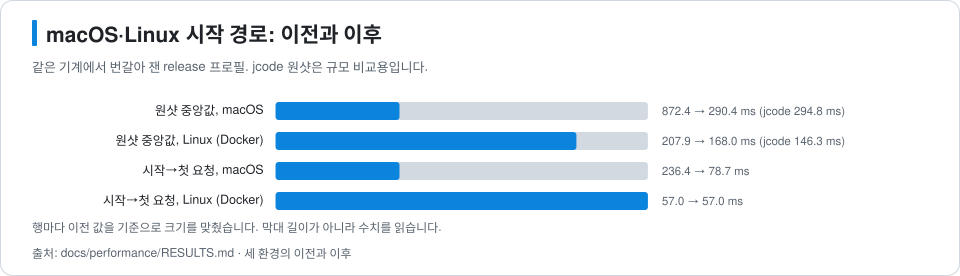
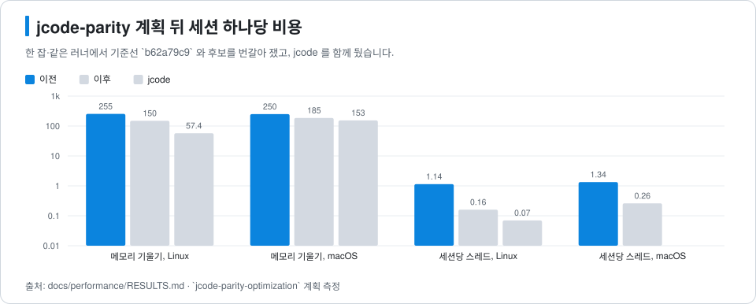

# 성능: 측정 결과와 그 한계

언어: [English](RESULTS.md) | **한국어**

이 문서는 `agent-runtime-performance-2` 계획이 기준점 B0(계획 시작 직전 커밋) 위에서 남긴 측정값을 기록한다. 이 계획은 `dev` 에 성능 커밋 19개를 올렸고, 같은 범위에 이 계획과 무관한 `fix(cli)` 커밋 하나가 더 있지만 아래 수치와는 관계가 없다. 측정 대상은 세션 저장소의 해시와 이력 페이지, SSE 파서, 복제 내보내기, 결과 캐시의 임계값 판정, 그리고 attach/detach 소크다. 측정은 모두 이 기기(Apple M1 Max, 디버그 테스트 프로필)에서 같은 기계의 앞뒤를 번갈아 재는 방식으로 이뤄졌다.

원본 산출물은 전부 `.omo/evidence/agent-runtime-performance-2/` 아래에 있고 그 경로는 `.gitignore:19` 로 무시된다. 계획은 주요 수치를 PR 본문에 옮겨 적으라고 했지만, 실제로는 대부분의 PR 본문이 한 줄이었다. 그래서 오늘 이 저장소를 클론한 사람은 이 작업의 측정값을 하나도 볼 수 없다. 이 페이지가 그 기록을 추적되는 자리로 옮긴 것이며, 모든 수치는 위 증거 파일에서 그대로 가져왔다.

## 한눈에 보기

차트가 본문이고, 정확한 수치는 해당 절의 표에 그대로 있되 접힌 채로 둔다. 표가 차트 앞을 막지 않게 하려는 것이다.


- 이벤트 10만 개 세션에서 이력 페이지 한 장은 62,169,922 B 대신 18,554 B를 읽고, 26.2 s 대신 5.9 ms가 걸린다. 200 MiB 소스 해시의 최고 할당은 268,435,520 B에서 65,600 B로 내려갔다. 시간과 읽은 바이트는 이전과 같다.
- GitHub Linux 러너의 원샷 프롬프트당 fsync 호출은 콜드 40회·웜 35회에서 아래 계획들을 거치며 15회·14회로 줄었다. jcode는 5회에 머무는데, 대화 기록을 커밋하지 않기 때문이다. 이 차이는 조정 대상이 아니라 구조 차이다.
- macOS 원샷은 872.4 ms에서 290.4 ms로, 시작→첫 요청은 236.4 ms에서 78.7 ms로 줄었다. 두 빌드를 같은 기계에서 번갈아 쟀고, 같은 실행에서 jcode 원샷은 294.8 ms였다.
- Linux 원샷은 207.9 ms에서 168.0 ms로 줄었지만 jcode의 146.3 ms보다 여전히 느리다. Windows 격차는 더 크고, 닫혔다고 주장하지 않는다.
- `jcode-parity-optimization` 계획 뒤 세션 하나당 메모리는 Linux에서 149.6 KB로, jcode의 57.4 KB보다 크다. 이전 값은 254.7 KB였다.
- 로딩 계획에서는 벽시계 개선이 확인되지 않았고, A/A 대조가 그 이유를 보여 준다. 같은 바이너리의 두 실행 차이가 그 계획이 주장할 수 있는 어떤 효과보다 크다.

## 차트: 최신 자동 측정

<!-- bench-charts:start -->

이 구간은 `.github/workflows/benchmark-docs.yml` 이 아래 자동 측정의 경쟁 도구 비교로 다시 그립니다. 손으로 고치지 않습니다. 모든 차트는 낮을수록 좋고 파란 막대가 horon 입니다.


| 항목 | 차트 |
| --- | --- |
| `--version` 시간 | [01-version.ko.svg](charts/01-version.ko.svg) |
| 설치 크기 | [02-install-size.ko.svg](charts/02-install-size.ko.svg) |
| 원샷 프롬프트 시간 | [03-oneshot-time.ko.svg](charts/03-oneshot-time.ko.svg) |
| 원샷 프롬프트 메모리 | [04-oneshot-memory.ko.svg](charts/04-oneshot-memory.ko.svg) |
| 스킬 호출 시간 | [05-skill-time.ko.svg](charts/05-skill-time.ko.svg) |
| MCP 도구 호출 시간 | [06-mcp-time.ko.svg](charts/06-mcp-time.ko.svg) |
| 최대 세션 수에서의 메모리 | [07-sessions-memory.ko.svg](charts/07-sessions-memory.ko.svg) |
| 세션 하나당 늘어나는 메모리 | [08-per-session-memory.ko.svg](charts/08-per-session-memory.ko.svg) |
| 원샷 프롬프트당 fsync 호출 수 | [09-fsync-calls.ko.svg](charts/09-fsync-calls.ko.svg) |
| 첫 세션 메모리 | [10-first-session-memory.ko.svg](charts/10-first-session-memory.ko.svg) |

대화형 클라이언트는 별도 바이너리입니다. 이 차트는 `tui` 묶음만으로 그리며 위의 헤드리스 차트와 섞지 않습니다.

| TUI 항목 | 차트 |
| --- | --- |
| TUI 지연 | [tui-01-latency.ko.svg](charts/tui-01-latency.ko.svg) |
| TUI 메모리와 크기 | [tui-02-memory.ko.svg](charts/tui-02-memory.ko.svg) |

<!-- bench-charts:end -->

## 측정 결과

차원 표기는 다음 규칙을 따른다. `MEMORY` 는 할당과 메모리, `TIME` 은 벽시계 시간, `WORK` 는 반복 횟수와 바이트량, `RESOURCES` 는 파일 서술자·스레드·태스크 수다. 한 차원의 개선을 다른 차원의 개선으로 읽지 않기 위해 차원을 따로 적는다.

<details>
<summary>정확한 수치</summary>

| 변경 | 차원 | 이전 | 이후 |
| --- | --- | --- | --- |
| 스트리밍 소스 해시, 최고 할당 (200 MiB 로그) | `MEMORY` | 268,435,520 B | 65,600 B (4,092배) |
| 스트리밍 소스 해시, 읽은 바이트 | 변화 없음 | 209,715,200 B | 209,715,200 B |
| 스트리밍 소스 해시, 벽시계 | `TIME` (개선 없음) | 6,434 ms | 6,404 ms |
| 이력 페이지, 평탄화한 메시지 (10만 이벤트, 20개 페이지) | `WORK` | 99,999개 | 20개 |
| 이력 페이지, 읽은 바이트 | `WORK` | 62,169,922 B | 18,554 B |
| 이력 페이지, 벽시계 | `TIME` | 26.2 s | 5.9 ms |
| SSE, 페이로드 12개를 파싱한 횟수 | `WORK` | 24회 | 12회 |
| 복제 내보내기, 직렬화 횟수 (페이지 64 → 256 이벤트) | `WORK` | 129회 | 513회 (이벤트 4배에 직렬화 4.0배) |
| 복제 내보내기, 참조 구현 대비 바이트 (같은 64 → 256) | `WORK` | 8,445,218 → 138,506,722 B (16.4배) | 102,903 → 411,795 B (4.0배) |
| 캐시 facade, 상한 초과 경로 (일시 할당 · 정규 직렬화) | `MEMORY` | 3,146,158 B, 1회 | 0 B, 0회 |
| 캐시 facade, 벽시계 | `TIME` (개선 없음) | MiB당 약 19 ms | MiB당 약 19 ms |
| attach/detach 소크, 200 사이클 뒤 자원 | `RESOURCES` | fd 14, 스레드 25, 태스크 2,141 | fd 14, 스레드 22, 태스크 2,141 |

</details>

몇 가지는 표만으로는 오해하기 쉬워서 따로 적는다.

- 소스 해시의 다이제스트는 다섯 픽스처(61 KB, 618 KB, 6.2 MB, 62 MB, 200 MiB)에서 모두 이전과 같다. 바뀐 것은 최고 할당 하나이고, 읽는 바이트와 걸리는 시간은 그대로다.
- 이력 페이지의 `WORK` 와 `TIME` 은 같은 요청의 두 얼굴이다. 10만 이벤트 세션에서 20개짜리 페이지 하나를 받을 때, 이전에는 세션 전체를 재생해 99,999개 메시지를 평탄화하고 62 MB 를 읽었고, 이후에는 색인이 가리키는 20개 레코드만 읽는다.
- 복제 내보내기는 페이지 크기가 4배가 될 때 이전 참조 구현이 바이트를 16.4배로 늘렸고, 지금 구현은 4.0배로 늘린다. 즉 로그 길이가 아니라 페이지 길이에 비례한다. 페이지 바이트는 B0 과 바이트 단위로 같고, 고정 다이제스트 `135cf07d...`(길이 240,882)와 `4a4855d4...`(길이 26,979)가 그대로 재현된다.
- 캐시 facade 는 상한을 넘는지 판단하려고 정규 JSON 을 한 번 직렬화하던 것을 없앴다. 1 MiB 경계는 바이트 단위로 정확하다(1,048,575 B 는 캐시, 1,048,577 B 는 건너뜀). 실제로 캐시하는 경로는 여전히 한 번 직렬화한다.
- 소크는 200 사이클, 10개 창, 588.99초다. 창마다 증가분을 재고, 실패 라운드와 정지 실패(`quiescence_misses`), 반납 실패(`non_returning`)가 모두 비어 있다.

### 같은 페이지를 로그가 커져도 같은 비용으로 받는가

색인이 있는 상태에서 20개짜리 페이지를 받을 때, 로그가 100배 커져도 읽는 바이트는 0.5%만 늘었다. 재생한 메시지는 세 크기 모두 0이다.


<details>
<summary>정확한 수치</summary>

| 이벤트 수 | 로그 크기 | 페이지가 읽은 바이트 | 벽시계 |
| --- | --- | --- | --- |
| 1,000 | 514,853 B | 15,375 B | 4.28 ms |
| 10,000 | 5,168,853 B | 15,415 B | 4.68 ms |
| 100,000 | 51,888,853 B | 15,455 B | 4.80 ms |

</details>

이 표의 로그 크기는 성장 테스트가 직접 만든 세션이라 앞 표의 10만 이벤트 픽스처(62,155,848 B)와 크기가 다르다. 같은 측정이 아니다.

### 표에 담지 않은 커밋

나머지 커밋은 앞뒤 쌍보다 상한, 측정 표면, 결정을 바꾼 것이다. NDJSON 프레이밍을 UTF-8 경계에서 안전하게 하고 프레임 상한을 넣은 커밋, 훅의 stdin 쓰기를 데드라인 안으로 옮긴 커밋, 도구 지연을 execute 가 아니라 dispatch 전체로 넓힌 커밋이 있다. 이벤트 스트림에 개수·바이트 상한과 보이는 overflow 를 넣은 커밋, 압축 결정 전의 컨텍스트 복제를 없앤 커밋, 브리지 쓰기를 select 루프 밖 유계 큐로 옮긴 커밋도 있다. 문법 오류로 실행되지 않던 벤치마크 스크립트를 고치고 고정 픽스처 생성기를 넣은 커밋, 단계 카운터·할당 프로브·같은 기계 A/B 실행기를 넣은 커밋, p99 키를 항상 남기는 규칙을 넣은 커밋이 측정 표면을 바꿨다. 네 가지 구조 항목을 측정으로 기각한 결정 기록, 구조 게이트·리포트 템플릿·A/B 안내를 넣은 커밋 둘, 색인 헤더 검사의 중복 클로저를 정리한 후속 수정이 나머지다.

## 측정했지만 채택하지 않은 것

여섯 항목은 측정한 뒤 채택하지 않기로 결정했다. 각 항목에는 그 결정을 뒤집으려면 넘어야 할 숫자가 함께 있다.

| 항목 | 결정 | 결정한 숫자 |
| --- | --- | --- |
| 비활성 세션 축출 정책 | 채택 안 함 | 세션당 fd 0.999개, 스레드 0.998개, RSS 0.41 MB. 1개에서 1,000개까지 이 기울기가 꺾이지 않는다. debug job 수(`server:memory`가 내보내는 `job_count`)는 다섯 인구 수 모두에서 0이고, 소크에서 세션 수는 0으로 돌아온다 |
| `globalEvents` 다중화 | 채택 안 함 (프로토콜 변경) | 감시 세션당 소비자 쪽 fd 7.4개와 스레드 3.0개. 데몬 자신의 몫은 세션당 연결 1.0개이고, 브리지는 연결 하나에 세션 하나를 붙인다 |
| 세션 맵 잠금 범위 축소 | 채택 안 함 | 무관한 세션 제거가 import 전체를 기다린다. 1 / 20 / 60 / 150 이벤트에서 861 / 5,561 / 11,255 / 24,499 ms, 비율 1.00 |
| 인터럽트 폴 25 ms 타이머를 통지로 교체 | 채택 안 함 | 최악 29.7 ms(평균 27.6 ms)를 아끼려고, 감시 그룹 라운드당 wakeup 1회라는 비용 구조를 바꾸는 것이다 |
| `run.stopped` 저널 쓰기와 닫기 저장 겹치기 (#144, #129) | 채택 안 함 (더 느림) | 같은 잡에서 `dev`와 비교한 Windows 마지막 요청→종료 중앙값: 5회 39.8 → 56.4 ms(run 42759006826), 20회 35.2 → 42.8 ms(run 42764256757, IQR 33.0–40.9 대 40.7–45.5). Linux와 macOS는 동률이었다. 이후 #146이 닫기 저장의 flush 자체를 없애 같은 구간이 32.5 ms가 됐다 |
| Windows 고정 셸 환경을 프로세스당 한 번만 계산 (#124, #122) | 채택 안 함 (동률) | Windows 도구 왕복 구간, 20회: 74.3 → 73.5 ms(run 42735692366), min–max 범위 안이다. 왕복의 대부분은 호출마다 만드는 env 표나 PATH 탐색이 아니라 `cmd.exe` 기동 비용이다 |

숫자로 기각한 것은 실패가 아니다. 이 계획은 "개선이 안 나오면 그 항목은 '채택 안 함'으로 근거와 함께 끝냅니다. 그것도 성공입니다"를 성공의 정의로 삼았다. 위 표의 마지막 열이 그 근거다.

## 이 숫자들이 말하지 않는 것

이 절이 이 페이지의 목적이다. 아래 문장 중 하나라도 빠지면 이 페이지는 읽는 사람을 잘못된 결론으로 데려간다.

- **소스 해시의 개선은 해시 단계에만 해당하며, 저장 경로는 검증도 흘려서 한다.** `crates/base/src/session/event_commit.rs:120-133` 는 잡아 둔 접두부를 64 KiB 버퍼 하나로 해시하고, `:148-166` 은 예약된 꼬리를 같은 크기 버퍼로 비교한다. 그래서 큰 로그를 저장해도 로그 사본을 통째로 할당하지 않는다. 계획 당시 기록한 7 KB 로그에서 156,518 B, 553 KB 로그에서 8,293,580 B는 최고 할당이 로그 크기를 따르던 저장에서 나온 값이며 지금 이 경로를 설명하지 않는다.
- **이력 페이지의 개선은 머리가 바뀌지 않은 동안의 반복 페이징에만 해당한다.** 색인은 로그의 신원 스탬프(장치, inode, 길이, mtime, ctime)에 묶여 있어 append 한 번, import 한 번, reset 한 번으로 무효가 된다. 그래서 계속 자라는 세션은 예전 비용을 한 번 더 치르고 색인을 다시 만든다. 그 재구축 비용은 측정되지 않았다. 새 머리에서 페이지를 한 번만 받는 경우는 빨라지지 않는다.
- **캐시의 개선은 할당이지 처리량이 아니다.** 벽시계는 MiB당 약 19 ms 로 양쪽이 같다. 이스케이프 비용이 어느 쪽이든 지배한다.
- **소크는 fd, 스레드, 큐, 대기 요청, 태스크를 단언한다. RSS 는 아니다.** RSS 는 68.4 MB 에서 79.5 MB 로 오른 뒤 평평하게 머물렀고(최고 83.7 MB), 관찰값으로만 남았다.
- **200 사이클 소크는 20 사이클당 자원 1개의 누수를 판별한다.** 계획이 요구한 1,000 사이클은 이제 예약 워크플로 `Attach/Detach Soak`(`.github/workflows/soak.yml`)가 매주 실행하고 첫 실행이 깨끗했으며, 풀 리퀘스트용 형식은 같은 테스트를 구조 게이트에서 20 사이클로 돌리는 것이다(`scripts/perf/check_structural.py:136-146`).
- **이 계획이 끝났을 때 구조 게이트는 프레임 상한을 단언하지 않았다.** 그때 게이트가 읽던 카운터에 프레임 계수가 없었고, 프레임 상한은 `crates/harness-api-server/src/framing_tests.rs` 만 지켰다. 이제 게이트에 `frame` 구획이 있다(`scripts/perf/check_structural.py`). 브리지 리더와 SDK 리더가 각각 `max_frame_bytes`, `accepted_frame_bytes`, `rejected_frame_bytes` 를 보고하고, 게이트는 상한이 `frame_max_bytes`(64 MiB)와 같고 거부된 가장 작은 프레임이 수락된 가장 큰 프레임보다 정확히 1바이트 큰지 확인한다. 프레임 개수는 여전히 세지 않는다.
- **이 숫자들이 덮던 `shared_context` 맵은 이제 트리에 없다.** 토픽 채널 저장소와 함께 제거됐으므로(#299) 소크도 이 맵을 더 이상 표집하지 않고, 위 표에도 이 항목의 값이 없다. 과거 측정값은 기록대로 남긴다. 모든 인구 수에서 0이었고, 그 0은 "누수가 없다"가 아니라 "아무도 쓰지 않았다"는 뜻이었다. `server:memory` 페이로드에 남은 것은 그 옆의 swarm 블록이다. `member_count`, `status_counts`, `swarm_count`, `swarm_membership_count`, `plan_count`, `plan_item_count` 와 각 바이트 추정치이고(`crates/app-core/src/server/debug_server_state.rs`), 앞으로 소크가 표집할 대상은 이 블록이다.
- **복제 내보내기의 직렬화 계수는 페이지 단위로 고정된다.** 256개 상한에서 513회지만, 로그가 커지면 내보내기 시간은 여전히 커진다(1,000 이벤트 278.2 ms, 10,000 이벤트 2,657.2 ms). 바이트가 평평한 것은 페이지 안에서지 전체 내보내기에서가 아니다.
- **캐시 facade 의 워밍 복원 시간은 단발 측정이다.** 페이지 캐시 분산을 포함하고, 같은 케이스에서 레인의 108.6 / 901.8 ms 와 리드의 재실행 108.9 / 499.7 ms 가 그 폭이다. 바이트 단위 경계 판정만 재현 가능한 수치다.
- **네 가지 채택 안 함 결정의 절대 밀리초는 릴리스 수치가 아니다.** 디버그 테스트 프로필과 임시 홈에서 잰 값이고, 전이되는 것은 비율(대기 시간이 import 시간과 같다, 세션 생성 약 1.2 s)이다.
- **`globalEvents` 의 fd 7.4개와 스레드 3.0개는 소비자 쪽 비용이다.** SDK 와 데몬이 같은 프로세스에서 돌아 양 끝이 함께 세어졌다. 100 세션과 1,000 세션 수치는 이 세션당 값에 대한 산술이지 두 번째 측정이 아니다.

## 재현 방법

측정마다 `CARGO_TARGET_DIR` 을 자기 전용 디렉터리로 두고, 한 번에 하나씩만 돌린다. 하나의 타깃 디렉터리에 테스트 바이너리 둘이 동시에 붙으면 매번 다른 실패가 나고, 그 실패는 코드에 대한 정보가 아니다.

```bash
export CARGO_TARGET_DIR="$PWD/.target-measure"
```

측정용 로그는 저장소의 생성기로 만든다. 아래는 200 MiB 로그와 10만 이벤트 로그다.

```bash
python3 scripts/perf/fixtures/gen_event_log.py --bytes 209715200 --seed 20261021 --out /tmp/event-log-200mib/
python3 scripts/perf/fixtures/gen_event_log.py --events 100000 --seed 20261021 --out /tmp/event-log-100000/
```

소스 해시는 프로브 예제가 전체 읽기와 스트리밍 다이제스트를 나란히 인쇄한다.

```bash
cargo build --locked -p horon-agent-base --example source_hash_probe
"$CARGO_TARGET_DIR/debug/examples/source_hash_probe" hash /tmp/event-log-200mib/events.jsonl
```

이력 페이지는 10만 이벤트 픽스처를 환경 변수로 넘겨 재고, 커밋된 500레코드 기준선과의 동일성은 별도 테스트가 본다.

```bash
HISTORY_PAGE_PERF_FIXTURE=/tmp/event-log-100000/events.jsonl \
  cargo test --locked -p horon-agent-harness-api-server --lib history_page_perf -- --nocapture --test-threads=1
cargo test --locked -p horon-agent-harness-api-server --lib pages_match_the_committed_pre_change_baseline -- --nocapture
```

SSE 파서는 청크 크기 네 가지에서 같은 이벤트 열과 파싱 횟수를 인쇄한다.

```bash
cargo test --locked -p horon-agent-provider-openai --lib stream::stream_tool_tests::chunked_replay_yields_the_same_events_at_every_chunk_size -- --nocapture
```

복제 내보내기는 페이지 바이트 동일성과 상한을 저장소 안 테스트가 검증한다. 표에 적은 직렬화 계수(129 / 513)를 인쇄한 QA 하네스는 `.omo/evidence/agent-runtime-performance-2/qa_task14.py` 에 있고 추적되지 않으므로, 클론한 사람은 그 계수를 직접 재현할 수 없다. 다이제스트와 길이는 재현된다.

```bash
cargo test --locked -p horon-agent-session-store replication -- --nocapture
```

캐시 facade 는 테스트가 경계 양쪽의 직렬화 횟수를 인쇄하고, 예제가 할당 최고점을 인쇄한다.

```bash
cargo test --locked -p horon-agent-base --lib event_cache -- --nocapture
cargo build --locked -p horon-agent-base --example facade_cache_probe
```

소크는 200 사이클 기본형과 `#[ignore]` 된 1,000 사이클 변형이 있다. 1,000 사이클형은 예약 워크플로 `Attach/Detach Soak`(`.github/workflows/soak.yml`)가 매주 실행한다. 이 워크플로는 `CI Required` 에 들어가지 않으므로 자원 잔류 실패가 풀 리퀘스트를 막지 않고, 추적 이슈 하나를 만들거나 갱신한다.

```bash
HORON_AGENT_WORKSPACE_TRUST=trust \
  cargo test --locked -p horon-agent --test e2e soak_attach_detach::soak_attach_detach_returns_every_counter_to_baseline -- --exact --nocapture
HORON_AGENT_WORKSPACE_TRUST=trust \
  cargo test -p horon-agent --test e2e soak_attach_detach_1000_cycles -- --ignored --exact --nocapture
```

예약 실행은 직접 재현할 수 있다: `gh workflow run soak.yml --ref dev -f cycles=1000`. 리포트는 `soak-attach-detach-report` 아티팩트이고, `python3 scripts/perf/check_soak.py <캡처한 로그>` 가 로컬 실행에서 같은 마크다운을 만든다.

### 호스트 러너에서 잰 1,000 사이클 기준선

첫 실행은 워크플로가 병합된 뒤 `dev` 푸시가 띄운 것이다([실행 43600180217](https://github.com/horon-ai/agent/actions/runs/43600180217), 커밋 `af41e0b7`). `ubuntu-24.04`, `HORON_AGENT_PERF_COUNTERS=1` 환경이다.

| 측정 | 값 |
| --- | --- |
| 사이클 | 1,000, 100개씩 10개 창 |
| 사이클 소요 | 7분 38초(13:34:30Z → 13:42:08Z), 사이클당 약 0.46초 |
| 잡 전체 | 콜드 빌드를 포함해 10분 56초 |
| 판정 | `STRUCTURAL_PERF section=soak cycles=1000 fd_retention=0 thread_retention=0 non_returning=0` |
| 리포트 | **Clean.** 모든 카운터가 기준선으로 돌아왔다 |

| 카운터 | 기준선 → 최종 | 100 사이클당 기울기 |
| --- | --- | --- |
| `fd_count` | 16 → 16 | +0.000 |
| `thread_count` | 16 → 16 | +0.000 |
| `queue_depth_high_water` | 0 → 1 | +0.100 |
| `pending_requests`, `interrupt_poll_wakeups`, `background_tasks`, `live_sessions`, `connected_clients` | 0 → 0 | +0.000 |

`queue_depth_high_water` 는 최종값이 아니라 최고 수위다. 어느 시점에든 관측된 가장 깊은 큐를 기록하므로 순간적인 1은 잔류가 아니다. 잡 타임아웃 180분은 측정된 실행보다 한 자릿수 이상 여유가 있다.

구조 게이트와 A/B 실행기의 사용법, 리포트 템플릿의 필수 키, 경계를 올리는 절차는 [`docs/performance/BENCHMARK.ko.md`](BENCHMARK.ko.md) 에 있다. 게이트 명령은 `python3 scripts/perf/check_structural.py` 이고, A/B 는 `scripts/perf/ab_perf.py` 다.

## 상태

계획의 항목은 17개이고, 14개가 완료, 3개가 부분 완료(`[~]`)다. 부분 완료의 뜻은 다음과 같다.

| 항목 | 상태 | 뜻 |
| --- | --- | --- |
| 7. 두 SDK 의 NDJSON 프레이밍 상한 | `[~]` | 코드와 테스트는 `dev` 에 있고 검증됐다. 이 항목이 지목한 증거 파일이 워크트리와 함께 사라졌고 재구성하지 않았다. 동작은 증명됐고 증거 궤적은 아니다 |
| 12. 보조·결과 캐시 바이트 회계 | `[~]` | 코드는 `dev` 에 있고, 결정적인 줄은 리드가 직접 재실행해 재현했다. 레인의 원본 증거 파일은 사라졌고, 지금 그 자리에 있는 파일은 스스로 `recovered` 라고 밝힌 재구성본이다 |
| 15. attach/detach 소크 | `[x]` | 계획 항목인 1,000 사이클이 이제 돈다. `.github/workflows/soak.yml` 이 매주·수동으로 실행하고, 첫 실행이 1,000 사이클을 7분 38초에 깨끗하게 마쳤다(`fd_retention=0`, `thread_retention=0`, `non_returning=0`, 실행 43600180217). 200 사이클 형은 풀 리퀘스트 게이트로 남되, 구조 게이트가 20 사이클로 돌린다(`scripts/perf/check_structural.py:136-146`) |
| 17. CI 구조 게이트와 리포트 템플릿 | `[~]` | 게이트는 실제로 돈다(경계 42개 `scripts/perf/structural_budget.json`, `EXIT=0`, 위반 시 `EXIT=1`, 측정 누락 시 `EXIT=2`, 계약 테스트 84개 `scripts/perf/test_check_structural.py`). 계획의 두 조건이 남았다. 프레임 계수 카운터가 없고, "B0 에서 통과"는 구조적으로 불가능하다(`STRUCTURAL_PERF` 줄을 인쇄하는 코드가 B0 뒤에 들어왔다). 이제 게이트는 `frame` 구획에서 두 리더의 프레임 상한 자체를 단언하고, 프레임 개수는 여전히 읽지 않는다 |

나머지 13개 항목은 완료다.

## `agent-rust-loading-durable-runtime` 계획의 측정 (별도 계획, 별도 기준)

위 표는 `agent-runtime-performance-2` 계획의 기록입니다. 아래는 뒤에 실행된
`agent-rust-loading-durable-runtime` 계획이 남긴 것이며, 기준 커밋도 측정 도구도 다릅니다.
두 계획의 수치를 한 표에서 비교하지 않습니다.

이 계획의 원본 산출물은 `.omo/evidence/agent-rust-loading-durable-runtime/` 아래에 있습니다.

### 시간 개선: 확인되지 않음

측정 도구(`scripts/perf/bench_loading.py` 와 `crates/base/examples/loading_probe.rs`)가 이 계획의
산출물이라, 계획 시작 직전의 기준 커밋에는 같은 도구가 없습니다. 그래서 서로 다른 두 측정
프로그램을 비교하는 대신, 같은 바이너리의 두 설정을 30회씩 교대 측정하는 대조(A/A)를
썼습니다(`aa_control: true`). 결과는 `improvement_claim: false` 입니다.

| 구간 | A p50 / p95 (ms) | B p50 / p95 (ms) |
| --- | --- | --- |
| attach_history | 671.2 / 1579.2 | 691.7 / 2047.0 |
| provider_dispatch | 12.0 / 26.5 | 13.3 / 66.2 |
| resume_ready | 309.9 / 733.9 | 299.2 / 675.1 |
| session_save | 906.8 / 1271.5 | 993.2 / 1412.7 |
| skill_catalog | 0.2 / 0.2 | 0.2 / 1.4 |

같은 바이너리의 두 실행 사이 편차가 이 계획이 주장할 수 있는 효과보다 크고, 방향도 한쪽으로
치우치지 않습니다. 따라서 **벽시계 시간 개선은 주장하지 않습니다.**

### 구조 계수: 측정되고, 상한이 지켜짐

시간 대신 계수로 판정하는 항목입니다. 두 종류의 증거가 있고, 서로 다른 것을 잽니다.

- `python3 scripts/perf/check_structural.py` 가 exit 0 으로 **상한 45개 전부 통과**(실패 0, 누락 0)
  했습니다. 이 게이트가 실제로 읽는 계수는 큐 깊이·대기 요청 수·이력 페이지 비용·해시 버퍼·
  프레임 상한·attach/detach 소크 여섯 묶음입니다.
- 아래 표의 항목은 그 게이트가 읽지 **않습니다**. 각 항목의 이름 붙은 테스트가 직접 단정합니다.

| 항목 | 차원 | 무엇이 바뀌었나 | 고정하는 테스트 |
| --- | --- | --- | --- |
| 저장 검증 | `MEMORY` | 커밋 검증이 파일 전체를 할당하지 않고 고정 64 KiB 버퍼로 스트리밍. 소스 길이는 패스 수만 늘림 | `hash_stream` |
| 요청 스냅샷 | `WORK` | 같은 요청에서 메시지 깊은 복사가 이력 길이를 따라 늘지 않음 | `request_snapshot_reuse` |
| 스킬 목록 | `WORK` | 요청당 overlay 스캔 1회 이하, 섹션 상한 49,152 B(UTF-8) | `skill_snapshot_budget` |
| 연결 준비 | `WORK` | core 밖 내장 도구 생성자 호출 0회, 시작 경로가 prewarm 네트워크를 기다리지 않음 | `loading_deferred_setup` |
| 세션 재개 | `WORK` | 살아 있는 세션 재로드와 재개 중복 저장 제거 | `loading_live_resume` |

`MEMORY` 와 `TIME` 을 섞지 않습니다. 위 표의 어느 항목도 벽시계 개선을 주장하지 않습니다.

### 이 계획이 측정하지 않은 것

- 릴리스 프로필 수치. 모든 측정은 디버그 프로필입니다.
- 다중 기기·운영 규모의 처리량.
- provider 호출의 속도. provider 네트워크 시간은 이 계획의 범위가 아닙니다.

## `agent-irc-bus` 계획의 측정

위 두 기록과 별개로 실행한 `agent-irc-bus` 계획의 측정입니다. 이 계획은 에이전트 사이의 메일박스 버스와 `irc` 도구를 넣었고, 기준 커밋 B0는 `50eed12`(`dev`의 계획 시작 직전 커밋), 후보는 `c9d9d8c`(웨이브 3 병합)입니다. 앞의 두 기록과 이 기록의 수치를 서로 비교하지 않습니다.

원본 산출물은 `.hyper/qa/agent-irc-bus/11-happy.txt`(A/B 보고서 JSON, 처리량 3회, 구조 게이트 `irc` 구역)와 `.hyper/qa/agent-irc-bus/11-failure.txt`(A/A 대조)에 있고, `.hyper/`는 저장소에서 무시되므로 이 절이 추적되는 기록입니다.

### 측정 조건

| 항목 | 값 |
| --- | --- |
| 기계 | Apple M1 Max, 10 코어, 메모리 64 GiB |
| 커널 | `Darwin Alpoxs-MacBook.local 25.4.0 ... RELEASE_ARM64_T6000 arm64` |
| 툴체인 | `rustc 1.99.1`, `cargo 1.99.1` |
| 빌드 프로필 | release, 기능 집합 없음(양쪽 모두 `cargo build --locked --release -p horon-agent-base --example perf_counters_surface`) |
| 워크로드 | `perf_counters_surface` 한 번 실행(실행마다 프로세스를 새로 띄움) |
| 측정 중 부하 | 부하 평균 50.10 / 44.73 / 44.59(1분 / 5분 / 15분), `rustc`·`cargo` 프로세스 4개 |
| 반복 수 | 워밍업 3회, 각 쪽 10회, 두 쪽을 번갈아 실행 |
| B0 바이너리 | `48c69b5c...`, 커밋 `50eed12` |
| 후보 바이너리 | `a82fb191...`, 커밋 `c9d9d8c` |

측정 중 이 계획과 무관한 컴파일이 여러 저장소에서 돌고 있었습니다. 그동안 관측한 부하 평균은 36에서 64 사이였고 `rustc`와 `cargo` 프로세스 수가 4에서 17 사이로 관측됐습니다. 그래서 이 절의 절대 시간은 조용한 기계의 값이 아닙니다.

### A/B: 회귀 없음

`scripts/perf/ab_perf.py`가 exit 0으로 끝났고 채택 판정은 `not-adopted-no-measurable-change`입니다. 회귀를 뜻하는 `reject-regression`이 아니며, 중앙값 차이가 잡음 대역 안이라 개선도 회귀도 주장하지 않는 값입니다.

| 항목 | B0 | 후보 | 차이 |
| --- | --- | --- | --- |
| 중앙값 | 5.23 ms | 5.39 ms | +0.16 ms (+3.09%) |
| p95 | 7.06 ms | 7.10 ms | +0.05 ms |
| 잡음 대역(`max(3*1.4826*MAD, 중앙값의 1%)`) | | | ±1.35 ms, 대역 안 |
| `cpu_user_ms` 중앙값 | 2.22 ms | 2.18 ms | -0.04 ms |
| `cpu_system_ms` 중앙값 | 1.55 ms | 1.60 ms | +0.05 ms |
| `peak_rss_bytes` 중앙값 | 6,045,696 B | 6,029,312 B | -16,384 B |
| `fd_count` / `thread_count` 중앙값 | 3 / 1 | 3 / 1 | 같음 |
| 실패 / 시간 초과 | 0 / 0 | 0 / 0 | |
| `read_bytes` 중앙값 | 0 B | 0 B | 같음 |

실행기는 워크로드가 보고하지 않은 `allocated_bytes`, `pss_bytes`, `retained_bytes`를 0이 아니라 `null`로 두고 `counts.missing`에 세 이름을 올렸습니다. p99는 표본 10개라 20개 미만이라는 이유와 함께 거절됐습니다.

### A/A 대조: 거짓 회귀 없음

같은 후보 바이너리를 양쪽에 넣은 대조 실행은 `control-no-change`로 끝났습니다. 중앙값은 6.48 ms와 6.70 ms로 0.22 ms(3.43%) 차이가 났지만 잡음 대역 ±1.58 ms 안입니다. 즉 위 A/B의 0.16 ms 차이는 이 측정기가 구분할 수 있는 크기가 아니며, 실행기가 회귀를 지어내지 않는다는 증거입니다.

### IRC 처리량

`cargo run --locked --release -p horon-agent-irc-core --example irc_throughput`을 3회 실행했습니다. 메시지 수는 기본값 100,000이고 `broadcast64`는 64의 배수로 내림해 99,968건입니다.


<details>
<summary>정확한 수치</summary>

| 시나리오 | 1회차 | 2회차 | 3회차 | 중앙값 | 범위 |
| --- | --- | --- | --- | --- | --- |
| `direct_waiter` (msg/s) | 105,291 | 107,434 | 111,523 | 107,434 | 105,291 ~ 111,523 |
| `direct_deliver` (msg/s) | 2,410,858 | 2,229,008 | 2,392,230 | 2,392,230 | 2,229,008 ~ 2,410,858 |
| `broadcast64` (msg/s) | 3,237,934 | 3,141,178 | 3,141,375 | 3,141,375 | 3,141,178 ~ 3,237,934 |

</details>

`direct_waiter`는 수신 작업 64쌍(`WAITER_PAIRS = 64`)이 동시에 `wait`로 기다리는 구조입니다. 각 수신 작업은 첫 라운드 뒤부터 상대에게 답장 의무를 만드는 메시지를 한 번 보내고 나서 `wait`에 들어가고, 드라이버는 64개 대기자가 모두 등록된 것을 확인한 뒤 살아 있는 쌍마다 메시지 하나를 보냅니다. 쌍 안의 왕복은 순서대로지만 64쌍은 동시에 진행합니다. `direct_deliver`는 즉시 주입을 돌려주는 가짜 전달 경로, `broadcast64`는 64개 대상에게 한 본문을 보내는 경로입니다.

todo 6이 처음 잰 `direct_waiter`는 39,128 msg/s(`6-happy.txt`, 2,555,678 us에 100,000건)였고, todo 12가 `wait` 호출마다 붙던 타이머 왕복을 없앤 뒤 이번 측정에서 107,434 msg/s입니다. 약 2.75배입니다. todo 12가 남긴 측정은 124,071 msg/s(`12-happy.txt`)이고, 이번 값은 그보다 낮습니다. 측정 시점의 부하 차이로 보이며 코드 경로는 같습니다.

### 구조 게이트 `irc`

`python3 scripts/perf/check_structural.py --only irc`가 exit 0으로 다섯 경계를 모두 통과했습니다.

| 카운터 | 관측값 | 경계 |
| --- | --- | --- |
| `mailbox_high_water` | 100 | 100 이하 |
| `mailbox_dropped` | 900 | 900과 같음 |
| `broadcast_body_allocations` | 1 | 1과 같음 |
| `waiters_live_after_churn` | 0 | 0과 같음 |
| `broadcast_inflight_high_water` | 16 | 16 이하 |

### 이 숫자들이 말하지 않는 것

- **A/B 워크로드는 버스가 아니라 프로세스 시작과 카운터 인쇄를 잽니다.** `perf_counters_surface`는 데몬을 띄우지 않고 카운터 스냅샷을 한 번 인쇄합니다. IRC 버스는 기본 설정에서 꺼져 있고 이 경로에 들어오지 않으므로, 이 A/B가 말하는 것은 "공용 코드에 회귀가 없다"까지입니다. 버스 자체의 비용은 처리량 표가 답합니다.
- **처리량은 같은 프로세스 내부 측정입니다.** 예제는 `IrcBus`와 가짜 디렉터리·가짜 전달자를 한 프로세스에 두고 잽니다. 데몬 전송, 직렬화, 세션 상태 전이, 모델 호출은 포함하지 않습니다. 실제 에이전트 대화의 응답 시간은 이 수치로 예측할 수 없습니다.
- **`direct_waiter` 수치는 기계 부하에 민감합니다.** 이번 측정의 3회는 105,291에서 111,523 사이이고, todo 6의 39,128(`6-happy.txt`)과 견주면 약 2.75배입니다. todo 12가 남긴 124,071(`12-happy.txt`)과 이번 값의 차이는 측정 시점의 부하 차이로 보이므로, 옮겨 읽을 값은 절대 처리량보다 비율입니다.
- **A/B의 절대 시간은 조용한 기계의 값이 아닙니다.** 측정 중 관측한 부하 평균이 36에서 64 사이였고, 무관한 저장소의 `cargo test`, `cargo clippy`, `cargo build`가 함께 돌았습니다. A/B가 두 쪽을 번갈아 실행하고 A/A가 잡음 대역을 확인했으므로 비교의 방향은 유효하지만, 5 ms대 절대값은 다른 조건에서 재현되지 않습니다.
- **p99는 없습니다.** 표본이 10개라 실행기가 20개 미만을 이유로 거절했습니다.
- **세 지표는 측정되지 않았습니다.** `allocated_bytes`, `pss_bytes`, `retained_bytes`는 워크로드가 보고하지 않아 `null`이고 `counts.missing`에 있습니다. 0으로 읽지 않습니다.
- **구조 게이트는 시간을 재지 않습니다.** 위 다섯 값은 모양이 상한 안에 있는지만 말하고, 빠른지는 말하지 않습니다.

## `platform-adapter-perf` 계획의 측정

위 세 기록과 별개로 실행한 `platform-adapter-perf` 계획의 측정입니다. 이 계획은 OS별 코드를 `crates/platform-*` 다섯 크레이트로 모으고, 세션 저장에서 다시 만들 수 있는 파생 캐시의 fsync를 없애고, HTTPS 클라이언트의 TLS 설정을 프로세스당 한 번만 만들고, 가격표 새로고침을 기본으로 끕니다. 기준 커밋 B0는 `738712a`(`dev`의 계획 시작 직전 커밋), 후보는 `215bfdb`(작업 브랜치)입니다. 앞 세 기록과 이 기록의 수치를 서로 비교하지 않습니다.

원본 산출물은 `.hyper/qa/platform-adapter-perf/after/` 아래에 있습니다. `.hyper/`는 저장소에서 무시되므로 이 절이 추적되는 기록입니다.

| 파일 | 내용 |
| --- | --- |
| `compare-macos.json`, `compare-linux.json`, `compare-linux-times.json` | 세 줄(horon B0, horon 후보, jcode) 비교. Linux `compare-linux.json`은 `--syscalls`, 시간 수치는 `compare-linux-times.json`에서 |
| `fsync-linux.txt` | one-shot 한 건의 fsync·fdatasync 호출 수, cold와 warm |
| `ab-*.json` | 같은 기계 A/B 보고서(실행기 출력 JSON 그대로) |
| `github-baseline/`, `github-candidate/` | GitHub `benchmark.yml` 실행 42294971747(`--ref dev`)과 42294976581(브랜치)의 아티팩트 |
| `structural.log` | `check_structural.py` 전체 출력 |

### 측정 조건

| 항목 | macOS | Linux | GitHub 러너 |
| --- | --- | --- | --- |
| 기계 | Apple M1 Max, 10 코어 | Docker `rust:1-trixie`, linux/aarch64, 10 코어 | `ubuntu-latest`, linux/x86_64, 4 코어 |
| 툴체인 | `rustc 1.99.1` | 컨테이너 배포판 rustc | `stable` (실행 시점) |
| 프로필 | release | release | release |
| 한 측정 안의 두 바이너리 | 같은 기계, 번갈아 실행 | 같음 | 다른 실행, 다른 러너 인스턴스 |
| 경쟁 도구 | jcode v0.99.1 (`7206efd0c`) | 같음 | 같음 |

한 측정 안의 모든 줄이 같은 모의 모델 서버에 붙으므로 API 요금과 시크릿은 쓰지 않습니다. macOS와 Linux는 B0 바이너리와 후보 바이너리를 같은 실행 안에서 쟀고, GitHub은 `dev` 실행과 브랜치 실행을 따로 띄웠습니다. 그래서 아래 표에서 GitHub 열만 "전후"가 아니라 "두 실행"입니다.

### 세 환경 전후

one-shot은 `run` 질문 한 건(기동, `ls` 도구 왕복 1회, 최종 응답)의 중앙값입니다. start→first request는 api-bridge 소켓 연결부터 첫 `list_sessions` 응답까지입니다. fsync는 one-shot 한 건이 부른 fsync·fdatasync 호출 수입니다. 메모리는 데몬 프로세스 트리의 idle RSS입니다.



<details>
<summary>정확한 수치</summary>

| 지표 | 환경 | B0 `738712a` | 후보 `215bfdb` | 변화 | jcode | 후보 / jcode |
| --- | --- | --- | --- | --- | --- | --- |
| one-shot 중앙값 | macOS | 872.4 ms | 290.4 ms | -66.7% | 294.8 ms | 0.99× |
| one-shot 중앙값 | Linux (Docker) | 207.9 ms | 168.0 ms | -19.2% | 146.3 ms | 1.15× |
| one-shot 중앙값 | GitHub 러너 | 185.3 ms | 499.8 ms | 별도 실행, 비교 불가 | 145.5 ms / 357.8 ms | 비교 불가 |
| start→first request | macOS | 236.4 ms | 78.7 ms | -66.7% | 해당 없음 | 해당 없음 |
| start→first request | Linux (Docker) | 57.0 ms | 57.0 ms | -0.03% | 해당 없음 | 해당 없음 |
| start→first request | GitHub 러너 | 23.7 ms | 25.3 ms | 별도 실행 | 해당 없음 | 해당 없음 |
| fsync·fdatasync 호출 | Linux (Docker) | 175 cold / 170 warm | 40 cold / 35 warm | -77% | 19 cold / 5 warm | 7.0× |
| fsync·fdatasync 호출 | GitHub 러너 | 잴 수 없음 | 40 cold / 35 warm | 잴 수 없음 | 19 / 10 / 5 회 | 3.5× |
| 첫 세션 idle RSS | macOS | 32.73 MiB | 29.52 MiB | -9.8% | 37.34 MiB | 0.79× |
| 첫 세션 idle RSS | Linux (Docker) | 32.05 MiB | 33.37 MiB | +4.1% | 40.29 MiB | 0.83× |
| 세션당 증가분 | macOS | 592 KiB | 320 KiB | -46% | 544 KiB | 0.59× |
| 세션당 증가분 | Linux (Docker) | 1396 KiB | 944 KiB | -32% | 144 KiB | 6.6× |
| 첫 세션 idle RSS | GitHub 러너 | 잴 수 없음 | 39.9 MiB | 잴 수 없음 | 43.0 MiB | 0.93× |
| 세션당 증가분 | GitHub 러너 | 잴 수 없음 | 319 KiB | 잴 수 없음 | 38 KiB | 8.3× |

</details>

이 표의 후보 열은 `215bfdb` 바이너리로 잰 값입니다. 그 뒤 브랜치에 쌓인 변경 가운데 시작 경로를 건드린 것은 지연 HTTP 클라이언트(`b6dcfc0`) 하나이고, 시간·메모리 재측정은 아래 "메모리" 절에 있습니다. F2 품질 검토가 찾은 11건의 수정도 이 수치를 바꾸지 않았고, 같은 실행기로 다시 재면 Linux fsync가 cold 40 · warm 35로 값이 같습니다(`F2-review.md`의 "fsync" 절).

fsync의 40 상한 판정은 `bench_compare.py --syscalls` 실행기가 잰 값(cold 40 · warm 35)입니다. todo 6의 자체 드라이버는 HOME과 프롬프트 모양이 달라 같은 후보 바이너리에서 cold 45 · warm 40을 쟀고, 그 실행에서는 40 상한을 warm만 만족합니다(`6-linux-fsync.txt`의 "result against the plan").

호스트 러너의 절대값은 기계마다 달라 뜻이 없으므로 GitHub 열은 "워크플로가 브랜치에서 그대로 돌고 fsync 수도 기록된다"까지만 읽습니다. GitHub B0 실행의 세션 측정은 세 지점 모두 `daemon socket not ready`로 실패했습니다. 그 실행은 `dev`의 `bench_compare.py`를 쓰는데, `serve --debug-socket` 제거에 맞춘 수정(todo 13)이 아직 브랜치에만 있어서입니다. 그래서 GitHub B0의 세션 값은 0으로 읽지 않습니다.

### 같은 기계 A/B: 시간 경로에 회귀 없음

`scripts/perf/ab_perf.py`는 두 바이너리를 블록 단위로 번갈아 실행하고 잡음 대역 `max(3*1.4826*MAD, 중앙값의 1%)`을 함께 냅니다. 대역을 넘는 차이만 개선이나 회귀로 부릅니다.

한 줄이 한 경로입니다. one-shot과 start→first request, 세션 경로는 준비(임시 HOME, 모의 모델 주소, 데몬 기동)를 대신 해 주는 작은 프로브를 거치므로 이 표의 절대값은 앞 환경 표보다 프로브 기동분만큼 큽니다. 두 쪽이 같은 프로브를 쓰므로 비교 방향은 그대로입니다.

<details>
<summary>정확한 수치</summary>

| 경로 | 환경 | B0 | 후보 | 차이 | 잡음 대역 | 판정 |
| --- | --- | --- | --- | --- | --- | --- |
| one-shot | macOS | 1121.85 ms | 435.79 ms | -61.2% | ±93.95 ms | 개선 |
| start→first request | macOS | 236.36 ms | 78.72 ms | -66.7% | ±10.36 ms | 개선 |
| 세션 경로 2개 | macOS | 3295.26 ms | 2259.88 ms | -31.4% | ±131.13 ms | 개선 |
| `--version` 로드 | macOS | 7.76 ms | 7.52 ms | -3.0% | ±1.36 ms | 대역 안 |
| `perf_counters_surface` | macOS | 4.74 ms | 4.80 ms | +1.3% | ±1.41 ms | 대역 안 |
| one-shot | Linux | 265.02 ms | 217.62 ms | -17.9% | ±14.61 ms | 개선 |
| `--version` 로드 | Linux | 2.60 ms | 2.63 ms | +1.2% | ±0.39 ms | 대역 안 |
| `perf_counters_surface` | Linux | 0.46 ms | 0.47 ms | +1.6% | ±0.08 ms | 대역 안 |
| start→first request | Linux | 57.03 ms | 57.02 ms | -0.03% | ±2.93 ms | 대역 안 |
| 세션 경로 1개 | Linux | 14882 ms | 14836 ms | -0.3% | ±148.82 ms | 대역 안 |
| 세션 경로 2개 | Linux | 14936 ms | 14858 ms | -0.5% | ±149.36 ms | 대역 안 |

</details>

도구 지연과 기동 단계는 같은 기계에서 따로 확인했습니다. `bench_tools.py`의 14개 케이스를 3회씩 번갈아 돌린 결과 중앙값 차이는 -15.7%에서 +5.4% 사이이고, 커진 케이스는 `ls`(+5.4%), `agentgrep`(+1.1%), `read (repo Cargo.toml)`(+0.9%)입니다. `ls`는 B0의 세 회차가 2.21 / 2.46 / 3.57 ms이고 후보가 2.58 / 2.59 / 2.64 ms라 B0 자신의 회차 폭 안에 들어갑니다. `bench_startup.py`의 서버 준비 중앙값은 10.8~10.9 ms(B0)와 11.0 ms(후보), 브리지 총 시간은 18.1~18.6 ms와 17.9~18.6 ms로 양쪽이 겹칩니다. GitHub 후보 실행에서 변경과 무관한 도구 케이스까지 20~40% 높았던 것은 러너 인스턴스 차이이고, 같은 기계에서는 재현되지 않습니다.

macOS가 크게 줄어든 것은 이 계획이 노린 두 비용이 macOS에만 있었기 때문입니다. 파생 캐시를 포함한 저장마다 `F_FULLFSYNC`를 걸던 경로가 원본으로 줄었고, reqwest 클라이언트마다 키체인 인증서를 읽던 경로가 프로세스당 한 번 생성으로 바뀌었습니다. 대조로 `--version` 로드와 `perf_counters_surface`는 두 환경 모두 대역 안입니다. 이 두 경로는 저장도 TLS도 지나지 않으므로, 공용 코드에 회귀가 생겼다면 여기서 먼저 보였을 자리입니다.

### 메모리: Linux 데몬 상주량의 처음 수치와, 다시 잰 뒤의 결론

시간 경로는 어디서도 느려지지 않았습니다. 메모리는 Linux 데몬 상주량(`rss`)이 늘어난 것으로 처음 기록했는데, 그 측정 방법 자체가 두 빌드를 비교할 수 없다는 것을 뒤에 확인했습니다. 처음 수치를 먼저 남기고, 재측정과 원인 수정을 그 아래 적습니다.

<details>
<summary>정확한 수치</summary>

| 측정 | 환경 | B0 | 후보 | 차이 |
| --- | --- | --- | --- | --- |
| 데몬 idle, 세션 0개 | macOS | 27.82 MiB | 24.09 MiB | -3.73 MiB (-13.4%) |
| 데몬 idle, 세션 1개 | macOS | 32.34 MiB | 28.95 MiB | -3.39 MiB (-10.5%) |
| 데몬 idle, 세션 0개 | Linux | 27.88 MiB | 29.01 MiB | +1.13 MiB (+4.1%) |
| 데몬 idle, 세션 1개 | Linux | 31.74 MiB | 32.75 MiB | +1.01 MiB (+3.2%) |
| one-shot 최고 RSS (8회) | Linux | 32.46 MiB | 32.87 MiB | +0.41 MiB (+1.3%, 범위 겹침) |
| 같은 바이너리 대조 (A/A) | Linux | 27.83 MiB | 27.87 MiB | +0.03 MiB (+0.1%) |

</details>

Linux의 차이는 힙이 아니라 실행 파일 상주 페이지입니다. 세션 1개 상태의 `/proc/<pid>/smaps`를 매핑 종류별로 더하면 다음과 같습니다.

| 매핑 | B0 | 후보 | 차이 |
| --- | --- | --- | --- |
| 실행 파일 `r-xp` | 26176 KiB | 27136 KiB | +960 KiB |
| 실행 파일 `r--p` | 1508 KiB | 1508 KiB | 0 |
| 익명 `rw-p` | 1796 KiB | 1730 KiB | -66 KiB |
| 그 밖 | 1784 KiB | 1784 KiB | 0 |

같은 측정을 한 번 더 돌리면 `r-xp` 차이는 +960에서 +1472 KiB, 익명 차이는 -66에서 +156 KiB 사이에서 나옵니다. 두 번 모두 방향은 같고 크기는 실행 파일 쪽이 압도적입니다. 세션이 없을 때도 같은 방향으로 `r-xp` +1152 KiB, 익명 +10 KiB입니다. 보조 페이지 폴트 중앙값은 1574와 1584로 사실상 같고 주 페이지 폴트는 양쪽 0입니다. 바이너리는 276,928 B 커졌고 `.text`는 100,576 B 커졌으므로, 늘어난 상주량은 파일 크기보다 크게 나옵니다. 즉 더 많은 코드 페이지가 실제로 닿습니다. 세션당 증가분은 반대로 B0 1396 KiB에서 944 KiB로 줄었습니다.

#### 다시 잰 결과: 이 차이는 코드가 아니라 페이지 캐시였다

처음 수치는 같은 파일을 양쪽에 쓰는 A/A 대조만 했기 때문에 "이 바이너리 하나에서는 측정이 반복된다"만 보증합니다. 같은 소스를 독립적으로 두 번 빌드해 같은 방법으로 재면 그 차이보다 큰 폭으로 흔들립니다.

| 대조 | rss 중앙값 | `r-xp` 중앙값 |
| --- | --- | --- |
| 같은 커밋, 빌드 1 vs 빌드 2 | 22.22 vs 21.63 MiB | 22068 vs 22028 KiB |
| 같은 커밋, 빌드 1 vs 빌드 3 | 22.22 vs 26.33 MiB | 22068 vs 21948 KiB |
| 후보 커밋, 빌드 1 vs 빌드 2 | 27.00 vs 23.17 MiB | 22576 vs 22716 KiB |
| 같은 바이트, 경로만 다름 | 14.39 vs 26.85 MiB | 11276 vs 24076 KiB |

원인은 `r-xp` 상주 페이지가 실행한 코드가 아니라 커널이 폴트마다 함께 매핑한 페이지 캐시 폴리오라는 점입니다. 상주 구간의 중앙 길이는 32~48페이지(64 KiB 폴리오)이고, 실제 실행 구간은 1~2페이지입니다. 그래서 같은 소스의 두 빌드도 상주량이 8 MiB까지 갈립니다.

측정을 캐시에 흔들리지 않는 값으로 바꿨습니다. callgrind 명령어 덤프(`--dump-instr=yes`)에서 실행한 4 KiB 코드 페이지 수를 세고, `rss`는 시작 전마다 `posix_fadvise(DONTNEED)`로 페이지 캐시를 비우고 `fault_around_bytes`를 4096으로 고정해 쟀습니다.

| 빌드 | 실행 코드 페이지 | `rss` 중앙값(통제 측정) |
| --- | --- | --- |
| 기준선 738712a #1 | 1765 | 26.42 MiB |
| 기준선 #2 | 1765 | 26.37 MiB |
| 후보 f5f5868 #1 | 1771 | 26.92 MiB |
| 후보 #2 | 1778 | - |
| 후보 #3 | 1771 | - |

한쪽 안의 빌드 간 폭(기준선 1759~1765)이 양쪽 차이(1765 vs 1771)와 같거나 큽니다. 즉 처음 기록한 "+1.0~1.3 MiB 실행 코드 상주"는 이 변경에 귀속되는 회귀가 아닙니다.

#### 실제로 고친 것: 시작할 때 TLS 신뢰 저장소를 만들던 경로

`serve`는 시작할 때 도구 레지스트리를 만듭니다. 그때 `WebFetchTool::new`, `WebSearchTool::new`, `DiscoverToolsTool::new`, `NotificationDispatcher::new`가 각각 `shared_http_client()`를 들고 있었고, 그 클라이언트를 만드는 일은 신뢰 저장소 449개 앵커를 전부 파싱하는 일입니다.

    shared_http_client -> ClientBuilder::build -> openssl_probe::probe
      -> rustls_native_certs::load_pem_certs
      = 시작 instructions의 83%, 실행 코드 페이지 878개 중 194개

네 생성자가 클라이언트를 들지 않게 바꿨습니다. `shared_http_client()`는 이미 프로세스 전역 `OnceLock`이므로, 요청을 보내는 지점에서 그대로 부르면 됩니다.

| 쪽 | 실행 코드 페이지 | `rss` 중앙값 | `r-xp` 중앙값 |
| --- | --- | --- | --- |
| 기준선 | 1765 | 26.42 MiB | 22068 KiB |
| 수정 전 후보 | 1771 | 26.92 MiB | 22576 KiB |
| 수정 후 후보 | 1755 | 26.59 MiB | 22208 KiB |

수정 후 실행 코드 페이지는 기준선보다 적습니다(1755 vs 1765). 남은 `rss` 차이 +0.17 MiB는 위에서 본 같은 소스 빌드 간 폭(통제 측정에서 최대 8 MiB, 같은 쌍에서 0.6 MiB) 안이며, 실행 코드 차이로는 나타나지 않습니다.

시작 경로의 나머지는 양쪽이 같습니다. idle까지의 시스템 호출은 5416 vs 5428(53종 중 46종 동일), 연 파일은 364 vs 365입니다.

### 구조 게이트

`python3 scripts/perf/check_structural.py`가 exit 0으로 55개 경계를 모두 통과했습니다(실패 0, 누락 0). 이 게이트는 벽시계 시간을 읽지 않으므로 위 시간 수치와는 다른 축을 지킵니다.

### 이 숫자들이 말하지 않는 것

- **GitHub 러너의 두 실행은 전후 비교가 아닙니다.** 서로 다른 호스티드 러너 인스턴스이고, 브랜치의 워크플로만 `--syscalls`를 켜므로 후보 실행에만 strace가 붙습니다. 후보 실행에서 이 변경과 무관한 바이너리까지 일제히 느려졌습니다: jcode 145.5 → 357.8 ms, Claude Code 452.1 → 913.9 ms, Codex CLI 369.4 → 2273.1 ms, OpenCode 2.98 → 5.81 s, pi 928.4 → 2109.5 ms. 바뀌지 않은 실행 파일이 두 배 넘게 느려졌으므로 두 실행의 차이는 이 계획이 아니라 러너와 계측에서 옵니다. 같은 Docker 기계에서 잰 strace 비용은 one-shot당 +255에서 +259 ms였고, 후보 실행의 변경 없는 도구 지연도 일률적으로 높습니다(`bash (true)` 2.2 → 3.1 ms, `read (tiny file)` 0.5 → 0.6 ms). 이 계획의 회귀 판정은 같은 기계에서 잰 macOS와 Docker Linux 두 환경으로 합니다.
- **macOS의 -66.7%는 이 계획의 두 비용에만 해당합니다.** 저장 경로와 클라이언트 생성 경로를 지나지 않는 `--version` 로드와 `perf_counters_surface`는 대역 안입니다. 모델 지연, 도구 실행 시간, 프롬프트 조립 시간은 이 수치에 들어 있지 않습니다.
- **fsync 호출 수는 Linux 컨테이너에서만 셉니다.** macOS에는 `strace`가 없고, 이 계획은 macOS의 기본 동기화를 바꾸지 않았습니다(설정 `[storage] sync = "fast"`로만 일반 fsync).
- **처음 잰 Linux 데몬 RSS +1.0~1.3 MiB는 회귀가 아니었습니다.** 그 값은 실행한 코드가 아니라 커널이 폴트마다 함께 매핑한 페이지 캐시 폴리오를 재고 있었습니다. 같은 소스의 두 빌드도 더 크게 흔들리므로 그 수치로 이 변경을 판정할 수 없습니다. 캐시에 흔들리지 않는 실행 코드 페이지로 다시 재면 후보가 기준선보다 적고(수정 후 1755 vs 1765), 통제한 `rss` 차이는 같은 소스 빌드 폭 안입니다. 대신 시작할 때 TLS 신뢰 저장소를 만들던 경로를 찾아 없앴습니다(위 "실제로 고친 것").
- **첫 세션 RSS와 세션당 증가분은 다른 축입니다.** Linux 후보는 첫 세션 값이 +1.3 MiB 높고 세션당 증가분은 -452 KiB입니다. 두 값을 하나의 "메모리"로 합치지 않습니다.
- **`perf_counters_surface`는 데몬을 띄우지 않습니다.** 이 워크로드가 말하는 것은 "공용 코드에 회귀가 없다"까지이고, 저장 경로나 TLS 경로의 비용은 one-shot 표가 답합니다.
- **p99는 없습니다.** 표본이 12개 이하라 실행기가 20개 미만을 이유로 거절했습니다.

## `cache-context-session-opt` 계획의 측정

이 계획은 OpenAI 호환 요청에 `prompt_cache_key`와 보존 기간을 싣고(`ee9f46bc`), 같은 입력이면 그 키를 다시 계산하지 않으며(`263ab39e`), 압축 꼬리를 회복 대역(기준의 0.8)에 맞추고(`6e7f5052`), 묶음 저장의 로그 동기화를 묶음 끝 한 번으로 합칩니다(`626eebb3`). 성능은 GitHub Actions에서만 잽니다. 후보는 `dev`의 `e95b8773`이고, 측정은 2026-11-07의 `benchmark.yml` 실행 42371020359(`--ref dev`, linux·macos·windows 모두 성공)와 `structural-perf.yml` 실행 42371014382(성공)입니다. 비교 기준은 위 `platform-adapter-perf` 절에 기록된 같은 러너 값입니다.

| 지표 | 환경 | 이전 기록 | 후보 `e95b8773` | 변화 |
| --- | --- | --- | --- | --- |
| one-shot fsync·fdatasync 호출 (표본 3) | GitHub Linux 러너 | 40 cold / 35 warm | 32 cold / 27 warm | -20% cold, -23% warm |
| 그중 fsync / fdatasync (cold) | GitHub Linux 러너 | 해당 없음 | 16 / 16 | 해당 없음 |
| jcode 대비 배수 (warm) | GitHub Linux 러너 | 7.0× (35 / 5) | 5.4× (27 / 5) | 차이 축소 |
| one-shot 시간 중앙값 | GitHub macOS 러너 | 해당 없음 | 175.52 ms (jcode 341.8 ms) | 해당 없음 |
| one-shot 시간 중앙값 | GitHub Windows 러너 | 해당 없음 | 269.02 ms (jcode 175.37 ms) | 해당 없음 |
| 구조 성능 게이트 | GitHub Linux 러너 | 통과 | 통과 | 회귀 없음 |

줄어든 호출은 로그 줄의 fdatasync입니다. 3건 묶음 저장의 `LogFileSync`가 3에서 1로 줄어든 것은 `crates/session-store/tests/batch_sync.rs`가 고정합니다.

### 이 숫자들이 말하지 않는 것

- **one-shot 시간은 표본이 3개입니다.** 이 절은 OS별 현재 값을 적을 뿐이고, 같은 러너의 이전 시간 값과 A/B로 비교한 것이 아닙니다. 아래 자동 측정 절이 `main`에서 같은 묶음을 계속 다시 잽니다.
- **캐시 키의 효과는 여기 없습니다.** 벤치마크는 가짜 모델 서버를 쓰므로 캐시 적중이 생기지 않습니다. 적중은 실제 모델 회사의 `cached_tokens`로만 보입니다. 키 계산 비용은 세션 안에서 입력이 바뀌지 않으면 비교 한 번으로 끝나도록 메모했습니다(`crates/provider-openai/src/chat/prompt_cache_memo.rs`).
- **압축 회복 대역은 시간 지표가 아닙니다.** 24k 창의 남기는 꼬리가 10,800에서 3,625 토큰으로 줄고 200k 창은 140,000 / 20,000 그대로라는 것은 단위 테스트가 확인합니다.

## `jcode-parity-optimization` 계획의 측정

이 계획은 기본 실행에서 가격표 읽기와 두 번째 설정 파싱을 건너뛰고(`76a510fd`), 세션마다 저장 스레드를 두던 것을 최대 4개짜리 공용 writer 풀로 바꾸고(`c75dd149`), 더티 표식을 디렉터리 fsync 하나로 확정하고(`af13232d`), 30분 넘게 쉰 세션의 파생 캐시를 놓습니다(`1266059d`). 성능은 GitHub Actions에서만 잽니다. `benchmark.yml`의 `baseline_ref` 입력으로 기준 `main`(`b62a79c9`)과 후보를 **한 잡 안에서 같은 러너, 같은 가짜 모델 서버로 번갈아** 쟀으므로 아래 이전/이후는 같은 기계의 A/B입니다. 실행은 2026-11-08의 42388003895(linux·macos, 세션 1·10·100, 턴 3, one-shot 표본 3)와 42389421614(macos, one-shot 표본 20)입니다.



<details>
<summary>정확한 수치</summary>

| 지표 | 환경 | 이전 `b62a79c9` | 이후 | jcode v0.99.1 |
| --- | --- | --- | --- | --- |
| 세션 하나가 늘 때 메모리 (기울기) | GitHub Linux 러너 | 254.7 KB | 149.6 KB | 57.4 KB |
| 세션 하나가 늘 때 메모리 (기울기) | GitHub macOS 러너 | 249.6 KB | 185.1 KB | 153.4 KB |
| 세션당 스레드 | GitHub Linux 러너 | 1.14 | 0.16 | 0.07 |
| 세션당 스레드 | GitHub macOS 러너 | 1.34 | 0.26 | 측정 불가 |
| 100세션 턴 뒤 트리 RSS | GitHub Linux 러너 | 96.2 MB | 79.2 MB | 65.5 MB |
| 100세션 턴 뒤 트리 RSS | GitHub macOS 러너 | 84.5 MB | 75.4 MB | 70.1 MB |
| one-shot fsync·fdatasync 호출 (cold, 첫 표본) | GitHub Linux 러너 | 32 | 27 | 19 |
| one-shot fsync·fdatasync 호출 (warm, 마지막 표본) | GitHub Linux 러너 | 27 | 22 | 5 |
| one-shot 시간 중앙값 (표본 3) | GitHub Linux 러너 | 367.0 ms | 363.9 ms | 288.7 ms |
| one-shot 시간 중앙값 (표본 20) | GitHub macOS 러너 | 219.3 ms | 215.8 ms | 312.9 ms |

</details>

세션당 fd는 두 환경 모두 이전과 이후가 1.00으로 같습니다.

### 이 숫자들이 말하지 않는 것

- **표본 3개의 macOS 중앙값은 회귀처럼 보였습니다.** 42388003895에서 이후 384.3 ms, 이전 254.4 ms였지만 표본이 이후 616·384·245 ms, 이전 594·254·235 ms로 흩어져 있었습니다. 같은 비교를 표본 20개로 다시 잰 42389421614에서 중앙값 215.8 대 219.3 ms, 최솟값 174.7 대 173.5 ms로 차이가 없었습니다. 그래서 `benchmark.yml`에 `oneshot_runs` 입력을 두었습니다.
- **jcode와의 차이는 아직 남아 있습니다.** Linux에서 세션 하나가 늘 때 메모리는 jcode의 약 2.6배이고 one-shot은 1.26배 느립니다. 이 계획은 그 차이를 줄였을 뿐 없애지 않았습니다.
- **세션당 스레드 기준(기울기 0.1 미만)은 Linux에서만 맞았습니다.** 세션 1·10·100 세 점의 기울기는 Linux 0.16, macOS 0.26이었습니다. 세션 500을 더한 42397804493(같은 러너 A/B, one-shot 표본 20)에서는 Linux 0.05(이전 1.04, jcode 0.02), macOS 0.40(이전 1.45)입니다. Linux의 세 점 값은 적은 세션 수에서 런타임 스레드가 섞인 잡음이었지만, macOS는 500세션에서도 0.1을 넘습니다. writer 풀은 최대 4개이므로 macOS에서 남은 기울기는 다른 곳(데몬의 블로킹 작업 스레드로 보임)에서 오며, 원인은 확인하지 않았습니다. 500세션 턴 뒤 트리 RSS는 Linux 289.2 → 189.9 MB(jcode 159.9 MB), macOS 226.8 → 161.7 MB(jcode 156.8 MB)입니다.
- **macOS one-shot 중앙값은 두 번 잰 결과의 방향이 엇갈립니다.** 표본 20개로 42389421614에서는 이후 215.8 대 이전 219.3 ms, 42397804493에서는 199.4 대 188.7 ms(+5.7%)였고 최솟값은 두 번 모두 같았습니다(174.7 대 173.5, 168.7 대 168.6 ms). 같은 실행의 Linux는 410.6 대 407.6 ms입니다. 회귀로 판정하지 않았지만 호스티드 러너의 잡음 대역이 약 ±6%라는 뜻이기도 합니다.
- **`ab_perf.py` 경로별 A/B는 돌리지 않았습니다.** 이 계획의 시간 비회귀 판정은 위 one-shot 표(같은 러너 번갈아 측정)와 구조 성능 게이트로 했고, `perf_counters_surface`·start→first request 같은 경로별 A/B는 기록에 없습니다.
- **hibernation의 효과는 위 표에 없습니다.** 벤치마크는 턴 직후 잠깐 쉬고 재므로 30분 창이 지나지 않습니다. 해제가 실제로 일어나는지는 `crates/app-core/src/server/idle_hibernation_tests.rs`가 확인합니다.

## `skill-mcp-loading-omp` 계획의 측정

스킬 목록, 작업 폴더 스킬, MCP 사용자 설정 로딩을 바꾼 계획입니다. 판정은 `.github/workflows/loading-ab.yml` 한 번의 실행으로 했습니다. 개발 기기에서 잰 수치는 판정에 쓰지 않았습니다.

### 측정 조건

- 실행: [run 42461323656](https://github.com/horon-ai/agent/actions/runs/42461323656), 2026-11-08, `ubuntu-24.04` 잡 하나에서 두 쪽을 릴리스로 빌드하고 번갈아 잼.
- 기준선 `23007c9b`(로딩 카운터가 처음 들어간 커밋), 후보 `83f2b6c7`. 툴체인 `rustc 1.99.1`.
- `bench_loading.py --mode warm --events 0 --skills 0,200,1000`, 예열 3회, 측정 30회씩. 두 조건: 본문 8 KiB와 `~/.claude.json` 300 KB, 그리고 둘 다 0. 픽스처가 `[mcp] claude_user = true`를 켜서 두 쪽이 같은 파일을 읽습니다.
- 측정 단계 하나는 요청 9회분입니다(`REPEAT_REQUESTS`).

### 카운터: 세 조건 모두 참

| 픽스처 (본문 8 KiB, MCP 300 KB) | 카운터 | 기준선 | 후보 |
| --- | --- | --- | --- |
| 스킬 200개 | `skill_catalog` `skill_bytes_read` | 1,656,290 | 819,200 |
| 스킬 1000개 | `skill_catalog` `skill_bytes_read` | 8,281,890 | 4,096,000 |
| 스킬 0·200·1000개 | `mcp_config_load` `mcp_config_reads` | 9 | 0 |
| 스킬 0·200·1000개 | `skill_request_overlay` `skill_file_reads` | 0 | 0 |

본문이 0인 조건의 `skill_bytes_read`(23,490 / 117,890)는 두 쪽이 같습니다. 앞머리만 있는 파일이라 줄일 본문이 없습니다. `skill_request_overlay`의 파일 읽기는 기준선도 0입니다. 기준선은 요청 범위 안에서 같은 목록을 다시 쓰고, 대신 요청마다 폴더를 다시 훑습니다. 그 비용은 아래 시간에 나옵니다.

### 시간 (p50, 괄호는 p95, ms)


<details>
<summary>정확한 수치</summary>

| 단계 | 조건 | 기준선 | 후보 |
| --- | --- | --- | --- |
| `skill_request_overlay` | 스킬 200, 본문 8 KiB | 28.30 (29.09) | 4.79 (4.96) |
| `skill_request_overlay` | 스킬 1000, 본문 8 KiB | 149.03 (153.92) | 26.46 (27.83) |
| `skill_catalog` | 스킬 200, 본문 8 KiB | 4.41 (4.53) | 3.00 (3.11) |
| `skill_catalog` | 스킬 1000, 본문 8 KiB | 21.88 (22.64) | 15.00 (15.32) |
| `skill_catalog` | 스킬 1000, 본문 0 | 15.71 (15.98) | 14.82 (15.28) |
| `mcp_config_load` | MCP 300 KB | 3.46 (3.71) | 0.22 (0.26) |

</details>

`bench_tools.py`의 14개 사례는 모두 후보 중앙값이 기준선과 같거나 작습니다(표본 5개씩, 같은 잡).

### 측정 중에 고친 것

- 첫 실행([run 42458666340](https://github.com/horon-ai/agent/actions/runs/42458666340))에서 본문 0 조건의 `skill_catalog`가 기준선 p95를 넘었습니다(스킬 1000개 9.65 → 13.52 ms). 원인은 이름 충돌 처리가 스킬마다 앞서 받은 목록을 처음부터 훑던 것과, 충돌이 없어도 스킬마다 namespace 문자열과 비교 키를 만들던 것입니다. `abd7618e`, `83f2b6c7`에서 이름 색인, 충돌 때만 namespace 계산, 스레드 하나 줄이기, 첫 4 KiB 안의 앞머리는 힙 버퍼 없이 파싱하기로 고쳤고, 위 표가 고친 뒤의 결과입니다.
- 벤치 스크립트의 MCP 픽스처 확인이 "측정 단계에서 파일을 다시 읽었는가"를 보던 것을 "그 파일의 서버가 로드됐는가"로 바꿨습니다(`b3a053b3`). 파싱 캐시가 바뀌지 않은 파일을 다시 읽지 않는 것이 이번 변경의 목적이기 때문입니다.

### 이 숫자들이 말하지 않는 것

- 실행마다 러너가 달라 같은 기준선도 실행 사이에 수 ms씩 움직였습니다(본문 0, 스킬 1000개 `skill_catalog` 기준선 9.65 / 15.62 / 15.71 ms). 비교는 같은 실행 안의 두 쪽끼리만 했습니다.
- 콜드 시작(파일 캐시가 빈 상태)은 재지 않았습니다.
- Windows는 ctime이 없어, 같은 크기로 고치고 수정 시각을 되돌린 스킬 파일은 다음 요청에 보이지 않을 수 있습니다(`docs/runtime/PROMPT.md`).

## fsync 감축과 jcode와의 구조적 차이 (#47)

세 변경을 넣었습니다. 명시 선택을 한 번도 하지 않은 세션은 `local-head-explicit.json`에 `false`를 쓰지 않고(A), 세션 writer는 이미 있는 `sessions/` 루트의 부모를 열 때마다 다시 flush하지 않습니다(B). 반대로 영속 런타임 저널은 새로 만든 폴더의 항목을 부모에 확정하도록 고쳤습니다(C). C 전에는 정전 뒤 이미 `Ok`를 돌려준 `runtime.jsonl`이 폴더째 사라질 수 있었습니다. 계약은 [`../protocol/SESSION_STORE.ko.md`](../protocol/SESSION_STORE.ko.md)에 있습니다. 측정은 2026-11-09 `benchmark.yml` 실행 42531992327이고, 기준 `dev`(`c3e3ceeb`)와 후보(`d9d2c836`)를 한 잡 안에서 같은 러너로 번갈아 쟀습니다. one-shot 표본은 5개입니다.

<details>
<summary>정확한 수치</summary>

| 지표 | 환경 | 이전 `c3e3ceeb` | 이후 `d9d2c836` | jcode v0.99.1 |
| --- | --- | --- | --- | --- |
| one-shot fsync·fdatasync 호출 (warm) | GitHub Linux 러너 | 16 | 15 | 5 |
| one-shot 시간 중앙값 (최소–최대) | GitHub Linux 러너 | 60.5 ms (54.2–133.1) | 57.7 ms (54.3–111.4) | 146.9 ms |
| one-shot 시간 중앙값 (최소–최대) | GitHub macOS 러너 | 98.3 ms (90.3–389.4) | 115.1 ms (96.1–393.0) | 362.4 ms |
| one-shot 시간 중앙값 (최소–최대) | GitHub Windows 러너 | 257.5 ms (235.0–562.6) | 284.8 ms (225.8–468.6) | 146.9 ms |
| 스킬 호출 시간 중앙값 (최소–최대) | GitHub Windows 러너 | 243.3 ms (220.2–260.9) | 264.6 ms (235.0–366.3) | 205.9 ms |
| MCP 호출 시간 중앙값 (최소–최대) | GitHub Linux 러너 | 72.3 ms (70.2–144.0) | 101.8 ms (72.3–288.0) | 169.0 ms |
| MCP 호출 시간 중앙값 (최소–최대) | GitHub Windows 러너 | 287.5 ms (276.9–302.2) | 299.3 ms (277.5–350.7) | 317.8 ms |
| 세션 하나가 늘 때 메모리, 턴 뒤 | GitHub Linux 러너 | 516.7 KB | 404.2 KB | 218.0 KB |
| 세션 하나가 늘 때 메모리, 턴 뒤 | GitHub Windows 러너 | 378.5 KB | 353.8 KB | 324.9 KB |

</details>

시간 칸의 이전·이후 차이는 모두 최소–최대 범위 안에 있으므로 동률로 읽습니다. 이 변경은 시간 경로에 flush를 더하지 않고 줄이기만 합니다(C의 flush는 저널 폴더를 처음 만들 때 한 번뿐이고 append마다 들지 않습니다).

Windows one-shot과 스킬 호출은 이 변경과 관계없이 jcode보다 느립니다(#44, #45). 이 표는 그 차이를 줄였다고 말하지 않습니다.

### 남는 10회 차이는 구조적 차이입니다

- jcode의 one-shot fsync는 전부 사용량 통계 SQLite(`model-usage-v1.sqlite3`, WAL)에서 나옵니다. 대화 기록(세션 저널과 스냅샷)은 `append_json_line_fast`와 `write_json_fast`로 쓰며 flush하지 않습니다. 그래서 jcode는 프로세스 충돌에는 안전하지만 전원 차단 시 커널이 아직 내려쓰지 않은 대화를 잃습니다.
- horon의 15회는 모두 원본의 확정입니다. 이벤트 로그 커밋마다 1회, 세션 생성 때 폴더 항목, 로컬 상태 파일(`local-runtime.json`)과 그 폴더, 영속 런타임 저널과 그 폴더입니다.
- AGENTS.md 방침에 따라 다음은 넣지 않았습니다. 턴 끝에 한 번만 flush하는 그룹 커밋(도구 결과 기록이 확정 전 상태로 남음), 비동기 flush 스레드(`Ok` 뒤에 확정되므로 계약 약화), `sync_file_range`와 `O_DSYNC`(내구성이 아니거나 횟수가 늘어남).
- 더 줄이려면 로컬 상태 파일과 이벤트 로그를 한 기록으로 합치는 저장 형식 변경이 필요합니다. 별도 설계 과제입니다.

### 이 숫자들이 말하지 않는 것

- **fsync 호출 수는 Linux에서만 셉니다.** macOS에는 `strace`가 없습니다. 세 변경은 macOS `F_FULLFSYNC`와 Windows `FlushFileBuffers`에도 같은 비율로 적용되지만 그 횟수는 재지 않았습니다.
- **첫 실행(cold)은 1회 늘 수 있습니다.** C는 `durable-runtime/`을 처음 만들 때 홈 폴더 항목도 확정하므로, 홈마다 한 번 더 듭니다.

## 닫기 저장과 세션당 메모리: 원인 진단과 구조적 차이 (#44, #45, #47, #48)

Windows 단발 실행·스킬 호출의 열세와 세션당 메모리 증가를 진단 기록으로 나눈 뒤, 데이터 안전을 깎지 않는 수정 하나만 넣었습니다. 실행 끝의 닫기는 상태만 바꾸는데도, 보조 기록(`AuxiliaryRecorded`)에 상태·pid·마지막 활동 시각(`runtime_history`)이 함께 들어 있어서 매번 이벤트 로그 커밋, 바인딩 확정, 파생 캐시 재작성을 모두 했습니다. 이 값은 읽는 곳이 없고 원본은 `local-runtime.json`이므로 보조 기록에서 뺐습니다([`../protocol/SESSION_STORE.ko.md`](../protocol/SESSION_STORE.ko.md)). 측정은 2026-11-09 `benchmark.yml` 실행 42572765871이고, 기준 `dev`(`fca59cd6`)와 후보(`1dd5cd2d`)를 한 잡 안에서 같은 러너로 번갈아 쟀습니다. 표본은 5개입니다.

| 지표 | 환경 | 이전 | 이후 | jcode v0.99.1 |
| --- | --- | --- | --- | --- |
| one-shot fsync·fdatasync 호출 (warm) | GitHub Linux 러너 | 15 | 14 | 5 |
| one-shot 마지막 요청 → 종료 (중앙값) | GitHub Linux 러너 | 11.5 ms | 8.2 ms | 4.4 ms |
| one-shot 마지막 요청 → 종료 (중앙값) | GitHub Windows 러너 | 61.8 ms | 46.5 ms | 11.9 ms |
| one-shot 시간 중앙값 (최소–최대) | GitHub Linux 러너 | 61.5 ms (60–63) | 58.7 ms (57–100) | 144.9 ms |
| one-shot 시간 중앙값 (최소–최대) | GitHub Windows 러너 | 255.8 ms (224–303) | 224.3 ms (220–305) | 151.7 ms |
| 스킬 호출 시간 중앙값 (최소–최대) | GitHub Linux 러너 | 57.0 ms (55–60) | 53.4 ms (52–54) | 56.3 ms (55–58) |
| 스킬 호출 시간 중앙값 (최소–최대) | GitHub Windows 러너 | 260.5 ms (256–306) | 250.6 ms (233–263) | 232.7 ms (211–256) |
| MCP 호출 시간 중앙값 (최소–최대) | GitHub Windows 러너 | 301.6 ms (281–363) | 269.8 ms (255–279) | 337.2 ms |

Linux 스킬 호출은 범위가 겹치지 않아 jcode보다 빠르게 되었습니다. Windows 시간 칸은 이전·이후 범위가 겹치므로 개선 방향으로만 읽습니다.

### Windows 종료 구간의 남은 몫

진단 빌드(실행 42568847961, 구간별 시간 로그)로 나눈 Windows one-shot 종료 구간은 최종 응답 저장 15 ms(이벤트 로그 확정 약 8 ms, 파생 캐시 재작성 약 4.5 ms), `run.stopped` 저널 기록 10 ms, 닫기 저장 18 ms, 프로세스 정리 약 4 ms였습니다. 이번 수정은 닫기 저장만 바인딩 확정 하나로 줄였습니다. 남은 몫은 아래 이유로 줄이지 않았습니다.

- 이벤트 로그와 `run.stopped` 저널은 원본입니다. Windows `FlushFileBuffers`는 호출마다 수 ms가 들지만 확정을 빼면 정전 시 대화와 실행 상태를 잃습니다. jcode는 대화 기록을 확정하지 않으므로 이 차이는 구조적 차이입니다.
- 커밋마다 다시 쓰는 파생 캐시(약 4.3 ms, flush 없음)는 턴 중간에 붙는 다른 클라이언트가 읽으므로 쓰는 주기를 바꾸지 않았습니다.
- 도구 왕복의 bash 실행(Windows 약 23 ms)은 벤치마크의 `ls`를 `cmd.exe /D /S /C`로 실행하는 비용입니다. 셸을 바꾸지 않고는 줄일 수 없습니다.
- 시작 구간의 첫 HTTP 클라이언트 생성은 5 ms로, 인증서 저장소 읽기가 원인이라는 추정은 측정으로 기각했습니다.

### 세션당 메모리 (#48)

실행 42568289247(Linux, 턴 직후, 세션 1·5·10의 기울기)에서 세션 하나가 늘 때 RSS 477 KB 가운데 익명 메모리가 440 KB, 할당자가 살아 있다고 보고한 데이터가 234 KB, `allocator:purge` 뒤 RSS가 417 KB였습니다. heaptrack(진단 실행 42571121373)으로 세션 1개와 10개를 비교하면 살아 있는 힙이 세션당 약 247 KB 늘고, 가장 큰 증가 지점도 세션 생성 29 KB, 잠근 도구 목록 10 KB, 이벤트 위치 색인 8 KB 정도로 모두 세션이 실제로 쓰는 데이터입니다. 누수는 없습니다.

- 반환해도 60 KB만 줄었으므로, 나머지 약 200 KB는 할당자 영역 안의 단편화입니다. 반환을 더 자주 해도 효과가 작습니다.
- macOS에서는 살아 있는 데이터 증가가 horon 140 KB로 jcode 191 KB보다 작고, 이번 실행의 Windows 턴 뒤 증가도 horon 310 KB로 jcode 396 KB보다 작습니다. Linux 차이는 할당자(glibc)의 단편화에서 오며, 할당자를 바꾸는 것은 다른 경로의 회귀 위험이 커서 이번에 하지 않았습니다.

## `perf-bench-harness-prompt` 계획의 측정

이 계획은 한 턴이 치르는 요청 바이트와 프롬프트 표면을 재고, 줄이고, 구조 게이트로 묶었습니다(#324). 동작도 하나 바뀝니다. 세션 도중 `.horon/prompt-overlay.md`, `preferred-tools.md`, `system-prompt.md`를 고치면 이제 다음 세션 경계(새 세션, `/clear`, 작업 폴더 변경, 복원)에서 반영됩니다. AGENTS.md가 이미 따르던 규칙과 같습니다.

### 측정 조건

- 3개 OS A/B: [run 43667470921](https://github.com/horon-ai/agent/actions/runs/43667470921), 후보 `f5993e9d`, 같은 잡에서 `dev` `5285d2a4`로 만든 기준선 `horon-base`. `suites=compare`, `oneshot_runs=5`, 중앙값과 min–max입니다. min–max가 겹치는 차이는 동률입니다.
- `compare,startup,tools`를 묶은 Linux A/B: [run 43670649131](https://github.com/horon-ai/agent/actions/runs/43670649131).
- macOS `compare` 재측정: [run 43672354272](https://github.com/horon-ai/agent/actions/runs/43672354272). 첫 macOS `--version` 표본이 겹치지 않아 다시 쟀습니다.
- 바이트와 카운터 값: 구조 게이트 [run 43666931419](https://github.com/horon-ai/agent/actions/runs/43666931419)와 ci.yml [run 43662099986](https://github.com/horon-ai/agent/actions/runs/43662099986)이며 ubuntu와 macOS가 같습니다. 전 값은 같은 브랜치 Wave 1(`308f6c5e`, 이 표면들에서 `dev`와 같음)에서 쟀습니다.

### 프롬프트 표면과 세션 컨텍스트


<details>
<summary>정확한 수치</summary>

| 표면 | 전 | 후 |
| --- | --- | --- |
| 즉시 보내는 core 도구 카탈로그(스키마 8개) | 9,714 B | 9,151 B |
| core one-shot 첫 요청의 `tools`(모의 서버) | 9,818 B | 9,255 B |
| 정적 프롬프트(core, 프롬프트 파일 없음) | 1,367 B, 319 토큰 | 1,322 B, 305 토큰 |
| `# Additional tools` 색인 | 629 B, 문장 중간에서 잘린 행 5개 | 585 B, 1개(`todo`) |
| 바뀌지 않은 요청 9번의 프롬프트 원천 읽기 시도 | 54 | 0 |
| 세션 컨텍스트 `git` 프로세스, 저장소 밖 / 작업 트리 | 1 / 3 | 0 / 1 |
| PCI 표시 장치가 없을 때 GPU 탐지 프로세스 | 1 | 0 |

</details>

PR #332에서 도구 목록 상한을 9,151 B로 낮췄습니다. `1dfdd06a`에서 도구 8개에 공통으로 들어가는 `intent` 설명을 줄인 뒤 실측값인 8,975 B를 새 상한으로 정했습니다. 정적 프롬프트는 1,322 B였고 내용이 같은 요청 9회에서 프롬프트 원본을 읽은 횟수는 0회였습니다. 같은 Linux 러너에서 첫 요청의 `tools` 필드는 `83da1c39`의 9,255 B에서 9,079 B로 줄었습니다. 도구 목록은 목표인 9,000 B보다 25 B 작고 첫 요청은 최초 기준인 9,818 B보다 739 B 작습니다. [구조 측정 결과](https://github.com/horon-ai/agent/actions/runs/44190404248/job/134418534689) · [모의 서버가 받은 첫 요청](https://github.com/horon-ai/agent/actions/runs/44190400494/artifacts/14378517143)

### 시간과 메모리 (중앙값 ms, 괄호는 min–max)


<details>
<summary>정확한 수치</summary>

| OS | 시나리오 | `horon-base` (dev) | 후보 |
| --- | --- | --- | --- |
| Linux | one-shot | 40.24 (39.92–179.35) | 29.35 (28.39–44.31) |
| Linux | core one-shot | 42.92 (41.29–49.03) | 31.31 (30.72–45.41) |
| Linux | skill 호출 | 37.43 (36.77–38.08) | 26.31 (25.22–26.45) |
| Linux | MCP 도구 호출 | 55.62 (50.58–57.65) | 40.16 (39.54–44.96) |
| macOS | one-shot | 54.93 (53.10–495.17) | 47.07 (44.89–265.97) |
| macOS | core one-shot | 60.63 (55.86–88.40) | 49.28 (48.89–127.21) |
| macOS | skill 호출 | 108.27 (85.84–128.53) | 62.82 (51.71–87.13) |
| macOS | MCP 도구 호출 | 82.51 (80.09–191.23) | 76.41 (73.10–206.67) |
| Windows | one-shot | 170.15 (158.82–229.05) | 188.26 (142.17–370.69) |
| Windows | core one-shot | 200.21 (171.71–436.16) | 179.55 (149.18–427.49) |
| Windows | skill 호출 | 176.06 (158.48–180.42) | 145.75 (139.41–231.53) |
| Windows | MCP 도구 호출 | 302.51 (201.68–494.52) | 268.93 (172.28–412.46) |

</details>

- one-shot 최대 RSS는 Linux 46.6 → 39.4 MB, macOS 31.6 → 24.0 MB, Windows 33.9 → 33.6 MB입니다. Linux one-shot fsync는 양쪽 모두 10회 그대로입니다.
- Linux run 43670649131도 같은 방향입니다. one-shot 48.69 → 34.59 ms, skill 호출 43.12 → 30.72 ms, MCP 도구 호출 78.07 → 49.12 ms, 최대 RSS 40.0 → 38.3 MB, fsync 10과 10입니다.
- min–max가 겹치지 않게 느려진 시나리오는 없습니다. Windows one-shot(170.15 → 188.26)과 run 43672354272의 macOS MCP 도구 호출(101.94 → 107.63)은 중앙값이 나빠졌지만 범위가 겹치므로 동률입니다.
- `--version`: 첫 macOS 표본은 7.36 (6.99–7.50) → 7.89 (7.79–8.18) ms로 겹치지 않았습니다. 재측정은 9.27 (8.96–10.48) → 8.29 (7.99–8.43) ms로 반대 방향으로 겹치지 않았고, Linux와 Windows는 두 실행 모두 겹칩니다. 이 브랜치는 `--version` 경로의 코드를 바꾸지 않았으므로 첫 표본은 러너 잡음입니다.
- startup·tools 묶음은 같은 잡 기준선이 없어 보고만 합니다. `serve` 소켓 준비 20.39 ms(dev 기준 run 43612646876에서 20.57 ms), 브리지 no-op 응답 21.59 ms(21.89 ms)입니다.

### 이 숫자가 말하지 않는 것

- 시간 단축의 원인은 나누지 않았습니다. 세션 컨텍스트의 `git` 프로세스 감소와 요청당 프롬프트 작업 감소가 모두 측정 경로에 있지만, 그 차이를 둘로 나눈 실행은 없습니다.
- `[features] foreign_rules`(기본값 꺼짐)는 여전히 요청마다 규칙 파일을 읽고, 프롬프트 원천 읽기 수에 잡히지 않습니다.
- Windows 벤치 빌드는 기준선과 후보 모두에서 같은 `linker stdout` 줄 두 개를 출력합니다. 이 변경이 아니라 벤치의 Windows release 링크에서 나오며, 이 브랜치의 ci.yml 실행에는 경고가 없습니다.

## 자동 측정: `main` 최신 측정 커밋

`main` 에 올라간 커밋이 CI 와 구조 성능 게이트를 모두 통과하고 직전 측정 이후 에이전트 코드(`src`, `crates`, `Cargo.toml`, `Cargo.lock`, `.cargo`, `rust-toolchain.toml`, `scripts/perf`)가 바뀌었으면, `.github/workflows/benchmark-docs.yml` 이 Linux·macOS·Windows에서 전체 벤치마크 묶음을 OS마다 따로 돌리고 아래 구간을 `main` 과 `dev` 에서 함께 다시 씁니다. OS마다 절이 하나씩 있고, 한 번의 실행이 이 파일과 `RESULTS.ko.md`를 함께 쓰므로 영어와 한국어 구간은 늘 같은 커밋을 가리킵니다. `suites=all`은 모든 정규 묶음을 뜻하고 `install`은 넣지 않으므로 아래 어느 줄도 설치 시간이 아닙니다. 설치 시간은 설치 묶음을 이름으로 지정한 실행에서 나오고, 그 묶음은 측정 중인 커밋이 아니라 고정한 배포 릴리스를 잽니다. 측정 방법과 묶음별 뜻은 [`BENCHMARK.ko.md`](BENCHMARK.ko.md) 의 "자동 측정"에 있습니다.

<!-- bench-auto:start commit=674f49d9f892b7e83383cd7d92ad2a6b5419727c -->

## 헤드리스 (`horon-agent`)

이 구간은 `.github/workflows/benchmark-docs.yml` 이 자동으로 다시 씁니다. 손으로 고치지 않습니다.

- 커밋: `674f49d9f892b7e83383cd7d92ad2a6b5419727c`
- 측정 시각: 2026-11-20 02:51 UTC
- 실행: <https://github.com/horon-ai/agent/actions/runs/44658465265> (원본 JSON 은 OS별 `benchmark-<os>-<run_id>` 아티팩트)

OS마다 다른 GitHub 호스티드 러너에서 따로 잽니다. 기계가 다르므로 OS끼리 절대값을 비교하지 않고, 같은 OS 안의 상대 비교(horon 대비 배수)와 커밋 사이의 추세만 읽습니다.

| OS | 러너 | 바이너리 | 상태 |
| --- | --- | --- | --- |
| Linux | `ubuntu-24.04` | `horon-agent v0.1.0-dev (674f49d)` | 성공 |
| macOS | `macos-latest` | `horon-agent v0.1.0-dev (674f49d)` | 성공 |
| Windows | `windows-latest` | `horon-agent v0.1.0-dev (674f49d)` | 성공 |

### Linux

#### Coding agent comparison (headless, mock model)

Host: linux/x86_64, 4 CPUs, Python 3.12.16. Baseline: **horon**. Samples per one-shot, skill and MCP cell: 5.

| Tool | Version | `--version` (median) | Install size |
|---|---|---|---|
| horon | horon-agent v0.1.0-dev (674f49d) | 3.4 ms | 112.1 MB |
| jcode | jcode v0.99.1 (7206efd0c) | 11.0 ms | 163.4 MB |
| Claude Code | 2.1.317 (Claude Code) | 11.4 ms | 632.2 MB |
| Codex CLI | codex-cli 0.166.0 | 43.5 ms | 435.0 MB |
| OpenCode | 1.19.5 | 490.6 ms | 613.4 MB |
| pi | 1.5.0 | 255.0 ms | 109.0 MB |
| oh-my-pi (omp) | omp/18.18.0 | 671.1 ms | 413.9 MB |
| oh-my-openagent (omo) | omo 5.1.64 (engine: senpi 2026.11.5-1) | 125.2 ms | 520.7 MB |

**One-shot headless prompt** (includes startup, one `ls` tool call, final answer)

| Tool | Time (median) | Min–max | vs horon | Peak tree RSS | vs horon | Tool round-trip | fsync calls | request bytes | Note |
|---|---|---|---|---|---|---|---|---|---|
| horon | 42.6 ms | 42.2 ms–52.0 ms | baseline | 38.2 MB | baseline | yes | 10 | 3,709 / 2,368 (1 tools) | — |
| jcode | 146.2 ms | 145.3 ms–205.3 ms | 3.43× more | 38.3 MB | same | yes | 5 | 3,245 / 1,433 (1 tools) | — |
| Claude Code | 471.1 ms | 470.9 ms–480.8 ms | 11.05× more | 204.4 MB | 5.36× more | yes | — | 45,782 / 29,653 (12 tools) | — |
| Codex CLI | 492.2 ms | 485.1 ms–525.3 ms | 11.54× more | 195.1 MB | 5.11× more | yes | 6 | 39,432 / 17,271 (9 tools) | — |
| OpenCode | 3.06 s | 2.95 s–3.16 s | 71.75× more | 590.3 MB | 15.47× more | yes | 4 | 2,659 / 0 (0 tools) | — |
| pi | 421.3 ms | 419.6 ms–444.8 ms | 9.88× more | 113.6 MB | 2.98× more | yes | — | 5,502 / 2,841 (4 tools) | — |
| oh-my-pi (omp) | 2.15 s | 1.80 s–2.28 s | 50.40× more | 400.2 MB | 10.49× more | yes | 71 | 29,860 / 18,533 (11 tools) | — |
| oh-my-openagent (omo) | 6.29 s | 6.20 s–6.68 s | 147.46× more | 683.7 MB | 17.92× more | yes | 36 | 27,452 / 2,424 (2 tools) | — |

`request bytes` is the first model request of the first run as the mock server received it: JSON body bytes / tool catalog bytes (tools offered).

**Core-profile one-shot** (the one-shot turn without `--tools`, so the request carries the default core surface: the eager tools, `toolbox` and the listed-tool index)

| Tool | Time (median) | Min–max | vs horon | Peak tree RSS | vs horon | Via | Tool round-trip | Note | request bytes |
|---|---|---|---|---|---|---|---|---|---|
| horon | 45.3 ms | 44.8 ms–48.1 ms | baseline | 41.1 MB | baseline | — | yes | — | 11,078 / 9,079 (8 tools) |
| jcode | — | — | — | — | — | — | — | skipped: jcode has no core tool profile | — |
| Claude Code | — | — | — | — | — | — | — | skipped: Claude Code has no core tool profile | — |
| Codex CLI | — | — | — | — | — | — | — | skipped: Codex CLI has no core tool profile | — |
| OpenCode | — | — | — | — | — | — | — | skipped: OpenCode has no core tool profile | — |
| pi | — | — | — | — | — | — | — | skipped: pi has no core tool profile | — |
| oh-my-pi (omp) | — | — | — | — | — | — | — | skipped: oh-my-pi (omp) has no core tool profile | — |
| oh-my-openagent (omo) | — | — | — | — | — | — | — | skipped: oh-my-openagent (omo) has no core tool profile | — |

**Skill invocation** (process start to final answer, including skill discovery and one load of the fixture skill)

| Tool | Time (median) | Min–max | vs horon | Peak tree RSS | vs horon | Via | Tool round-trip | Note |
|---|---|---|---|---|---|---|---|---|
| horon | 38.0 ms | 37.4 ms–39.4 ms | baseline | 17.6 MB | baseline | skill-uri | yes | — |
| jcode | 58.8 ms | 57.4 ms–63.5 ms | 1.55× more | 40.6 MB | 2.32× more | skill-tool | yes | — |
| Claude Code | 448.9 ms | 425.1 ms–465.2 ms | 11.83× more | 204.0 MB | 11.62× more | skill-tool | yes | — |
| Codex CLI | 578.5 ms | 508.2 ms–613.3 ms | 15.24× more | 191.9 MB | 10.94× more | file-read | yes | — |
| OpenCode | 3.27 s | 3.16 s–3.38 s | 86.27× more | 592.5 MB | 33.76× more | skill-tool | yes | — |
| pi | 539.0 ms | 526.5 ms–566.9 ms | 14.20× more | 125.3 MB | 7.14× more | file-read | yes | — |
| oh-my-pi (omp) | 2.08 s | 1.79 s–2.12 s | 54.90× more | 393.6 MB | 22.42× more | file-read | yes | — |
| oh-my-openagent (omo) | 6.86 s | 6.66 s–6.96 s | 180.71× more | 694.7 MB | 39.58× more | file-read | yes | — |

**MCP tool call** (process start to final answer, including starting the fixture stdio MCP server and one `bench_echo` call)

| Tool | Time (median) | Min–max | vs horon | Peak tree RSS | vs horon | Via | Tool round-trip | MCP ready | Note |
|---|---|---|---|---|---|---|---|---|---|
| horon | 63.8 ms | 61.5 ms–74.8 ms | baseline | 42.7 MB | baseline | mcp-call | yes | 47.3 ms | — |
| jcode | 181.4 ms | 177.3 ms–222.2 ms | 2.84× more | 54.0 MB | 1.26× more | mcp-action | yes | 145.8 ms | — |
| Claude Code | 558.4 ms | 552.5 ms–575.5 ms | 8.75× more | 227.6 MB | 5.33× more | mcp-tool | yes | 410.8 ms | — |
| Codex CLI | 525.2 ms | 492.5 ms–545.6 ms | 8.23× more | 186.9 MB | 4.38× more | mcp-tool | yes | 376.5 ms | — |
| OpenCode | 3.14 s | 3.12 s–3.17 s | 49.13× more | 567.6 MB | 13.29× more | mcp-tool | yes | 2.84 s | — |
| pi | 587.2 ms | 584.8 ms–608.3 ms | 9.20× more | 139.9 MB | 3.28× more | mcp-tool | yes | 524.8 ms | — |
| oh-my-pi (omp) | 2.16 s | 2.15 s–2.23 s | 33.90× more | 399.6 MB | 9.35× more | mcp-route | yes | 1.75 s | — |
| oh-my-openagent (omo) | — | — | — | — | — | mcp-tool | no | — | failed: the fixture sentinel never came back |

**Session memory** (idle after 3 turn(s) per session; sizes are process-tree sums, RSS; PSS also recorded on Linux). "Each additional" is the least-squares slope across the measured session counts; 0 B means growth stayed below RSS sampling noise. Threads and descriptors come from the daemon's own `server:memory` after the turns. Processes are counted in the same tree walk as the RSS sample (PSS shares it on Linux), so the count and the bytes describe one observation; a PID shared by two session roots counts once, a root that already exited is counted as neither bytes nor process, and a cell that could not be read is —, never 0.

| Tool | First session | Each additional | vs horon (additional) | Threads/session | FDs/session | Processes (idle) | Processes/session | First (post-turn) | Each additional (post-turn) |
|---|---|---|---|---|---|---|---|---|---|
| horon | 37.6 MB | 109.1 KB | baseline | 0.22 | 1.00 | 1 | 0.00 | 44.9 MB | 425.2 KB |
| jcode | 42.9 MB | 52.9 KB | 2.06× less | 0.21 | — | 1 | 0.00 | 45.9 MB | 265.1 KB |
| Claude Code | 149.8 MB | 146.7 MB | 1,377× more | — | — | 1 | 1.00 | 185.1 MB | 179.8 MB |
| Codex CLI | 128.6 MB | 132.8 MB | 1,246× more | — | — | 1 | 1.00 | 162.3 MB | 163.5 MB |
| OpenCode | 243.4 MB | 457.5 KB | 4.19× more | — | — | 1 | 0.00 | 454.3 MB | 4.9 MB |
| pi | 109.2 MB | 107.8 MB | 1,012× more | — | — | 1 | 1.00 | 133.9 MB | 126.9 MB |
| oh-my-pi (omp) | 348.3 MB | 61.6 MB | 578.13× more | — | — | 1 | 1.00 | 437.3 MB | 354.7 MB |
| oh-my-openagent (omo) | 273.3 MB | 50.0 MB | 469.18× more | — | — | 1 | 1.00 | 614.6 MB | 578.5 MB |

Threads/descriptors unavailable: jcode (server:memory did not report fd_count)

**Post-turn tree RSS per session count**

| Tool | 1 session(s) | 5 session(s) | 10 session(s) |
|---|---|---|---|
| horon | 44.9 MB | 47.0 MB | 48.7 MB |
| jcode | 45.9 MB | 47.3 MB | 48.3 MB |
| Claude Code | 185.1 MB | 914.1 MB | 1.8 GB |
| Codex CLI | 162.3 MB | 811.7 MB | 1.6 GB |
| OpenCode | 454.3 MB | 481.2 MB | 499.2 MB |
| pi | 133.9 MB | 615.4 MB | 1.2 GB |
| oh-my-pi (omp) | 437.3 MB | 1.8 GB | 3.5 GB |
| oh-my-openagent (omo) | 614.6 MB | 2.9 GB | 5.7 GB |

**Live processes per session count** (idle / post-turn)

| Tool | 1 session(s) | 5 session(s) | 10 session(s) |
|---|---|---|---|
| horon | 1 / 1 | 1 / 1 | 1 / 1 |
| jcode | 1 / 1 | 1 / 1 | 1 / 1 |
| Claude Code | 1 / 1 | 5 / 5 | 10 / 10 |
| Codex CLI | 1 / 1 | 5 / 5 | 10 / 10 |
| OpenCode | 1 / 1 | 1 / 1 | 1 / 1 |
| pi | 1 / 1 | 5 / 5 | 10 / 10 |
| oh-my-pi (omp) | 1 / 1 | 5 / 5 | 10 / 10 |
| oh-my-openagent (omo) | 1 / 4 | 5 / 20 | 10 / 40 |

#### 기동

```text
Benchmarking: /home/runner/work/agent/agent/bench-bin/horon-agent
============================================================

--help (binary load):
  Min:    1.92 ms
  Max:    2.44 ms
  Mean:   2.00 ms
  Median: 1.95 ms
  Stdev:  0.16 ms

--version:
  Min:    1.77 ms
  Max:    1.87 ms
  Mean:   1.82 ms
  Median: 1.82 ms
  Stdev:  0.03 ms

Measuring isolated server startup (10 runs)...

Server ready (isolated socket connectable):
  Min:    20.37 ms
  Max:    20.43 ms
  Mean:   20.39 ms
  Median: 20.39 ms
  Stdev:  0.02 ms

Server startup stages (one extra run with HORON_AGENT_STARTUP_PROFILE=1, not timed):
  stage             at ms  delta ms   share
  panic_hook          0.0       0.0    0.1%
  logging_init        0.1       0.1   14.5%
  nofile_limit        0.3       0.2   26.6%
  perm_harden         0.3       0.0    0.9%
  args_parse          0.3       0.0    0.1%
  config_loaded       0.4       0.1   13.1%
  server_new          0.7       0.3   38.0%
  socket_bound        0.8       0.1    6.7%

Measuring harness bridge readiness (10 runs)...

Bridge stage: api socket connectable:
  Min:    20.41 ms
  Max:    20.76 ms
  Mean:   20.67 ms
  Median: 20.72 ms
  Stdev:  0.11 ms

Bridge stage: hello_ok:
  Min:    20.85 ms
  Max:    21.25 ms
  Mean:   21.12 ms
  Median: 21.17 ms
  Stdev:  0.12 ms

Bridge stage: no-op reply:
  Min:    21.19 ms
  Max:    21.57 ms
  Mean:   21.45 ms
  Median: 21.50 ms
  Stdev:  0.12 ms

Bridge total (socket -> no-op):
  Min:    21.19 ms
  Max:    21.57 ms
  Mean:   21.45 ms
  Median: 21.50 ms
  Stdev:  0.12 ms

============================================================
Summary:
  Binary load median:      ~1.9 ms
  Server ready median:     ~20.4 ms
  Bridge total median:     ~21.5 ms
```

#### 세션 로딩 (COLD)

```text
binary   /home/runner/work/agent/agent/bench-bin/examples/loading_probe (e372337528e0)
stages   /home/runner/work/agent/agent/bench-bin/examples/resume_stage_probe (e05b11ad31bb, 3 cold pass(es) per session fixture)
mode     cold
protocol COLD: every measured run gets its own freshly copied HOME; no derived cache from an earlier run exists, so each sample is a first load of the fixture.
fixtures /tmp/horon-loading-bench-cpx7dr_g
note     --warmup 3 is ignored in cold mode: every sample gets a fresh HOME
fixture events=0 skills=0 body=0 mcp=0 mode=cold -> measured (fixture-stage counters stable: True, criterion within 1% of the median - vacuous, this fixture has no session)
  skill_catalog     p50    0.006/0.007    p95    0.017/0.008    delta  +0.000 ms  control-no-change
  skill_request_overlay p50    0.038/0.038    p95    0.050/0.055    delta  -0.000 ms  control-no-change
  mcp_config_load   p50    0.053/0.053    p95    0.053/0.059    delta  -0.000 ms  control-no-change
  attach_history    p50    0.000/0.000    p95    0.000/0.000    delta  -0.000 ms  control-no-change
  resume_ready      p50    0.000/0.000    p95    0.000/0.000    delta  +0.000 ms  control-no-change
  provider_dispatch p50    0.000/0.000    p95    0.000/0.000    delta  -0.000 ms  control-no-change
  session_save      p50    4.592/4.584    p95    6.286/4.627    delta  -0.009 ms  control-no-change
  total store_read_bytes p50 23076  full_source_hashes p50 1  skill_dir_reads p50 1
  decomposition not_applicable: this fixture has no session log
  total skill_file_reads p50 0  skill_bytes_read p50 0  mcp_config_reads p50 0  mcp_config_bytes p50 0
  SPREAD   a session_save store_read_bytes 23068..23084 (4 distinct values)
  SPREAD   b session_save store_read_bytes 23068..23080 (4 distinct values)
fixture events=0 skills=200 body=0 mcp=0 mode=cold -> measured (fixture-stage counters stable: True, criterion within 1% of the median - vacuous, this fixture has no session)
  skill_catalog     p50    1.169/1.178    p95    1.196/1.201    delta  +0.009 ms  control-no-change
  skill_request_overlay p50    1.845/1.829    p95    1.870/1.868    delta  -0.016 ms  control-no-change
  mcp_config_load   p50    0.058/0.059    p95    0.058/0.069    delta  +0.001 ms  control-drift
  attach_history    p50    0.000/0.000    p95    0.000/0.000    delta  +0.000 ms  control-no-change
  resume_ready      p50    0.000/0.000    p95    0.000/0.000    delta  +0.000 ms  control-no-change
  provider_dispatch p50    0.000/0.000    p95    0.000/0.000    delta  -0.000 ms  control-no-change
  session_save      p50    5.650/5.562    p95    6.685/6.534    delta  -0.088 ms  control-no-change
  total store_read_bytes p50 23076  full_source_hashes p50 1  skill_dir_reads p50 1
  decomposition not_applicable: this fixture has no session log
  total skill_file_reads p50 200  skill_bytes_read p50 23490  mcp_config_reads p50 0  mcp_config_bytes p50 0
  SPREAD   a session_save store_read_bytes 23064..23088 (6 distinct values)
  SPREAD   b session_save store_read_bytes 23056..23084 (6 distinct values)
fixture events=1000 skills=0 body=0 mcp=0 mode=cold -> measured (fixture-stage counters stable: True, criterion within 1% of the median)
  skill_catalog     p50    0.005/0.005    p95    0.006/0.007    delta  -0.000 ms  control-no-change
  skill_request_overlay p50    0.037/0.037    p95    0.043/0.038    delta  -0.000 ms  control-no-change
  mcp_config_load   p50    0.053/0.053    p95    0.054/0.067    delta  -0.000 ms  control-no-change
  attach_history    p50  151.766/152.245  p95  153.861/152.927  delta  +0.479 ms  control-no-change
  resume_ready      p50   27.360/27.266   p95   27.563/27.416   delta  -0.095 ms  control-no-change
  provider_dispatch p50    0.974/0.979    p95    0.990/0.988    delta  +0.005 ms  control-no-change
  session_save      p50    4.256/4.213    p95    4.561/4.737    delta  -0.044 ms  control-no-change
  total store_read_bytes p50 5311413  full_source_hashes p50 2  skill_dir_reads p50 1
  decomposition 3/3 cold pass(es); anchor attach_history p50 151.766 ms (load 124.405 + history 27.397)
    selection          p50     0.016 ms  min     0.015  max     0.018  ratio 0.0% of anchor
    checkpoint_recent  p50    93.800 ms  min    93.204  max    94.400  ratio 61.8% of anchor
    log_read           p50     0.046 ms  min     0.042  max     0.049  ratio 0.0% of anchor
    full_scan          p50    14.643 ms  min    14.621  max    14.736  ratio 9.6% of anchor
    blob_read          p50     0.003 ms  min     0.003  max     0.005  ratio 0.0% of anchor
    graph_replay       p50    10.351 ms  min    10.305  max    10.401  ratio 6.8% of anchor
    metadata_json      p50     0.006 ms  min     0.006  max     0.007  ratio 0.0% of anchor
    messages_json      p50     0.709 ms  min     0.691  max     0.714  ratio 0.5% of anchor
    messages_decode    p50     0.663 ms  min     0.648  max     0.678  ratio 0.4% of anchor
    source_hash        p50     0.386 ms  min     0.368  max     0.398  ratio 0.3% of anchor
    history_rescan     p50    28.064 ms  min    27.864  max    28.166  ratio 18.5% of anchor
    page_index         p50    30.641 ms  min    30.246  max    30.676  ratio 20.2% of anchor
  total skill_file_reads p50 0  skill_bytes_read p50 0  mcp_config_reads p50 0  mcp_config_bytes p50 0
  SPREAD   a attach_history store_read_bytes 4189187..4189195 (3 distinct values)
  SPREAD   a resume_ready store_read_bytes 1099128..1099136 (3 distinct values)
  SPREAD   a session_save store_read_bytes 23074..23090 (5 distinct values)
  SPREAD   b attach_history store_read_bytes 4189191..4189195 (3 distinct values)
  SPREAD   b resume_ready store_read_bytes 1099132..1099136 (3 distinct values)
  SPREAD   b session_save store_read_bytes 23070..23090 (7 distinct values)
fixture events=1000 skills=200 body=0 mcp=0 mode=cold -> measured (fixture-stage counters stable: True, criterion within 1% of the median)
  skill_catalog     p50    1.168/1.167    p95    1.196/1.184    delta  -0.001 ms  control-no-change
  skill_request_overlay p50    1.848/1.834    p95    1.892/1.870    delta  -0.014 ms  control-no-change
  mcp_config_load   p50    0.058/0.058    p95    0.062/0.063    delta  -0.000 ms  control-no-change
  attach_history    p50  152.595/151.874  p95  153.734/152.644  delta  -0.721 ms  control-no-change
  resume_ready      p50   27.431/27.396   p95   27.591/27.721   delta  -0.035 ms  control-no-change
  provider_dispatch p50    0.982/0.988    p95    1.004/0.997    delta  +0.006 ms  control-no-change
  session_save      p50    4.134/4.023    p95    4.327/4.467    delta  -0.111 ms  control-no-change
  total store_read_bytes p50 5311410  full_source_hashes p50 2  skill_dir_reads p50 1
  decomposition 3/3 cold pass(es); anchor attach_history p50 152.595 ms (load 125.333 + history 27.330)
    selection          p50     0.017 ms  min     0.017  max     0.018  ratio 0.0% of anchor
    checkpoint_recent  p50    95.461 ms  min    93.939  max    96.048  ratio 62.6% of anchor
    log_read           p50     0.048 ms  min     0.048  max     0.050  ratio 0.0% of anchor
    full_scan          p50    14.494 ms  min    14.493  max    14.501  ratio 9.5% of anchor
    blob_read          p50     0.004 ms  min     0.002  max     0.005  ratio 0.0% of anchor
    graph_replay       p50    10.342 ms  min    10.329  max    10.364  ratio 6.8% of anchor
    metadata_json      p50     0.006 ms  min     0.005  max     0.007  ratio 0.0% of anchor
    messages_json      p50     0.683 ms  min     0.681  max     0.703  ratio 0.4% of anchor
    messages_decode    p50     0.670 ms  min     0.664  max     0.687  ratio 0.4% of anchor
    source_hash        p50     0.367 ms  min     0.364  max     0.373  ratio 0.2% of anchor
    history_rescan     p50    28.283 ms  min    28.047  max    28.443  ratio 18.5% of anchor
    page_index         p50    30.363 ms  min    30.147  max    30.900  ratio 19.9% of anchor
  total skill_file_reads p50 200  skill_bytes_read p50 23490  mcp_config_reads p50 0  mcp_config_bytes p50 0
  SPREAD   a attach_history store_read_bytes 4189191..4189195 (2 distinct values)
  SPREAD   a resume_ready store_read_bytes 1099132..1099136 (2 distinct values)
  SPREAD   a session_save store_read_bytes 23070..23094 (7 distinct values)
  SPREAD   b attach_history store_read_bytes 4189187..4189195 (2 distinct values)
  SPREAD   b resume_ready store_read_bytes 1099130..1099136 (2 distinct values)
  SPREAD   b session_save store_read_bytes 23066..23090 (6 distinct values)
fixture events=10000 skills=0 body=0 mcp=0 mode=cold -> measured (fixture-stage counters stable: True, criterion within 1% of the median)
  skill_catalog     p50    0.006/0.006    p95    0.023/0.007    delta  -0.000 ms  control-no-change
  skill_request_overlay p50    0.038/0.038    p95    0.039/0.038    delta  -0.000 ms  control-no-change
  mcp_config_load   p50    0.053/0.053    p95    0.061/0.054    delta  +0.000 ms  control-no-change
  attach_history    p50 1826.643/1826.927 p95 1859.420/1839.327 delta  +0.284 ms  control-no-change
  resume_ready      p50  309.759/310.580  p95  316.522/313.975  delta  +0.821 ms  control-no-change
  provider_dispatch p50   11.237/11.209   p95   11.278/11.371   delta  -0.027 ms  control-no-change
  session_save      p50    4.708/4.729    p95    4.978/4.987    delta  +0.020 ms  control-no-change
  total store_read_bytes p50 53417614  full_source_hashes p50 2  skill_dir_reads p50 1
  decomposition 3/3 cold pass(es); anchor attach_history p50 1826.643 ms (load 1523.159 + history 303.570)
    selection          p50     0.023 ms  min     0.023  max     0.025  ratio 0.0% of anchor
    checkpoint_recent  p50  1179.554 ms  min  1169.706  max  1194.233  ratio 64.6% of anchor
    log_read           p50     0.524 ms  min     0.524  max     0.550  ratio 0.0% of anchor
    full_scan          p50   158.600 ms  min   158.243  max   159.420  ratio 8.7% of anchor
    blob_read          p50     0.034 ms  min     0.033  max     0.051  ratio 0.0% of anchor
    graph_replay       p50   128.077 ms  min   128.028  max   128.471  ratio 7.0% of anchor
    metadata_json      p50     0.005 ms  min     0.005  max     0.005  ratio 0.0% of anchor
    messages_json      p50     6.373 ms  min     6.363  max     6.434  ratio 0.3% of anchor
    messages_decode    p50    10.035 ms  min     9.984  max    10.125  ratio 0.5% of anchor
    source_hash        p50     3.644 ms  min     3.616  max     3.663  ratio 0.2% of anchor
    history_rescan     p50   320.039 ms  min   319.020  max   321.796  ratio 17.5% of anchor
    page_index         p50   323.510 ms  min   322.599  max   324.461  ratio 17.7% of anchor
  total skill_file_reads p50 0  skill_bytes_read p50 0  mcp_config_reads p50 0  mcp_config_bytes p50 0
  SPREAD   a attach_history store_read_bytes 42184287..42184291 (3 distinct values)
  SPREAD   a resume_ready store_read_bytes 11210241..11210245 (3 distinct values)
  SPREAD   a session_save store_read_bytes 23062..23088 (6 distinct values)
  SPREAD   b attach_history store_read_bytes 42184287..42184291 (2 distinct values)
  SPREAD   b resume_ready store_read_bytes 11210241..11210245 (2 distinct values)
  SPREAD   b session_save store_read_bytes 23072..23088 (4 distinct values)
fixture events=10000 skills=200 body=0 mcp=0 mode=cold -> measured (fixture-stage counters stable: True, criterion within 1% of the median)
  skill_catalog     p50    1.185/1.190    p95    1.204/1.206    delta  +0.005 ms  control-no-change
  skill_request_overlay p50    1.815/1.807    p95    1.847/1.830    delta  -0.008 ms  control-no-change
  mcp_config_load   p50    0.058/0.058    p95    0.073/0.079    delta  -0.000 ms  control-no-change
  attach_history    p50 1819.554/1817.835 p95 1824.392/1859.886 delta  -1.720 ms  control-no-change
  resume_ready      p50  309.227/309.619  p95  311.037/310.557  delta  +0.392 ms  control-no-change
  provider_dispatch p50   11.458/11.444   p95   11.589/11.622   delta  -0.014 ms  control-no-change
  session_save      p50    4.532/4.492    p95    5.151/4.641    delta  -0.040 ms  control-no-change
  total store_read_bytes p50 53417620  full_source_hashes p50 2  skill_dir_reads p50 1
  decomposition 3/3 cold pass(es); anchor attach_history p50 1819.554 ms (load 1516.810 + history 302.813)
    selection          p50     0.023 ms  min     0.022  max     0.025  ratio 0.0% of anchor
    checkpoint_recent  p50  1176.437 ms  min  1169.172  max  1184.052  ratio 64.7% of anchor
    log_read           p50     0.542 ms  min     0.511  max     0.596  ratio 0.0% of anchor
    full_scan          p50   158.354 ms  min   157.477  max   160.359  ratio 8.7% of anchor
    blob_read          p50     0.035 ms  min     0.034  max     0.042  ratio 0.0% of anchor
    graph_replay       p50   128.403 ms  min   128.220  max   129.166  ratio 7.1% of anchor
    metadata_json      p50     0.005 ms  min     0.004  max     0.005  ratio 0.0% of anchor
    messages_json      p50     6.355 ms  min     6.351  max     6.430  ratio 0.3% of anchor
    messages_decode    p50     9.643 ms  min     9.528  max     9.734  ratio 0.5% of anchor
    source_hash        p50     3.706 ms  min     3.636  max     3.722  ratio 0.2% of anchor
    history_rescan     p50   318.708 ms  min   318.130  max   320.873  ratio 17.5% of anchor
    page_index         p50   322.752 ms  min   321.383  max   323.397  ratio 17.7% of anchor
  total skill_file_reads p50 200  skill_bytes_read p50 23490  mcp_config_reads p50 0  mcp_config_bytes p50 0
  SPREAD   a session_save store_read_bytes 23067..23093 (4 distinct values)
  SPREAD   b attach_history store_read_bytes 42184288..42184293 (4 distinct values)
  SPREAD   b resume_ready store_read_bytes 11210241..11210246 (4 distinct values)
  SPREAD   b session_save store_read_bytes 23071..23089 (5 distinct values)
report   bench-results/loading-cold.json
mode cold, fixtures 6, measurement failures 0, unstable fixtures 0, verdict control-no-change
```

#### 세션 로딩 (WARM)

```text
binary   /home/runner/work/agent/agent/bench-bin/examples/loading_probe (e372337528e0)
stages   /home/runner/work/agent/agent/bench-bin/examples/resume_stage_probe (e05b11ad31bb, 0 cold pass(es) per session fixture)
mode     warm
protocol WARM: one HOME per side, --warmup discarded runs per side, then measured runs alternate between the two sides on those same HOMEs.
fixtures /tmp/horon-loading-bench-yyu6mzhg
fixture events=0 skills=0 body=0 mcp=0 mode=warm -> measured (fixture-stage counters stable: True, criterion identical - vacuous, this fixture has no session)
  skill_catalog     p50    0.014/0.016    p95    0.017/0.019    delta  +0.002 ms  control-drift
  skill_request_overlay p50    0.103/0.103    p95    0.104/0.119    delta  +0.000 ms  control-no-change
  mcp_config_load   p50    0.140/0.140    p95    0.141/0.169    delta  +0.000 ms  control-no-change
  attach_history    p50    0.000/0.000    p95    0.000/0.016    delta  +0.000 ms  control-no-change
  resume_ready      p50    0.000/0.000    p95    0.000/0.000    delta  -0.000 ms  control-no-change
  provider_dispatch p50    0.000/0.000    p95    0.000/0.000    delta  +0.000 ms  control-no-change
  session_save      p50    8.585/8.852    p95   10.079/10.349   delta  +0.268 ms  control-no-change
  total store_read_bytes p50 23789  full_source_hashes p50 1  skill_dir_reads p50 1
  decomposition not_applicable: this fixture has no session log
  total skill_file_reads p50 0  skill_bytes_read p50 0  mcp_config_reads p50 0  mcp_config_bytes p50 0
  DRIFT    a session_save {'store_read_bytes': [23069, 23073, 23085, 23779, 23783, 23795, 24501, 24509, 24513]} (outside the stability claim)
  DRIFT    b session_save {'store_read_bytes': [23069, 23077, 23081, 23791, 23795, 24505, 24513, 24517]} (outside the stability claim)
  SPREAD   a session_save store_read_bytes 23069..24513 (9 distinct values)
  SPREAD   b session_save store_read_bytes 23069..24517 (8 distinct values)
fixture events=0 skills=200 body=0 mcp=0 mode=warm -> measured (fixture-stage counters stable: True, criterion identical - vacuous, this fixture has no session)
  skill_catalog     p50    2.658/2.678    p95    2.707/2.743    delta  +0.020 ms  control-no-change
  skill_request_overlay p50    4.649/4.613    p95    5.003/4.641    delta  -0.036 ms  control-no-change
  mcp_config_load   p50    0.145/0.146    p95    0.161/0.162    delta  +0.001 ms  control-no-change
  attach_history    p50    0.000/0.000    p95    0.000/0.000    delta  -0.000 ms  control-drift
  resume_ready      p50    0.000/0.000    p95    0.000/0.000    delta  -0.000 ms  control-no-change
  provider_dispatch p50    0.000/0.000    p95    0.000/0.000    delta  +0.000 ms  control-no-change
  session_save      p50    9.429/9.209    p95   12.305/10.046   delta  -0.220 ms  control-no-change
  total store_read_bytes p50 23788  full_source_hashes p50 1  skill_dir_reads p50 1
  decomposition not_applicable: this fixture has no session log
  total skill_file_reads p50 200  skill_bytes_read p50 23490  mcp_config_reads p50 0  mcp_config_bytes p50 0
  DRIFT    a session_save {'store_read_bytes': [23055, 23077, 23785, 23791, 23795, 24503, 24505, 24509]} (outside the stability claim)
  DRIFT    b session_save {'store_read_bytes': [23069, 23081, 23779, 23787, 23795, 24505, 24507, 24511]} (outside the stability claim)
  SPREAD   a session_save store_read_bytes 23055..24509 (8 distinct values)
  SPREAD   b session_save store_read_bytes 23069..24511 (8 distinct values)
fixture events=1000 skills=0 body=0 mcp=0 mode=warm -> measured (fixture-stage counters stable: True, criterion identical)
  skill_catalog     p50    0.014/0.014    p95    0.017/0.018    delta  +0.000 ms  control-no-change
  skill_request_overlay p50    0.103/0.103    p95    0.105/0.129    delta  -0.000 ms  control-no-change
  mcp_config_load   p50    0.140/0.141    p95    0.141/0.181    delta  +0.001 ms  control-no-change
  attach_history    p50   97.760/97.421   p95   98.716/98.556   delta  -0.339 ms  control-no-change
  resume_ready      p50   53.199/52.998   p95   53.733/53.242   delta  -0.201 ms  control-no-change
  provider_dispatch p50    1.426/1.425    p95    1.454/1.443    delta  -0.001 ms  control-no-change
  session_save      p50    8.620/8.363    p95   16.642/8.518    delta  -0.258 ms  control-no-change
  total store_read_bytes p50 2841354  full_source_hashes p50 1  skill_dir_reads p50 1
  decomposition skipped: --stage-probe-samples is 0
  total skill_file_reads p50 0  skill_bytes_read p50 0  mcp_config_reads p50 0  mcp_config_bytes p50 0
  DRIFT    a session_save {'store_read_bytes': [23800, 23804, 24504, 24506, 25216, 25224, 25946, 25954, 26664, 26680]} (outside the stability claim)
  DRIFT    b session_save {'store_read_bytes': [23782, 23796, 24504, 24526, 25228, 25234, 25938, 25946, 26668, 26672]} (outside the stability claim)
  SPREAD   a session_save store_read_bytes 23800..26680 (10 distinct values)
  SPREAD   b session_save store_read_bytes 23782..26672 (10 distinct values)
fixture events=1000 skills=200 body=0 mcp=0 mode=warm -> measured (fixture-stage counters stable: True, criterion identical)
  skill_catalog     p50    2.663/2.680    p95    2.709/2.714    delta  +0.018 ms  control-no-change
  skill_request_overlay p50    4.592/4.603    p95    4.635/4.679    delta  +0.012 ms  control-no-change
  mcp_config_load   p50    0.144/0.145    p95    0.155/0.152    delta  +0.001 ms  control-no-change
  attach_history    p50   97.669/97.706   p95   98.670/99.208   delta  +0.037 ms  control-no-change
  resume_ready      p50   53.005/53.125   p95   53.504/53.742   delta  +0.120 ms  control-no-change
  provider_dispatch p50    1.423/1.414    p95    1.468/1.451    delta  -0.009 ms  control-no-change
  session_save      p50    9.100/9.279    p95   10.517/11.461   delta  +0.180 ms  control-no-change
  total store_read_bytes p50 2841352  full_source_hashes p50 1  skill_dir_reads p50 1
  decomposition skipped: --stage-probe-samples is 0
  total skill_file_reads p50 200  skill_bytes_read p50 23490  mcp_config_reads p50 0  mcp_config_bytes p50 0
  DRIFT    a session_save {'store_read_bytes': [23788, 23792, 24502, 24518, 25214, 25222, 25948, 26670]} (outside the stability claim)
  DRIFT    b session_save {'store_read_bytes': [23790, 23798, 24508, 24512, 25222, 25238, 25952, 26648, 26660]} (outside the stability claim)
  SPREAD   a session_save store_read_bytes 23788..26670 (8 distinct values)
  SPREAD   b session_save store_read_bytes 23790..26660 (9 distinct values)
fixture events=10000 skills=0 body=0 mcp=0 mode=warm -> measured (fixture-stage counters stable: True, criterion identical)
  skill_catalog     p50    0.015/0.015    p95    0.019/0.018    delta  -0.001 ms  control-no-change
  skill_request_overlay p50    0.103/0.103    p95    0.126/0.120    delta  -0.001 ms  control-no-change
  mcp_config_load   p50    0.141/0.140    p95    0.170/0.161    delta  -0.001 ms  control-no-change
  attach_history    p50 1088.254/1092.327 p95 1103.250/1103.265 delta  +4.073 ms  control-no-change
  resume_ready      p50  581.306/580.951  p95  586.851/588.235  delta  -0.355 ms  control-no-change
  provider_dispatch p50   15.432/15.359   p95   16.028/16.978   delta  -0.073 ms  control-no-change
  session_save      p50    8.197/8.282    p95    8.760/9.846    delta  +0.085 ms  control-no-change
  total store_read_bytes p50 28640372  full_source_hashes p50 1  skill_dir_reads p50 1
  decomposition skipped: --stage-probe-samples is 0
  total skill_file_reads p50 0  skill_bytes_read p50 0  mcp_config_reads p50 0  mcp_config_bytes p50 0
  DRIFT    a session_save {'store_read_bytes': [23769, 23791, 24511, 24513, 25211, 25231, 25235, 25939, 25953, 26671]} (outside the stability claim)
  DRIFT    b session_save {'store_read_bytes': [23795, 24495, 24509, 25225, 25931, 25955, 26649, 26665]} (outside the stability claim)
  SPREAD   a session_save store_read_bytes 23769..26671 (10 distinct values)
  SPREAD   b session_save store_read_bytes 23795..26665 (8 distinct values)
fixture events=10000 skills=200 body=0 mcp=0 mode=warm -> measured (fixture-stage counters stable: True, criterion identical)
  skill_catalog     p50    2.665/2.643    p95    2.752/2.692    delta  -0.023 ms  control-no-change
  skill_request_overlay p50    4.604/4.605    p95    4.653/4.647    delta  +0.001 ms  control-no-change
  mcp_config_load   p50    0.145/0.144    p95    0.157/0.152    delta  -0.001 ms  control-no-change
  attach_history    p50 1084.178/1085.669 p95 1096.497/1096.425 delta  +1.490 ms  control-no-change
  resume_ready      p50  582.402/583.395  p95  588.613/596.963  delta  +0.993 ms  control-no-change
  provider_dispatch p50   14.919/15.030   p95   15.934/15.645   delta  +0.111 ms  control-no-change
  session_save      p50    9.478/9.435    p95   12.684/10.521   delta  -0.043 ms  control-no-change
  total store_read_bytes p50 28640372  full_source_hashes p50 1  skill_dir_reads p50 1
  decomposition skipped: --stage-probe-samples is 0
  total skill_file_reads p50 200  skill_bytes_read p50 23490  mcp_config_reads p50 0  mcp_config_bytes p50 0
  DRIFT    a session_save {'store_read_bytes': [23791, 24509, 24517, 25227, 25231, 25949, 25953, 26667, 26675]} (outside the stability claim)
  DRIFT    b session_save {'store_read_bytes': [23789, 23803, 24515, 24517, 25217, 25233, 25939, 25945, 26655, 26665]} (outside the stability claim)
  SPREAD   a session_save store_read_bytes 23791..26675 (9 distinct values)
  SPREAD   b session_save store_read_bytes 23789..26665 (10 distinct values)
report   bench-results/loading-warm.json
mode warm, fixtures 6, measurement failures 0, unstable fixtures 0, verdict control-no-change
```

#### Tool latency

| Tool case | median | p95 | min | max | samples |
|---|---|---|---|---|---|
| read (tiny file) | 0.1 ms | 0.2 ms | 0.1 ms | 0.2 ms | 5 |
| read (1000 lines) | 0.3 ms | 0.4 ms | 0.2 ms | 0.4 ms | 5 |
| read (10 lines @ offset) | 0.2 ms | 0.3 ms | 0.2 ms | 0.3 ms | 5 |
| read (repo Cargo.toml) | 0.2 ms | 0.2 ms | 0.2 ms | 0.2 ms | 5 |
| write (small) | 0.6 ms | 0.7 ms | 0.6 ms | 0.7 ms | 5 |
| write (10KB) | 0.7 ms | 0.7 ms | 0.7 ms | 0.7 ms | 5 |
| edit (simple replace) | 0.6 ms | 0.7 ms | 0.6 ms | 0.7 ms | 5 |
| ls (scripts dir) | 0.5 ms | 0.6 ms | 0.4 ms | 0.6 ms | 5 |
| agentgrep (grep in tree) | 1.2 ms | 1.3 ms | 1.2 ms | 1.3 ms | 5 |
| agentgrep (find **/*.rs) | 0.9 ms | 1.0 ms | 0.9 ms | 1.0 ms | 5 |
| bash (true) | 1.4 ms | 1.6 ms | 1.3 ms | 1.6 ms | 5 |
| bash (echo hello) | 1.3 ms | 1.4 ms | 1.2 ms | 1.4 ms | 5 |
| bash (ls fixture tree) | 2.3 ms | 2.3 ms | 2.2 ms | 2.3 ms | 5 |
| invalid tool (dispatch only) | 0.0 ms | 0.1 ms | 0.0 ms | 0.1 ms | 5 |

#### Tool CPU per call

| Tool case | daemon cpu median | min | max | child cpu median | voluntary switches | involuntary switches | windows × calls | source |
|---|---|---|---|---|---|---|---|---|
| read (tiny file) | 0.124 ms | 0.113 ms | 0.127 ms | 0.000 ms | 5.14 | 0.00 | 5 × 50 | schedstat |
| read (1000 lines) | 0.218 ms | 0.216 ms | 0.221 ms | 0.000 ms | 5.50 | 0.00 | 5 × 50 | schedstat |
| read (10 lines @ offset) | 0.213 ms | 0.208 ms | 0.228 ms | 0.000 ms | 5.48 | 0.00 | 5 × 50 | schedstat |
| read (repo Cargo.toml) | 0.160 ms | 0.157 ms | 0.164 ms | 0.000 ms | 5.46 | 0.00 | 5 × 50 | schedstat |
| write (small) | 0.408 ms | 0.377 ms | 0.444 ms | 0.000 ms | 17.00 | 0.30 | 5 × 50 | schedstat |
| write (10KB) | 0.577 ms | 0.526 ms | 0.596 ms | 0.000 ms | 17.76 | 0.06 | 5 × 50 | schedstat |
| edit (simple replace) | 0.468 ms | 0.428 ms | 0.479 ms | 0.000 ms | 16.92 | 0.56 | 5 × 50 | schedstat |
| ls (scripts dir) | 0.440 ms | 0.435 ms | 0.457 ms | 0.000 ms | 5.52 | 0.00 | 5 × 50 | schedstat |
| agentgrep (grep in tree) | 0.857 ms | 0.842 ms | 0.865 ms | 0.000 ms | 10.02 | 0.06 | 5 × 50 | schedstat |
| agentgrep (find **/*.rs) | 0.864 ms | 0.854 ms | 0.908 ms | 0.000 ms | 5.44 | 0.00 | 5 × 50 | schedstat |
| bash (true) | 0.415 ms | 0.405 ms | 0.425 ms | 0.800 ms | 7.86 | 0.00 | 5 × 50 | schedstat |
| bash (echo hello) | 0.444 ms | 0.430 ms | 0.449 ms | 1.000 ms | 8.40 | 0.00 | 5 × 50 | schedstat |
| bash (ls fixture tree) | 0.519 ms | 0.511 ms | 0.525 ms | 1.800 ms | 8.78 | 0.00 | 5 × 50 | schedstat |
| invalid tool (dispatch only) | 0.026 ms | 0.020 ms | 0.033 ms | 0.000 ms | 2.66 | 0.00 | 5 × 50 | schedstat |

#### Reload storm

1 resume(s) per level; each level resumes sessions no other level has opened, from a freshly started daemon.

| Concurrent resumes | history median | p95 | max | storm wall | failures |
|---|---|---|---|---|---|
| 1 | 41.9 ms | 41.9 ms | 41.9 ms | 42.0 ms | 0 |
| 10 | 113.0 ms | 134.7 ms | 134.7 ms | 136.2 ms | 0 |
| 40 | 600.2 ms | 634.3 ms | 635.0 ms | 636.0 ms | 0 |

#### Compile loop

| Checkpoint | Touched | median | min | max | samples |
|---|---|---|---|---|---|
| warm_noop | — | 203.8 ms | 203.8 ms | 203.8 ms | 1 |
| leaf_touch | src/main.rs | 251.8 ms | 251.8 ms | 251.8 ms | 1 |
| core_touch | crates/app-core/src/lib.rs | 16.30 s | 16.30 s | 16.30 s | 1 |
| build_meta_touch | crates/build-meta/src/lib.rs | 22.96 s | 22.96 s | 22.96 s | 1 |

### macOS

#### Coding agent comparison (headless, mock model)

Host: darwin/arm64, 3 CPUs, Python 3.12.10. Baseline: **horon**. Samples per one-shot, skill and MCP cell: 5.

Skipped: syscalls (strace not available)

| Tool | Version | `--version` (median) | Install size |
|---|---|---|---|
| horon | horon-agent v0.1.0-dev (674f49d) | 10.0 ms | 94.3 MB |
| jcode | jcode v0.99.1 (7206efd0c) | 19.9 ms | 136.3 MB |
| Claude Code | 2.1.317 (Claude Code) | 20.1 ms | 596.8 MB |
| Codex CLI | codex-cli 0.166.0 | 70.7 ms | 346.5 MB |
| OpenCode | 1.19.5 | 689.3 ms | 344.6 MB |
| pi | 1.5.0 | 363.8 ms | 109.0 MB |
| oh-my-pi (omp) | omp/18.18.0 | 689.0 ms | 274.3 MB |
| oh-my-openagent (omo) | omo 5.1.64 (engine: senpi 2026.11.5-1) | 184.4 ms | 502.3 MB |

**One-shot headless prompt** (includes startup, one `ls` tool call, final answer)

| Tool | Time (median) | Min–max | vs horon | Peak tree RSS | vs horon | Tool round-trip | request bytes | Note |
|---|---|---|---|---|---|---|---|---|
| horon | 86.0 ms | 81.2 ms–457.0 ms | baseline | 30.9 MB | baseline | yes | 3,597 / 2,368 (1 tools) | — |
| jcode | 605.2 ms | 577.5 ms–959.3 ms | 7.04× more | 33.9 MB | 1.09× more | yes | 3,133 / 1,433 (1 tools) | — |
| Claude Code | 480.9 ms | 450.1 ms–807.4 ms | 5.59× more | 202.9 MB | 6.56× more | yes | 45,798 / 29,653 (12 tools) | — |
| Codex CLI | 809.1 ms | 451.4 ms–1.57 s | 9.41× more | 142.1 MB | 4.60× more | yes | 39,453 / 17,271 (9 tools) | — |
| OpenCode | 3.48 s | 3.43 s–5.89 s | 40.43× more | 744.3 MB | 24.07× more | yes | 2,659 / 0 (0 tools) | — |
| pi | 506.8 ms | 463.5 ms–532.0 ms | 5.90× more | 122.2 MB | 3.95× more | yes | 5,513 / 2,841 (4 tools) | — |
| oh-my-pi (omp) | 1.97 s | 1.50 s–2.68 s | 22.94× more | 415.8 MB | 13.45× more | yes | 29,853 / 18,533 (11 tools) | — |
| oh-my-openagent (omo) | 11.41 s | 10.19 s–13.74 s | 132.76× more | 890.0 MB | 28.78× more | yes | 27,493 / 2,424 (2 tools) | — |

`request bytes` is the first model request of the first run as the mock server received it: JSON body bytes / tool catalog bytes (tools offered).

**Core-profile one-shot** (the one-shot turn without `--tools`, so the request carries the default core surface: the eager tools, `toolbox` and the listed-tool index)

| Tool | Time (median) | Min–max | vs horon | Peak tree RSS | vs horon | Via | Tool round-trip | Note | request bytes |
|---|---|---|---|---|---|---|---|---|---|
| horon | 95.1 ms | 86.8 ms–107.5 ms | baseline | 31.0 MB | baseline | — | yes | — | 10,966 / 9,079 (8 tools) |
| jcode | — | — | — | — | — | — | — | skipped: jcode has no core tool profile | — |
| Claude Code | — | — | — | — | — | — | — | skipped: Claude Code has no core tool profile | — |
| Codex CLI | — | — | — | — | — | — | — | skipped: Codex CLI has no core tool profile | — |
| OpenCode | — | — | — | — | — | — | — | skipped: OpenCode has no core tool profile | — |
| pi | — | — | — | — | — | — | — | skipped: pi has no core tool profile | — |
| oh-my-pi (omp) | — | — | — | — | — | — | — | skipped: oh-my-pi (omp) has no core tool profile | — |
| oh-my-openagent (omo) | — | — | — | — | — | — | — | skipped: oh-my-openagent (omo) has no core tool profile | — |

**Skill invocation** (process start to final answer, including skill discovery and one load of the fixture skill)

| Tool | Time (median) | Min–max | vs horon | Peak tree RSS | vs horon | Via | Tool round-trip | Note |
|---|---|---|---|---|---|---|---|---|
| horon | 143.6 ms | 105.2 ms–248.4 ms | baseline | 30.2 MB | baseline | skill-uri | yes | — |
| jcode | 249.7 ms | 223.7 ms–365.4 ms | 1.74× more | 27.6 MB | 1.09× less | skill-tool | yes | — |
| Claude Code | 408.6 ms | 367.9 ms–504.1 ms | 2.85× more | 201.2 MB | 6.65× more | skill-tool | yes | — |
| Codex CLI | 615.3 ms | 514.4 ms–1.21 s | 4.29× more | 142.1 MB | 4.70× more | file-read | yes | — |
| OpenCode | 6.74 s | 4.86 s–9.34 s | 46.94× more | 755.9 MB | 24.99× more | skill-tool | yes | — |
| pi | 768.7 ms | 588.2 ms–809.9 ms | 5.35× more | 131.2 MB | 4.34× more | file-read | yes | — |
| oh-my-pi (omp) | 2.98 s | 2.47 s–3.37 s | 20.72× more | 468.6 MB | 15.49× more | file-read | yes | — |
| oh-my-openagent (omo) | 9.86 s | 8.90 s–10.86 s | 68.71× more | 908.9 MB | 30.05× more | file-read | yes | — |

**MCP tool call** (process start to final answer, including starting the fixture stdio MCP server and one `bench_echo` call)

| Tool | Time (median) | Min–max | vs horon | Peak tree RSS | vs horon | Via | Tool round-trip | MCP ready | Note |
|---|---|---|---|---|---|---|---|---|---|
| horon | 140.9 ms | 128.1 ms–193.2 ms | baseline | 42.1 MB | baseline | mcp-call | yes | 104.0 ms | — |
| jcode | 399.1 ms | 389.6 ms–407.1 ms | 2.83× more | 43.8 MB | 1.04× more | mcp-action | yes | 365.8 ms | — |
| Claude Code | 523.6 ms | 461.9 ms–671.4 ms | 3.72× more | 224.6 MB | 5.34× more | mcp-tool | yes | 402.2 ms | — |
| Codex CLI | 566.5 ms | 381.0 ms–664.1 ms | 4.02× more | 142.4 MB | 3.38× more | mcp-tool | yes | 373.5 ms | — |
| OpenCode | 4.36 s | 3.91 s–4.64 s | 30.92× more | 746.0 MB | 17.73× more | mcp-tool | yes | 3.71 s | — |
| pi | 661.4 ms | 603.0 ms–711.2 ms | 4.69× more | 146.3 MB | 3.48× more | mcp-tool | yes | 584.1 ms | — |
| oh-my-pi (omp) | 2.93 s | 2.11 s–3.42 s | 20.83× more | 469.8 MB | 11.17× more | mcp-route | yes | 2.27 s | — |
| oh-my-openagent (omo) | — | — | — | — | — | mcp-tool | no | — | failed: the fixture sentinel never came back |

**Session memory** (idle after 3 turn(s) per session; sizes are process-tree sums, RSS; PSS also recorded on Linux). "Each additional" is the least-squares slope across the measured session counts; 0 B means growth stayed below RSS sampling noise. Threads and descriptors come from the daemon's own `server:memory` after the turns. Processes are counted in the same tree walk as the RSS sample (PSS shares it on Linux), so the count and the bytes describe one observation; a PID shared by two session roots counts once, a root that already exited is counted as neither bytes nor process, and a cell that could not be read is —, never 0.

| Tool | First session | Each additional | vs horon (additional) | Threads/session | FDs/session | Processes (idle) | Processes/session | First (post-turn) | Each additional (post-turn) |
|---|---|---|---|---|---|---|---|---|---|
| horon | 28.7 MB | 145.7 KB | baseline | 0.34 | 1.00 | 1 | 0.00 | 34.9 MB | 378.2 KB |
| jcode | 36.4 MB | 202.6 KB | 1.39× more | — | — | 1 | 0.00 | 39.9 MB | 360.3 KB |
| Claude Code | 157.3 MB | 145.9 MB | 1,025× more | — | — | 1 | 1.00 | 190.6 MB | 180.7 MB |
| Codex CLI | 101.0 MB | 79.6 MB | 559.50× more | — | — | 2 | 0.89 | 106.7 MB | 107.9 MB |
| OpenCode | 259.5 MB | 955.4 KB | 6.56× more | — | — | 1 | 0.00 | 580.6 MB | 17.9 MB |
| pi | 118.5 MB | 115.1 MB | 809.03× more | — | — | 1 | 1.00 | 148.5 MB | 147.9 MB |
| oh-my-pi (omp) | 399.6 MB | 103.9 MB | 730.15× more | — | — | 1 | 1.00 | 423.1 MB | 330.1 MB |
| oh-my-openagent (omo) | 61.6 MB | 52.5 MB | 369.18× more | — | — | 1 | 1.00 | 803.0 MB | 363.5 MB |

Threads/descriptors unavailable: jcode (server:memory did not report thread_count, fd_count)

**Post-turn tree RSS per session count**

| Tool | 1 session(s) | 5 session(s) | 10 session(s) |
|---|---|---|---|
| horon | 34.9 MB | 36.4 MB | 38.2 MB |
| jcode | 39.9 MB | 41.3 MB | 43.0 MB |
| Claude Code | 190.6 MB | 928.9 MB | 1.8 GB |
| Codex CLI | 106.7 MB | 534.2 MB | 1.1 GB |
| OpenCode | 580.6 MB | 610.7 MB | 738.4 MB |
| pi | 148.5 MB | 741.3 MB | 1.4 GB |
| oh-my-pi (omp) | 423.1 MB | 1.8 GB | 3.3 GB |
| oh-my-openagent (omo) | 803.0 MB | 3.0 GB | 4.0 GB |

**Live processes per session count** (idle / post-turn)

| Tool | 1 session(s) | 5 session(s) | 10 session(s) |
|---|---|---|---|
| horon | 1 / 1 | 1 / 1 | 1 / 1 |
| jcode | 1 / 1 | 1 / 1 | 1 / 1 |
| Claude Code | 1 / 1 | 5 / 5 | 10 / 10 |
| Codex CLI | 2 / 1 | 5 / 5 | 10 / 10 |
| OpenCode | 1 / 1 | 1 / 1 | 1 / 1 |
| pi | 1 / 1 | 5 / 5 | 10 / 10 |
| oh-my-pi (omp) | 1 / 1 | 5 / 5 | 10 / 10 |
| oh-my-openagent (omo) | 1 / 4 | 5 / 20 | 10 / 40 |

#### 기동

```text
Benchmarking: /Users/runner/work/agent/agent/bench-bin/horon-agent
============================================================

--help (binary load):
  Min:    6.35 ms
  Max:    8.32 ms
  Mean:   7.24 ms
  Median: 7.21 ms
  Stdev:  0.51 ms

--version:
  Min:    6.34 ms
  Max:    7.49 ms
  Mean:   6.90 ms
  Median: 6.96 ms
  Stdev:  0.36 ms

Measuring isolated server startup (10 runs)...

Server ready (isolated socket connectable):
  Min:    26.32 ms
  Max:    82.04 ms
  Mean:   47.53 ms
  Median: 42.51 ms
  Stdev:  21.73 ms

Server startup stages (one extra run with HORON_AGENT_STARTUP_PROFILE=1, not timed):
  stage             at ms  delta ms   share
  panic_hook          0.0       0.0    0.0%
  logging_init        0.7       0.7    8.3%
  nofile_limit        0.9       0.3    3.2%
  perm_harden         1.0       0.0    0.5%
  args_parse          1.0       0.0    0.0%
  config_loaded       7.5       6.5   83.0%
  server_new          7.6       0.2    2.3%
  socket_bound        7.8       0.2    2.5%

Measuring harness bridge readiness (10 runs)...

Bridge stage: api socket connectable:
  Min:    36.21 ms
  Max:    98.31 ms
  Mean:   60.11 ms
  Median: 45.45 ms
  Stdev:  25.73 ms

Bridge stage: hello_ok:
  Min:    37.04 ms
  Max:    99.06 ms
  Mean:   60.81 ms
  Median: 46.33 ms
  Stdev:  25.71 ms

Bridge stage: no-op reply:
  Min:    37.66 ms
  Max:    99.66 ms
  Mean:   61.31 ms
  Median: 46.94 ms
  Stdev:  25.70 ms

Bridge total (socket -> no-op):
  Min:    37.66 ms
  Max:    99.66 ms
  Mean:   61.31 ms
  Median: 46.94 ms
  Stdev:  25.70 ms

============================================================
Summary:
  Binary load median:      ~7.2 ms
  Server ready median:     ~42.5 ms
  Bridge total median:     ~46.9 ms
```

#### 세션 로딩 (COLD)

```text
binary   /Users/runner/work/agent/agent/bench-bin/examples/loading_probe (95283ff5b791)
stages   /Users/runner/work/agent/agent/bench-bin/examples/resume_stage_probe (1142d8e365c9, 3 cold pass(es) per session fixture)
mode     cold
protocol COLD: every measured run gets its own freshly copied HOME; no derived cache from an earlier run exists, so each sample is a first load of the fixture.
fixtures /var/folders/h5/t85nd63d71x27_8gl5gw3l_w0000gn/T/horon-loading-bench-u2rnz88t
note     --warmup 3 is ignored in cold mode: every sample gets a fresh HOME
fixture events=0 skills=0 body=0 mcp=0 mode=cold -> measured (fixture-stage counters stable: True, criterion within 1% of the median - vacuous, this fixture has no session)
  skill_catalog     p50    0.027/0.030    p95    0.056/0.040    delta  +0.003 ms  control-no-change
  skill_request_overlay p50    0.257/0.259    p95    0.482/0.282    delta  +0.003 ms  control-no-change
  mcp_config_load   p50    0.303/0.302    p95    0.353/0.336    delta  -0.001 ms  control-no-change
  attach_history    p50    0.000/0.000    p95    0.001/0.001    delta  +0.000 ms  control-no-change
  resume_ready      p50    0.000/0.000    p95    0.000/0.005    delta  +0.000 ms  control-no-change
  provider_dispatch p50    0.000/0.000    p95    0.000/0.000    delta  +0.000 ms  control-no-change
  session_save      p50   15.369/16.259   p95   28.046/20.579   delta  +0.890 ms  control-no-change
  total store_read_bytes p50 22948  full_source_hashes p50 1  skill_dir_reads p50 1
  decomposition not_applicable: this fixture has no session log
  total skill_file_reads p50 0  skill_bytes_read p50 0  mcp_config_reads p50 0  mcp_config_bytes p50 0
  SPREAD   a session_save store_read_bytes 22942..22950 (3 distinct values)
  SPREAD   b session_save store_read_bytes 22934..22958 (6 distinct values)
fixture events=0 skills=200 body=0 mcp=0 mode=cold -> measured (fixture-stage counters stable: True, criterion within 1% of the median - vacuous, this fixture has no session)
  skill_catalog     p50    4.607/4.598    p95    6.809/4.947    delta  -0.010 ms  control-no-change
  skill_request_overlay p50    6.058/6.154    p95    6.508/6.497    delta  +0.096 ms  control-no-change
  mcp_config_load   p50    0.316/0.311    p95    0.380/0.336    delta  -0.005 ms  control-no-change
  attach_history    p50    0.000/0.000    p95    0.000/0.001    delta  -0.000 ms  control-no-change
  resume_ready      p50    0.000/0.000    p95    0.000/0.000    delta  +0.000 ms  control-no-change
  provider_dispatch p50    0.000/0.000    p95    0.000/0.000    delta  +0.000 ms  control-no-change
  session_save      p50   18.337/18.483   p95   22.139/71.004   delta  +0.146 ms  control-no-change
  total store_read_bytes p50 22950  full_source_hashes p50 1  skill_dir_reads p50 1
  decomposition not_applicable: this fixture has no session log
  total skill_file_reads p50 200  skill_bytes_read p50 23490  mcp_config_reads p50 0  mcp_config_bytes p50 0
  SPREAD   a session_save store_read_bytes 22942..22954 (4 distinct values)
  SPREAD   b session_save store_read_bytes 22938..22966 (6 distinct values)
fixture events=1000 skills=0 body=0 mcp=0 mode=cold -> measured (fixture-stage counters stable: True, criterion within 1% of the median)
  skill_catalog     p50    0.029/0.027    p95    0.043/0.030    delta  -0.002 ms  control-no-change
  skill_request_overlay p50    0.262/0.264    p95    0.270/0.275    delta  +0.001 ms  control-no-change
  mcp_config_load   p50    0.312/0.305    p95    0.395/0.321    delta  -0.007 ms  control-no-change
  attach_history    p50  264.296/266.175  p95  299.643/282.458  delta  +1.879 ms  control-no-change
  resume_ready      p50   71.238/68.626   p95   79.537/72.993   delta  -2.612 ms  control-no-change
  provider_dispatch p50    1.268/1.278    p95    2.008/1.317    delta  +0.010 ms  control-no-change
  session_save      p50   15.841/14.887   p95   20.539/17.597   delta  -0.954 ms  control-no-change
  total store_read_bytes p50 5311308  full_source_hashes p50 2  skill_dir_reads p50 1
  decomposition 3/3 cold pass(es); anchor attach_history p50 264.296 ms (load 223.562 + history 40.912)
    selection          p50     0.063 ms  min     0.059  max     0.064  ratio 0.0% of anchor
    checkpoint_recent  p50   199.327 ms  min   184.683  max   313.042  ratio 75.4% of anchor
    log_read           p50     0.097 ms  min     0.089  max     0.103  ratio 0.0% of anchor
    full_scan          p50    24.327 ms  min    24.197  max    27.069  ratio 9.2% of anchor
    blob_read          p50     0.006 ms  min     0.005  max     0.008  ratio 0.0% of anchor
    graph_replay       p50    19.299 ms  min    16.561  max    20.601  ratio 7.3% of anchor
    metadata_json      p50     0.017 ms  min     0.008  max     0.030  ratio 0.0% of anchor
    messages_json      p50     0.962 ms  min     0.830  max     1.046  ratio 0.4% of anchor
    messages_decode    p50     0.661 ms  min     0.634  max     0.664  ratio 0.3% of anchor
    source_hash        p50     2.424 ms  min     2.361  max     4.371  ratio 0.9% of anchor
    history_rescan     p50    50.497 ms  min    45.938  max    50.932  ratio 19.1% of anchor
    page_index         p50    57.257 ms  min    53.562  max    61.622  ratio 21.7% of anchor
  total skill_file_reads p50 0  skill_bytes_read p50 0  mcp_config_reads p50 0  mcp_config_bytes p50 0
  SPREAD   a attach_history store_read_bytes 4189199..4189207 (3 distinct values)
  SPREAD   a resume_ready store_read_bytes 1099137..1099145 (3 distinct values)
  SPREAD   a session_save store_read_bytes 22942..22968 (7 distinct values)
  SPREAD   b attach_history store_read_bytes 4189203..4189207 (2 distinct values)
  SPREAD   b resume_ready store_read_bytes 1099141..1099145 (2 distinct values)
  SPREAD   b session_save store_read_bytes 22946..22968 (6 distinct values)
fixture events=1000 skills=200 body=0 mcp=0 mode=cold -> measured (fixture-stage counters stable: True, criterion within 1% of the median)
  skill_catalog     p50    5.156/4.827    p95   12.139/7.292    delta  -0.329 ms  control-no-change
  skill_request_overlay p50    6.172/6.691    p95   10.206/17.498   delta  +0.519 ms  control-no-change
  mcp_config_load   p50    0.305/0.325    p95    0.374/2.181    delta  +0.021 ms  control-no-change
  attach_history    p50  301.291/300.918  p95  397.564/376.849  delta  -0.373 ms  control-no-change
  resume_ready      p50   76.579/77.872   p95  102.553/108.584  delta  +1.293 ms  control-no-change
  provider_dispatch p50    1.415/1.253    p95    2.395/2.281    delta  -0.162 ms  control-no-change
  session_save      p50   21.004/22.823   p95   45.973/32.202   delta  +1.819 ms  control-no-change
  total store_read_bytes p50 5311311  full_source_hashes p50 2  skill_dir_reads p50 1
  decomposition 3/3 cold pass(es); anchor attach_history p50 301.291 ms (load 256.708 + history 48.075)
    selection          p50     0.074 ms  min     0.060  max     0.079  ratio 0.0% of anchor
    checkpoint_recent  p50   189.898 ms  min   166.901  max   212.979  ratio 63.0% of anchor
    log_read           p50     0.074 ms  min     0.064  max     0.075  ratio 0.0% of anchor
    full_scan          p50    23.907 ms  min    23.854  max    24.459  ratio 7.9% of anchor
    blob_read          p50     0.006 ms  min     0.006  max     0.008  ratio 0.0% of anchor
    graph_replay       p50    18.416 ms  min    18.108  max    19.122  ratio 6.1% of anchor
    metadata_json      p50     0.020 ms  min     0.009  max     0.021  ratio 0.0% of anchor
    messages_json      p50     0.773 ms  min     0.733  max     2.530  ratio 0.3% of anchor
    messages_decode    p50     0.647 ms  min     0.526  max     0.990  ratio 0.2% of anchor
    source_hash        p50     2.320 ms  min     2.154  max     3.351  ratio 0.8% of anchor
    history_rescan     p50    42.133 ms  min    37.057  max    47.302  ratio 14.0% of anchor
    page_index         p50    61.438 ms  min    51.444  max    72.586  ratio 20.4% of anchor
  total skill_file_reads p50 200  skill_bytes_read p50 23490  mcp_config_reads p50 0  mcp_config_bytes p50 0
  SPREAD   a attach_history store_read_bytes 4189203..4189207 (2 distinct values)
  SPREAD   a resume_ready store_read_bytes 1099141..1099145 (2 distinct values)
  SPREAD   a session_save store_read_bytes 22952..22976 (6 distinct values)
  SPREAD   b attach_history store_read_bytes 4189205..4189207 (2 distinct values)
  SPREAD   b resume_ready store_read_bytes 1099144..1099145 (2 distinct values)
  SPREAD   b session_save store_read_bytes 22952..22968 (7 distinct values)
fixture events=10000 skills=0 body=0 mcp=0 mode=cold -> measured (fixture-stage counters stable: True, criterion within 1% of the median)
  skill_catalog     p50    0.028/0.029    p95    0.034/0.034    delta  +0.001 ms  control-no-change
  skill_request_overlay p50    0.266/0.262    p95    0.281/0.416    delta  -0.004 ms  control-no-change
  mcp_config_load   p50    0.287/0.302    p95    0.316/0.347    delta  +0.016 ms  control-no-change
  attach_history    p50 3012.973/2975.557 p95 3385.480/3685.966 delta -37.416 ms  control-no-change
  resume_ready      p50  742.731/733.149  p95  865.479/832.593  delta  -9.582 ms  control-no-change
  provider_dispatch p50   12.682/12.654   p95   16.494/15.201   delta  -0.028 ms  control-no-change
  session_save      p50   21.281/21.353   p95  119.894/48.000   delta  +0.072 ms  control-no-change
  total store_read_bytes p50 53417515  full_source_hashes p50 2  skill_dir_reads p50 1
  decomposition 3/3 cold pass(es); anchor attach_history p50 3012.973 ms (load 2578.709 + history 427.000)
    selection          p50     0.071 ms  min     0.056  max     0.559  ratio 0.0% of anchor
    checkpoint_recent  p50  1871.345 ms  min  1842.244  max  1984.343  ratio 62.1% of anchor
    log_read           p50     1.421 ms  min     1.181  max     1.554  ratio 0.0% of anchor
    full_scan          p50   245.208 ms  min   238.478  max   246.064  ratio 8.1% of anchor
    blob_read          p50     0.063 ms  min     0.055  max     0.064  ratio 0.0% of anchor
    graph_replay       p50   182.342 ms  min   178.788  max   187.806  ratio 6.1% of anchor
    metadata_json      p50     0.018 ms  min     0.013  max     0.029  ratio 0.0% of anchor
    messages_json      p50     7.695 ms  min     6.622  max    10.933  ratio 0.3% of anchor
    messages_decode    p50     9.980 ms  min     6.555  max    11.580  ratio 0.3% of anchor
    source_hash        p50    23.375 ms  min    23.071  max    23.426  ratio 0.8% of anchor
    history_rescan     p50   404.619 ms  min   389.911  max   421.555  ratio 13.4% of anchor
    page_index         p50   413.413 ms  min   402.444  max   440.133  ratio 13.7% of anchor
  total skill_file_reads p50 0  skill_bytes_read p50 0  mcp_config_reads p50 0  mcp_config_bytes p50 0
  SPREAD   a attach_history store_read_bytes 42184301..42184305 (3 distinct values)
  SPREAD   a resume_ready store_read_bytes 11210251..11210255 (3 distinct values)
  SPREAD   a session_save store_read_bytes 22949..22963 (6 distinct values)
  SPREAD   b attach_history store_read_bytes 42184301..42184305 (4 distinct values)
  SPREAD   b resume_ready store_read_bytes 11210251..11210255 (4 distinct values)
  SPREAD   b session_save store_read_bytes 22953..22971 (6 distinct values)
fixture events=10000 skills=200 body=0 mcp=0 mode=cold -> measured (fixture-stage counters stable: True, criterion within 1% of the median)
  skill_catalog     p50    4.603/4.270    p95    6.018/6.260    delta  -0.334 ms  control-no-change
  skill_request_overlay p50    5.906/5.316    p95    7.310/6.708    delta  -0.590 ms  control-no-change
  mcp_config_load   p50    0.312/0.280    p95    0.576/0.349    delta  -0.032 ms  control-no-change
  attach_history    p50 2818.126/2738.759 p95 3386.613/3040.850 delta -79.367 ms  control-no-change
  resume_ready      p50  723.020/718.336  p95  756.974/795.542  delta  -4.683 ms  control-no-change
  provider_dispatch p50   12.119/12.042   p95   14.925/13.653   delta  -0.077 ms  control-no-change
  session_save      p50   20.141/17.498   p95   67.513/59.181   delta  -2.643 ms  control-no-change
  total store_read_bytes p50 53417519  full_source_hashes p50 2  skill_dir_reads p50 1
  decomposition 3/3 cold pass(es); anchor attach_history p50 2818.126 ms (load 2416.740 + history 390.565)
    selection          p50     0.078 ms  min     0.074  max     0.459  ratio 0.0% of anchor
    checkpoint_recent  p50  1803.670 ms  min  1786.714  max  1805.921  ratio 64.0% of anchor
    log_read           p50     1.232 ms  min     1.155  max     1.328  ratio 0.0% of anchor
    full_scan          p50   215.932 ms  min   215.821  max   219.440  ratio 7.7% of anchor
    blob_read          p50     0.054 ms  min     0.051  max     0.056  ratio 0.0% of anchor
    graph_replay       p50   160.993 ms  min   156.987  max   163.904  ratio 5.7% of anchor
    metadata_json      p50     0.020 ms  min     0.015  max     0.036  ratio 0.0% of anchor
    messages_json      p50     6.908 ms  min     5.861  max     6.944  ratio 0.2% of anchor
    messages_decode    p50     9.409 ms  min     6.078  max     9.461  ratio 0.3% of anchor
    source_hash        p50    21.989 ms  min    21.514  max    22.150  ratio 0.8% of anchor
    history_rescan     p50   383.650 ms  min   382.674  max   412.703  ratio 13.6% of anchor
    page_index         p50   431.661 ms  min   400.801  max   436.931  ratio 15.3% of anchor
  total skill_file_reads p50 200  skill_bytes_read p50 23490  mcp_config_reads p50 0  mcp_config_bytes p50 0
  SPREAD   a attach_history store_read_bytes 42184301..42184305 (3 distinct values)
  SPREAD   a resume_ready store_read_bytes 11210251..11210255 (3 distinct values)
  SPREAD   a session_save store_read_bytes 22947..22967 (6 distinct values)
  SPREAD   b attach_history store_read_bytes 42184303..42184305 (2 distinct values)
  SPREAD   b resume_ready store_read_bytes 11210254..11210255 (2 distinct values)
  SPREAD   b session_save store_read_bytes 22950..22971 (7 distinct values)
report   bench-results/loading-cold.json
mode cold, fixtures 6, measurement failures 0, unstable fixtures 0, verdict control-no-change
```

#### 세션 로딩 (WARM)

```text
binary   /Users/runner/work/agent/agent/bench-bin/examples/loading_probe (95283ff5b791)
stages   /Users/runner/work/agent/agent/bench-bin/examples/resume_stage_probe (1142d8e365c9, 0 cold pass(es) per session fixture)
mode     warm
protocol WARM: one HOME per side, --warmup discarded runs per side, then measured runs alternate between the two sides on those same HOMEs.
fixtures /var/folders/q2/p1t6rgxj5fj32g1dc7dmd49r0000gn/T/horon-loading-bench-xnovpld3
fixture events=0 skills=0 body=0 mcp=0 mode=warm -> measured (fixture-stage counters stable: True, criterion identical - vacuous, this fixture has no session)
  skill_catalog     p50    0.030/0.034    p95    0.059/0.073    delta  +0.005 ms  control-no-change
  skill_request_overlay p50    0.277/0.251    p95    0.975/1.015    delta  -0.026 ms  control-no-change
  mcp_config_load   p50    0.350/0.287    p95    1.039/0.451    delta  -0.063 ms  control-no-change
  attach_history    p50    0.000/0.000    p95    0.001/0.000    delta  +0.000 ms  control-no-change
  resume_ready      p50    0.000/0.000    p95    0.000/0.000    delta  -0.000 ms  control-no-change
  provider_dispatch p50    0.000/0.000    p95    0.000/0.000    delta  +0.000 ms  control-no-change
  session_save      p50   17.264/16.220   p95   25.269/37.494   delta  -1.044 ms  control-no-change
  total store_read_bytes p50 23671  full_source_hashes p50 1  skill_dir_reads p50 1
  decomposition not_applicable: this fixture has no session log
  total skill_file_reads p50 0  skill_bytes_read p50 0  mcp_config_reads p50 0  mcp_config_bytes p50 0
  DRIFT    a session_save {'store_read_bytes': [22943, 22947, 22951, 23649, 23665, 23677, 24357, 24367, 24375, 24387]} (outside the stability claim)
  DRIFT    b session_save {'store_read_bytes': [22943, 22959, 23653, 23657, 23661, 24367, 24373, 24375]} (outside the stability claim)
  SPREAD   a session_save store_read_bytes 22943..24387 (10 distinct values)
  SPREAD   b session_save store_read_bytes 22943..24375 (8 distinct values)
fixture events=0 skills=200 body=0 mcp=0 mode=warm -> measured (fixture-stage counters stable: True, criterion identical - vacuous, this fixture has no session)
  skill_catalog     p50    5.332/5.169    p95   10.861/7.630    delta  -0.163 ms  control-no-change
  skill_request_overlay p50    6.958/6.206    p95   15.221/10.356   delta  -0.751 ms  control-no-change
  mcp_config_load   p50    0.295/0.310    p95    0.745/0.599    delta  +0.015 ms  control-no-change
  attach_history    p50    0.000/0.000    p95    0.001/0.001    delta  +0.000 ms  control-no-change
  resume_ready      p50    0.000/0.000    p95    0.000/0.000    delta  +0.000 ms  control-no-change
  provider_dispatch p50    0.000/0.000    p95    0.000/0.000    delta  +0.000 ms  control-no-change
  session_save      p50   23.216/25.392   p95   38.288/41.177   delta  +2.176 ms  control-no-change
  total store_read_bytes p50 23656  full_source_hashes p50 1  skill_dir_reads p50 1
  decomposition not_applicable: this fixture has no session log
  total skill_file_reads p50 200  skill_bytes_read p50 23490  mcp_config_reads p50 0  mcp_config_bytes p50 0
  DRIFT    a session_save {'store_read_bytes': [22933, 22943, 22951, 23653, 23655, 23657, 24359, 24377, 24383]} (outside the stability claim)
  DRIFT    b session_save {'store_read_bytes': [22941, 22951, 23655, 23661, 23669, 24353, 24373, 24375, 24379]} (outside the stability claim)
  SPREAD   a session_save store_read_bytes 22933..24383 (9 distinct values)
  SPREAD   b session_save store_read_bytes 22941..24379 (9 distinct values)
fixture events=1000 skills=0 body=0 mcp=0 mode=warm -> measured (fixture-stage counters stable: True, criterion identical)
  skill_catalog     p50    0.035/0.040    p95    0.151/0.125    delta  +0.005 ms  control-no-change
  skill_request_overlay p50    0.290/0.267    p95    0.833/0.727    delta  -0.023 ms  control-no-change
  mcp_config_load   p50    0.336/0.266    p95    1.173/0.656    delta  -0.070 ms  control-no-change
  attach_history    p50  133.041/140.044  p95  158.909/157.513  delta  +7.003 ms  control-no-change
  resume_ready      p50   90.745/101.643  p95  196.589/164.574  delta +10.898 ms  control-no-change
  provider_dispatch p50    1.348/1.529    p95    3.875/4.175    delta  +0.180 ms  control-no-change
  session_save      p50   20.382/25.333   p95   28.162/40.156   delta  +4.951 ms  control-no-change
  total store_read_bytes p50 2841254  full_source_hashes p50 1  skill_dir_reads p50 1
  decomposition skipped: --stage-probe-samples is 0
  total skill_file_reads p50 0  skill_bytes_read p50 0  mcp_config_reads p50 0  mcp_config_bytes p50 0
  DRIFT    a session_save {'store_read_bytes': [23670, 24372, 24392, 25094, 25098, 25808, 25812, 26526, 26530]} (outside the stability claim)
  DRIFT    b session_save {'store_read_bytes': [23674, 24380, 25102, 25110, 25804, 25810, 26518, 26536]} (outside the stability claim)
  SPREAD   a session_save store_read_bytes 23670..26530 (9 distinct values)
  SPREAD   b session_save store_read_bytes 23674..26536 (8 distinct values)
fixture events=1000 skills=200 body=0 mcp=0 mode=warm -> measured (fixture-stage counters stable: True, criterion identical)
  skill_catalog     p50    4.932/4.890    p95    8.245/7.688    delta  -0.042 ms  control-no-change
  skill_request_overlay p50    6.415/6.397    p95   10.952/7.260    delta  -0.019 ms  control-no-change
  mcp_config_load   p50    0.306/0.309    p95    0.434/0.496    delta  +0.004 ms  control-no-change
  attach_history    p50  142.024/128.202  p95  179.328/183.694  delta -13.822 ms  control-no-change
  resume_ready      p50   97.710/100.692  p95  112.321/113.344  delta  +2.982 ms  control-no-change
  provider_dispatch p50    1.293/1.296    p95    1.717/2.544    delta  +0.003 ms  control-no-change
  session_save      p50   22.310/27.072   p95   26.972/65.970   delta  +4.762 ms  control-no-change
  total store_read_bytes p50 2841247  full_source_hashes p50 1  skill_dir_reads p50 1
  decomposition skipped: --stage-probe-samples is 0
  total skill_file_reads p50 200  skill_bytes_read p50 23490  mcp_config_reads p50 0  mcp_config_bytes p50 0
  DRIFT    a session_save {'store_read_bytes': [23662, 23668, 24356, 24384, 25086, 25092, 25798, 25804, 26518, 26530]} (outside the stability claim)
  DRIFT    b session_save {'store_read_bytes': [23670, 23674, 24368, 24376, 25098, 25106, 25812, 25820, 26518, 26530]} (outside the stability claim)
  SPREAD   a session_save store_read_bytes 23662..26530 (10 distinct values)
  SPREAD   b session_save store_read_bytes 23670..26530 (10 distinct values)
fixture events=10000 skills=0 body=0 mcp=0 mode=warm -> measured (fixture-stage counters stable: True, criterion identical)
  skill_catalog     p50    0.040/0.043    p95    0.078/0.080    delta  +0.003 ms  control-no-change
  skill_request_overlay p50    0.278/0.290    p95    0.882/0.738    delta  +0.012 ms  control-no-change
  mcp_config_load   p50    0.322/0.284    p95    0.600/1.439    delta  -0.037 ms  control-no-change
  attach_history    p50 1406.223/1555.759 p95 1536.491/2008.471 delta +149.537 ms  control-no-change
  resume_ready      p50  913.617/815.233  p95 1152.656/1167.774 delta -98.384 ms  control-no-change
  provider_dispatch p50   14.687/13.628   p95   27.829/21.768   delta  -1.059 ms  control-no-change
  session_save      p50   25.483/22.190   p95   31.487/114.767  delta  -3.293 ms  control-no-change
  total store_read_bytes p50 28640277  full_source_hashes p50 1  skill_dir_reads p50 1
  decomposition skipped: --stage-probe-samples is 0
  total skill_file_reads p50 0  skill_bytes_read p50 0  mcp_config_reads p50 0  mcp_config_bytes p50 0
  DRIFT    a session_save {'store_read_bytes': [23681, 23689, 24375, 24379, 25097, 25107, 25817, 25827, 26517, 26527]} (outside the stability claim)
  DRIFT    b session_save {'store_read_bytes': [23675, 23681, 24387, 24389, 25083, 25103, 25807, 25813, 26509, 26513]} (outside the stability claim)
  SPREAD   a session_save store_read_bytes 23681..26527 (10 distinct values)
  SPREAD   b session_save store_read_bytes 23675..26513 (10 distinct values)
fixture events=10000 skills=200 body=0 mcp=0 mode=warm -> measured (fixture-stage counters stable: True, criterion identical)
  skill_catalog     p50    6.187/4.829    p95   10.010/7.052    delta  -1.358 ms  control-no-change
  skill_request_overlay p50    6.968/6.437    p95    9.956/10.481   delta  -0.531 ms  control-no-change
  mcp_config_load   p50    0.334/0.310    p95    0.673/0.588    delta  -0.024 ms  control-no-change
  attach_history    p50 1411.246/1330.148 p95 1632.650/1457.152 delta -81.099 ms  control-no-change
  resume_ready      p50  803.190/794.424  p95  925.076/901.640  delta  -8.765 ms  control-no-change
  provider_dispatch p50   14.321/13.880   p95   19.911/17.063   delta  -0.441 ms  control-no-change
  session_save      p50   23.345/22.421   p95   36.357/32.482   delta  -0.924 ms  control-no-change
  total store_read_bytes p50 28640271  full_source_hashes p50 1  skill_dir_reads p50 1
  decomposition skipped: --stage-probe-samples is 0
  total skill_file_reads p50 200  skill_bytes_read p50 23490  mcp_config_reads p50 0  mcp_config_bytes p50 0
  DRIFT    a session_save {'store_read_bytes': [23667, 23673, 24385, 24407, 25093, 25099, 25797, 25813, 26519, 26523]} (outside the stability claim)
  DRIFT    b session_save {'store_read_bytes': [23669, 23673, 24387, 24391, 25089, 25101, 25815, 25827, 26517, 26525]} (outside the stability claim)
  SPREAD   a session_save store_read_bytes 23667..26523 (10 distinct values)
  SPREAD   b session_save store_read_bytes 23669..26525 (10 distinct values)
report   bench-results/loading-warm.json
mode warm, fixtures 6, measurement failures 0, unstable fixtures 0, verdict control-no-change
```

#### Tool latency

| Tool case | median | p95 | min | max | samples |
|---|---|---|---|---|---|
| read (tiny file) | 0.2 ms | 0.3 ms | 0.2 ms | 0.3 ms | 5 |
| read (1000 lines) | 0.5 ms | 0.5 ms | 0.4 ms | 0.5 ms | 5 |
| read (10 lines @ offset) | 0.5 ms | 0.6 ms | 0.4 ms | 0.6 ms | 5 |
| read (repo Cargo.toml) | 0.3 ms | 0.3 ms | 0.2 ms | 0.3 ms | 5 |
| write (small) | 1.4 ms | 1.5 ms | 1.2 ms | 1.5 ms | 5 |
| write (10KB) | 1.8 ms | 2.0 ms | 1.7 ms | 2.0 ms | 5 |
| edit (simple replace) | 1.5 ms | 1.6 ms | 1.3 ms | 1.6 ms | 5 |
| ls (scripts dir) | 0.7 ms | 0.8 ms | 0.7 ms | 0.8 ms | 5 |
| agentgrep (grep in tree) | 2.7 ms | 2.9 ms | 2.5 ms | 2.9 ms | 5 |
| agentgrep (find **/*.rs) | 1.5 ms | 1.7 ms | 1.4 ms | 1.7 ms | 5 |
| bash (true) | 3.6 ms | 4.1 ms | 3.4 ms | 4.1 ms | 5 |
| bash (echo hello) | 3.9 ms | 4.3 ms | 3.8 ms | 4.3 ms | 5 |
| bash (ls fixture tree) | 6.2 ms | 7.1 ms | 5.7 ms | 7.1 ms | 5 |
| invalid tool (dispatch only) | 0.1 ms | 0.1 ms | 0.1 ms | 0.1 ms | 5 |

#### Tool CPU per call

| Tool case | daemon cpu median | min | max | child cpu median | voluntary switches | involuntary switches | windows × calls | source |
|---|---|---|---|---|---|---|---|---|
| read (tiny file) | — | — | — | — | — | — | 0 | — |
| read (1000 lines) | — | — | — | — | — | — | 0 | — |
| read (10 lines @ offset) | — | — | — | — | — | — | 0 | — |
| read (repo Cargo.toml) | — | — | — | — | — | — | 0 | — |
| write (small) | — | — | — | — | — | — | 0 | — |
| write (10KB) | — | — | — | — | — | — | 0 | — |
| edit (simple replace) | — | — | — | — | — | — | 0 | — |
| ls (scripts dir) | — | — | — | — | — | — | 0 | — |
| agentgrep (grep in tree) | — | — | — | — | — | — | 0 | — |
| agentgrep (find **/*.rs) | — | — | — | — | — | — | 0 | — |
| bash (true) | — | — | — | — | — | — | 0 | — |
| bash (echo hello) | — | — | — | — | — | — | 0 | — |
| bash (ls fixture tree) | — | — | — | — | — | — | 0 | — |
| invalid tool (dispatch only) | — | — | — | — | — | — | 0 | — |

CPU unmeasured: no /proc CPU counters for the daemon on this system

#### Reload storm

1 resume(s) per level; each level resumes sessions no other level has opened, from a freshly started daemon.

| Concurrent resumes | history median | p95 | max | storm wall | failures |
|---|---|---|---|---|---|
| 1 | 110.3 ms | 110.3 ms | 110.3 ms | 110.6 ms | 0 |
| 10 | 402.0 ms | 405.1 ms | 405.1 ms | 405.5 ms | 0 |
| 40 | 963.9 ms | 1.01 s | 1.01 s | 1.01 s | 0 |

#### Compile loop

| Checkpoint | Touched | median | min | max | samples |
|---|---|---|---|---|---|
| warm_noop | — | 1.18 s | 1.18 s | 1.18 s | 1 |
| leaf_touch | src/main.rs | 498.5 ms | 498.5 ms | 498.5 ms | 1 |
| core_touch | crates/app-core/src/lib.rs | 24.25 s | 24.25 s | 24.25 s | 1 |
| build_meta_touch | crates/build-meta/src/lib.rs | 39.11 s | 39.11 s | 39.11 s | 1 |

### Windows

#### Coding agent comparison (headless, mock model)

Host: windows/AMD64, 4 CPUs, Python 3.12.10. Baseline: **horon**. Samples per one-shot, skill and MCP cell: 5.

Skipped: syscalls (strace not available)

| Tool | Version | `--version` (median) | Install size |
|---|---|---|---|
| horon | horon-agent v0.1.0-dev (674f49d) | 14.8 ms | 95.5 MB |
| jcode | jcode v0.99.1 (7206efd0c) | 18.5 ms | 128.4 MB |
| Claude Code | 2.1.317 (Claude Code) | 46.1 ms | 645.2 MB |
| Codex CLI | codex-cli 0.166.0 | 105.6 ms | 479.4 MB |
| OpenCode | 1.19.5 | 637.1 ms | 605.3 MB |
| pi | 1.5.0 | 306.4 ms | 109.0 MB |
| oh-my-pi (omp) | omp/18.18.0 | 878.7 ms | 292.5 MB |
| oh-my-openagent (omo) | omo 5.1.64 (engine: senpi 2026.11.5-1) | 209.7 ms | 514.9 MB |

**One-shot headless prompt** (includes startup, one `ls` tool call, final answer)

| Tool | Time (median) | Min–max | vs horon | Peak tree RSS | vs horon | Tool round-trip | request bytes | Note |
|---|---|---|---|---|---|---|---|---|
| horon | 187.6 ms | 175.5 ms–229.2 ms | baseline | 33.8 MB | baseline | yes | 3,664 / 2,368 (1 tools) | — |
| jcode | 153.5 ms | 146.4 ms–216.4 ms | 1.22× less | 28.1 MB | 1.20× less | yes | 3,105 / 1,312 (1 tools) | — |
| Claude Code | 1.67 s | 1.47 s–2.11 s | 8.90× more | 272.8 MB | 8.08× more | yes | 50,067 / 33,795 (14 tools) | — |
| Codex CLI | 1.83 s | 1.75 s–2.15 s | 9.74× more | 266.2 MB | 7.89× more | yes | 41,028 / 18,342 (9 tools) | — |
| OpenCode | 5.66 s | 5.30 s–8.26 s | 30.18× more | 784.7 MB | 23.25× more | yes | 2,659 / 0 (0 tools) | — |
| pi | 537.7 ms | 532.8 ms–566.8 ms | 2.87× more | 126.4 MB | 3.74× more | yes | 5,522 / 2,841 (4 tools) | — |
| oh-my-pi (omp) | 3.03 s | 2.90 s–7.87 s | 16.17× more | 434.6 MB | 12.88× more | yes | 29,889 / 18,533 (11 tools) | — |
| oh-my-openagent (omo) | 19.39 s | 16.78 s–23.22 s | 103.35× more | 552.9 MB | 16.38× more | yes | 29,467 / 2,424 (2 tools) | — |

`request bytes` is the first model request of the first run as the mock server received it: JSON body bytes / tool catalog bytes (tools offered).

**Core-profile one-shot** (the one-shot turn without `--tools`, so the request carries the default core surface: the eager tools, `toolbox` and the listed-tool index)

| Tool | Time (median) | Min–max | vs horon | Peak tree RSS | vs horon | Via | Tool round-trip | Note | request bytes |
|---|---|---|---|---|---|---|---|---|---|
| horon | 188.0 ms | 182.8 ms–195.3 ms | baseline | 35.6 MB | baseline | — | yes | — | 11,033 / 9,079 (8 tools) |
| jcode | — | — | — | — | — | — | — | skipped: jcode has no core tool profile | — |
| Claude Code | — | — | — | — | — | — | — | skipped: Claude Code has no core tool profile | — |
| Codex CLI | — | — | — | — | — | — | — | skipped: Codex CLI has no core tool profile | — |
| OpenCode | — | — | — | — | — | — | — | skipped: OpenCode has no core tool profile | — |
| pi | — | — | — | — | — | — | — | skipped: pi has no core tool profile | — |
| oh-my-pi (omp) | — | — | — | — | — | — | — | skipped: oh-my-pi (omp) has no core tool profile | — |
| oh-my-openagent (omo) | — | — | — | — | — | — | — | skipped: oh-my-openagent (omo) has no core tool profile | — |

**Skill invocation** (process start to final answer, including skill discovery and one load of the fixture skill)

| Tool | Time (median) | Min–max | vs horon | Peak tree RSS | vs horon | Via | Tool round-trip | Note |
|---|---|---|---|---|---|---|---|---|
| horon | 170.9 ms | 169.2 ms–201.8 ms | baseline | 24.2 MB | baseline | skill-uri | yes | — |
| jcode | 197.8 ms | 194.2 ms–240.9 ms | 1.16× more | 22.8 MB | 1.06× less | skill-tool | yes | — |
| Claude Code | 972.1 ms | 963.4 ms–986.7 ms | 5.69× more | 236.5 MB | 9.77× more | skill-tool | yes | — |
| Codex CLI | 2.11 s | 2.00 s–2.25 s | 12.37× more | 254.8 MB | 10.53× more | file-read | yes | — |
| OpenCode | 8.28 s | 8.22 s–10.87 s | 48.45× more | 809.3 MB | 33.43× more | skill-tool | yes | — |
| pi | 1.03 s | 820.4 ms–1.59 s | 6.03× more | 97.6 MB | 4.03× more | file-read | yes | — |
| oh-my-pi (omp) | 3.32 s | 2.87 s–3.85 s | 19.44× more | 421.7 MB | 17.42× more | file-read | yes | — |
| oh-my-openagent (omo) | 20.67 s | 17.59 s–21.74 s | 120.91× more | 549.4 MB | 22.70× more | file-read | yes | — |

**MCP tool call** (process start to final answer, including starting the fixture stdio MCP server and one `bench_echo` call)

| Tool | Time (median) | Min–max | vs horon | Peak tree RSS | vs horon | Via | Tool round-trip | MCP ready | Note |
|---|---|---|---|---|---|---|---|---|---|
| horon | 214.8 ms | 211.8 ms–229.6 ms | baseline | 37.3 MB | baseline | mcp-call | yes | 140.0 ms | — |
| jcode | 312.1 ms | 304.6 ms–324.3 ms | 1.45× more | 36.2 MB | 1.03× less | mcp-action | yes | 225.7 ms | — |
| Claude Code | 1.03 s | 1.03 s–1.09 s | 4.81× more | 277.9 MB | 7.45× more | mcp-tool | yes | 898.0 ms | — |
| Codex CLI | 912.8 ms | 884.5 ms–968.0 ms | 4.25× more | 179.0 MB | 4.80× more | mcp-tool | yes | 604.7 ms | — |
| OpenCode | 7.77 s | 7.70 s–7.97 s | 36.16× more | 719.4 MB | 19.27× more | mcp-tool | yes | 6.13 s | — |
| pi | 956.5 ms | 875.6 ms–1.07 s | 4.45× more | 118.8 MB | 3.18× more | mcp-tool | yes | 736.5 ms | — |
| oh-my-pi (omp) | 3.32 s | 2.90 s–3.85 s | 15.45× more | 424.7 MB | 11.38× more | mcp-route | yes | 2.75 s | — |
| oh-my-openagent (omo) | 22.29 s | 18.39 s–23.78 s | 103.74× more | 553.1 MB | 14.82× more | mcp-tool | yes | 18.68 s | — |

**Session memory** (idle after 3 turn(s) per session; sizes are process-tree sums, RSS; PSS also recorded on Linux). "Each additional" is the least-squares slope across the measured session counts; 0 B means growth stayed below RSS sampling noise. Threads and descriptors come from the daemon's own `server:memory` after the turns. Processes are counted in the same tree walk as the RSS sample (PSS shares it on Linux), so the count and the bytes describe one observation; a PID shared by two session roots counts once, a root that already exited is counted as neither bytes nor process, and a cell that could not be read is —, never 0.

| Tool | First session | Each additional | vs horon (additional) | Threads/session | FDs/session | Processes (idle) | Processes/session | First (post-turn) | Each additional (post-turn) |
|---|---|---|---|---|---|---|---|---|---|
| horon | 22.2 MB | 138.6 KB | baseline | — | — | 1 | 0.00 | 29.5 MB | 479.2 KB |
| jcode | 21.9 MB | 78.8 KB | 1.76× less | — | — | 1 | 0.00 | 26.9 MB | 367.5 KB |
| Claude Code | 153.6 MB | 155.8 MB | 1,151× more | — | — | 2 | 3.61 | 188.8 MB | 190.4 MB |
| Codex CLI | 125.7 MB | 97.1 MB | 717.89× more | — | — | 6 | 3.00 | 166.7 MB | 116.2 MB |
| OpenCode | 243.3 MB | 235.9 KB | 1.70× more | — | — | 2 | 0.00 | 429.6 MB | 8.5 MB |
| pi | 90.8 MB | 84.3 MB | 623.33× more | — | — | 2 | 1.97 | 101.0 MB | 100.2 MB |
| oh-my-pi (omp) | 299.3 MB | 385.5 MB | 2,849× more | — | — | 2 | 16.57 | 373.7 MB | 632.2 MB |
| oh-my-openagent (omo) | 152.5 MB | 130.7 MB | 966.15× more | — | — | 4 | 4.00 | 416.2 MB | 406.2 MB |

Threads/descriptors unavailable: horon (server:memory did not report thread_count, fd_count), jcode (server:memory did not report thread_count, fd_count)

**Post-turn tree RSS per session count**

| Tool | 1 session(s) | 5 session(s) | 10 session(s) |
|---|---|---|---|
| horon | 29.5 MB | 31.4 MB | 33.7 MB |
| jcode | 26.9 MB | 28.5 MB | 30.1 MB |
| Claude Code | 188.8 MB | 945.5 MB | 1.9 GB |
| Codex CLI | 166.7 MB | 605.7 MB | 1.2 GB |
| OpenCode | 429.6 MB | 586.8 MB | 514.9 MB |
| pi | 101.0 MB | 604.6 MB | 1010.2 MB |
| oh-my-pi (omp) | 373.7 MB | 1.7 GB | 5.8 GB |
| oh-my-openagent (omo) | 416.2 MB | 2.2 GB | 4.0 GB |

**Live processes per session count** (idle / post-turn)

| Tool | 1 session(s) | 5 session(s) | 10 session(s) |
|---|---|---|---|
| horon | 1 / 1 | 1 / 1 | 1 / 1 |
| jcode | 1 / 1 | 1 / 1 | 1 / 1 |
| Claude Code | 2 / 2 | 10 / 10 | 34 / 20 |
| Codex CLI | 6 / 6 | 18 / 15 | 33 / 30 |
| OpenCode | 2 / 2 | 2 / 2 | 2 / 2 |
| pi | 2 / 2 | 14 / 14 | 20 / 20 |
| oh-my-pi (omp) | 2 / 2 | 10 / 10 | 147 / 146 |
| oh-my-openagent (omo) | 4 / 6 | 20 / 54 | 40 / 70 |

#### 기동

```text
Benchmarking: D:/a/agent/agent/bench-bin/horon-agent.exe
============================================================

--help (binary load):
  Min:    8.75 ms
  Max:    9.51 ms
  Mean:   8.97 ms
  Median: 8.93 ms
  Stdev:  0.23 ms

--version:
  Min:    8.43 ms
  Max:    9.60 ms
  Mean:   8.93 ms
  Median: 8.73 ms
  Stdev:  0.45 ms

Measuring isolated server startup (10 runs)...

Server ready (isolated socket connectable):
  Min:    16.16 ms
  Max:    32.73 ms
  Mean:   22.43 ms
  Median: 21.87 ms
  Stdev:  4.06 ms

Server startup stages (one extra run with HORON_AGENT_STARTUP_PROFILE=1, not timed):
  stage             at ms  delta ms   share
  panic_hook          0.0       0.0    0.1%
  logging_init        0.8       0.8   18.4%
  nofile_limit        1.2       0.4    8.7%
  perm_harden         3.1       1.8   39.5%
  args_parse          3.1       0.0    0.0%
  config_loaded       3.7       0.6   14.0%
  server_new          4.3       0.6   13.6%
  socket_bound        4.6       0.3    5.6%

Measuring harness bridge readiness (10 runs)...
  skipped: api-bridge is Unix-only, so Windows has no harness bridge to time

Bridge stage: api socket connectable: No successful runs

Bridge stage: hello_ok: No successful runs

Bridge stage: no-op reply: No successful runs

Bridge total (socket -> no-op): No successful runs

============================================================
Summary:
  Binary load median:      ~8.9 ms
  Server ready median:     ~21.9 ms
  Bridge total median:     n/a
```

#### 세션 로딩 (COLD)

```text
binary   D:\a\agent\agent\bench-bin\examples\loading_probe.exe (23152c0e5ca6)
stages   D:\a\agent\agent\bench-bin\examples\resume_stage_probe.exe (d763e6da0da9, 3 cold pass(es) per session fixture)
mode     cold
protocol COLD: every measured run gets its own freshly copied HOME; no derived cache from an earlier run exists, so each sample is a first load of the fixture.
fixtures C:\Users\RUNNER~1\AppData\Local\Temp\horon-loading-bench-v9tgy6be
note     --warmup 3 is ignored in cold mode: every sample gets a fresh HOME
fixture events=0 skills=0 body=0 mcp=0 mode=cold -> measured (fixture-stage counters stable: True, criterion within 1% of the median - vacuous, this fixture has no session)
  skill_catalog     p50    0.159/0.154    p95    0.257/0.182    delta  -0.005 ms  control-no-change
  skill_request_overlay p50    1.184/1.236    p95    1.552/1.357    delta  +0.052 ms  control-no-change
  mcp_config_load   p50    1.418/1.406    p95    1.741/1.590    delta  -0.012 ms  control-no-change
  attach_history    p50    0.002/0.002    p95    0.003/0.002    delta  -0.000 ms  control-no-change
  resume_ready      p50    0.000/0.000    p95    0.001/0.001    delta  +0.000 ms  control-no-change
  provider_dispatch p50    0.000/0.000    p95    0.001/0.000    delta  +0.000 ms  control-no-change
  session_save      p50   62.316/69.972   p95  111.425/163.799  delta  +7.656 ms  control-no-change
  total store_read_bytes p50 22942  full_source_hashes p50 1  skill_dir_reads p50 1
  decomposition not_applicable: this fixture has no session log
  total skill_file_reads p50 0  skill_bytes_read p50 0  mcp_config_reads p50 0  mcp_config_bytes p50 0
  SPREAD   a session_save store_read_bytes 22902..22964 (7 distinct values)
  SPREAD   b session_save store_read_bytes 22932..22968 (6 distinct values)
fixture events=0 skills=200 body=0 mcp=0 mode=cold -> measured (fixture-stage counters stable: True, criterion within 1% of the median - vacuous, this fixture has no session)
  skill_catalog     p50   24.275/24.449   p95   37.213/27.389   delta  +0.174 ms  control-no-change
  skill_request_overlay p50   57.773/57.553   p95   64.600/72.309   delta  -0.220 ms  control-no-change
  mcp_config_load   p50    1.503/1.523    p95    1.935/1.568    delta  +0.021 ms  control-no-change
  attach_history    p50    0.002/0.002    p95    0.007/0.009    delta  +0.000 ms  control-no-change
  resume_ready      p50    0.000/0.000    p95    0.001/0.001    delta  +0.000 ms  control-no-change
  provider_dispatch p50    0.000/0.000    p95    0.001/0.001    delta  +0.000 ms  control-no-change
  session_save      p50   76.400/75.174   p95  290.139/916.248  delta  -1.226 ms  control-no-change
  total store_read_bytes p50 22948  full_source_hashes p50 1  skill_dir_reads p50 1
  decomposition not_applicable: this fixture has no session log
  total skill_file_reads p50 200  skill_bytes_read p50 24690  mcp_config_reads p50 0  mcp_config_bytes p50 0
  SPREAD   a session_save store_read_bytes 22912..22964 (6 distinct values)
  SPREAD   b session_save store_read_bytes 22882..22968 (9 distinct values)
fixture events=1000 skills=0 body=0 mcp=0 mode=cold -> measured (fixture-stage counters stable: True, criterion within 1% of the median)
  skill_catalog     p50    0.176/0.166    p95    0.323/0.218    delta  -0.010 ms  control-no-change
  skill_request_overlay p50    1.658/1.294    p95    2.056/1.729    delta  -0.364 ms  control-no-change
  mcp_config_load   p50    1.583/1.561    p95    2.350/2.218    delta  -0.022 ms  control-no-change
  attach_history    p50  649.369/691.153  p95  827.018/797.707  delta +41.783 ms  control-no-change
  resume_ready      p50  263.771/270.209  p95  274.889/287.017  delta  +6.437 ms  control-no-change
  provider_dispatch p50    1.961/2.216    p95    2.874/3.019    delta  +0.255 ms  control-no-change
  session_save      p50  238.499/296.250  p95  752.091/442.368  delta +57.750 ms  control-no-change
  total store_read_bytes p50 5311222  full_source_hashes p50 2  skill_dir_reads p50 1
  decomposition 3/3 cold pass(es); anchor attach_history p50 649.369 ms (load 573.325 + history 65.727)
    selection          p50     0.344 ms  min     0.226  max     0.363  ratio 0.1% of anchor
    checkpoint_recent  p50   455.732 ms  min   415.404  max   504.042  ratio 70.2% of anchor
    log_read           p50     0.179 ms  min     0.176  max     0.184  ratio 0.0% of anchor
    full_scan          p50    32.800 ms  min    32.768  max    33.354  ratio 5.1% of anchor
    blob_read          p50     0.006 ms  min     0.004  max     0.008  ratio 0.0% of anchor
    graph_replay       p50    24.966 ms  min    24.185  max    32.453  ratio 3.8% of anchor
    metadata_json      p50     0.016 ms  min     0.011  max     0.021  ratio 0.0% of anchor
    messages_json      p50     1.538 ms  min     1.500  max     2.593  ratio 0.2% of anchor
    messages_decode    p50     1.113 ms  min     1.037  max     1.647  ratio 0.2% of anchor
    source_hash        p50     0.578 ms  min     0.544  max     0.733  ratio 0.1% of anchor
    history_rescan     p50    58.694 ms  min    56.404  max    65.370  ratio 9.0% of anchor
    page_index         p50   121.282 ms  min   106.611  max   144.709  ratio 18.7% of anchor
  total skill_file_reads p50 0  skill_bytes_read p50 0  mcp_config_reads p50 0  mcp_config_bytes p50 0
  SPREAD   a attach_history store_read_bytes 4189153..4189155 (3 distinct values)
  SPREAD   a resume_ready store_read_bytes 1099105..1099106 (2 distinct values)
  SPREAD   a session_save store_read_bytes 22934..22976 (8 distinct values)
  SPREAD   b attach_history store_read_bytes 4189154..4189155 (2 distinct values)
  SPREAD   b resume_ready store_read_bytes 1099105..1099106 (2 distinct values)
  SPREAD   b session_save store_read_bytes 22919..22976 (9 distinct values)
fixture events=1000 skills=200 body=0 mcp=0 mode=cold -> measured (fixture-stage counters stable: True, criterion within 1% of the median)
  skill_catalog     p50   26.011/25.331   p95   32.303/28.761   delta  -0.680 ms  control-no-change
  skill_request_overlay p50   54.242/54.481   p95   59.427/58.997   delta  +0.240 ms  control-no-change
  mcp_config_load   p50    1.473/1.492    p95    1.540/1.817    delta  +0.019 ms  control-no-change
  attach_history    p50  498.484/504.757  p95  598.194/540.998  delta  +6.273 ms  control-no-change
  resume_ready      p50  231.054/229.563  p95  247.305/250.909  delta  -1.492 ms  control-no-change
  provider_dispatch p50    1.858/1.852    p95    1.941/1.898    delta  -0.006 ms  control-no-change
  session_save      p50   54.300/56.237   p95  176.343/63.516   delta  +1.937 ms  control-no-change
  total store_read_bytes p50 5311206  full_source_hashes p50 2  skill_dir_reads p50 1
  decomposition 3/3 cold pass(es); anchor attach_history p50 498.484 ms (load 439.803 + history 58.271)
    selection          p50     0.209 ms  min     0.208  max     0.218  ratio 0.0% of anchor
    checkpoint_recent  p50   374.188 ms  min   373.270  max   430.424  ratio 75.1% of anchor
    log_read           p50     0.219 ms  min     0.196  max     0.310  ratio 0.0% of anchor
    full_scan          p50    32.672 ms  min    32.428  max    45.029  ratio 6.6% of anchor
    blob_read          p50     0.005 ms  min     0.005  max     0.005  ratio 0.0% of anchor
    graph_replay       p50    23.696 ms  min    23.693  max    24.043  ratio 4.8% of anchor
    metadata_json      p50     0.010 ms  min     0.010  max     0.010  ratio 0.0% of anchor
    messages_json      p50     1.575 ms  min     1.555  max     1.615  ratio 0.3% of anchor
    messages_decode    p50     1.115 ms  min     1.083  max     1.120  ratio 0.2% of anchor
    source_hash        p50     0.531 ms  min     0.530  max     0.576  ratio 0.1% of anchor
    history_rescan     p50    56.498 ms  min    56.273  max    56.568  ratio 11.3% of anchor
    page_index         p50    84.995 ms  min    84.209  max    91.006  ratio 17.1% of anchor
  total skill_file_reads p50 200  skill_bytes_read p50 24690  mcp_config_reads p50 0  mcp_config_bytes p50 0
  SPREAD   a attach_history store_read_bytes 4189151..4189155 (3 distinct values)
  SPREAD   a resume_ready store_read_bytes 1099102..1099106 (3 distinct values)
  SPREAD   a session_save store_read_bytes 22888..22976 (8 distinct values)
  SPREAD   b session_save store_read_bytes 22936..22976 (9 distinct values)
fixture events=10000 skills=0 body=0 mcp=0 mode=cold -> measured (fixture-stage counters stable: True, criterion within 1% of the median)
  skill_catalog     p50    0.155/0.155    p95    0.202/0.171    delta  -0.000 ms  control-no-change
  skill_request_overlay p50    1.281/1.248    p95    1.334/1.353    delta  -0.033 ms  control-no-change
  mcp_config_load   p50    1.444/1.444    p95    1.539/1.469    delta  -0.001 ms  control-no-change
  attach_history    p50 5532.410/5520.292 p95 5632.256/5565.000 delta -12.117 ms  control-no-change
  resume_ready      p50 2413.815/2417.892 p95 2434.027/2450.439 delta  +4.077 ms  control-no-change
  provider_dispatch p50   20.443/20.332   p95   21.126/20.599   delta  -0.111 ms  control-no-change
  session_save      p50   51.843/51.434   p95   57.710/80.320   delta  -0.409 ms  control-no-change
  total store_read_bytes p50 53417418  full_source_hashes p50 2  skill_dir_reads p50 1
  decomposition 3/3 cold pass(es); anchor attach_history p50 5532.410 ms (load 4889.211 + history 642.518)
    selection          p50     0.181 ms  min     0.181  max     0.193  ratio 0.0% of anchor
    checkpoint_recent  p50  4238.200 ms  min  4192.738  max  4269.442  ratio 76.6% of anchor
    log_read           p50     1.951 ms  min     1.915  max     1.990  ratio 0.0% of anchor
    full_scan          p50   332.952 ms  min   328.212  max   347.231  ratio 6.0% of anchor
    blob_read          p50     0.051 ms  min     0.051  max     0.058  ratio 0.0% of anchor
    graph_replay       p50   290.751 ms  min   283.660  max   293.714  ratio 5.3% of anchor
    metadata_json      p50     0.015 ms  min     0.014  max     0.015  ratio 0.0% of anchor
    messages_json      p50    21.125 ms  min    20.990  max    21.329  ratio 0.4% of anchor
    messages_decode    p50    16.529 ms  min    15.677  max    18.915  ratio 0.3% of anchor
    source_hash        p50     5.153 ms  min     5.117  max     5.716  ratio 0.1% of anchor
    history_rescan     p50   647.667 ms  min   627.734  max   656.273  ratio 11.7% of anchor
    page_index         p50   692.652 ms  min   689.481  max   698.233  ratio 12.5% of anchor
  total skill_file_reads p50 0  skill_bytes_read p50 0  mcp_config_reads p50 0  mcp_config_bytes p50 0
  SPREAD   a attach_history store_read_bytes 42184249..42184253 (2 distinct values)
  SPREAD   a resume_ready store_read_bytes 11210212..11210216 (2 distinct values)
  SPREAD   a session_save store_read_bytes 22927..22967 (8 distinct values)
  SPREAD   b attach_history store_read_bytes 42184249..42184253 (3 distinct values)
  SPREAD   b resume_ready store_read_bytes 11210212..11210216 (3 distinct values)
  SPREAD   b session_save store_read_bytes 22917..22969 (9 distinct values)
fixture events=10000 skills=200 body=0 mcp=0 mode=cold -> measured (fixture-stage counters stable: True, criterion within 1% of the median)
  skill_catalog     p50   23.970/24.608   p95   24.739/26.096   delta  +0.638 ms  control-no-change
  skill_request_overlay p50   54.652/55.534   p95   57.492/60.335   delta  +0.882 ms  control-no-change
  mcp_config_load   p50    1.457/1.496    p95    1.567/1.561    delta  +0.038 ms  control-no-change
  attach_history    p50 5604.261/5562.756 p95 5916.167/5637.835 delta -41.505 ms  control-no-change
  resume_ready      p50 2432.811/2405.463 p95 2736.276/2460.940 delta -27.347 ms  control-no-change
  provider_dispatch p50   21.238/21.031   p95   23.986/22.486   delta  -0.207 ms  control-no-change
  session_save      p50   53.236/51.636   p95   55.448/55.165   delta  -1.600 ms  control-no-change
  total store_read_bytes p50 53417416  full_source_hashes p50 2  skill_dir_reads p50 1
  decomposition 3/3 cold pass(es); anchor attach_history p50 5604.261 ms (load 4945.943 + history 659.959)
    selection          p50     0.217 ms  min     0.206  max     0.226  ratio 0.0% of anchor
    checkpoint_recent  p50  4296.534 ms  min  4288.206  max  4313.585  ratio 76.7% of anchor
    log_read           p50     2.045 ms  min     2.003  max     2.068  ratio 0.0% of anchor
    full_scan          p50   330.161 ms  min   329.782  max   337.865  ratio 5.9% of anchor
    blob_read          p50     0.064 ms  min     0.053  max     0.076  ratio 0.0% of anchor
    graph_replay       p50   297.577 ms  min   296.967  max   302.747  ratio 5.3% of anchor
    metadata_json      p50     0.016 ms  min     0.015  max     0.018  ratio 0.0% of anchor
    messages_json      p50    21.432 ms  min    20.951  max    21.735  ratio 0.4% of anchor
    messages_decode    p50    19.148 ms  min    16.892  max    19.512  ratio 0.3% of anchor
    source_hash        p50     5.176 ms  min     5.153  max     5.214  ratio 0.1% of anchor
    history_rescan     p50   652.281 ms  min   651.281  max   653.391  ratio 11.6% of anchor
    page_index         p50   722.560 ms  min   709.702  max   734.491  ratio 12.9% of anchor
  total skill_file_reads p50 200  skill_bytes_read p50 24690  mcp_config_reads p50 0  mcp_config_bytes p50 0
  SPREAD   a session_save store_read_bytes 22930..22979 (8 distinct values)
  SPREAD   b attach_history store_read_bytes 42184251..42184253 (2 distinct values)
  SPREAD   b resume_ready store_read_bytes 11210215..11210216 (2 distinct values)
  SPREAD   b session_save store_read_bytes 22921..22979 (7 distinct values)
report   bench-results\loading-cold.json
mode cold, fixtures 6, measurement failures 0, unstable fixtures 0, verdict control-no-change
```

#### 세션 로딩 (WARM)

```text
binary   D:\a\agent\agent\bench-bin\examples\loading_probe.exe (23152c0e5ca6)
stages   D:\a\agent\agent\bench-bin\examples\resume_stage_probe.exe (d763e6da0da9, 0 cold pass(es) per session fixture)
mode     warm
protocol WARM: one HOME per side, --warmup discarded runs per side, then measured runs alternate between the two sides on those same HOMEs.
fixtures C:\Users\RUNNER~1\AppData\Local\Temp\horon-loading-bench-wdajvvgh
fixture events=0 skills=0 body=0 mcp=0 mode=warm -> measured (fixture-stage counters stable: True, criterion identical - vacuous, this fixture has no session)
  skill_catalog     p50    0.156/0.157    p95    0.259/0.185    delta  +0.001 ms  control-no-change
  skill_request_overlay p50    1.250/1.205    p95    1.563/1.283    delta  -0.045 ms  control-no-change
  mcp_config_load   p50    1.412/1.428    p95    2.065/1.529    delta  +0.016 ms  control-no-change
  attach_history    p50    0.002/0.002    p95    0.002/0.002    delta  -0.000 ms  control-no-change
  resume_ready      p50    0.000/0.000    p95    0.001/0.001    delta  +0.000 ms  control-no-change
  provider_dispatch p50    0.000/0.000    p95    0.001/0.001    delta  +0.000 ms  control-no-change
  session_save      p50   45.354/45.279   p95   46.898/47.001   delta  -0.075 ms  control-no-change
  total store_read_bytes p50 23636  full_source_hashes p50 1  skill_dir_reads p50 1
  decomposition not_applicable: this fixture has no session log
  total skill_file_reads p50 0  skill_bytes_read p50 0  mcp_config_reads p50 0  mcp_config_bytes p50 0
  DRIFT    a session_save {'store_read_bytes': [22953, 22955, 22957, 22965, 23632, 23640, 23646, 24341, 24345, 24351]} (outside the stability claim)
  DRIFT    b session_save {'store_read_bytes': [22923, 22931, 22947, 22959, 23614, 23624, 23626, 24303, 24341]} (outside the stability claim)
  SPREAD   a session_save store_read_bytes 22953..24351 (10 distinct values)
  SPREAD   b session_save store_read_bytes 22923..24341 (9 distinct values)
fixture events=0 skills=200 body=0 mcp=0 mode=warm -> measured (fixture-stage counters stable: True, criterion identical - vacuous, this fixture has no session)
  skill_catalog     p50   23.579/23.747   p95   24.488/26.494   delta  +0.168 ms  control-no-change
  skill_request_overlay p50   54.404/53.539   p95   65.138/60.555   delta  -0.864 ms  control-no-change
  mcp_config_load   p50    1.481/1.462    p95    1.588/1.541    delta  -0.019 ms  control-no-change
  attach_history    p50    0.002/0.002    p95    0.009/0.009    delta  +0.000 ms  control-no-change
  resume_ready      p50    0.000/0.000    p95    0.000/0.000    delta  +0.000 ms  control-no-change
  provider_dispatch p50    0.000/0.000    p95    0.001/0.000    delta  +0.000 ms  control-no-change
  session_save      p50   48.873/50.895   p95   53.910/66.679   delta  +2.022 ms  control-no-change
  total store_read_bytes p50 23634  full_source_hashes p50 1  skill_dir_reads p50 1
  decomposition not_applicable: this fixture has no session log
  total skill_file_reads p50 200  skill_bytes_read p50 24690  mcp_config_reads p50 0  mcp_config_bytes p50 0
  DRIFT    a session_save {'store_read_bytes': [22917, 22929, 22935, 22951, 23626, 23642, 23660, 24325, 24353, 24355]} (outside the stability claim)
  DRIFT    b session_save {'store_read_bytes': [22917, 22933, 22937, 22947, 23624, 23644, 23660, 24355, 24359]} (outside the stability claim)
  SPREAD   a session_save store_read_bytes 22917..24355 (10 distinct values)
  SPREAD   b session_save store_read_bytes 22917..24359 (9 distinct values)
fixture events=1000 skills=0 body=0 mcp=0 mode=warm -> measured (fixture-stage counters stable: True, criterion identical)
  skill_catalog     p50    0.156/0.169    p95    0.221/0.217    delta  +0.014 ms  control-no-change
  skill_request_overlay p50    1.246/1.233    p95    1.391/1.482    delta  -0.013 ms  control-no-change
  mcp_config_load   p50    1.448/1.455    p95    1.501/1.713    delta  +0.007 ms  control-no-change
  attach_history    p50  297.567/298.894  p95  311.686/306.551  delta  +1.327 ms  control-no-change
  resume_ready      p50  235.165/233.911  p95  243.099/251.219  delta  -1.255 ms  control-no-change
  provider_dispatch p50    1.951/1.954    p95    2.052/2.053    delta  +0.002 ms  control-no-change
  session_save      p50   43.124/43.173   p95   47.218/46.398   delta  +0.048 ms  control-no-change
  total store_read_bytes p50 2841139  full_source_hashes p50 1  skill_dir_reads p50 1
  decomposition skipped: --stage-probe-samples is 0
  total skill_file_reads p50 0  skill_bytes_read p50 0  mcp_config_reads p50 0  mcp_config_bytes p50 0
  DRIFT    a session_save {'store_read_bytes': [23647, 23659, 24362, 24366, 25041, 25077, 25764, 25768, 26431, 26471]} (outside the stability claim)
  DRIFT    b session_save {'store_read_bytes': [23659, 23667, 24338, 24354, 25053, 25716, 25748, 26459, 26463]} (outside the stability claim)
  SPREAD   a session_save store_read_bytes 23647..26471 (10 distinct values)
  SPREAD   b session_save store_read_bytes 23659..26463 (9 distinct values)
fixture events=1000 skills=200 body=0 mcp=0 mode=warm -> measured (fixture-stage counters stable: True, criterion identical)
  skill_catalog     p50   24.404/24.375   p95   27.556/25.422   delta  -0.029 ms  control-no-change
  skill_request_overlay p50   56.764/56.827   p95   61.994/63.218   delta  +0.063 ms  control-no-change
  mcp_config_load   p50    1.551/1.520    p95    1.589/1.657    delta  -0.032 ms  control-no-change
  attach_history    p50  299.093/295.667  p95  307.723/301.369  delta  -3.425 ms  control-no-change
  resume_ready      p50  237.811/235.435  p95  244.334/237.975  delta  -2.376 ms  control-no-change
  provider_dispatch p50    1.973/1.910    p95    2.018/2.044    delta  -0.063 ms  control-no-change
  session_save      p50   44.264/43.758   p95   53.359/50.298   delta  -0.506 ms  control-no-change
  total store_read_bytes p50 2841134  full_source_hashes p50 1  skill_dir_reads p50 1
  decomposition skipped: --stage-probe-samples is 0
  total skill_file_reads p50 200  skill_bytes_read p50 24690  mcp_config_reads p50 0  mcp_config_bytes p50 0
  DRIFT    a session_save {'store_read_bytes': [23639, 23660, 24348, 24355, 25046, 25062, 25753, 25761, 26423, 26460]} (outside the stability claim)
  DRIFT    b session_save {'store_read_bytes': [23622, 23647, 24325, 24331, 25052, 25056, 25743, 25759, 26426, 26442]} (outside the stability claim)
  SPREAD   a session_save store_read_bytes 23639..26460 (10 distinct values)
  SPREAD   b session_save store_read_bytes 23622..26442 (10 distinct values)
fixture events=10000 skills=0 body=0 mcp=0 mode=warm -> measured (fixture-stage counters stable: True, criterion identical)
  skill_catalog     p50    0.154/0.166    p95    0.254/0.219    delta  +0.012 ms  control-drift
  skill_request_overlay p50    1.239/1.300    p95    1.919/1.534    delta  +0.062 ms  control-no-change
  mcp_config_load   p50    1.437/1.444    p95    1.600/1.679    delta  +0.007 ms  control-no-change
  attach_history    p50 3079.202/3109.786 p95 3290.960/3226.314 delta +30.584 ms  control-no-change
  resume_ready      p50 2457.259/2441.752 p95 3087.851/2543.175 delta -15.507 ms  control-no-change
  provider_dispatch p50   21.296/20.554   p95   22.461/21.980   delta  -0.741 ms  control-no-change
  session_save      p50   46.198/44.068   p95   98.325/169.850  delta  -2.130 ms  control-no-change
  total store_read_bytes p50 28640151  full_source_hashes p50 1  skill_dir_reads p50 1
  decomposition skipped: --stage-probe-samples is 0
  total skill_file_reads p50 0  skill_bytes_read p50 0  mcp_config_reads p50 0  mcp_config_bytes p50 0
  DRIFT    a session_save {'store_read_bytes': [23650, 23660, 24351, 24377, 25032, 25076, 25737, 25761, 26422, 26424]} (outside the stability claim)
  DRIFT    b session_save {'store_read_bytes': [23638, 23679, 24338, 24355, 25041, 25066, 25765, 25770, 26403, 26437]} (outside the stability claim)
  SPREAD   a session_save store_read_bytes 23650..26424 (10 distinct values)
  SPREAD   b session_save store_read_bytes 23638..26437 (10 distinct values)
fixture events=10000 skills=200 body=0 mcp=0 mode=warm -> measured (fixture-stage counters stable: True, criterion identical)
  skill_catalog     p50   23.618/23.822   p95   25.905/24.580   delta  +0.204 ms  control-no-change
  skill_request_overlay p50   54.379/54.034   p95   59.248/54.776   delta  -0.346 ms  control-no-change
  mcp_config_load   p50    1.448/1.446    p95    1.663/1.504    delta  -0.002 ms  control-no-change
  attach_history    p50 3040.963/3047.905 p95 3101.661/3067.691 delta  +6.942 ms  control-no-change
  resume_ready      p50 2416.556/2410.868 p95 2439.473/2425.613 delta  -5.688 ms  control-no-change
  provider_dispatch p50   20.303/20.601   p95   21.509/25.830   delta  +0.298 ms  control-no-change
  session_save      p50   41.662/41.814   p95   49.852/48.318   delta  +0.152 ms  control-no-change
  total store_read_bytes p50 28640152  full_source_hashes p50 1  skill_dir_reads p50 1
  decomposition skipped: --stage-probe-samples is 0
  total skill_file_reads p50 200  skill_bytes_read p50 24690  mcp_config_reads p50 0  mcp_config_bytes p50 0
  DRIFT    a session_save {'store_read_bytes': [23646, 23662, 24361, 24369, 25047, 25064, 25702, 25732, 26439, 26458]} (outside the stability claim)
  DRIFT    b session_save {'store_read_bytes': [23650, 23674, 24344, 24361, 25049, 25077, 25731, 25744, 26447, 26456]} (outside the stability claim)
  SPREAD   a session_save store_read_bytes 23646..26458 (10 distinct values)
  SPREAD   b session_save store_read_bytes 23650..26456 (10 distinct values)
report   bench-results\loading-warm.json
mode warm, fixtures 6, measurement failures 0, unstable fixtures 0, verdict control-no-change
```

#### Tool latency

| Tool case | median | p95 | min | max | samples |
|---|---|---|---|---|---|
| read (tiny file) | 2.6 ms | 2.7 ms | 2.2 ms | 2.7 ms | 5 |
| read (1000 lines) | 2.7 ms | 2.7 ms | 2.2 ms | 2.7 ms | 5 |
| read (10 lines @ offset) | 2.6 ms | 2.7 ms | 2.6 ms | 2.7 ms | 5 |
| read (repo Cargo.toml) | 2.7 ms | 2.7 ms | 2.6 ms | 2.7 ms | 5 |
| write (small) | 10.4 ms | 15.4 ms | 10.4 ms | 15.4 ms | 5 |
| write (10KB) | 10.4 ms | 15.0 ms | 9.9 ms | 15.0 ms | 5 |
| edit (simple replace) | 12.4 ms | 37.5 ms | 10.4 ms | 37.5 ms | 5 |
| ls (scripts dir) | 2.7 ms | 2.7 ms | 2.2 ms | 2.7 ms | 5 |
| agentgrep (grep in tree) | 5.0 ms | 5.2 ms | 4.7 ms | 5.2 ms | 5 |
| agentgrep (find **/*.rs) | 5.2 ms | 5.3 ms | 4.8 ms | 5.3 ms | 5 |
| bash (true) | 7.8 ms | 9.9 ms | 7.8 ms | 9.9 ms | 5 |
| bash (echo hello) | 7.8 ms | 7.8 ms | 7.3 ms | 7.8 ms | 5 |
| bash (ls fixture tree) | 10.4 ms | 10.4 ms | 9.9 ms | 10.4 ms | 5 |
| invalid tool (dispatch only) | 2.6 ms | 2.7 ms | 2.6 ms | 2.7 ms | 5 |

#### Tool CPU per call

| Tool case | daemon cpu median | min | max | child cpu median | voluntary switches | involuntary switches | windows × calls | source |
|---|---|---|---|---|---|---|---|---|
| read (tiny file) | — | — | — | — | — | — | 0 | — |
| read (1000 lines) | — | — | — | — | — | — | 0 | — |
| read (10 lines @ offset) | — | — | — | — | — | — | 0 | — |
| read (repo Cargo.toml) | — | — | — | — | — | — | 0 | — |
| write (small) | — | — | — | — | — | — | 0 | — |
| write (10KB) | — | — | — | — | — | — | 0 | — |
| edit (simple replace) | — | — | — | — | — | — | 0 | — |
| ls (scripts dir) | — | — | — | — | — | — | 0 | — |
| agentgrep (grep in tree) | — | — | — | — | — | — | 0 | — |
| agentgrep (find **/*.rs) | — | — | — | — | — | — | 0 | — |
| bash (true) | — | — | — | — | — | — | 0 | — |
| bash (echo hello) | — | — | — | — | — | — | 0 | — |
| bash (ls fixture tree) | — | — | — | — | — | — | 0 | — |
| invalid tool (dispatch only) | — | — | — | — | — | — | 0 | — |

CPU unmeasured: no /proc CPU counters for the daemon on this system

#### Reload storm

1 resume(s) per level; each level resumes sessions no other level has opened, from a freshly started daemon.

| Concurrent resumes | history median | p95 | max | storm wall | failures |
|---|---|---|---|---|---|
| 1 | 147.7 ms | 147.7 ms | 147.7 ms | 147.9 ms | 0 |
| 10 | 474.9 ms | 476.9 ms | 476.9 ms | 477.6 ms | 0 |
| 40 | 1.17 s | 1.89 s | 1.96 s | 1.96 s | 0 |

#### Compile loop

| Checkpoint | Touched | median | min | max | samples |
|---|---|---|---|---|---|
| warm_noop | — | 622.0 ms | 622.0 ms | 622.0 ms | 1 |
| leaf_touch | src\main.rs | 747.8 ms | 747.8 ms | 747.8 ms | 1 |
| core_touch | crates\app-core\src\lib.rs | 24.93 s | 24.93 s | 24.93 s | 1 |
| build_meta_touch | crates\build-meta\src\lib.rs | 35.68 s | 35.68 s | 35.68 s | 1 |

## TUI (`horon-tui`)

대화형 클라이언트는 별도 바이너리이고 따로 잽니다. 이 수치는 `tui` 묶음에서 나오며 위의 헤드리스 표와 비교하지 않습니다. `first_frame_ms` 와 `direct_first_frame_ms` 는 서로 다른 두 프로그램을 각각 띄운 값이고, 핸드오프는 그 둘의 차이입니다.


### Linux

#### TUI (`horon-tui`)

Measured version: the interactive client `horon-tui`. The headless `horon-agent` numbers are in the suites above and are never compared with these: the two binaries are timed against themselves.

| Metric | Median | Min–max | Samples |
| --- | --- | --- | --- |
| First frame (bare `horon-agent`) | 36.6 ms | 35.8 ms–117.9 ms | 5 |
| First frame (direct `horon-tui`) | 39.8 ms | 39.5 ms–41.2 ms | 5 |
| TTY handoff cost | -3.3 ms | -4.1 ms–76.7 ms | 5 |
| Key press to echo (p95) | 0.1 ms | 0.1 ms–1.1 ms | 50 |
| Idle RSS after 5 s | 6.0 MB | 5.9 MB–6.1 MB | 5 |
| RSS after one turn | 6.1 MB | 6.1 MB–6.2 MB | 5 |
| Frame draw time (p50) | 0.8 ms | 0.8 ms–0.8 ms | 5 |
| Frame draw time (p95) | 0.8 ms | 0.8 ms–0.8 ms | 5 |
| Install size (`horon-tui`) | 6.4 MB | — | 1 |

Handoff: median first-frame time of a bare `horon-agent` launch (no arguments, on a PTY) minus the median first-frame time of a direct `horon-tui` launch against an already-running daemon, both on the same machine and build. The bare path also starts the daemon, so the number covers that startup, the sibling lookup and the `exec`; it is the extra cost of the handoff over launching the client itself.

Render bench: 200 frames on a 120×40 terminal.

Scroll bench (a separate measurement, not the frame cells above): 120 one-row scroll steps and 20 no-input redraws over a 2,081-row transcript (72 items, 148.4 KB of tool output, expanded) on a 120×40 terminal. Every scroll step moved the expanded output.

| Scroll metric | Median | Min–max | Samples |
| --- | --- | --- | --- |
| Held frame draw (p50) | 0.3 ms | 0.3 ms–0.3 ms | 5 |
| Held frame draw (p95) | 0.4 ms | 0.4 ms–0.4 ms | 5 |
| Scroll key handling (p50) | 0.1 µs | 0.1 µs–0.2 µs | 5 |
| Scroll key handling (p95) | 0.2 µs | 0.2 µs–0.2 µs | 5 |
| First held frame after scrolling | 0.5 ms | 0.5 ms–0.5 ms | 5 |
| Key dispatch through completed draw (p50) | 0.3 ms | 0.3 ms–0.3 ms | 5 |
| Key dispatch through completed draw (p95) | 0.4 ms | 0.4 ms–0.4 ms | 5 |
| First key dispatch through completed draw | 0.5 ms | 0.5 ms–0.5 ms | 5 |
| Held frame redraw without input (p50) | 0.3 ms | 0.3 ms–0.3 ms | 5 |
| Held frame redraw without input (p95) | 0.4 ms | 0.4 ms–0.4 ms | 5 |

### macOS

#### TUI (`horon-tui`)

Measured version: the interactive client `horon-tui`. The headless `horon-agent` numbers are in the suites above and are never compared with these: the two binaries are timed against themselves.

| Metric | Median | Min–max | Samples |
| --- | --- | --- | --- |
| First frame (bare `horon-agent`) | 80.6 ms | 63.9 ms–276.8 ms | 5 |
| First frame (direct `horon-tui`) | 82.2 ms | 45.5 ms–110.5 ms | 5 |
| TTY handoff cost | 3.6 ms | -29.9 ms–214.7 ms | 5 |
| Key press to echo (p95) | 0.2 ms | 0.2 ms–0.6 ms | 50 |
| Idle RSS after 5 s | 9.5 MB | 9.4 MB–9.6 MB | 5 |
| RSS after one turn | 9.8 MB | 9.7 MB–9.8 MB | 5 |
| Frame draw time (p50) | 0.9 ms | 0.9 ms–1.0 ms | 5 |
| Frame draw time (p95) | 2.2 ms | 2.0 ms–2.3 ms | 5 |
| Install size (`horon-tui`) | 5.4 MB | — | 1 |

Handoff: median first-frame time of a bare `horon-agent` launch (no arguments, on a PTY) minus the median first-frame time of a direct `horon-tui` launch against an already-running daemon, both on the same machine and build. The bare path also starts the daemon, so the number covers that startup, the sibling lookup and the `exec`; it is the extra cost of the handoff over launching the client itself.

Render bench: 200 frames on a 120×40 terminal.

Scroll bench (a separate measurement, not the frame cells above): 120 one-row scroll steps and 20 no-input redraws over a 2,081-row transcript (72 items, 148.4 KB of tool output, expanded) on a 120×40 terminal. Every scroll step moved the expanded output.

| Scroll metric | Median | Min–max | Samples |
| --- | --- | --- | --- |
| Held frame draw (p50) | 0.4 ms | 0.4 ms–0.5 ms | 5 |
| Held frame draw (p95) | 1.0 ms | 0.6 ms–1.0 ms | 5 |
| Scroll key handling (p50) | 0.3 µs | 0.2 µs–1.0 µs | 5 |
| Scroll key handling (p95) | 2.3 µs | 1.3 µs–3.1 µs | 5 |
| First held frame after scrolling | 0.8 ms | 0.6 ms–1.6 ms | 5 |
| Key dispatch through completed draw (p50) | 0.4 ms | 0.4 ms–0.5 ms | 5 |
| Key dispatch through completed draw (p95) | 1.0 ms | 0.6 ms–1.0 ms | 5 |
| First key dispatch through completed draw | 0.8 ms | 0.6 ms–1.6 ms | 5 |
| Held frame redraw without input (p50) | 0.4 ms | 0.4 ms–0.8 ms | 5 |
| Held frame redraw without input (p95) | 0.6 ms | 0.5 ms–1.1 ms | 5 |

### Windows

#### TUI (`horon-tui`)

Measured version: the interactive client `horon-tui`. The headless `horon-agent` numbers are in the suites above and are never compared with these: the two binaries are timed against themselves.

| Metric | Median | Min–max | Samples |
| --- | --- | --- | --- |
| First frame (bare `horon-agent`) | — | — | — |
| First frame (direct `horon-tui`) | — | — | — |
| TTY handoff cost | — | — | — |
| Key press to echo (p95) | — | — | — |
| Idle RSS after 5 s | — | — | — |
| RSS after one turn | — | — | — |
| Frame draw time (p50) | 1.9 ms | 1.9 ms–1.9 ms | 5 |
| Frame draw time (p95) | 2.2 ms | 2.0 ms–3.1 ms | 5 |
| Install size (`horon-tui`) | 5.4 MB | — | 1 |

Handoff: median first-frame time of a bare `horon-agent` launch (no arguments, on a PTY) minus the median first-frame time of a direct `horon-tui` launch against an already-running daemon, both on the same machine and build. The bare path also starts the daemon, so the number covers that startup, the sibling lookup and the `exec`; it is the extra cost of the handoff over launching the client itself.

Render bench: 200 frames on a 120×40 terminal.

Scroll bench (a separate measurement, not the frame cells above): 120 one-row scroll steps and 20 no-input redraws over a 2,081-row transcript (72 items, 148.4 KB of tool output, expanded) on a 120×40 terminal. Every scroll step moved the expanded output.

| Scroll metric | Median | Min–max | Samples |
| --- | --- | --- | --- |
| Held frame draw (p50) | 0.5 ms | 0.5 ms–0.5 ms | 5 |
| Held frame draw (p95) | 0.6 ms | 0.5 ms–1.0 ms | 5 |
| Scroll key handling (p50) | 0.2 µs | 0.1 µs–0.2 µs | 5 |
| Scroll key handling (p95) | 0.4 µs | 0.3 µs–0.7 µs | 5 |
| First held frame after scrolling | 0.9 ms | 0.8 ms–0.9 ms | 5 |
| Key dispatch through completed draw (p50) | 0.5 ms | 0.5 ms–0.5 ms | 5 |
| Key dispatch through completed draw (p95) | 0.6 ms | 0.5 ms–1.0 ms | 5 |
| First key dispatch through completed draw | 0.9 ms | 0.8 ms–0.9 ms | 5 |
| Held frame redraw without input (p50) | 0.5 ms | 0.5 ms–0.5 ms | 5 |
| Held frame redraw without input (p95) | 0.5 ms | 0.5 ms–0.6 ms | 5 |

Skipped: pty unavailable on Windows

<!-- bench-auto:end -->
